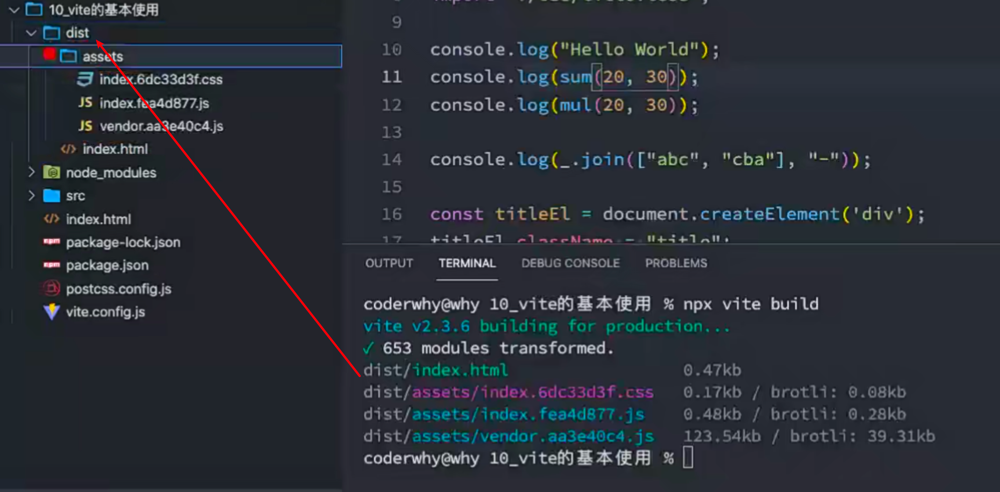
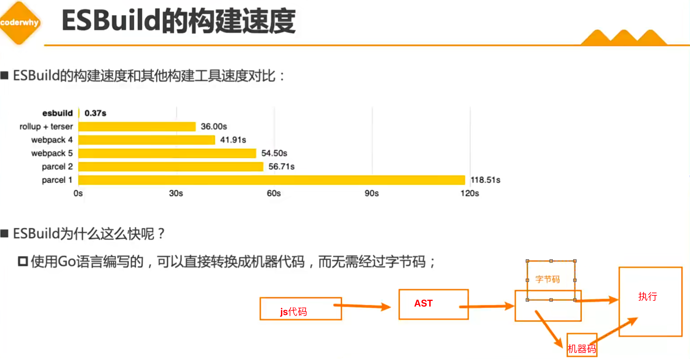

## 认识Vite

Webpack是目前整个前端使用最多的构建工具，但是除了webpack之后也有其他的一些构建工具： 

- 比如rollup、parcel、gulp、vite等等

什么是vite呢？ 官方的定位：下一代前端开发与构建工具；

如何定义下一代开发和构建工具呢？ 

- 我们知道在实际开发中，我们编写的代码往往是不能被浏览器直接识别的，比如ES6、TypeScript、Vue文件等 等； 
- 所以我们必须通过构建工具来对代码进行转换、编译，类似的工具有webpack、rollup、parcel； 
- 但是随着项目越来越大，需要处理的JavaScript呈指数级增长，模块越来越多； 
- 构建工具需要很长的时间才能开启服务器，HMR也需要几秒钟才能在浏览器反应出来； 
- 所以也有这样的说法：天下苦webpack久矣；

Vite (法语意为 "快速的"，发音 /vit/) 是一种新型前端构建工具，能够显著提升前端开发体验。

## Vite的构造

它主要由两部分组成： 

- 一个开发服务器，它基于原生ES模块提供了丰富的内建功能，HMR的速度非常快速； 
- 一套构建指令，它使用rollup打开我们的代码，并且它是预配置的，可以输出生成环境的优化过的静态资源；

目前是否要大力学习vite？vite的未来是怎么样的？ 

- 我个人非常看好vite的未来，也希望它可以有更好的发展； 

- 但是，目前vite虽然已经更新到2.0，依然并不算非常的稳定，并且比较少大型项目（或框架）使用vite来进行 构建； 
- vite的整个社区插件等支持也还不够完善； 
- 包括vue脚手架本身，目前也还没有打算迁移到vite，而依然使用webpack（虽然后期一定是有这个打算的）； 
- 所以vite看起来非常的火热，在面试也可能会问到，但是实际项目中应用的还比较少；


## 浏览器原生支持模块化

但是如果我们不借助于其他工具，直接使用ES Module来开发有什么问题呢？ 

我们在代码中写的ES6的代码在我们的浏览器中是支持的，不支持的仅仅是一些低版本的浏览器，所以我们可以在开发环境下使用高版本的浏览器进行开发，这样可以减少构建的环节，等到部署发布的时候，在进行打包，并且进行低版本浏览器的适配。这样的话，我们在开发过程中热更新就很快了，因为它省略了构建的过程而是将我们的源代码直接跑在了浏览器。但是存在一个问题，还有ts代码，.vue文件，less文件，这些文件我们的浏览器是不认识的，所以这个就是vite帮我们做的事情，他帮我们把这些代码做一个转化，把这些代码转化成ESMoudle的代码，转化成ESModule代码之后。


举个lodash的例子，我们使用一下lodash

```shell
npm install lodash-es -D
```


/src/index.js

```js
import _ from '../node_modules/lodash-es/lodash.default.js';

let arr1 = [1, 2, 3];
let arr2 = [4, 5, 6];
console.log(_.concat(arr1, arr2));
```

/src/index.html

```html
<!DOCTYPE html>
<html lang="en">
<head>
  <meta charset="UTF-8">
  <meta name="viewport" content="width=device-width, initial-scale=1.0">
  <title>Document</title>
</head>
<body>
  <script src="./index.js" type="module"></script>
</body>
</html>
```

打开浏览器


- 首先，我们会发现在使用loadash时，加载了上百个模块的js代码，对于浏览器发送请求是巨大的消耗； 
- 因为lodash依赖很多包，都是需要加载的，这个时候浏览器就会把这些东西都请求回来加载;
- 上面就是用浏览器来解析这个文件的弊端
- 其次，我们的代码中如果有TypeScript、less、vue等代码时，浏览器并不能直接识别；
- 因为lodash依赖很多包，都是需要加载的，这个时候浏览器就会把这些东西都请求回来加载


可以发现上面并没有使用构建工具，他们也是可以正常使用，包括使用第三方库，但是依然存在很多问题，事实上，vite就帮助我们解决了上面的所有问题。


## Vite的安装和使用

注意：Vite本身也是依赖Node的，所以也需要安装好Node环境 

- 并且Vite要求Node版本是大于12版本的；

首先，我们安装一下vite工具：

```
npm install vite –g # 全局安装
npm install vite –D # 局部安装
```

通过vite来启动项目：

```
npx vite
```


然后运行npx vite

为我们打开了一个3000端口的服务


注意：这里仅仅是下载了vite，其他什么都没做

就可以显示了


这个时候vite就帮助我们对源代码做了一些处理了，vite对我们的src代码做了一些构建，并且提供了一个服务

那这个时候和我们不用vite有什么区别呢？

区别：

1、可以不加.js后缀了

2、可以这样导入文件了

/src/index.js

```js
import _ from 'lodash-es';

let arr1 = [1, 2, 3];
let arr2 = [4, 5, 6];
console.log(_.concat(arr1, arr2));
```

vite可以帮助我们解析lodash-es这样一个路径 

也没有那么多的请求了


## Vite对css的支持

vite可以直接支持css的处理 

- 直接导入css即可；

 vite可以直接支持css预处理器，比如less 

- 直接导入less； 
- 之后安装less编译器；

```
npm install less -D
```

vite直接支持postcss的转换：

- 只需要安装postcss，并且配置 postcss.config.js 的配置文件即可；

```
npm install postcss postcss-preset-env -D
```

安装完以后在less文件开发完代码，在需要的地方引入后，就能自动对less文件进行处理，不需要其他任何操作


配置postcss

./postcss.config.js

```js
module.exports = {
  plugins: [
    require('postcss-preset-env')
  ]
}
```

这个时候postcss就能生效了


## Vite对TypeScript的支持

vite对TypeScript是原生支持的，它会直接使用ESBuild来完成编译： 

- 只需要直接导入即可；

如果我们查看浏览器中的请求，会发现请求的依然是ts的代码： 

- 这是因为vite中的服务器Connect会对我们的请求进行转发； 
- 获取ts编译后的代码，给浏览器返回，浏览器可以直接进行解析；

注意：在vite2中，已经不再使用Koa了，而是使用Connect来搭建的服务器

官网说


./src/ts/mul.ts

```typescript
export default function(num1: number, num2: number): number {
  return num1 * num2;
}
```

./src/main.js

```js
import _ from 'lodash-es';
import { createApp } from 'vue';
import mul from './ts/mul';
import App from './vue/App.vue';

console.log(mul(20, 30));
// vue
createApp(App).mount("#app");


// 打印600
```

可以发现默认情况下vite对ts语法是支持的。

他在服务器中请求了非常多的东西

vite1用的服务器是koa

vite2用的服务器是connect


刚才说过vite会建一个本地的服务器，vite1用的是koa,vite2用的是connect

浏览器在请求的时候，请求的就是mul.ts,title.less文件请求的就是

那我们能不能直接把ts文件和less文件就直接给浏览器，不能，因为它解析不了

vite做的事情就是，把这两个文件做了个转化，生成了新的文件，叫mul.ts,title.less，但是打开这些文件，可以发现，这些文件都是es6以上的js代码，css也能变成js吗？是的！在这个connect做的拦截，然后转化，转成es6的js代码，这也是为什么要用connect的原因，因为connect非常适合做请求的转发的，所以真正转发的代码都是es6的js代码，浏览器渲染的也就是转化后的代码


## Vite对vue的支持

vite对vue提供第一优先级支持：

- Vue 3 单文件组件支持：@vitejs/plugin-vue
- Vue 3 JSX 支持：@vitejs/plugin-vue-jsx
- Vue 2 支持：underfin/vite-plugin-vue2

安装支持vue的插件：

```
npm install @vitejs/plugin-vue -D
```

在vite.config.js中配置插件：


新增一个vue文件

./src/vue/App.vue

```vue
<template>
  <div>
    <h2>{{message}}</h2>
  </div>
</template>

<script>
  export default {
    data() {
      return {
        message: "Hello App"
      }
    }
  }
</script>

<style scoped>
  h2 {
    color: white;
  }
</style>
```

./src/index.js

```js
import { createApp } from 'vue';
import App from './vue/App.vue';

// vue
createApp(App).mount("#app");

```

安装vue

```js
npm install vue@next -D
```

这个时候执行 npx vite

报错了


需要安装一个插件

```js
npm install @vitejs/plugin-vue -D
```

这个时候需要配置vite了

建立一个文件叫vite.config.js

./vite.config.js

```js
const vue = require('@vitejs/plugin-vue')

module.exports = {
  plugins: [
    vue()
  ]
}
```

报错


这里是缺少sfc，就是对template模板解析的插件

所以需要下载

```js
npm install @vue/compiler-sfc -D
```

下载完以后再执行一下npx vite


就会显示了

默认在node_modules中生成一个文件夹叫.vite

删掉它


执行npx vite

执行npx vite的时候会对它们（loadash-es vue）做一个预打包


预打包以后会放到这个.vite这个文件夹里面（刷新一下目录）


他有一个好处，如果我把项目停掉，再次npx vite,他不会再预打包了，因为第一次预打包过了


时间也快了,第一次打包的时候是487ms，第二次是278ms

这也是vite快的一个原因---> 预打包


## Vite打包项目

我们可以直接通过vite build来完成对当前项目的打包工具：

```
npx vite build
```


我们可以通过preview的方式，开启一个本地服务来预览打包后的效果：

```
npx vite preview
```


打包文件夹（用来部署生成）



测试打包之后的文件在浏览器运行有没有问题

vite提供了预览服务器


这种效果就是打包之后的效果


我们不会一直写npx vite， 那么我们来配置脚本

./package.json

```json
{
  ...
  "scripts": {
    "serve": "vite",
    "build": "vite build",
    "preview": "vite preview"
  }
}
```

还有很多配置选项


## ESBuild解析

它是一个类似babel的代码转换工具，当然是本地调试的转换，他会将.vue文件转成js的es6

ESBuild的特点： 

- 超快的构建速度，并且不需要缓存； 
- 支持ES6和CommonJS的模块化；
  - 最好用ES6因为很多代码他不用做转化 ，直接使用es6的代码
- 支持ES6的Tree Shaking； 
  - 摇树，没用的代码删掉
- 支持Go、JavaScript的API；
  -  可以调用GO的api，ESBuild是通过GO来实现的
- 支持TypeScript、JSX等语法编译； 
- 支持SourceMap； 
- 支持代码压缩； 
- 支持扩展其他插件；

它有一部分webpack的功能，也有一部分babel的功能所以它很强大

vite是基于ESBuild来实现的


## ESBuild的构建速度

ESBuild的构建速度和其他构建工具速度对比：


esbuild还有一些语法是不支持的，所以并不是有很多项目来使用它


ESBuild为什么这么快呢？ 

- 使用Go语言编写的，可以直接转换成机器代码，而无需经过字节码； 
- ESBuild可以充分利用CPU的多内核，尽可能让它们饱和运行； 
  - 它会开启一个进程，进程里面会同时启动很多线程
- ESBuild的所有内容都是从零开始编写的，而不是使用第三方，所以从一开始就可以考虑各种性能问题； 
- 等等....


正常的代码会这样执行




使用Go语言编写的，可以直接转换成机器代码，而无需经过字节码；

vite依赖ESBuild，所以构建速度非常快


## Vite脚手架工具

在开发中，我们不可能所有的项目都使用vite从零去搭建，比如一个react项目、Vue项目； 

- 这个时候vite还给我们提供了对应的脚手架工具；

所以Vite实际上是有两个工具的： 

- vite：相当于是一个构件工具，类似于webpack、rollup； 
- @vitejs/create-app：类似vue-cli、create-react-app；

如果使用脚手架工具呢？

```
npm init @vitejs/app
```

上面的做法相当于省略了安装脚手架的过程：

```
npm install @vitejs/create-app -g
create-app
```

创建项目


选择 vue  选择vue-ts

然后安装依赖


这个就是创建出来的项目和vue脚手架创建出来的比较相似


把项目跑起来，执行dev

打包执行build

npm run server的时候就是预览

