# Vue3组件化开发（一）


## 认识组件的嵌套

前面我们是将所有的逻辑放到一个App.vue中：

- 在之前的案例中，我们只是创建了一个组件App； 
- 如果我们一个应用程序将所有的逻辑都放在一个组件中，那么这个组件就会变成非 常的臃肿和难以维护； 
- 所以组件化的核心思想应该是对组件进行拆分，拆分成一个个小的组件； 
- 再将这些组件组合嵌套在一起，最终形成我们的应用程序；

我们来分析一下下面代码的嵌套逻辑，假如我们将所有的代码逻辑都放到一个App.vue 组件中： 

- 我们会发现，将所有的代码逻辑全部放到一个组件中，代码是非常的臃肿和难以维 护的。 
- 并且在真实开发中，我们会有更多的内容和代码逻辑，对于扩展性和可维护性来说 都是非常差的。 
- 所以，在真实的开发中，我们会对组件进行拆分，拆分成一个个功能的小组件。

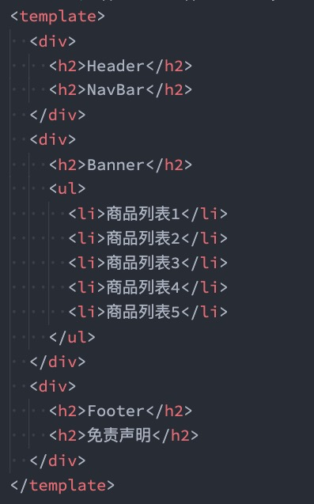

header、main、footer这些逻辑都在一起，肯定是不合适的，需要拆解

代码片段vscode插件，可以自己看下下载最多的去使用


## 组件的拆分

我们可以按照如下的方式进行拆分：

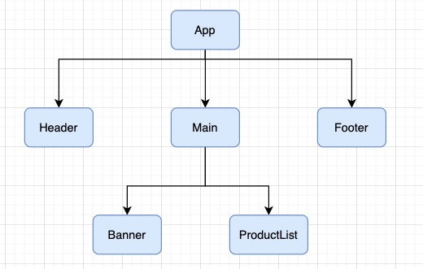


按照如上的拆分方式后，我们开发对应的逻辑只需要去对应的组件编写就可。

拆头部

./Header.vue

```vue
<template>
  <div class="header">
    <h2>Header</h2>
    <h2>NavBar</h2>
  </div>
</template>

<script>
  export default {
    
  }
</script>

<style scoped>

</style>
```

拆尾部

./Footer.vue

```vue
<template>
  <div class="footer">
    <h2>Footer</h2>
  </div>
</template>

<script>
  export default {
    
  }
</script>

<style scoped>

</style>
```


拆中间

./Main.vue

```vue
<template>
  <div class="main">
    <main-banner></main-banner>
    <main-product-list></main-product-list>
  </div>
</template>

<script>
  import MainBanner from './MainBanner.vue';
  import MainProductList from './MainProductList.vue';

  export default {
    components: {
      MainBanner,
      MainProductList
    },
  };
</script>

<style scoped>
</style>
```

main又可以拆

./MainBanner.vue

```vue
<template>
  <h2>Banner</h2>
</template>

<script>
  export default {
    
  }
</script>

<style scoped>

</style>
```

./MainProductList.vue

```vue
<template>
  <ul>
    <li>商品信息1</li>
    <li>商品信息2</li>
    <li>商品信息3</li>
    <li>商品信息4</li>
    <li>商品信息5</li>
  </ul>
</template>

<script>
  export default {
    
  }
</script>

<style scoped>

</style>
```

可以把拆开的组件合入在一起展示

./App.vue

```vue
<template>
  <div id="app">
    <Header></Header>
    <Main></Main>
    <Footer></Footer>
  </div>
</template>

<script>
  import Header from './Header';
  import Main from './Main';
  import Footer from './Footer';

  export default {
    components: {
      Header,
      Main,
      Footer
    }
  }
</script>

<style scoped>

</style>
```


注意：

细节一：

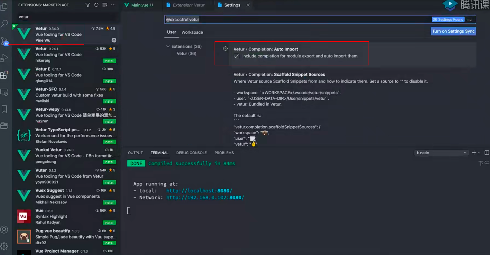

这个插件的这个选项是自动导入的，比如在template中写一个组件名字，然后按tab，script中自动导入这个组件并且注册

但是这样也不是很好的，首先可能会导入错，而且，导入顺序也可能有问题

细节二：

```vue
<script>
	import MainBanner from './MainBanner';
</script>
```

这个后缀名可以不加，但是不加，在template中写MainBanner的时候没有提示，你需要在template中完整的写完这个组件，加上.vue后在template中写这个组件的时候就可以有提示

另外如果加后缀名，那么点住ctrl加鼠标，就可以进入这个文件了。否则，进不去


组件的css作用域

app.vue

```vue
<template>
  <h2 class="title">App</h2>
  <hello-world></hello-world>
</template>

<script>
  import HelloWorld from './HelloWorld.vue';

  export default {
    components: {
      HelloWorld
    }
  }
</script>

<style scoped>
  h2 {
    color: red;
  }

  .title {
    color: blue;
  }
</style>
```


helloworld.vue

```vue
<template>
  <div class="Hello World">
    <h2>Hello World</h2>
    <h2>Hello World</h2>
    <h2>Hello World</h2>
  </div>
</template>

<script>
  export default {
    
  }
</script>

<style scoped>

</style>
```


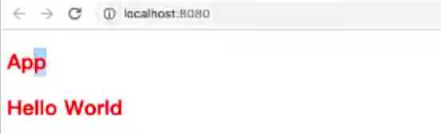

可以看到都是红色

scope的意思是作用域的意思

原理是在标签上增加一个属性

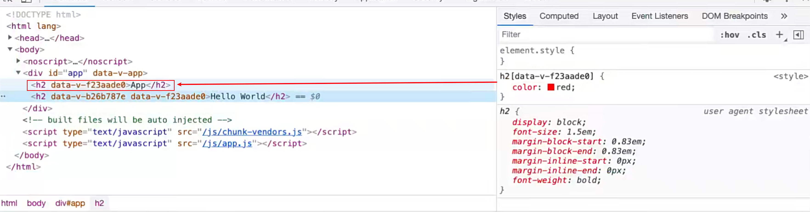

设置scope，有这个属性，才给你加这个样式.

现在存在的问题是在app这个组件的style中增加了scoped，但是helloWorld组件对color这个样式也生效了。

原因是，这样写，他会作用到app组件，并且还会给它的子组件的根组件加上这个data-v-f23aade0

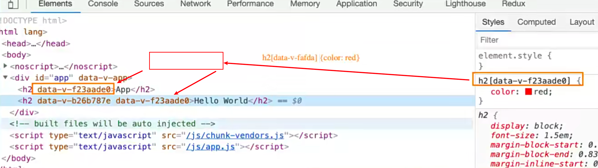

如果想解决这个问题，加一个div标签包裹住h2就行了。

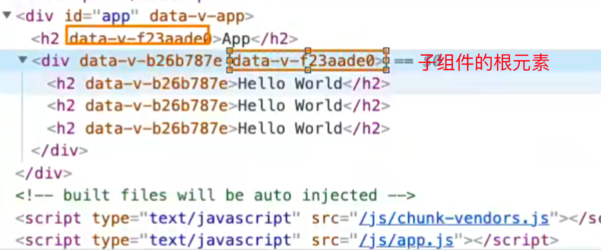

上面这样写，这两个相同的属性加的是div标签，也就是根标签，但是没有给h2，所以，它们不会相同了

所以这种问题在VUE2中很少出现，因为vue2要求我们组件必须有一个根组件，但是vue3没有这样要求

它只会对根元素造成影响，根元素的子元素不会被影响

> 1.这也算vue的一个bug
>
> 2.在开发中一般都会加一个根元素
>
> 3.最好不要写h2:{}这种样式


## 组件的通信

上面的嵌套逻辑如下，它们存在如下关系： 

- App组件是Header、Main、Footer组件的父组件； 
- Main组件是Banner、ProductList组件的父组件；

在开发过程中，我们会经常遇到需要组件之间相互进行通信： 

- 比如App可能使用了多个Header，每个地方的Header展示的内容不同，那么我们就需要使用者传递给Header 一些数据，让其进行展示； 
- 又比如我们在Main中一次性请求了Banner数据和ProductList数据，那么就需要传递给它们来进行展示； 
- 也可能是子组件中发生了事件，需要由父组件来完成某些操作，那就需要子组件向父组件传递事件；

总之，在一个Vue项目中，组件之间的通信是非常重要的环节，所以接下来我们就具体学习一下组件之间是如何相 互之间传递数据的；


## 父子组件之间通信的方式

父子组件之间如何进行通信呢？

- 父组件传递给子组件：通过props属性； 
- 子组件传递给父组件：通过$emit触发事件；

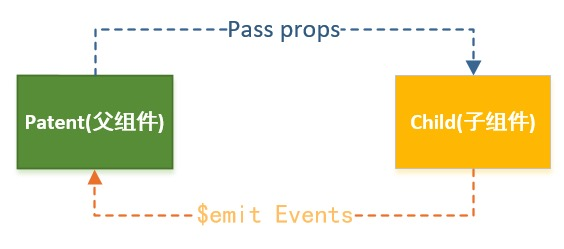


## 父组件传递给子组件

在开发中很常见的就是父子组件之间通信，比如父组件有一些数据，需要子组件来进行展示： 

- 这个时候我们可以通过props来完成组件之间的通信；

什么是Props呢？ 

- Props是你可以在组件上注册一些自定义的attribute； 
- 父组件给这些attribute赋值，子组件通过attribute的名称获取到对应的值；

Props有两种常见的用法： 

- 方式一：字符串数组，数组中的字符串就是attribute的名称； 
- 方式二：对象类型，对象类型我们可以在指定attribute名称的同时，指定它需要传递的类型、是否是必须的、 默认值等等；


## Props的数组用法

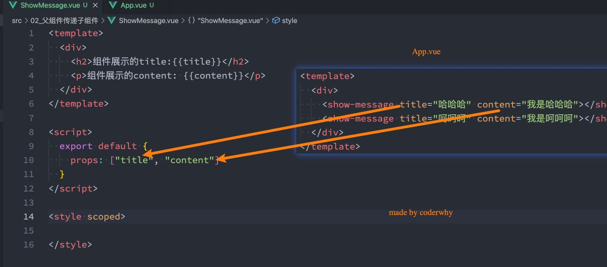


父组件的传参

./App.vue

```vue
<template>
  <div>
    <h2>app</h2>
    <!-- 传参方式一，写死传的值 -->
    <son name="why" age="18"></son>
    <!-- 通过动态绑定 -->
    <son v-bind:name="name" v-bind:age="age"></son>
    <!-- 上面写法的语法糖 -->
    <son :name="name" :age="age"></son>
    <!-- 上面写法的语法糖  但是这里只能写一个   v-bind= -->
    <!-- 而且只能是对象 -->
    <son v-bind="message1" :name="name"></son>
    <son></son>
  </div>
</template>

<script>
import Son from "./components/Son.vue";
export default {
  components: {
    Son,
  },
  data() {
    return {
      name: 'why',
      age: 18,
      message1: {
        name: 'why',
        age: 18
      },
      message2: [1, 2, 3]
    }
  }
};
</script>

<style scoped>
h2 {
  color: red;
}
</style>
```


子组件

./components/Son.vue

```vue
<template>
    <div>
        <h2>我是子组件</h2>
        <p>{{name}}</p>
        <p>{{age}}</p>
    </div>
</template>

<script>
    export default {
        props: ['name', 'age']
    }
</script>

<style lang="scss" scoped>

</style>
```


## Props的对象用法

数组用法中我们只能说明传入的attribute的名称，并不能对其进行任何形式的限制，接下来我们来看一下对象的 写法是如何让我们的props变得更加完善的。

当使用对象语法的时候，我们可以对传入的内容限制更多： 

- 比如指定传入的attribute的类型； 
- 比如指定传入的attribute是否是必传的； 
- 比如指定没有传入时，attribute的默认值；

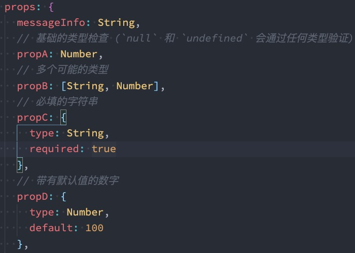


## 细节一：那么type的类型都可以是哪些呢？

那么type的类型都可以是哪些呢？ 

- String 
- Number 
- Boolean 
- Array 
- Object 
- Date 
- Function 
- Symbol

 

## 细节二：对象类型的其他写法

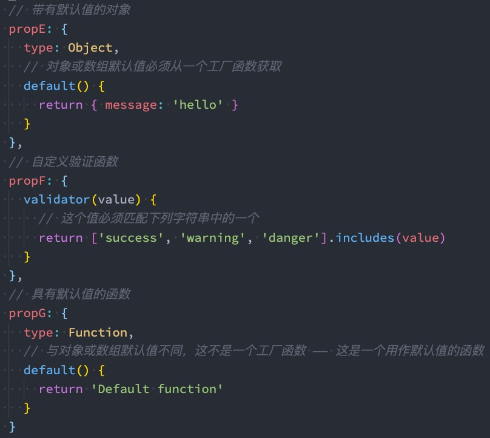

所以引用类型必须通过函数的方式来返回一个对象，否则，如果一个地方改了，其他地方就会都改了


## 细节三：Prop 的大小写命名

Prop 的大小写命名(camelCase vs kebab-case)

- HTML 中的 attribute 名是大小写不敏感的，所以浏览器会把所有大写字符解释为小写字符；
- 这意味着当你使用 DOM 中的模板时，camelCase (驼峰命名法) 的 prop 名需要使用其等价的 kebab-case (短 横线分隔命名) 命名；

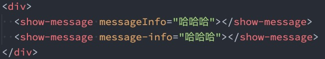

推荐使用短横线连接符的写法


## 非Prop的Attribute

什么是非Prop的Attribute呢？ 

- 当我们传递给一个组件某个属性，但是该属性并没有定义对应的props或者emits时，就称之为非Prop的 Attribute； 
- 常见的包括class、style、id属性等；

Attribute继承 

- 当组件有单个根节点时，非Prop的Attribute将自动添加到根节点的Attribute中：

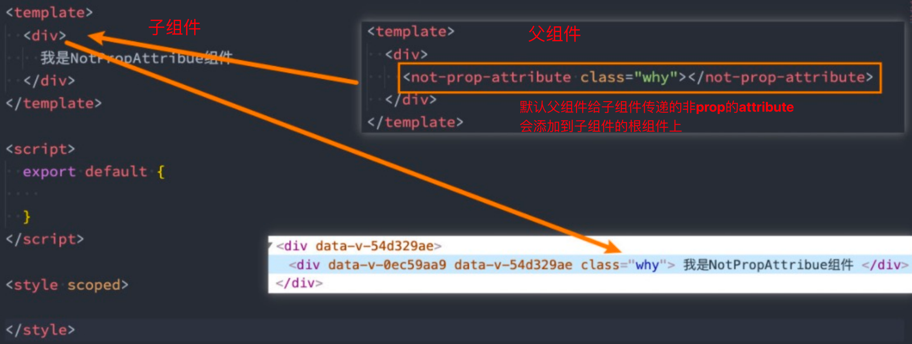


## 禁用Attribute继承和多根节点

如果我们不希望组件的根元素继承attribute，可以在组件中设置 inheritAttrs: false： 

```vue
<template>
  <div>
  </div>
</template>

<script>
  export default {
    ...
    inheritAttrs: false, // 不继承父组件传过来的attribute
  }
</script>

<style scoped>

</style>
```

- 禁用attribute继承的常见情况是需要将attribute应用于根元素之外的其他元素； 
  - 例如，我传过来的class不是给根标签的，我是要给h2标签的，怎么给到h2呢？
- 我们可以通过 $attrs来访问所有的 非props的attribute；

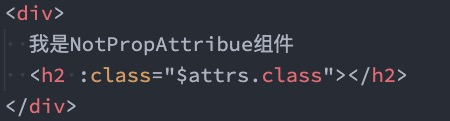

这样就可以把父组件传过来的class给到h2了

多个attribute绑定

```vue
<template>
  <div>
    <h2 v-bind="$attrs">{{title}}</h2>	// 把所有的attribute绑定上
    <p>{{content}}</p>
  </div>
</template>
```

当然要把inheritAttrs设置为false


多个根节点的attribute 

- 多个根节点的attribute如果没有显示的绑定，那么会报警告，我们必须手动的指定要绑定到哪一个属性上：

```vue
<template>
  <h2>MultiRootElement</h2>
  <h2>MultiRootElement</h2>
  <h2 :id="$attrs.id">MultiRootElement</h2>
</template>
```


## 子组件传递给父组件

什么情况下子组件需要传递内容到父组件呢？ 

- 当子组件有一些事件发生的时候，比如在组件中发生了点击，父组件需要切换内容； 
- 子组件有一些内容想要传递给父组件的时候；

我们如何完成上面的操作呢？ 

- 首先，我们需要在子组件中定义好在某些情况下触发的事件名称； 
- 其次，在父组件中以v-on的方式传入要监听的事件名称，并且绑定到对应的方法中； 
- 最后，在子组件中发生某个事件的时候，根据事件名称触发对应的事件；


## 自定义事件的流程

我们封装一个CounterOperation.vue的组件： 

- 内部其实是监听两个按钮的点击，点击之后通过 this.$emit的方式发出去事件；

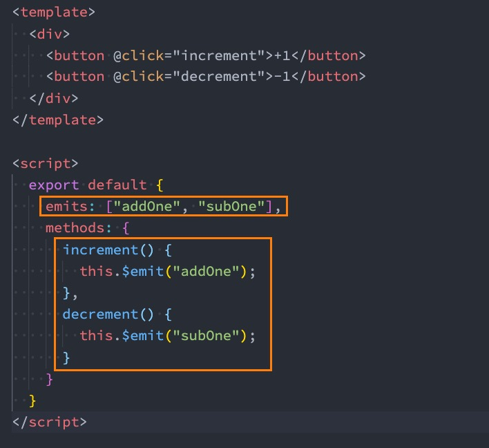

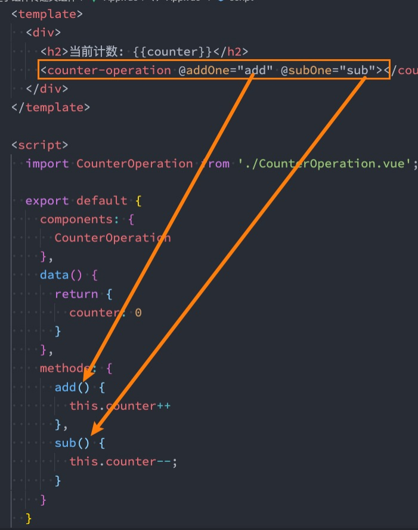


上面是emits的数组写法，下面介绍对象的写法

## 自定义事件的参数和验证

自定义事件的时候，我们也可以传递一些参数给父组件：

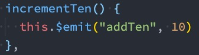

也可以传递多个参数，接着在10后面加，在父组件后面也需要接收


在vue3当中，我们可以对传递的参数进行验证：

把子组件的emits改成对象，如果不需要验证传过去一个null

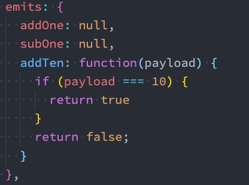

其实就算验证不通过的话，也是可以传过去的，只是会在控制台报一个警告

这里也可以传多个参数，那在上图中payload后面也需要跟着其他的参数


## 组件间通信案例练习

我们来做一个相对综合的练习：

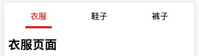

./App.vue

```vue
<template>
  <div class="app">
    <tab-cotrol :titles="titles" @getIndex="getIndex"> </tab-cotrol>
    <show-view :content="content[currentIndex]"></show-view>
  </div>
</template>

<script>
import TabCotrol from "./components/TabCotrol.vue";
import ShowView from "./components/ShowView.vue";

export default {
  components: {
    TabCotrol,
    ShowView,
  },
  data() {
    return {
      titles: ["衣服", "鞋子", "帽子"],
      content: ["我是衣服", "我是鞋子", "我是帽子"],
      currentIndex: 0
    };
  },
  methods: {
    getIndex(index) {
      this.currentIndex = index;
    }
  }
};
</script>

<style scoped>
</style>
```


./components/tabCotrol.vue

```vue
<template>
  <div class="tab-cotrol">
    <div
      class="tab-cotrol-item"
      :class="{ active: currentIndex == index }"
      v-for="(item, index) in titles"
      :key="item"
      @click="changeTab(index)"
    >
      <span>{{ item }}</span>
    </div>
  </div>
</template>

<script>
export default {
  emits: ["getIndex"],
  props: {
    titles: {
      type: Array,
      default: () => {
        return [];
      },
    },
  },
  data() {
    return {
      currentIndex: 0,
    };
  },
  methods: {
    changeTab(index) {
      console.log(index);
      this.currentIndex = index;
      this.$emit("getIndex", index);
    },
  },
};
</script>

<style scoped>
.tab-cotrol {
  display: flex;
  height: 40px;
  background: #cecece;
}
.tab-cotrol-item {
  flex: 1;
  text-align: center;
  line-height: 40px;
}
.tab-cotrol-item.active {
  color: red;
  border-bottom: 3px solid red;
}
</style>
```


./components/showView.vue

```vue
<template>
  <div class="show-view">{{content}}</div>
</template>

<script>
export default {
  props: {
    content: {
      type: String,
      default: () => {
        return "暂无数据";
      },
    },
  },
};
</script>

<style scoped>
</style>
```


