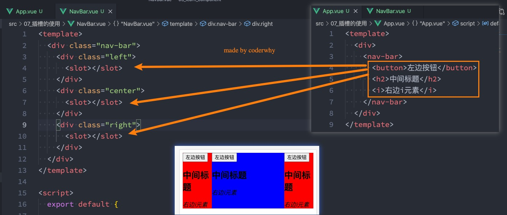

## 非父子组件的通信

在开发中，我们构建了组件树之后，除了父子组件之间的通信之外，还会有非父子组件之间的通信。

这里我们主要讲两种方式： 

- Provide/Inject； 
- Mitt全局事件总线；


## Provide和Inject

Provide/Inject用于非父子组件之间共享数据：

- 比如有一些深度嵌套的组件，子组件想要获取父组件的部分内 容；
- 在这种情况下，如果我们仍然将props沿着组件链逐级传递下 去，就会非常的麻烦；

对于这种情况下，我们可以使用 Provide 和 Inject ：

- 无论层级结构有多深，父组件都可以作为其所有子组件的依赖 提供者； 
- 父组件有一个 provide 选项来提供数据； 
- 子组件有一个 inject 选项来开始使用这些数据；

实际上，你可以将依赖注入看作是“long range props”（长范围的props），除了： 

- 父组件不需要知道哪些子组件使用它 provide 的 property 
- 子组件不需要知道 inject 的 property 来自哪里


## Provide和Inject**基本使用**

我们开发一个这样的结构：


上面这个东西只能给子孙来提供，兄弟不可以，自己也不可以用


## Provide和Inject函数的写法

如果Provide中提供的一些数据是来自data，那么我们可能会想要通过this来获取：

这个时候会报错： 

- 这里给大家留一个思考题，我们的this使用的是哪里的this？


想拿到names的长度，如果直接这样写的话是会报错的，为什么呢？因为上面的this.name.length的this指向的并不是vue实例，而是undefined（因为这个this的作用域是script标签内，而script作为一个模块的话，它的this就是undefined）

如何解决呢？需要像上面一样，把provide写成一个函数，return出去一个数组就可以。这个时候里面的this就是正常可以执行vue实例，这个函数的执行有绑定vue实例


## 处理响应式数据

我们先来验证一个结果：如果我们修改了this.names的内容，那么使用length的子组件会不会是响应式的？ 


我们会发现对应的子组件中是没有反应的：

- 这是因为当我们修改了names之后，之前在provide中引入的 this.names.length 本身并不是响应式的；

那么怎么样可以让我们的数据变成响应式的呢？

- 非常的简单，我们可以使用响应式的一些API来完成这些功能，比如说computed函数；
- 当然，这个computed是vue3的新特性，在后面我会专门讲解，这里大家可以先直接使用一下；

注意：我们在使用length的时候需要获取其中的value

- 这是因为computed返回的是一个ref对象，需要取出其中的value来使用；

```js
import { computed } from 'vue'
```


这个时候如果this.name.length发生了改变的话，经过computed包裹后，也会同步进行响应式更新


## 全局事件总线mitt库

Vue3从实例中移除了 $on、$off 和 $once 方法，所以我们如果希望继续使用全局事件总线，要通过第三方的库： 

- Vue3官方有推荐一些库，例如 mitt 或 tiny-emitter； 
- 这里我们主要讲解一下mitt库的使用；

首先，我们需要先安装这个库：

```
npm install mitt
```

其次，我们可以封装一个工具eventbus.js：


这个文件可以创建多个 const emitter1 = mitt(); 但是这里只创建一个就可以


## 使用事件总线工具

在项目中可以使用它们：

- 我们在Home.vue中监听事件； 
- 我们在App.vue中触发事件；

发出事件：


监听事件：


这里的why,kobe等这些都可以抽取为一个一个常量，在发出事件和监听事件的时候使用常量

*表示监听所有事件，type表示类型（也就是上面的why和kobe），e表示传递过来的参数


## Mitt的事件取消

在某些情况下我们可能希望取消掉之前注册的函数监听：


## 认识插槽Slot

在开发中，我们会经常封装一个个可复用的组件：

- 前面我们会通过props传递给组件一些数据，让组件来进行展示； 
- 但是为了让这个组件具备更强的通用性，我们不能将组件中的内容限制为固定的div、span等等这些元素； 

- 比如某种情况下我们使用组件，希望组件显示的是一个按钮，某种情况下我们使用组件希望显示的是一张图片； 
- 我们应该让使用者可以决定某一块区域到底存放什么内容和元素；


举个栗子：假如我们定制一个通用的导航组件 - NavBar

- 这个组件分成三块区域：左边-中间-右边，每块区域的内容是不固定； 
- 左边区域可能显示一个菜单图标，也可能显示一个返回按钮，可能什么都不显示； 
- 中间区域可能显示一个搜索框，也可能是一个列表，也可能是一个标题，等等； 
- 右边可能是一个文字，也可能是一个图标，也可能什么都不显示；


## 如何使用插槽slot？

这个时候我们就可以来定义插槽slot：

- 插槽的使用过程其实是抽取共性、预留不同； 
- 我们会将共同的元素、内容依然在组件内进行封装； 
- 同时会将不同的元素使用slot作为占位，让外部决定到底显示什么样的元素；

如何使用slot呢？

- Vue中将  元素作为承载分发内容的出口； 
- 在封装组件中，使用特殊的元素就可以为封装组件开启一个插槽； 
- 该插槽插入什么内容取决于父组件如何使用；


## 插槽的基本使用

我们一个组件MySlotCpn.vue：该组件中有一个插槽，我们可以在插槽中放入需要显示的内容； 

我们在App.vue中使用它们：我们可以插入普通的内容、html元素、组件元素，都可以是可以的；


## 插槽的默认内容

有时候我们希望在使用插槽时，如果没有插入对应的内容，那么我们需要显示一个默认的内容： 

- 当然这个默认的内容只会在没有提供插入的内容时，才会显示；


## 多个插槽的效果

我们先测试一个知识点：如果一个组件中含有多个插槽，我们插入多个内容时是什么效果？ 

- 我们会发现默认情况下每个插槽都会获取到我们插入的内容来显示；



多个插槽，不会依次插入，而是每个插槽都插入所有内容，可以发现上面每一个slot都会插入右侧的代码


## 具名插槽的使用

事实上，我们希望达到的效果是插槽对应的显示，这个时候我们就可以使用 具名插槽： 

- 具名插槽顾名思义就是给插槽起一个名字， 元素有一个特殊的 attribute：name； 
- 一个不带 name 的slot，会带有隐含的名字 default；


因为它是通过name找的，所以，这里顺序乱了也没事

插槽的默认name是default，也就是在父组件中写的是`v-slot:default`，在子组件中不写或者写`name='default'`


## 动态插槽名

什么是动态插槽名呢？

- 目前我们使用的插槽名称都是固定的；
- 比如 v-slot:left、v-slot:center等等；
- 我们可以通过 v-slot:[dynamicSlotName]方式动态绑定一个名称；


拿到字符串， 就可以匹配到。


## 具名插槽使用的时候缩写

具名插槽使用的时候缩写： 

- 跟 v-on 和 v-bind 一样，v-slot 也有缩写； 
- 即把参数之前的所有内容 (v-slot:) 替换为字符 #；


## 渲染作用域

在Vue中有渲染作用域的概念： 

- 父级模板里的所有内容都是在父级作用域中编译的； 
- 子模板里的所有内容都是在子作用域中编译的；

如何理解这句话呢？我们来看一个案例： 

- 在我们的案例中ChildCpn自然是可以让问自己作用域中的title内容的； 
- 但是在App中，是访问不了ChildCpn中的内容的，因为它们是跨作用域的访问；


## 渲染作用域案例


## 认识作用域插槽

但是有时候我们希望插槽可以访问到子组件中的内容是非常重要的： 

- 当一个组件被用来渲染一个数组元素时，我们使用插槽，并且希望插槽中没有显示每项的内容； 
- 这个Vue给我们提供了作用域插槽；

我们来看下面的一个案例： 

- 1.在App.vue中定义好数据 
- 2.传递给ShowNames组件中 
- 3.ShowNames组件中遍历names数据 
- 4.定义插槽的prop 
- 5.通过v-slot:default的方式获取到slot的props 
- 6.使用slotProps中的item和index


## 作用域插槽的案例


## 独占默认插槽的缩写

```
如果我们的插槽是默认插槽default，那么在使用的时候 v-slot:default="slotProps"可以简写为v-slot="slotProps"：
```


并且如果我们的插槽只有默认插槽时，组件的标签可以被当做插槽的模板来使用，这样，我们就可以将 v-slot 直 接用在组件上：


## 默认插槽和具名插槽混合

但是，如果我们有默认插槽和具名插槽，那么按照完整的template来编写。


只要出现多个插槽，请始终为所有的插槽使用完整的基于 `<template>` 语法


