## 切换组件案例

比如我们现在想要实现了一个功能：

- 点击一个tab-bar，切换不同的组件显示；

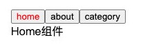

这个案例我们可以通过两种不同的实现思路来实现：

- 方式一：通过v-if来判断，显示不同的组件；
- 方式二：动态组件的方式；


## v-if显示不同的组件

我们可以先通过v-if来判断显示不同的组件，这个可以使用我们之前讲过的知识来实现：

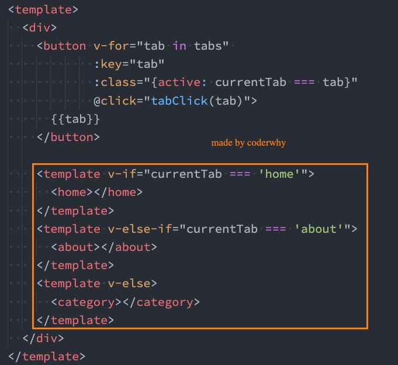


## 动态组件的实现

动态组件是使用 component 组件，通过一个特殊的attribute is 来实现：

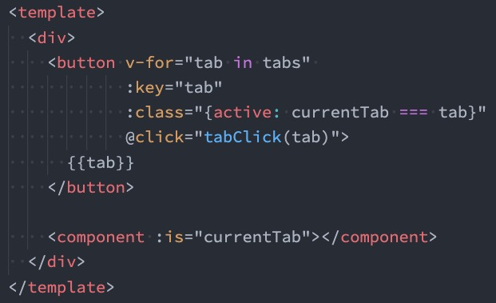

这个currentTab的值需要是什么内容呢？

- 可以是通过component函数注册的组件； 
- 在一个组件对象的components对象中注册的组件；


## 动态组件的传值

如果是动态组件我们可以给它们传值和监听事件吗？

- 也是一样的；
- 只是我们需要将属性和监听事件放到component上来使用；

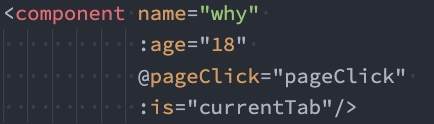

案例：

./App.vue

```vue
<template>
  <div class="app">
    <div class="tabBtn">
      <button
        v-for="item in dataList"
        :key="item"
        @click="pageChange(item)"
        :class="{ active: item === currentValue }"
      >
        {{ item }}
      </button>
    </div>
    <div class="showTab">
      <!-- 方式1 -->
      <!-- <template v-if="currentValue === 'home'">
        <home></home>
      </template>
      <template v-else-if="currentValue === 'about'">
        <about></about>
      </template>
      <template v-else>
        <hot></hot>
      </template> -->

      <!-- 方式2 -->
      <!-- 展示home -->
      <!-- <component is="home"></component>  -->
      <!-- 动态绑定了currentValue, 当这个值是home的时候展示Home组件等 -->
      <!-- <component :is="currentValue"></component> -->
      <!-- 传值，当前哪个组件出于活跃，就给哪个组件传值 -->
      <!-- 这里的age如果加了:age  那传过去的值就是number类型，如果没有那就是字符串类型 -->
      <component :is="currentValue" :name="name" :age="18" @btnCpn="getBtn"></component>
    </div>
  </div>
</template>

<script>
import About from "./components/About.vue";
import Home from "./components/Home.vue";
import Hot from "./components/Hot.vue";
export default {
  components: {
    About,
    Home,
    Hot,
  },
  data() {
    return {
      dataList: ["home", "about", "hot"],
      currentValue: "home",
      name: "why",
    };
  },
  methods: {
    pageChange(item) {
      this.currentValue = item;
    },
    getBtn(value) {
      console.log('获取到about组件的点击', value)
    }
  },
};
</script>

<style scoped>
.active {
  color: red;
}
</style>
```


./components/About.vue

```vue
<template>
  <div @click="btnCpn">我是About组件-{{ name }}</div>
</template>

<script>
export default {
  props: ["name", "age"],
  created() {
    console.log(this.name, this.age);
  },
  emits: ["btnCpn"],
  methods: {
    btnCpn() {
      this.$emit("btnCpn", "abc");
    },
  },
};
</script>

<style scoped>
</style>
```


./components/Home.vue

```vue
<template>
    <div>
        我是home组件
    </div>
</template>

<script>
    export default {
            props: ['name', 'age'],
    created() {
        console.log(this.name, this.age)
    }
    }
</script>

<style scoped>

</style>
```


./components/Hot.vue

```vue
<template>
  <div>我是Hot组件</div>
</template>

<script>
export default {
  props: ["name", "age"],
  created() {
    console.log(this.name, this.age);
  },
};
</script>

<style scoped>
</style>
```


## 认识keep-alive

我们先对之前的案例中About组件进行改造：

- 在其中增加了一个按钮，点击可以递增的功能；

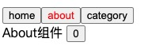

比如我们将counter点到10，那么在切换到home再切换回来about时，状态是否可以保持呢？

- 答案是否定的； 
- 这是因为默认情况下，我们在切换组件后，about组件会被销毁掉，再次回来时会重新创建组件；

但是，在开发中某些情况我们希望继续保持组件的状态，而不是销毁掉，这个时候我们就可以使用一个内置组件： keep-alive。

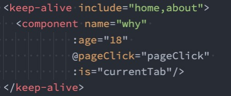


## keep-alive属性

keep-alive有一些属性：

- include - string | RegExp | Array。只有名称匹配的组件会被缓 存； 
- exclude - string | RegExp | Array。任何名称匹配的组件都不会被缓存； 
- max - number | string。最多可以缓存多少组件实例，一旦达到这个数字，那么缓存组件中最近没有被访问的实例会被销毁

include 和 exclude prop 允许组件有条件地缓存：

- 二者都可以用逗号分隔字符串、正则表达式或一个数组来表示；
- 匹配首先检查组件自身的 name 选项；

如果全部都需要缓存的话可以不加name，如果使用include或者exclude的话就需要加name属性

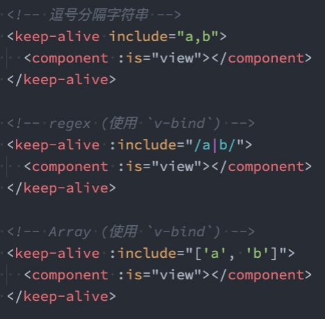


## 缓存组件的生命周期

对于缓存的组件来说，再次进入时，我们是不会执行created或者mounted等生命周期函数的： 

- 但是有时候我们确实希望监听到何时重新进入到了组件，何时离开了组件； 
- 这个时候我们可以使用activated 和 deactivated 这两个生命周期钩子函数来监听；

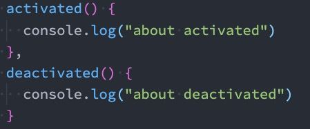


## Webpack的代码分包

默认的打包过程： 

- 默认情况下，在构建整个组件树的过程中，因为组件和组件之间是通过模块化直接依赖的，那么webpack在打包时就会将组 件模块打包到一起（比如一个app.js文件中）； 
- 这个时候随着项目的不断庞大，app.js文件的内容过大，会造成首屏的渲染速度变慢；

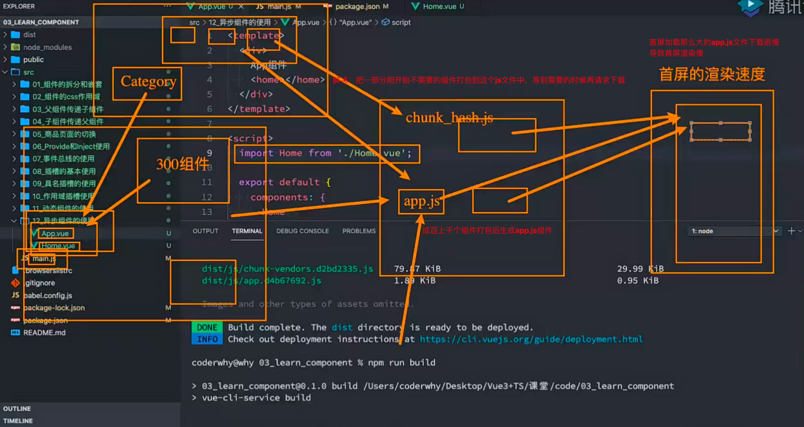

打包时，代码的分包： 

- 所以，对于一些不需要立即使用的组件，我们可以单独对它们进行拆分，拆分成一些小的代码块chunk.js； 
- 这些chunk.js会在需要时从服务器加载下来，并且运行代码，显示对应的内容；

那么webpack中如何可以对代码进行分包呢？

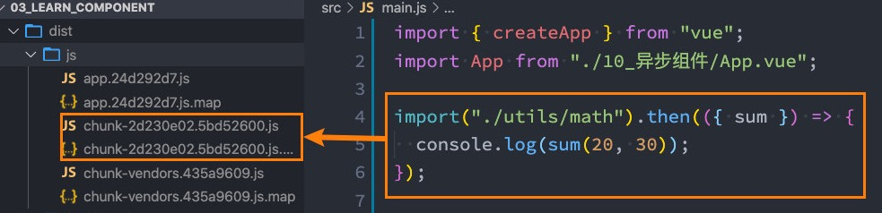


默认打包出来的效果

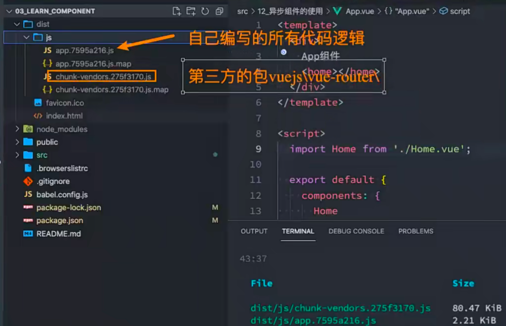

如果我想单独打包出来一个js文件，怎么操作呢？


引入一个新的js

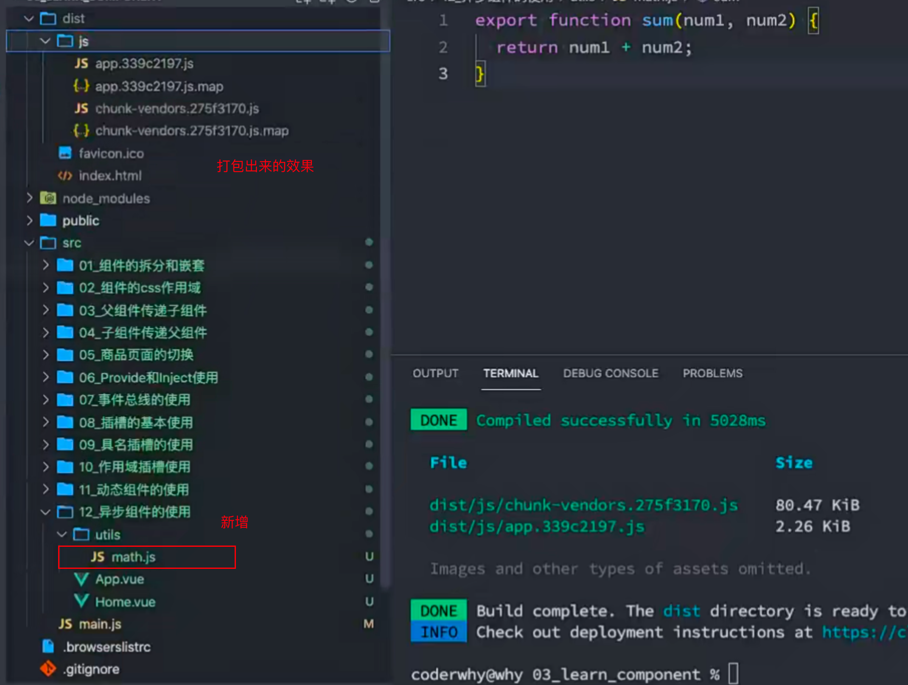

它依然是这几个文件，并没有分包，那么怎么进行分包呢？我希望math.js单独打出来一个包

进行分包操作


通过import 函数导入的模块，后续webpack会对齐进行打包的时候就会进行分包的操作

./main.js

```js
import { createApp } from 'vue'
import App from './15_组件的v-model/App.vue'

// import {sum} from './12_异步组件的使用/utils/math';	这样导入webpack不会分包

// 通过import函数导入的模块, 后续webpack对其进行打包的时候就会进行分包的操作
import("./12_异步组件的使用/utils/math").then((res) => {
  console.log(res.sum(20, 30))
})

createApp(App).mount('#app')

```


打包后

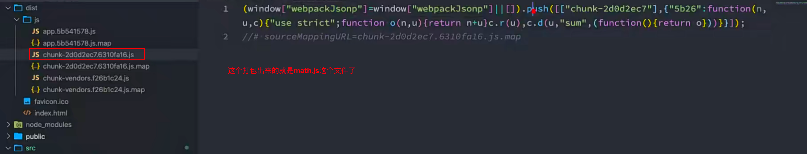

这个就是分包后单独引入的那个js的包


## Vue中实现异步组件

如果我们的项目过大了，对于某些组件我们希望通过异步的方式来进行加载（目的是可以对其进行分包处理），那么Vue中给我们提供了一个函数：defineAsyncComponent。

defineAsyncComponent接受两种类型的参数：

- 类型一：工厂函数，该工厂函数需要返回一个Promise对象； 
- 类型二：接受一个对象类型，对异步函数进行配置；

工厂函数类型一的写法：

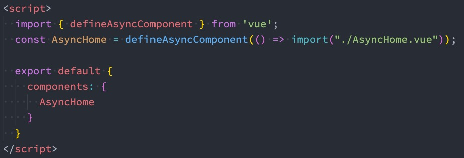


## 异步组件的写法二

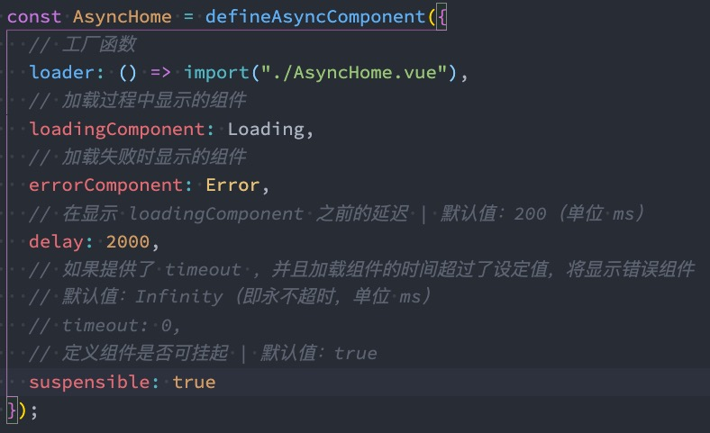

我们一般会通过路由来实现分包，但是如果这个组件不是路由组件，那么可以通过这种方式来实现分包


## 异步组件和Suspense（悬念，悬而未决）

注意：目前（2021-06-08）Suspense显示的是一个实验性的特性，API随时可能会修改。

Suspense是一个内置的全局组件，该组件有两个插槽： 

- default：如果default可以显示，那么显示default的内容； 
- fallback（应急的）：如果default无法显示，那么会显示fallback插槽的内容；

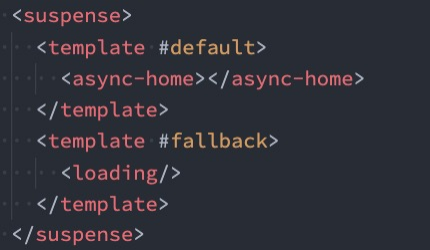


这样结合来使用

一般如果用到definedAsyncComponent的时候都会搭配一个suspense这个内置的组件，利用插槽找到default这个name的插槽和fallback这个name的插槽。这个loading组件是加载错误时展示的组件。

如果服务器在下载代码的时候可以下载到异步组件，那么就显示异步组件，如果下载不到或者错误的话就是用loading组件


## $refs的使用

某些情况下，我们在组件中想要直接获取到元素对象或者子组件实例：

- 在Vue开发中我们是不推荐进行DOM操作的； 
- 这个时候，我们可以给元素或者组件绑定一个ref的attribute属性；

组件实例有一个$refs属性： 

- 它一个对象Object，持有注册过 ref attribute 的所有 DOM 元素和组件实例。

```vue
<template>
  <div>
    <!-- 绑定到一个元素上 -->
    <h2 ref="title">哈哈哈</h2>

    <!-- 绑定到一个组件实例上 -->
    <nav-bar ref="navBar"></nav-bar>

    <button @click="btnClick">获取元素</button>
  </div>
</template>

<script>
  import NavBar from './NavBar.vue';

  export default {
    components: {
      NavBar
    },
    data() {
      return {
        names: ["abc", "cba"]
      }
    },
    methods: {
      btnClick() {
        // 获取dom
        console.log(this.$refs.title);

        // 获取组件中的message
        console.log(this.$refs.navBar.message);
        
        // 使用组件中的方法
        this.$refs.navBar.sayHello();

        // $el 获取组件的所有元素（根元素及所有子元素）
        console.log(this.$refs.navBar.$el);
      }
    }
  }
</script>
```


## $parent和$root

我们可以通过$parent来访问父元素。

HelloWorld.vue的实现：

- 这里我们也可以通过$root来实现，因为App是我们的根组件；

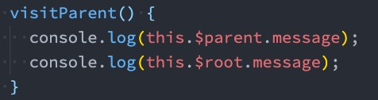

注意：在Vue3中已经移除了$children的属性，所以不可以使用了，所以我们可以用$refs。

虽然可以获取到父组件或者根组件的实例，但是最好不要直接拿实例上的东西，最好是用传的，因为直接拿，父组件或者根组件可能没有，这样会让代码的耦合性太强了，而且代码太乱了，因为你不知道name（比如父组件有一个name）是来自哪


## $el

$el用来获取子组件的所有dom元素，我这里打印的是一个组件的$el(this.$refs.navBar.$el)

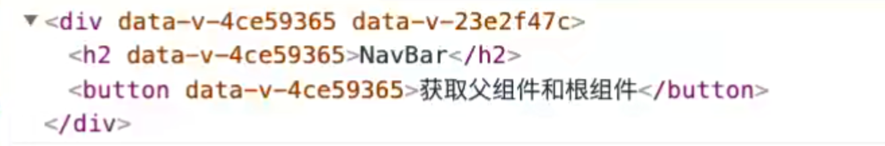


## 认识生命周期

什么是生命周期呢？ 

- 每个组件都可能会经历从创建、挂载、更新、卸载等一系列的过程； 
- 在这个过程中的某一个阶段，用于可能会想要添加一些属于自己的代码逻辑（比如组件创建完后就请求一些服务器数据）； 
- 但是我们如何可以知道目前组件正在哪一个过程呢？Vue给我们提供了组件的生命周期函数；

生命周期函数： 

- 生命周期函数是一些钩子函数，在某个时间会被Vue源码内部进行回调； 
- 通过对生命周期函数的回调，我们可以知道目前组件正在经历什么阶段； 
- 那么我们就可以在该生命周期中编写属于自己的逻辑代码了；


## 生命周期的流程

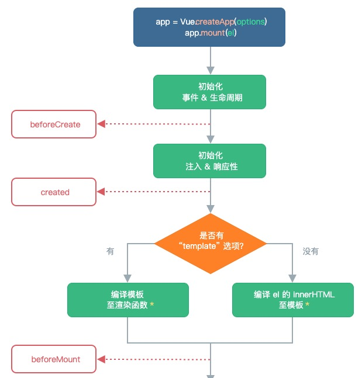

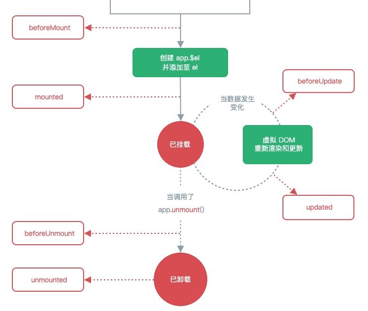

```js
<template>
  <div>
    <h2 ref="title">{{message}}</h2>
    <button @click="changeMessage">修改message</button>
  </div>
</template>

<script>
  export default {
    data() {
      return {
        message: "Hello Home"
      }
    },
    methods: {
      changeMessage() {
        this.message = "你好啊, 李银河"
      }
    },
    beforeCreate() {
      console.log("home beforeCreate");
    },
    created() {
      console.log("home created");
    },
    beforeMount() {
      console.log("home beforeMount");
    },
    mounted() {
      console.log("home mounted");
    },
    beforeUnmount() {
      console.log("home beforeUnmount");
    },
    unmounted() {
      console.log("home unmounted");
    },
    beforeUpdate() {
      console.log(this.$refs.title.innerHTML);
      console.log("home beforeUpdate");
    },
    updated() {
      console.log(this.$refs.title.innerHTML);
      console.log("home updated");
    }
  }
</script>

<style scoped>

</style>
```


## 组件的v-**model**

前面我们在input中可以使用v-model来完成双向绑定： 

- 这个时候往往会非常方便，因为v-model默认帮助我们完成了两件事； 
- v-bind:value的数据绑定和@input的事件监听；

如果我们现在封装了一个组件，其他地方在使用这个组件时，是否也可以使用v-model来同时完成这两个功能呢？ 

- 也是可以的，vue也支持在组件上使用v-model

当我们在组件上使用的时候，等价于如下的操作： 

- 我们会发现和input元素不同的只是属性的名称和事件触发的名称而已；

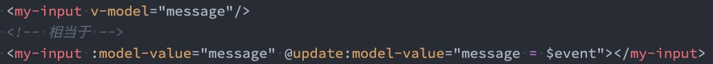

父组件：

```vue
<template>
  <div>
    <!-- 组件上使用v-model -->
    <hy-input v-model="message"></hy-input>
    <h2>{{message}}</h2>
  </div>
</template>

<script>
  import HyInput from './HyInput.vue';

  export default {
    components: {
      HyInput
    },
    data() {
      return {
        message: "Hello World"
      }
    }
  }
</script>

<style scoped>

</style>
```

子组件：

```vue
<template>
  <div>
    <h2>{{modelValue}}</h2>
   	<button @click="change">修改</button>
  </div>
</template>

<script>
  import HyInput from './HyInput.vue';

  export default {
    props: {
      modelValue: String
    },
    emits: ['update:modelValue'],
    methods: {
      change() {
        this.$emit('update:modelValue', '修改父组件的message')
      }
    }
  }
</script>

<style scoped>

</style>
```

这样就实现了v-model对组件的双向绑定了

我们也可以在子组件中写input标签，通过`:value="modelValue"`和`@input="change"`对他进行绑定


## 组件v-model的实现

那么，为了我们的MyInput组件可以正常的工作，这个组件内的必须： 

- 将其 value attribute 绑定到一个名叫 modelValue 的 prop 上； 
- 在其 input 事件被触发时，将新的值通过自定义的 update:modelValue 事件抛出；

MyInput.vue的组件代码如下：

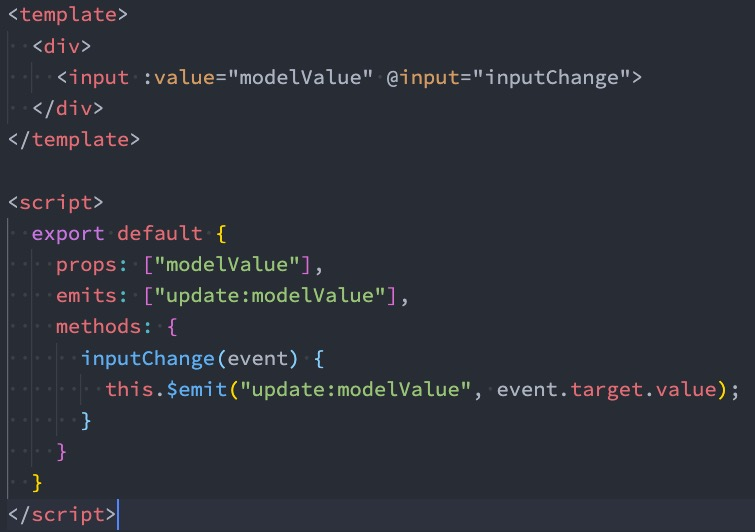

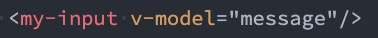

但是能不能对input标签再次使用v-model呢？

是不能的，因为<input v-model = "modelValue">这样写的话，他只是改了props中的modelValue和父组件中的数据是没有关系的，另外不能改父组件中的props中的值


## computed实现

我们依然希望在组件内部按照双向绑定的做法去完成，应该如何操作呢？我们可以使用计算属性的setter和getter 来完成。

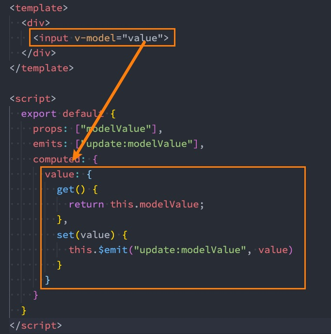


## 绑定多个属性

我们现在通过v-model是直接绑定了一个属性，如果我们希望绑定多个属性呢？ 

- 也就是我们希望在一个组件上使用多个v-model是否可以实现呢？ 
- 我们知道，默认情况下的v-model其实是绑定了 modelValue 属性和 @update:modelValue的事件； 
- 如果我们希望绑定更多，可以给v-model传入一个参数，那么这个参数的名称就是我们绑定属性的名称；

注意：这里我是绑定了两个属性的

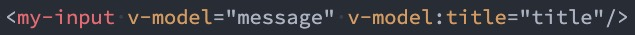

v-model:title相当于做了两件事： 

- 绑定了title属性； 
- 监听了 @update:title的事件；

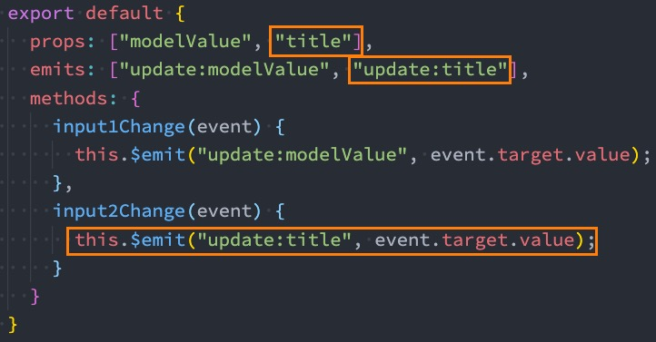

多个绑定注意，要给v-model传参数，来判断是哪一个v-model


## 认识Mixin

目前我们是使用组件化的方式在开发整个Vue的应用程序，但是**组件和组件之间有时候会存在相同的代码逻辑**，我们希望对**相同的代码逻辑进行抽取**。

在Vue2和Vue3中都支持的一种方式就是**使用Mixin来完成**：

- Mixin提供了一种非常灵活的方式，来分发Vue组件中的可复用功能；
- 一个Mixin对象可以包含任何组件选项；
- 当组件使用Mixin对象时，所有Mixin对象的选项将被 混合 进入该组件本身的选项中；


## Mixin的基本使用

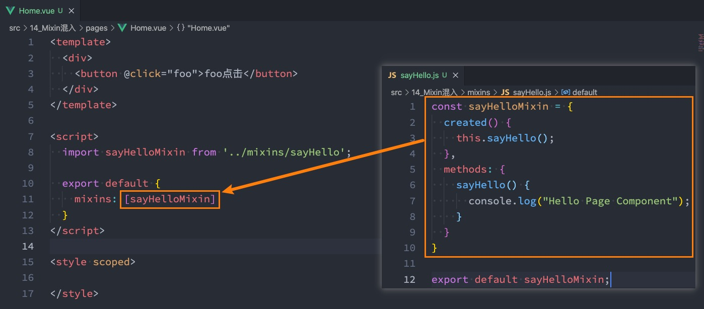


## Mixin的合并规则

如果Mixin对象中的选项和组件对象中的选项发生了冲突，那么Vue会如何操作呢？

- 这里分成不同的情况来进行处理；

情况一：如果是data函数的返回值对象

- 返回值对象默认情况下会进行合并；
- 如果data返回值对象的属性发生了冲突，那么会保留组件自身的数据；

情况二：如何生命周期钩子函数

- 生命周期的钩子函数会被合并到数组中，都会被调用；

情况三：值为对象的选项，例如 methods、components 和 directives，将被合并为同一个对象。

- 比如都有methods选项，并且都定义了方法，那么它们都会生效；
- 但是如果对象的key相同，那么会取组件对象的键值对；


## 全局混入Mixin

如果组件中的某些选项，是所有的组件都需要拥有的，那么这个时候我们可以使用全局的mixin：

- 全局的Mixin可以使用 应用app的方法 mixin 来完成注册；
- 一旦注册，那么全局混入的选项将会影响每一个组件；

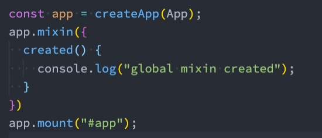
