## 认识动画 

在开发中，我们想要给一个组件的显示和消失添加某种过渡动画，可以很好的增加用户体验： 

- React框架本身并没有提供任何动画相关的API，所以在React中使用过渡动画我们需要使用一个第三方库 react-transition-group； 
- Vue中为我们提供一些内置组件和对应的API来完成动画，利用它们我们可以方便的实现过渡动画效果；

我们来看一个案例： 

- Hello World的显示和隐藏； 
- 通过下面的代码实现，是不会有任何动画效果的；

```vue
    <button @click="isShow = !isShow">Toogle</button>

    <h2 v-if="isShow">Hello World</h2>
```

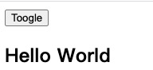

没有动画的情况下，整个内容的显示和隐藏会非常的生硬：

- 如果我们希望给单元素或者组件实现过渡动画，可以使用 transition 内置组件来完成动画；


## Vue的transition动画

Vue 提供了 transition 的封装组件，在下列情形中，可以给任何元素和组件添加进入/离开过渡： 

- 条件渲染 (使用 v-if)条件展示 (使用 v-show) 
- 动态组件 
- 组件根节点

```vue
<template>
  <div>
    <button @click="isShow = !isShow">显示/隐藏</button>
    
    <!-- vue提供的动画组件，需要把需要动画的元素包裹在里面，另外需要提供一个name -->
    <transition name="fade">
      <h2 v-if="isShow">hello world</h2>
    </transition>
  </div>
</template>

<script>
export default {
  data() {
    return {
      isShow: true,
    };
  },
};
</script>

<style scoped>
.fade-enter-from,
.fade-leave-to {
  opacity: 0;
}
.fade-enter-to,
.fade-leave-from {
  opacity: 1;
}
.fade-enter-active,
.fade-leave-active{
  transition: opacity 1s ease;
}
</style>
```

这样就可以添加一个opacity的动画

如果没有加name="fade"，那么就是v-enter-to、v-leave-to等通过v开头，但是一般都会加上name

上面这个被称为过渡动画


## Transition组件的原理

我们会发现，Vue自动给h2元素添加了动画，这是什么原因呢？

当插入或删除包含在 transition 组件中的元素时，Vue 将会做以下处理：

- 1.自动嗅探目标元素是否应用了CSS过渡或者动画，如果有，那么在恰当的时机添加/删除 CSS类名； 
- 2.如果 transition 组件提供了JavaScript钩子函数，这些钩子函数将在恰当的时机被调用； 
- 3.如果没有找到JavaScript钩子并且也没有检测到CSS过渡/动画，DOM插入、删除操作将会立即执行；

那么都会添加或者删除哪些class呢？


## 过渡动画class

我们会发现上面提到了很多个class，事实上Vue就是帮助我们在这些class之间来回切换完成的动画：

v-enter-from：定义进入过渡的开始状态。在元素被插入之前生效，在元素被插入之后的下一帧移除。

- 为什么是插入后的下一帧呢？因为在插入后，给这个元素加了个初始值，这样就从这个初始值开始向其他的变化了

v-enter-active：定义进入过渡生效时的状态。在整个进入过渡的阶段中应用，在元素被插入之前生效，在过渡/动 画完成之后移除。这个类可以被用来定义进入过渡的过程时间，延迟和曲线函数。 

v-enter-to：定义进入过渡的结束状态。在元素被插入之后下一帧生效 (与此同时 v-enter-from 被移除)，在过渡/ 动画完成之后移除。 

v-leave-from：定义离开过渡的开始状态。在离开过渡被触发时立刻生效，下一帧被移除。 

v-leave-active：定义离开过渡生效时的状态。在整个离开过渡的阶段中应用，在离开过渡被触发时立刻生效，在 过渡/动画完成之后移除。这个类可以被用来定义离开过渡的过程时间，延迟和曲线函数。 

v-leave-to：离开过渡的结束状态。在离开过渡被触发之后下一帧生效 (与此同时 v-leave-from 被删除)，在过渡/ 动画完成之后移除。


## class添加的时机和命名规则

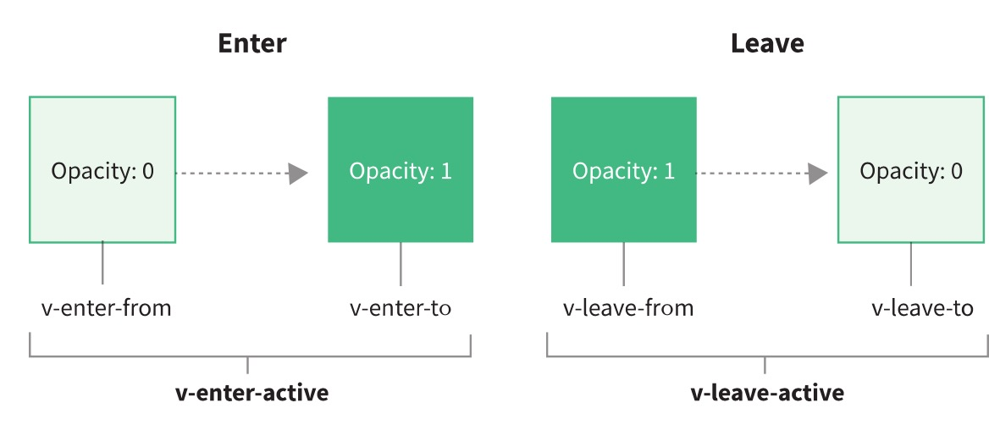


class的name命名规则如下： 

- 如果我们使用的是一个没有name的transition，那么所有的class是以 v- 作为默认前缀； 
- 如果我们添加了一个name属性，比如 ，那么所有的class会以 why- 开头；


## 过渡css动画

前面我们是通过transition来实现的动画效果，另外我们也可以通过animation来实现。

```vue
<template>
  <div id="app">
    <button @click="isShow = !isShow">显示/隐藏</button>
    <transition name="fade">
        <h2 v-if="isShow" class="show">hello world</h2>
    </transition>
  </div>
</template>

<script>
export default {
  data() {
    return {
      isShow: true,
    };
  },
};
</script>

<style scoped>
#app {
  width: 400px;
  margin: 0 auto;
}
.fade-enter-active{
  animation: bounce 2s ease
}
.fade-leave-active{
  animation: bounce 2s ease reverse;
}
@keyframes bounce {
  0% {
    transform: scale(0);
  }
  50% {
    transform: scale(1.2);
  }
  100% {
    transform: scale(1);
  }
}
</style>
```


## 同时设置过渡和动画

Vue为了知道过渡的完成，内部是在监听 transitionend 或 animationend，到底使用哪一个取决于元素应用的 CSS规则： - 

- 如果我们只是使用了其中的一个，那么Vue能自动识别类型并设置监听；

但是如果我们同时使用了过渡和动画呢？ 

- 假如有一个问题，就是这个元素，同时使用了transition和animation,但是呢一个是一秒，另一个是两秒，这个时候，一秒的执行完了，要不要删掉fade-enter-active这个类名呢？（不管是transition还是animation它们都用的是这一个类名），如果删掉了，那么我两秒的还没执行完啊

- 并且在这个情况下可能某一个动画执行结束时，另外一个动画还没有结束； 
- 在这种情况下，我们可以设置 type 属性为 animation 或者 transition 来明确的告知Vue监听的类型；
- 就是根据transition的时间来执行动画的结束，还是根据animation的时间来执行动画的结束呢？
- 但是一般都会把他们的时间写成一样的，而且一般就直接使用animation了，这样可以定义多个帧

```vue
<template>
  <div id="app">
    <button @click="isShow = !isShow">显示/隐藏</button>
    <transition name="fade" type="animation">
      <h2 v-if="isShow" class="show">hello world</h2>
    </transition>
  </div>
</template>

<script>
export default {
  data() {
    return {
      isShow: true,
    };
  },
};
</script>

<style scoped>
#app {
  width: 400px;
  margin: 0 auto;
}
    //过渡
.fade-enter-from,
.fade-leave-to {
  opacity: 0;
}
    //过渡
.fade-enter-active,
.fade-leave-active{
  transition: opacity 1s ease;
}
    //动画
.fade-enter-active {
  animation: bounce 2s ease;
}
.fade-leave-active {
  animation: bounce 2s ease reverse;
}
@keyframes bounce {
  0% {
    transform: scale(0);
  }
  50% {
    transform: scale(1.2);
  }
  100% {
    transform: scale(1);
  }
}
</style>
```


## 显示的指定动画时间

我们也可以显示的来指定过渡的时间，通过 duration 属性。 

duration可以设置两种类型的值：

- number类型：同时设置进入和离开的过渡时间； 
- object类型：分别设置进入和离开的过渡时间；

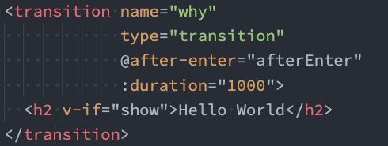

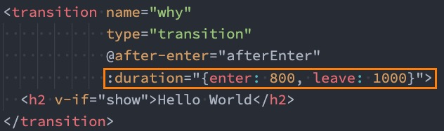

如果这样写，在css中写的 animation: bounce 2s ease这里的2s就不起作用了


这个时间就不起作用了，并且这个时间只针对animation，并不针对transition


## 过渡的模式mode

我们来看当前的动画在两个元素之间切换的时候存在的问题：

我们一般代码会是这样的


这两种情况，都会出现，比如第一个图，显示灰色的消失，然后是黑色的显示，并且往上走了，它们两个在同时执行动画


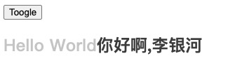

我们会发现 Hello World 和 你好啊，李银河是同时存在的： 

- 这是因为默认情况下进入和离开动画是同时发生的； 
- 如果确实我们希望达到这个的效果，那么是没有问题；

但是如果我们不希望同时执行进入和离开动画，那么我们需要设置transition的过渡模式： 

- in-out: 新元素先进行进入过渡，完成之后当前元素进行离开过渡； 
- out-in: 当前元素先进行离开过渡，完成之后新元素进行进入过渡；


## 动态组件的切换

上面的示例同样适用于我们的动态组件：

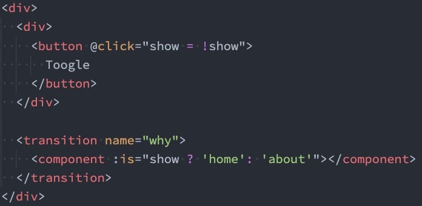


## appear初次渲染

默认情况下，首次渲染的时候是没有动画的，如果我们希望给他添加上去动画，那么就可以增加另外一个属性 appear：

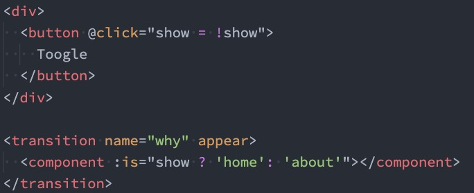


组件的进入和离开结合动画实现

```vue
<template>
  <div id="app">
    <button @click="isShow = !isShow">显示/隐藏</button>
    <!-- <transition name="fade" type="animation" mode="in-out"> -->
    <!-- <transition name="fade" type="animation" mode="out-in">
      <h2 v-if="isShow" class="show">hello world</h2>
      <h2 v-else class="show">你好啊，李银河</h2>
    </transition> -->

    <!-- appear 表示，第一次的时候就会执行进入动画 -->
    <transition name="fade" mode="out-in" appear>
      <component :is="isShow ? 'home' : 'about'"></component>
    </transition>
  </div>
</template>

<script>
import Home from "./components/Home.vue";
import About from "./components/About.vue";
export default {
  components: {
    Home,
    About,
  },
  data() {
    return {
      isShow: true,
    };
  },
};
</script>

<style scoped>
#app {
  width: 200px;
  margin: 0 auto;
}
.fade-enter-from,
.fade-leave-to {
  opacity: 0;
}
.fade-enter-active,
.fade-leave-active {
  transition: opacity 1s ease;		// 这里过渡的是opacity
}
.fade-enter-active {
  animation: bounce 2s ease;
}
.fade-leave-active {
  animation: bounce 2s ease reverse;
}
@keyframes bounce {
  0% {
    transform: scale(0);
  }
  50% {
    transform: scale(1.2);
  }
  100% {
    transform: scale(1);
  }
}
</style>
```


## 认识animate.css

如果我们手动一个个来编写这些动画，那么效率是比较低的，所以在开发中我们可能会引用一些第三方库的动画库， 比如animate.css

什么是animate.css呢？ 

- Animate.css is a library of ready-to-use, cross-browser animations for use in your web projects. Great  for emphasis, home pages, sliders, and attention-guiding hints. 
- Animate.css是一个已经准备好的、跨平台的动画库为我们的web项目，对于强调、主页、滑动、注意力引导 非常有用；

如何使用Animate库呢？ 

- 第一步：需要安装animate.css库； 
- 第二步：导入animate.css库的样式； 
- 第三步：使用animation动画或者animate提供的类；


## 自定义过渡class

我们可以通过以下 attribute 来自定义过渡类名： 

- enter-from-class 
- enter-active-class 
- enter-to-class 
- leave-from-class 
- leave-active-class 
- leave-to-class

他们的优先级高于普通的类名，这对于 Vue 的过渡系统和其他第三方 CSS 动画库，如 Animate.css. 结合使用十分有用。

如果同时存在自定义class，也存在我们给他添加name的class，那么自定义的class更好


## animate.css库的使用

安装animate.css：

```
npm install animate.css
```

在main.js中导入animate.css：

./main.js

```js
import { createApp } from 'vue'
import App from './03_列表动画的使用/02_列表的交替动画.vue'
import "animate.css";

createApp(App).mount('#app')

```


./App.vue

```vue
<template>
  <div class="app">
    <div><button @click="isShow = !isShow">显示/隐藏</button></div>

    <!-- 用法二：直接使用animate库提供给我们的类 -->
    <transition enter-active-class="animate__animated animate__fadeInDown"
                leave-active-class="animate__animated animate__flipInY">
      <h2 class="title" v-if="isShow">Hello World</h2>
    </transition>
  </div>
</template>

<script>
  export default {
    data() {
      return {
        isShow: true
      }
    }
  }
</script>

<style scoped>
  .title {
    display: inline-block;
    transform: translateX(100px)
  }

  // 最好在离开的时候做一反转
  .animate__flipInY {
    animation-direction: reverse;
  }

  /* 用法一：直接使用animate库中定义的 keyframes 动画； */
  /* .why-enter-active {
    animation: bounceInUp 1s ease-in;
  }

  .why-leave-active {
    animation: bounceInUp 1s ease-in reverse;
  } */
</style>
```


接下来在使用的时候我们有两种用法： 

- 用法一：直接使用animate库中定义的 keyframes 动画； 

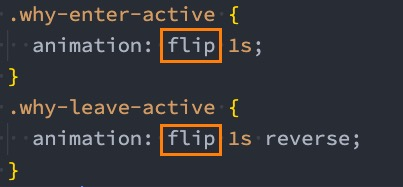

- 用法二：直接使用animate库提供给我们的类；

我们可以通过以下 attribute 来自定义过渡类名： 

- enter-from-class 
- enter-active-class 
- enter-to-class 
- leave-from-class 
- leave-active-class 
- leave-to-class

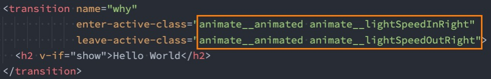

> 注意：
>
> animate__animated是必须要添加的

上面是属于css的库，下面的是属于js的库


## 认识gsap库

用js来实现动画的库

某些情况下我们希望通过JavaScript来实现一些动画的效果，这个时候我们可以选择使用gsap库来完成。

什么是gsap呢？ 

- GSAP是The GreenSock Animation Platform（GreenSock动画平台）的缩写； 
- 它可以通过JavaScript为CSS属性、SVG、Canvas等设置动画，并且是浏览器兼容的；

这个库应该如何使用呢？ 

- 第一步：需要安装gsap库； 
- 第二步：导入gsap库； 
- 第三步：使用对应的api即可；

我们可以先安装一下gsap库：

```
npm install gsap
```


## JavaScript钩子

在使用动画之前，我们先来看一下transition组件给我们提供的JavaScript钩子，这些钩子可以帮助我们监听动画执行到什么阶段了，注意，这些是vue给我们提供的。

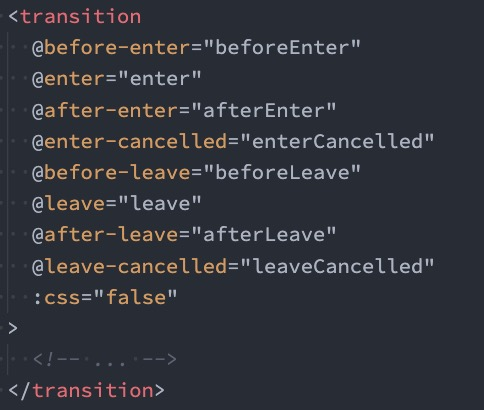

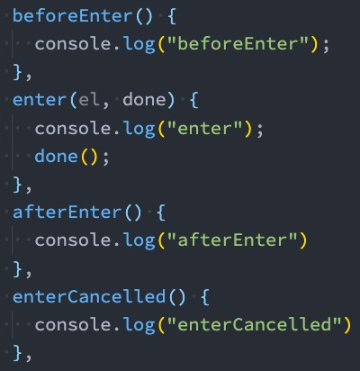

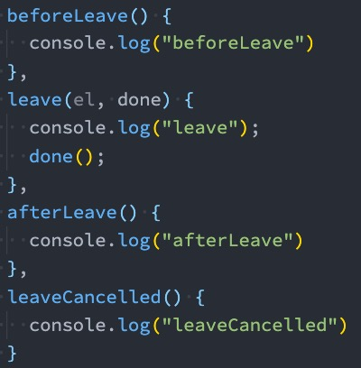


当我们使用JavaScript来执行过渡动画时，需要进行 done 回调，否则它们将会被同步调用，过渡会立即完成。

添加 :css="false"，也会让 Vue 会跳过 CSS 的检测，除了性能略高之外，这可以避免过渡过程中 CSS 规则的影响，也就是不会检测我们的fade-enter-from这些东西了。一般我们在使用js来实现动画的时候就不希望我们添加的这些css动画产生作用了，就可以用这个属性


## gsap库的使用

那么接下来我们就可以结合gsap库来完成动画效果：

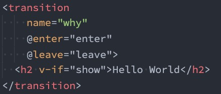


这个el是vue给我们的，这个钩子提供的

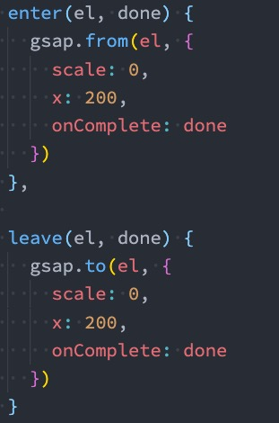


app.vue

```vue
<template>
  <div id="app">
    <button @click="isShow = !isShow">显示/隐藏</button>
    <transition @enter="enter" @leave="leave">
      <h2 class="title" v-if="isShow">hello world</h2>
    </transition>
  </div>
</template>

<script>
// 引入gsap
import gsap from "gsap";
export default {
  data() {
    return {
      isShow: true,
    };
  },
  methods: {
    enter(el, done) {
      // 定义进入
      gsap.from(el, {
        scale: 0,
        x: 200,
        onComplete: done,	// 当动画执行完成之后，会调用这个done，告诉gsap，此时动画才算完成了
      });
    },
    // 定义离开
    leave(el, done) {
      gsap.to(el, {
        scale: 0,
        x: 200,
        onComplete: done,
      });
    },
  },
};
</script>

<style scoped>
.title {
  width: 200px;
}
</style>
```


## gsap实现数字变化

在一些项目中，我们会见到数字快速变化的动画效果，这个动画可以很容易通过gsap来实现

```vue
<template>
  <div class="app">
    <input type="number" step="100" v-model="counter">
    <!-- <h2>当前计数: {{showCounter}}</h2> -->
    <h2>当前计数: {{showNumber.toFixed(0)}}</h2>
  </div>
</template>

<script>
  import gsap from 'gsap';

  export default {
    data() {
      return {
        counter: 0,
        showNumber: 0
      }
    },
    // computed: {
    //   showCounter() {
    //     return this.showNumber.toFixed(0);
    //   }
    // },
    watch: {
      counter(newValue) {
        gsap.to(this, {duration: 1, showNumber: newValue})
      }
    }
  }
</script>

<style scoped>
</style>
```

注意：这里用不用计算属性都是可以的，但是官方是有用一个计算属性


## 认识列表的过渡

目前为止，过渡动画我们只要是针对单个元素或者组件的： 

- 要么是单个节点； 
- 要么是同一时间渲染多个节点中的一个；

那么如果希望渲染的是一个列表，并且该列表中添加删除数据也希望有动画执行呢？ 

- 这个时候我们要使用  组件来完成；

使用 有如下的特点： 

- 默认情况下，它不会渲染一个元素的包裹器，但是你可以指定一个元素并以 tag attribute 进行渲染； 
- 过渡模式不可用，因为我们不再相互切换特有的元素（made:in-out)； 
- 内部元素总是需要提供唯一的 key attribute 值； 
- CSS 过渡的类将会应用在内部的元素中，而不是这个组/容器本身；


## 列表过渡的基本使用

我们来做一个案例： 

- 案例是一列数字，可以继续添加或者删除数字； 
- 在添加和删除数字的过程中，对添加的或者移除的数字添加动画；

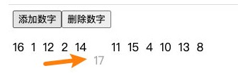


思路就是，首先把列表弄出来，然后弄一个随机数，随机往里面包裹住，然后，用`transition-group`标签把这些包裹住，然后给`transition-group`加上一个name，然后再css中写样式就行了

```vue
<template>
  <div>
    <button @click="addNum">增加数字</button>
    <button @click="subNum">删除数字</button>
    <!-- 这里的tag是把transition-group渲染为p标签 -->
    <transition-group name="fade" tag="p">
      <span class="showNum" v-for="item in numbs" :key="item">{{ item }}</span>
    </transition-group>
  </div>
</template>

<script>
export default {
  data() {
    return {
      numbs: [1, 2, 3, 4, 5, 6, 7, 8, 9],
      numAdd: 10,
    };
  },
  methods: {
    addNum() {
      this.numbs.splice(this.randomNum(), 0, this.numAdd++);
    },
    subNum() {
      this.numbs.splice(this.randomNum(), 1);
    },
    randomNum() {
      return parseInt(Math.random() * this.numbs.length);
    },
  },
};
</script>

<style scoped>
.i-div {
  margin-top: 20px;
}
.showNum {
  display: inline-block;
  margin-right: 10px;
}
.fade-enter-from,
.fade-leave-to {
  opacity: 0;
  transform: translateY(20px);
}
.fade-enter-active,
.fade-leave-active {
  transition: all 1s ease;
}
</style>
```


增加和删除的动画

```vue
<template>
  <div>
    <button @click="addNum">增加数字</button>
    <button @click="subNum">删除数字</button>
    <!-- 这里的tag是把transition-group渲染为p标签 -->
    <transition-group name="fade" tag="p">
      <span class="showNum" v-for="item in numbs" :key="item">{{ item }}</span>
    </transition-group>
  </div>
</template>

<script>
export default {
  data() {
    return {
      numbs: [1, 2, 3, 4, 5, 6, 7, 8, 9],
      numAdd: 10,
    };
  },
  methods: {
    addNum() {
      this.numbs.splice(this.randomNum(), 0, this.numAdd++);
    },
    subNum() {
      this.numbs.splice(this.randomNum(), 1);
    },
    randomNum() {
      return parseInt(Math.random() * this.numbs.length);
    },
  },
};
</script>

<style scoped>
.i-div {
  margin-top: 20px;
}
.showNum {
  display: inline-block;
  margin-right: 10px;
}
.fade-enter-from,
.fade-leave-to {
  opacity: 0;
  transform: translateY(20px);
}
.fade-enter-active,
.fade-leave-active {
  transition: all 1s ease;
}
/* 删除的时候要加上这个属性  */
.fade-leave-active{
  position:absolute;
}

/* 离开的时候加上这个 */
.fade-move {
  transition: transform 1s ease;
}
</style>
```


排序

下载lodash

```
npm install lodash
```


```vue
<template>
  <div>
    <button @click="addNum">增加数字</button>
    <button @click="subNum">删除数字</button>
    <button @click="shuffNum">数字排序</button>
    <!-- 这里的tag是把transition-group渲染为p标签 -->
    <transition-group name="fade" tag="p">
      <span class="showNum" v-for="item in numbs" :key="item">{{ item }}</span>
    </transition-group>
  </div>
</template>

<script>
import _ from "lodash";
export default {
  data() {
    return {
      numbs: [1, 2, 3, 4, 5, 6, 7, 8, 9],
      numAdd: 10,
    };
  },
  methods: {
    addNum() {
      this.numbs.splice(this.randomNum(), 0, this.numAdd++);
    },
    subNum() {
      this.numbs.splice(this.randomNum(), 1);
    },
    // 增加洗牌的操作
    shuffNum() {
      this.numbs = _.shuffle(this.numbs);
    },
    randomNum() {
      return parseInt(Math.random() * this.numbs.length);
    },
  },
};
</script>

<style scoped>
.i-div {
  margin-top: 20px;
}
.showNum {
    /* 注意，span元素在他出来之前不能对它做很多操作，需要转成块元素，不然很多动画加不上，比如transition */
  display: inline-block;
  margin-right: 10px;
}
.fade-enter-from,
.fade-leave-to {
  opacity: 0;
  transform: translateY(20px);
}
.fade-enter-active,
.fade-leave-active {
  transition: all 1s ease;
}
/* 删除的时候要加上这个属性  */
.fade-leave-active {
  position: absolute;
}

/* 离开的时候加上这个 */
.fade-move {
  transition: transform 1s ease;
}
</style>
```


上面的代码写完就会有一个洗牌的排序了


## 列表的交错过渡案例

我们来通过gsap的延迟delay属性，做一个交替消失的动画：

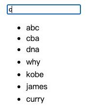

```vue
<template>
  <div>
    <input type="text" v-model="keyword" />
    <transition-group
      tag="ul"
      name="fade"
      :css="false"
      @enter="enter"
      @leave="leave"
      @before-enter="beforEnter"
    >
      <!-- 这里的data-index  会给到dataset -->
      <li v-for="(item, index) in showNames" :key="item" :data-index="index">
        {{ item }}
      </li>
    </transition-group>
  </div>
</template>

<script>
import gsap from "gsap";
export default {
  data() {
    return {
      names: ["abc", "cba", "nba", "why", "lilei", "hmm", "kobe", "james"],
      keyword: "",
    };
  },
  computed: {
    showNames() {
      return this.names.filter((item) => item.indexOf(this.keyword) !== -1);
    },
  },
  methods: {
    beforEnter(el) {
      el.style.opacity = 0;
      el.style.height = 0;
    },
    enter(el, done) {
      gsap.to(el, {
        opacity: 1,
        height: "1.5em",
        delay: el.dataset.index * 0.5,	// 延迟：每一个延迟的时间不一样
        onComplete: done,
      });
    },
    leave(el, done) {
      gsap.to(el, {
        opacity: 0,
        height: "0",
        // el就是绑定的dom元素，在dataset里面拿到index
        delay: el.dataset.index * 0.2,
        onComplete: done,
      });
    },
  },
};
</script>

<style scoped>
/* 不要用css，css实现的非常生硬 */
/* .fade-enter-from,
.fade-leave-to{
  opacity: 0;
}
.fade-enter-active,
.fade-leave-active{
  transition: all 1s ease
}
.fade-move{
  transition: transform;
} */
</style>
```

