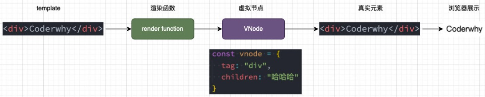
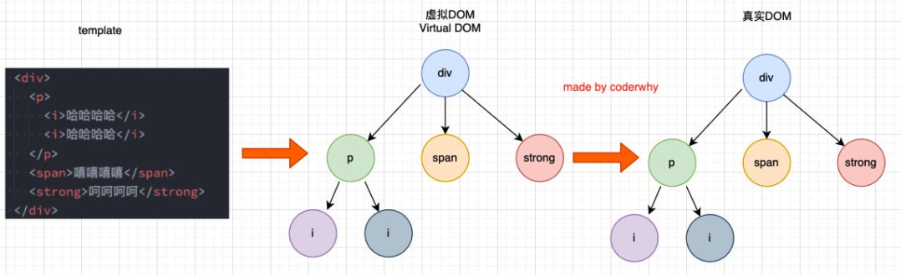
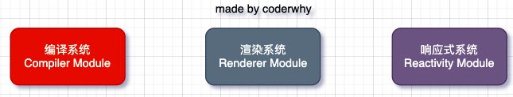
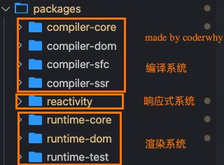
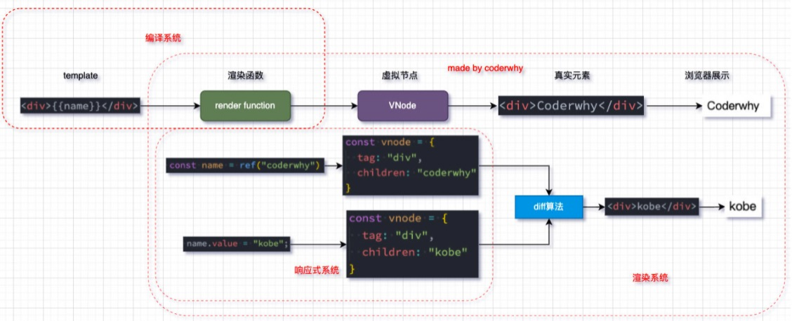

## Vue3源码学习


## 真实的DOM渲染

我们传统的前端开发中，我们是编写自己的HTML，形成一个dom树，浏览器识别到我们的dom树，最终被渲染到浏览器上的，那么它是什么样的过程呢？


## 虚拟DOM的优势

目前框架都会引入虚拟DOM来对真实的DOM进行抽象，这样做有很多的好处：

首先是可以对真实的元素节点进行抽象，抽象成VNode（虚拟节点），这样方便后续对其进行各种操作： 

- 因为对于直接操作DOM来说是有很多的限制的，比如diff、clone等等(element的属性太多了)，但是使用JavaScript编程语言来操作这 些，就变得非常的简单； 
- 我们可以使用JavaScript来表达非常多的逻辑，而对于DOM本身来说是非常不方便的；

其次是方便实现跨平台，包括你可以将VNode节点渲染成任意你想要的节点 

- 如渲染在canvas、WebGL、SSR、Native（iOS、Android）上； 
- 并且Vue允许你开发属于自己的渲染器（renderer），在其他的平台上渲染；

实现跨平台，将一些虚拟dom转成控件，比如ios，安卓，button控件（安卓），或者uibutton控件（ios）

vue源码比较复杂，但是本质上做的就是这个事情


## 虚拟DOM的渲染过程






## 三大核心系统

事实上Vue的源码包含三大核心： 

- Compiler模块：编译模板系统（把template中的代码编译成render函数生成虚拟节点）； 
-  Runtime模块：也可以称之为Renderer模块，真正渲染的模块； 
- Reactivity模块：响应式系统；






## 三大系统协同工作

三个系统之间如何协同工作呢：




## 实现Mini-Vue

这里我们实现一个简洁版的Mini-Vue框架，该Vue包括三个模块： 

- 渲染系统模块； 
- 可响应式系统模块； 
- 应用程序入口模块；


## 渲染系统实现

渲染系统，该模块主要包含三个功能： 

- 功能一：h函数，用于返回一个VNode对象； 
- 功能二：mount函数，用于将VNode挂载到DOM上； 
- 功能三：patch函数，用于对两个VNode进行对比，决定如何处理新的VNode；

./index.html

```html
<!DOCTYPE html>
<html lang="en">
<head>
  <meta charset="UTF-8">
  <meta name="viewport" content="width=device-width, initial-scale=1.0">
  <title>Document</title>
</head>
<body>
  <div id="app"></div>
  <script src="./render.js"></script>
  <script>
    // 1.通过h函数来创建一个vnode
    const vnode = h('div', {class: 'wts'}, [
      h('h2', null, 'hello world'),
      h('p', null, 'this is a paragraph')
    ])
  </script>
</body>
</html>
```


### h函数 – 生成VNode

h函数的实现： 

- 直接返回一个VNode对象即可

./render.js

```js
const h = (tag, props, children) => {
  // 返回的就是vnode对象
  return {
    tag,
    props,
    children
  }
}
```

上面已经实现了h函数

这就是我们的vnode了


上面就是虚拟dom了

接下来需要把虚拟节点转换成真实dom，并且展示在页面


### Mount函数 – 挂载VNode

mount函数的实现：

第一步：根据tag，创建HTML元素，并且存储 到vnode的el中；

第二步：处理props属性 

- 如果以on开头，那么监听事件； 
- 普通属性直接通过 setAttribute 添加即可；

第三步：处理子节点 

- 如果是字符串节点，那么直接设置 textContent； 
- 如果是数组节点，那么遍历调用 mount 函 数；

./index.html

```html
<!DOCTYPE html>
<html lang="en">
<head>
  <meta charset="UTF-8">
  <meta name="viewport" content="width=device-width, initial-scale=1.0">
  <title>Document</title>
</head>
<body>
  <div id="app"></div>
  <script src="./render.js"></script>
  <script>
    // 1.通过h函数来创建一个vnode
    const vnode = h('div', {class: 'wts'}, [
      h('h2', null, 'hello world'),
      h('p', null, 'this is a paragraph')
    ])
    console.log(vnode);

    // 2.通过mount函数将vnode怪哉到div#app上
    mount(vnode, document.querySelector('#app'));
  </script>
</body>
</html>
```

./render.js

```js
const h = (tag, props, children) => {
  // 返回的就是vnode对象
  return {
    tag,
    props,
    children
  }
}

const mount = (vnode, container) => {
  // vnode保留一份真实的DOM元素
  const el = vnode.el = document.createElement(vnode.tag);

  // 设置属性
  if (vnode.props) {
    for (const key in vnode.props) {
      const value = vnode.props[key];
      // 如果是事件监听器
      if (key.startsWith('on')) {
        el.addEventListener(key.slice(2).toLowerCase(), value)
      } else {
        // 普通属性
        el.setAttribute(key, value)
      }
      
    }
  }

  // 3.处理子节点
  if (vnode.children) {
    if (typeof vnode.children === 'string') {
      // 如果是文本节点
      el.textContent = vnode.children;
    } else {
      // 如果是数组节点
      vnode.children.forEach(child => {
        mount(child, el);
      });
    }
  }

  // 4.将el添加到容器中
  container.appendChild(el);
}
```


### Patch函数 – 对比两个VNode

patch函数的实现，分为两种情况 

n1和n2是不同类型的节点： 

- 找到n1的el父节点，删除原来的n1节点的el； 
- 挂载n2节点到n1的el父节点上；

n1和n2节点是相同的节点： 

- 处理props的情况 
  - 先将新节点的props全部挂载到el上； 
  - 判断旧节点的props是否不需要在新节点上，如果不需要，那么删除对应的属性； 
- 处理children的情况
  - 如果新节点是一个字符串类型，那么直接调用 el.textContent = newChildren； 
  - 如果新节点不同一个字符串类型：
    - 旧节点是一个字符串类型 
      - 将el的textContent设置为空字符串； 
      - 就节点是一个字符串类型，那么直接遍历新节点，挂载到el上；
    - 旧节点也是一个数组类型 
      - 取出数组的最小长度； 
      - 遍历所有的节点，新节点和旧节点进行path操作； 
      - 如果新节点的length更长，那么剩余的新节点进行挂载操作； 
      - 如果旧节点的length更长，那么剩余的旧节点进行卸载操作；


#### 如果节点不同

./index.html

```html
<!DOCTYPE html>
<html lang="en">
<head>
  <meta charset="UTF-8">
  <meta name="viewport" content="width=device-width, initial-scale=1.0">
  <title>Document</title>
</head>
<body>
  <div id="app"></div>
  <script src="./render.js"></script>
  <script>
    // 1.通过h函数来创建一个vnode
    const vnode = h('div', {class: 'wts'}, [
      h('h2', null, '当前计数'),
      h('button', {onClick: function () {}}, '+1')
    ])
    console.log(vnode);

    // 2.通过mount函数将vnode怪哉到div#app上
    mount(vnode, document.querySelector('#app'));

    // 3.创建新的vnode
    const vnode1 = h('h2', { class: 'coderwts' }, '哈哈哈')

    // 为了看的更清楚一些用计时器
    setTimeout(() => {
      patch(vnode, vnode1)
    }, 2000)
  </script>
</body>
</html>
```


./render.js

```js
const h = (tag, props, children) => {
  // 返回的就是vnode对象
  return {
    tag,
    props,
    children
  }
}

const mount = (vnode, container) => {
  // vnode保留一份真实的DOM元素
  const el = vnode.el = document.createElement(vnode.tag);

  // 设置属性
  if (vnode.props) {
    for (const key in vnode.props) {
      const value = vnode.props[key];
      // 如果是事件监听器
      if (key.startsWith('on')) {
        el.addEventListener(key.slice(2).toLowerCase(), value)
      } else {
        // 普通属性
        el.setAttribute(key, value)
      }
      
    }
  }

  // 3.处理子节点
  if (vnode.children) {
    if (typeof vnode.children === 'string') {
      // 如果是文本节点
      el.textContent = vnode.children;
    } else {
      // 如果是数组节点
      vnode.children.forEach(child => {
        mount(child, el);
      });
    }
  }

  // 4.将el添加到容器中
  container.appendChild(el);
}

const patch = (n1, n2) => {
  if (n1.tag !== n2.tag) {
    const n1ElParent = n1.el.parentElement;
    n1ElParent.removeChild(n1.el)
    mount(n2, n1ElParent)
  } else {

  }
}
```


#### 如果节点相同，但是属性不同，内容也不同

./index.html

```html
<!DOCTYPE html>
<html lang="en">
<head>
  <meta charset="UTF-8">
  <meta name="viewport" content="width=device-width, initial-scale=1.0">
  <title>Document</title>
</head>
<body>
  <div id="app"></div>
  <script src="./render.js"></script>
  <script>
    // 1.通过h函数来创建一个vnode
    const vnode = h('div', {class: 'wts', id: 'aaa'}, [
      h('h2', null, '当前计数'),
      h('button', {onClick: function () {}}, '+1')
    ])
    console.log(vnode);

    // 2.通过mount函数将vnode怪哉到div#app上
    mount(vnode, document.querySelector('#app'));

    // 3.创建新的vnode
    // const vnode1 = h('h2', { class: 'coderwts' }, '哈哈哈')
    const vnode1 = h('div', { class: 'coderwts', id: 'aaa' }, '哈哈哈')

    // 为了看的更清楚一些用计时器
    setTimeout(() => {
      patch(vnode, vnode1)
    }, 2000)
  </script>
</body>
</html>
```

./render.js

```js
const h = (tag, props, children) => {
  // 返回的就是vnode对象
  return {
    tag,
    props,
    children
  }
}

const mount = (vnode, container) => {
  // vnode保留一份真实的DOM元素
  const el = vnode.el = document.createElement(vnode.tag);

  // 设置属性
  if (vnode.props) {
    for (const key in vnode.props) {
      const value = vnode.props[key];
      // 如果是事件监听器
      if (key.startsWith('on')) {
        el.addEventListener(key.slice(2).toLowerCase(), value)
      } else {
        // 普通属性
        el.setAttribute(key, value)
      }
      
    }
  }

  // 3.处理子节点
  if (vnode.children) {
    if (typeof vnode.children === 'string') {
      // 如果是文本节点
      el.textContent = vnode.children;
    } else {
      // 如果是数组节点
      vnode.children.forEach(child => {
        mount(child, el);
      });
    }
  }

  // 4.将el添加到容器中
  container.appendChild(el);
}

const patch = (n1, n2) => {
  if (n1.tag !== n2.tag) {
    const n1ElParent = n1.el.parentElement;
    n1ElParent.removeChild(n1.el)
    mount(n2, n1ElParent)
  } else {
    // 1.取出element对象并且在n2中保存(当前n1.el在mount的时候加进去了，但是n2没有，所以这里加上)
    const el = n2.el = n1.el

    // 2.处理props
    const oldProps = n1.props || {}
    const newProps = n2.props || {}
    // 2.1获取所有的newProps添加到el
    for(const key in newProps) {
      const oldValue = oldProps[key]
      const newValue = newProps[key]
      if (oldValue !== newValue) {
        if (key.startsWith('on')) {
          el.addEventListener(key.slice(2).toLowerCase(), newValue)
        } else {
          // 普通属性
          el.setAttribute(key, newValue)
        }
      }
    }

    // 2.2删除旧的props
    for(const key in oldProps) {
      if (!(key in newProps)) {
        if (key.startsWith('on')) {
          const value = oldProps[key]
          el.removeEventListener(key.slice(2).toLowerCase(), value)
        } else {
          // 普通属性
          el.removeAttribute(key)
        }
      }
    }


    // 3.处理Children
  }
}
```


#### 如果children不同

./index.html

```html
<!DOCTYPE html>
<html lang="en">
<head>
  <meta charset="UTF-8">
  <meta name="viewport" content="width=device-width, initial-scale=1.0">
  <title>Document</title>
</head>
<body>
  <div id="app"></div>
  <script src="./render.js"></script>
  <script>
    // 1.通过h函数来创建一个vnode
    const vnode = h('div', {class: 'wts', id: 'aaa'}, [
      h('h2', null, '当前计数'),
      h('button', {onClick: function () {}}, '+1')
    ])
    console.log(vnode);

    // 2.通过mount函数将vnode怪哉到div#app上
    mount(vnode, document.querySelector('#app'));

    // 3.创建新的vnode
    // const vnode1 = h('h2', { class: 'coderwts' }, '哈哈哈')
    const vnode1 = h('div', { class: 'coderwts', id: 'aaa' },  [
      h('h2', null, '当前算数'),
      h('button', {onClick: function () {}}, '-1')
    ])

    // 为了看的更清楚一些用计时器
    setTimeout(() => {
      patch(vnode, vnode1)
    }, 2000)
  </script>
</body>
</html>
```

./render.js

```js
const h = (tag, props, children) => {
  // 返回的就是vnode对象
  return {
    tag,
    props,
    children
  }
}

const mount = (vnode, container) => {
  // vnode保留一份真实的DOM元素
  const el = vnode.el = document.createElement(vnode.tag);

  // 设置属性
  if (vnode.props) {
    for (const key in vnode.props) {
      const value = vnode.props[key];
      // 如果是事件监听器
      if (key.startsWith('on')) {
        el.addEventListener(key.slice(2).toLowerCase(), value)
      } else {
        // 普通属性
        el.setAttribute(key, value)
      }
      
    }
  }

  // 3.处理子节点
  if (vnode.children) {
    if (typeof vnode.children === 'string') {
      // 如果是文本节点
      el.textContent = vnode.children;
    } else {
      // 如果是数组节点
      vnode.children.forEach(child => {
        mount(child, el);
      });
    }
  }

  // 4.将el添加到容器中
  container.appendChild(el);
}

const patch = (n1, n2) => {
  if (n1.tag !== n2.tag) {
    const n1ElParent = n1.el.parentElement;
    n1ElParent.removeChild(n1.el)
    mount(n2, n1ElParent)
  } else {
    // 1.取出element对象并且在n2中保存(当前n1.el在mount的时候加进去了，但是n2没有，所以这里加上)
    const el = n2.el = n1.el

    // 2.处理props
    const oldProps = n1.props || {}
    const newProps = n2.props || {}
    // 2.1获取所有的newProps添加到el
    for(const key in newProps) {
      const oldValue = oldProps[key]
      const newValue = newProps[key]
      if (oldValue !== newValue) {
        if (key.startsWith('on')) {
          el.addEventListener(key.slice(2).toLowerCase(), newValue)
        } else {
          // 普通属性
          el.setAttribute(key, newValue)
        }
      }
    }

    // 2.2删除旧的props
    for(const key in oldProps) {
      if (!(key in newProps)) {
        if (key.startsWith('on')) {
          const value = oldProps[key]
          el.removeEventListener(key.slice(2).toLowerCase(), value)
        } else {
          // 普通属性
          el.removeAttribute(key)
        }
      }
    }


    // 3.处理Children
    const oldChildren = n1.children || []
    const newChildren = n2.children || []

    if (typeof newChildren === 'string') {  // 情况一：newChild是字符串
      // 如果n1的innerHTML和n2的innerHTML相同的话就不用赋值，这属于egeCase
      if(typeof oldChildren === 'string') {
        if (newChildren !== oldChildren) {
          el.textContent = newChildren
        }
      } else {
        el.innerHTML = newChildren
      }
    } else { // 情况二： newChild不是字符串，那就是数组（插槽才是对象，不考虑）
      if (typeof oldChildren === 'string') {
        el.innerHTML = '';
        newChildren.forEach(item => {
          mount(item, el)
        })
      } else { // 两个都是数组
        // oldChildren: [v1, v2, v3]
        // newChildren: [v2, v4, v8, v9]
        // 1.前面有相同节点的原生进行patch操作
        const commonLength = Math.min(oldChildren.length, newChildren.length);
        for(let i = 0; i < commonLength; i++) {
          patch(oldChildren[i], newChildren[i]);
        }

        // 2.newChildren > oldChilren
        if (newChildren.length > oldChildren.length) {
          newChildren.slice(oldChildren.length).forEach(item => {
            mount(item, el)
          })
        }

        // 3.newChildren < oldChildren
        if (newChildren.length < oldChildren.length) {
          oldChildren.slice(newChildren.length).forEach(item => {
            el.removeChild(item.el)
          })
        }
      }
    }
  }
}
```

以上就是渲染器的实现了，接下来实现响应式系统


## 响应式系统

实现一个dep的响应式系统

./reactive.js

```js
class Dep {
  constructor() {
    this.subScribers = new Set();
    
  }
  addEffect(effct) {
    this.subScribers.add(effct)
  }
  notify() {
    this.subScribers.forEach(effct => {
      effct()
    });
  }
}

const info = { counter: 100 }

const dep = new Dep()
function doubleCounter() {
  console.log(info.counter * 2)
}
function powerCounter() {
  console.log(info.counter * info.counter)
}

dep.addEffect(doubleCounter)
dep.addEffect(powerCounter)


info.counter = 200

dep.notify()
```

缺点：需要手动把函数加入到subScribers中等等

代码重新构造了一下，但是和上面的代码效果是一样的

./reactive.js

```js
let activeEffect = null
class Dep {
  constructor() {
    this.subScribers = new Set();
    
  }
  addEffect(effct) {
    this.subScribers.add(effct)
  }
  depend() {
    if (activeEffect) {
      this.subScribers.add(activeEffect)
    }
  }
  notify() {
    this.subScribers.forEach(effct => {
      effct()
    });
  }
}
const info = { counter: 100 }

const dep = new Dep()

function watchEffect(effct) {
  activeEffect = effct;
  dep.depend()
  // 这里要先执行一次
  effct()
  activeEffect = null;
}

watchEffect(function() {
  console.log(info.counter * 2)
})
watchEffect(function () {
  console.log(info.counter * info.counter)
})

info.counter = 200

dep.notify()
```


对不同的属性有依赖的话，需要针对每一个依赖做通知，而不是每一个都通知

所以这个依赖不是随便收集的，而是有多个dep，比如，这个dep是关于counter的，其他的dep是关于name的等等，但是还可能存在foo，foo也是有counter，也有name，需要对foo这里的属性做一个管理，所以我们最好有这样的一个数据结构


上面的这些，实际上先定义了一个map，然后对foo定义了一个数据结构map，然后对info定义了一个数据结构map，接着每一个foo或者info的属性都实例化了dep

所以接下来需要对数据的监听做一个处理


### Vue2的响应式思路

./reactive.js

```js
let activeEffect = null
class Dep {
  constructor() {
    this.subScribers = new Set();
    
  }
  addEffect(effct) {
    this.subScribers.add(effct)
  }
  depend() {
    if (activeEffect) {
      this.subScribers.add(activeEffect)
    }
  }
  notify() {
    this.subScribers.forEach(effct => {
      effct()
    });
  }
}

const targetMap = new WeakMap()
function getDep(target, key) {
  let depsMap = targetMap.get(target)
  if (!depsMap) {
    depsMap = new Map()
    targetMap.set(target, depsMap)
  }
  let dep = depsMap.get(key)
  if (!dep) {
    dep = new Dep()
    depsMap.set(key, dep)
  }
  return dep
}

// 对属性做劫持（vue2）
function reactive(raw) {
  Object.keys(raw).forEach(key => {
    const dep = getDep(raw, key);
    let value = raw[key];
    Object.defineProperty(raw, key, {
      get() {
        dep.depend();
        return value;
      },
      set(newValue) {
        value = newValue
        dep.notify();
      }
    })
  })
  return raw;
}

const info = reactive({ counter: 100, name: 'wts' })
const foo = reactive({height: 1.88})
const dep = new Dep()

function watchEffect(effct) {
  activeEffect = effct;
  // 这里要先执行一次,因为执行后才能收集依赖
  effct()
  activeEffect = null;
}

watchEffect(function() {
  console.log(info.counter * 2)
})
watchEffect(function () {
  console.log(info.counter * info.counter)
})
watchEffect(function () {
  console.log(info.name)
})

info.name = 'www'

```

以上是Vue2的响应式


### Vue3的响应式

./reactive.js

```js
let activeEffect = null
class Dep {
  constructor() {
    this.subScribers = new Set();
    
  }
  addEffect(effct) {
    this.subScribers.add(effct)
  }
  depend() {
    if (activeEffect) {
      this.subScribers.add(activeEffect)
    }
  }
  notify() {
    this.subScribers.forEach(effct => {
      effct()
    });
  }
}

const targetMap = new WeakMap()
function getDep(target, key) {
  let depsMap = targetMap.get(target)
  if (!depsMap) {
    depsMap = new Map()
    targetMap.set(target, depsMap)
  }
  let dep = depsMap.get(key)
  if (!dep) {
    dep = new Dep()
    depsMap.set(key, dep)
  }
  return dep
}

// 对属性做劫持（vue2）
function reactive(raw) {
  let proxy = new Proxy(raw, {
    get(target, key, receiver) {
      let dep = getDep(target, key)
      dep.depend()
      return Reflect.get(target, key, receiver) // 是为了绑定this的
    },
    set(target, key, newValue, receiver) {
      let dep = getDep(target, key)
      Reflect.set(target, key, newValue, receiver)
      dep.notify()
    }
  })
  return proxy;
}

const info = reactive({ counter: 100, name: 'wts' })
const foo = reactive({height: 1.88})
const dep = new Dep()

function watchEffect(effct) {
  activeEffect = effct;
  // 这里要先执行一次
  effct()
  activeEffect = null;
}

watchEffect(function() {
  console.log(info.counter * 2)
})
watchEffect(function () {
  console.log(info.counter * info.counter)
})
watchEffect(function () {
  console.log(info.name)
})

info.name = 'www'
info.name = 'www3'
info.name = 'www4'

```


## 为什么Vue3选择Proxy呢？

Object.definedProperty 是劫持对象的属性时，如果新增元素： 

- 那么Vue2需要再次 调用definedProperty，而 Proxy 劫持的是整个对象，不需要做特殊处理；
  - vue2中如果新增了属性需要使用Vue.$set，实际上就是触发definedProperty


修改对象的不同： 

- 使用 defineProperty 时，我们修改原来的 obj 对象就可以触发拦截； 
- 而使用 proxy，就必须修改代理对象，即 Proxy 的实例才可以触发拦截；

Proxy 能观察的类型比 defineProperty 更丰富 

- has：in操作符的捕获器； 
- deleteProperty：delete 操作符的捕捉器； 
- 等等其他操作；

Proxy 作为新标准将受到浏览器厂商重点持续的性能优化；

缺点：Proxy 不兼容IE，也没有 polyfill, defineProperty 能支持到IE9


## 框架外层API设计

这样我们就知道了，从框架的层面来说，我们需要 有两部分内容： 

- createApp用于创建一个app对象； 
- 该app对象有一个mount方法，可以将根组件挂载到某一个dom元素上；

./index.html

```html
<!DOCTYPE html>
<html lang="en">
<head>
  <meta charset="UTF-8">
  <meta name="viewport" content="width=device-width, initial-scale=1.0">
  <title>Document</title>
</head>
<body>
  <div id="app"></div>
  <script src="./render.js"></script>
  <script src="./reactive.js"></script>
  <script src="./index.js"></script>
  <script>
    // 1.根组件
    const App = {
      data: reactive({
        counter: 0
      }),
      render() {
        return h('div', null, [
          h('h2', null, `当前计数${this.data.counter}`),
          h('button', {
            onclick: () => {
              this.data.counter++
            }
          }, '+1')
        ])
      }
    }

    // 2.挂载根组件
    const app = createApp(App)
    app.mount('#app')
  </script>
</body>
</html>
```

./index.js

```js
function createApp(rootComponent) {
  return {
    mount(selector) {
      const container = document.querySelector(selector);
      let isMounted = false
      let oldVNode = null

      watchEffect(() => {
        if (!isMounted) {
          oldVNode = rootComponent.render();
          mount(oldVNode, container)
          isMounted = true
        } else {
          const newVNode = rootComponent.render()
          patch(oldVNode, newVNode);
          oldVNode = newVNode
        }
      })
    }
  }
}
```


./reactive.js

```js
let activeEffect = null
class Dep {
  constructor() {
    this.subScribers = new Set();
    
  }
  addEffect(effct) {
    this.subScribers.add(effct)
  }
  depend() {
    if (activeEffect) {
      this.subScribers.add(activeEffect)
    }
  }
  notify() {
    this.subScribers.forEach(effct => {
      effct()
    });
  }
}

const targetMap = new WeakMap()
function getDep(target, key) {
  let depsMap = targetMap.get(target)
  if (!depsMap) {
    depsMap = new Map()
    targetMap.set(target, depsMap)
  }
  let dep = depsMap.get(key)
  if (!dep) {
    dep = new Dep()
    depsMap.set(key, dep)
  }
  return dep
}

// 对属性做劫持（vue2）
function reactive(raw) {
  let proxy = new Proxy(raw, {
    get(target, key, receiver) {
      let dep = getDep(target, key)
      dep.depend()
      return Reflect.get(target, key, receiver) // 是为了绑定this的
    },
    set(target, key, newValue, receiver) {
      let dep = getDep(target, key)
      Reflect.set(target, key, newValue, receiver)
      dep.notify()
    }
  })
  return proxy;
}

const info = reactive({ counter: 100, name: 'wts' })
const foo = reactive({height: 1.88})
const dep = new Dep()

function watchEffect(effct) {
  activeEffect = effct;
  // 这里要先执行一次
  effct()
  activeEffect = null;
}

watchEffect(function() {
  console.log(info.counter * 2)
})
watchEffect(function () {
  console.log(info.counter * info.counter)
})
watchEffect(function () {
  console.log(info.name)
})

// info.name = 'www'
// info.name = 'www3'
// info.name = 'www4'

```

./render.js

```js
const h = (tag, props, children) => {
  // 返回的就是vnode对象
  return {
    tag,
    props,
    children
  }
}

const mount = (vnode, container) => {
  // vnode保留一份真实的DOM元素
  const el = vnode.el = document.createElement(vnode.tag);

  // 设置属性
  if (vnode.props) {
    for (const key in vnode.props) {
      const value = vnode.props[key];
      // 如果是事件监听器
      if (key.startsWith('on')) {
        el.addEventListener(key.slice(2).toLowerCase(), value)
      } else {
        // 普通属性
        el.setAttribute(key, value)
      }
    }
  }

  // 3.处理子节点
  if (vnode.children) {
    if (typeof vnode.children === 'string') {
      // 如果是文本节点
      el.textContent = vnode.children;
    } else {
      // 如果是数组节点
      vnode.children.forEach(child => {
        mount(child, el);
      });
    }
  }

  // 4.将el添加到容器中
  container.appendChild(el);
}

const patch = (n1, n2) => {
  if (n1.tag !== n2.tag) {
    const n1ElParent = n1.el.parentElement;
    n1ElParent.removeChild(n1.el)
    mount(n2, n1ElParent)
  } else {
    // 1.取出element对象并且在n2中保存(当前n1.el在mount的时候加进去了，但是n2没有，所以这里加上)
    const el = n2.el = n1.el

    // 2.处理props
    const oldProps = n1.props || {}
    const newProps = n2.props || {}

    // 2.1获取所有的newProps添加到el
    for(const key in newProps) {
      const oldValue = oldProps[key]
      const newValue = newProps[key]
      if (oldValue !== newValue) {
        if (key.startsWith('on')) {
          el.addEventListener(key.slice(2).toLowerCase(), newValue)
        } else {
          // 普通属性
          el.setAttribute(key, newValue)
        }
      }
    }

    // 2.2删除旧的props
    for(const key in oldProps) {

      // 需要把旧的事件删掉
      if (key.startsWith('on')) {
        const value = oldProps[key]
        el.removeEventListener(key.slice(2).toLowerCase(), value)
      }

      if (!(key in newProps)) {
        // 普通属性
        el.removeAttribute(key)
      }
    }


    // 3.处理Children
    const oldChildren = n1.children || []
    const newChildren = n2.children || []

    if (typeof newChildren === 'string') {  // 情况一：newChild是字符串
      // 如果n1的innerHTML和n2的innerHTML相同的话就不用赋值，这属于egeCase
      if(typeof oldChildren === 'string') {
        if (newChildren !== oldChildren) {
          el.textContent = newChildren
        }
      } else {
        el.innerHTML = newChildren
      }
    } else { // 情况二： newChild不是字符串，那就是数组（插槽才是对象，不考虑）
      if (typeof oldChildren === 'string') {
        el.innerHTML = '';
        newChildren.forEach(item => {
          mount(item, el)
        })
      } else { // 两个都是数组
        // oldChildren: [v1, v2, v3]
        // newChildren: [v2, v4, v8, v9]
        // 1.前面有相同节点的原生进行patch操作
        const commonLength = Math.min(oldChildren.length, newChildren.length);
        for(let i = 0; i < commonLength; i++) {
          patch(oldChildren[i], newChildren[i]);
        }

        // 2.newChildren > oldChilren
        if (newChildren.length > oldChildren.length) {
          newChildren.slice(oldChildren.length).forEach(item => {
            mount(item, el)
          })
        }

        // 3.newChildren < oldChildren
        if (newChildren.length < oldChildren.length) {
          oldChildren.slice(newChildren.length).forEach(item => {
            el.removeChild(item.el)
          })
        }
      }
    }
  }
}
```


## 源码阅读之createApp


## 源码阅读之挂载根组件


const app = {props: {message: String} 

instance 

// 1.处理props和attrs 

instance.props 

instance.attrs 

// 2.处理slots 

instance.slots 

// 3.执行setup 

const result = setup() 

instance.setupState = proxyRefs(result); 

// 4.编译template -> compile


## 组件化的初始化

 


## Compile过程


## Block Tree分析


## 生命周期回调


## template中数据的使用顺序


