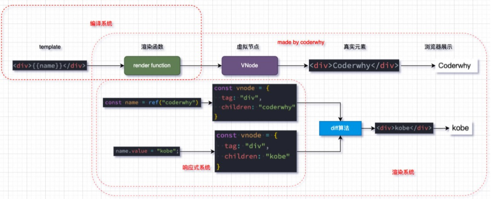

## Vue3源码学习


## 真实的DOM渲染

我们传统的前端开发中，我们是编写自己的HTML，形成一个dom树，浏览器识别到我们的dom树，最终被渲染到浏览器上的，那么它是什么样的过程呢？


## 虚拟DOM的优势

目前框架都会引入虚拟DOM来对真实的DOM进行抽象，这样做有很多的好处：

首先是可以对真实的元素节点进行抽象，抽象成VNode（虚拟节点），这样方便后续对其进行各种操作： 

- 因为对于直接操作DOM来说是有很多的限制的，比如diff、clone等等(element的属性太多了)，但是使用JavaScript编程语言来操作这 些，就变得非常的简单； 
- 我们可以使用JavaScript来表达非常多的逻辑，而对于DOM本身来说是非常不方便的；

其次是方便实现跨平台，包括你可以将VNode节点渲染成任意你想要的节点 

- 如渲染在canvas、WebGL、SSR、Native（iOS、Android）上； 
- 并且Vue允许你开发属于自己的渲染器（renderer），在其他的平台上渲染；

实现跨平台，将一些虚拟dom转成控件，比如ios，安卓，button控件（安卓），或者uibutton控件（ios）

vue源码比较复杂，但是本质上做的就是这个事情


## 虚拟DOM的渲染过程


## 三大核心系统

事实上Vue的源码包含三大核心： 

- Compiler模块：编译模板系统（把template中的代码编译成render函数生成虚拟节点）； 
-  Runtime模块：也可以称之为Renderer模块，真正渲染的模块； 
- Reactivity模块：响应式系统；


## 三大系统协同工作

三个系统之间如何协同工作呢：




## 实现Mini-Vue

这里我们实现一个简洁版的Mini-Vue框架，该Vue包括三个模块： 

- 渲染系统模块； 
- 可响应式系统模块； 
- 应用程序入口模块；


./index.html

```html
<!DOCTYPE html>
<html lang="en">
<head>
  <meta charset="UTF-8">
  <meta name="viewport" content="width=device-width, initial-scale=1.0">
  <title>Document</title>
</head>
<body>
  <div id="app"></div>
  <script src="./render.js"></script>
  <script>
    // 1.通过h函数来创建一个vnode
    const vnode = h('div', {class: 'wts'}, [
      h('h2', null, 'hello world'),
      h('p', null, 'this is a paragraph')
    ])
  </script>
</body>
</html>
```

首先实现h函数

./render.js

```js
const h = (tag, props, children) => {
  // 返回的就是vnode对象
  return {
    tag,
    props,
    children
  }
}
```

上面已经实现了h函数

这就是我们的vnode了


上面就是虚拟dom了

接下来需要把虚拟节点转换成真实dom，并且展示在页面

./index.html

```html
<!DOCTYPE html>
<html lang="en">
<head>
  <meta charset="UTF-8">
  <meta name="viewport" content="width=device-width, initial-scale=1.0">
  <title>Document</title>
</head>
<body>
  <div id="app"></div>
  <script src="./render.js"></script>
  <script>
    // 1.通过h函数来创建一个vnode
    const vnode = h('div', {class: 'wts'}, [
      h('h2', null, 'hello world'),
      h('p', null, 'this is a paragraph')
    ])
    console.log(vnode);

    // 2.通过mount函数将vnode怪哉到div#app上
    mount(vnode, document.querySelector('#app'));
  </script>
</body>
</html>
```

./render.js

```js
const h = (tag, props, children) => {
  // 返回的就是vnode对象
  return {
    tag,
    props,
    children
  }
}

const mount = (vnode, container) => {
  // vnode保留一份真实的DOM元素
  const el = vnode.el = document.createElement(vnode.tag);

  // 设置属性
  if (vnode.props) {
    for (const key in vnode.props) {
      const value = vnode.props[key];
      // 如果是事件监听器
      if (key.startsWith('on')) {
        el.addEventListener(key.slice(2).toLowerCase(), value)
      } else {
        // 普通属性
        el.setAttribute(key, value)
      }
      
    }
  }

  // 3.处理子节点
  if (vnode.children) {
    if (typeof vnode.children === 'string') {
      // 如果是文本节点
      el.textContent = vnode.children;
    } else {
      // 如果是数组节点
      vnode.children.forEach(child => {
        mount(child, el);
      });
    }
  }

  // 4.将el添加到容器中
  container.appendChild(el);
}
```


 

目录结构


h函数


这里是渲染函数，拿到vnode


长这么样，vnode里面还会有vnode


把上面的虚拟dom转成真实dom，怎么做呢？


增加props（attribute）， 事件、子元素


上面的写完以后，页面就可以展示了


如果有新的vnode


它们就需要通过diff比较


判断


拿到它，然后把他替换掉，替换为h2


这里我们的n2是h2标签


页面就变了


接下来处理props


处理attr


现在考虑的情况做完了


现在可以看到，这里已经改了，是没有问题的

可见，这里如果改了，是可以做diff算法的


下面开始做响应式系统


先实现一下这个代码


上面这个counter有个问题，它不是响应式的。


上面的有缺点，增加依赖的函数需要我们手动添加到订阅者列表中，更新依赖后也需要手动调用Notify来更新 


剩下要做什么呢？我们目前的话是要把我们每一个依赖的传到里面去，但是接下来要做的是，我不传里面去，也把你添加到我的依赖表里面


我们的代码改造了一下之后，依然可以达到这个效果

如果我们希望我们传入watchEffect的函数，默认就执行一次


再增加一个


现在的代码还有一个问题

假设我有一个name


也就是说foo.height发生变化的时候只有watchEffect4才执行

所以我们不能把所有的依赖都往一个dep.subscribers里面放，我们要有多个dep对象


我们现在要对我们的代码做劫持，因为我们的数据假如改变了，   info.name="wts";  我们如何知道呢？

数据劫持有两种方式

definedProperty


这个也不要了


加上打印


这个也不要


这里也需要改一下


再增加一个


所以只有它们两个执行


vue3


但是proxy修改的是一个新的对象


vue3是这样实现的


上面的代码有一些地方是有错误的，找了很长时间，这里不在说出哪里有错，如果重新复习这里，自己找bug，对自己有帮助。如果找不出，可以来到mini_vue文件夹，这里可以找到


## 渲染系统实现

渲染系统，该模块主要包含三个功能： 

- 功能一：h函数，用于返回一个VNode对象； 
- 功能二：mount函数，用于将VNode挂载到DOM上； 
- 功能三：patch函数，用于对两个VNode进行对比，决定如何处理新的VNode；


## h函数 – 生成VNode

h函数的实现： 

- 直接返回一个VNode对象即可


## Mount函数 – 挂载VNode

mount函数的实现：

第一步：根据tag，创建HTML元素，并且存储 到vnode的el中；

第二步：处理props属性 

- 如果以on开头，那么监听事件； 
- 普通属性直接通过 setAttribute 添加即可；

第三步：处理子节点 

- 如果是字符串节点，那么直接设置 textContent； 
- 如果是数组节点，那么遍历调用 mount 函 数；


## Patch函数 – 对比两个VNode

patch函数的实现，分为两种情况 

n1和n2是不同类型的节点： 

- 找到n1的el父节点，删除原来的n1节点的el； 
- 挂载n2节点到n1的el父节点上；

n1和n2节点是相同的节点： 

- 处理props的情况 
  - 先将新节点的props全部挂载到el上； 
  - 判断旧节点的props是否不需要在新节点上，如果不需要，那么删除对应的属性； 
- 处理children的情况
  - 如果新节点是一个字符串类型，那么直接调用 el.textContent = newChildren； 
  - 如果新节点不同一个字符串类型：
    - 旧节点是一个字符串类型 
      - 将el的textContent设置为空字符串； 
      - 就节点是一个字符串类型，那么直接遍历新节点，挂载到el上；
    - 旧节点也是一个数组类型 
      - 取出数组的最小长度； 
      - 遍历所有的节点，新节点和旧节点进行path操作； 
      - 如果新节点的length更长，那么剩余的新节点进行挂载操作； 
      - 如果旧节点的length更长，那么剩余的旧节点进行卸载操作；


## Patch的实现


## 依赖收集系统


## 响应式系统Vue2实现


## 响应式系统Vue3实现


## 为什么Vue3选择Proxy呢？

Object.definedProperty 是劫持对象的属性时，如果新增元素： 

- 那么Vue2需要再次 调用definedProperty，而 Proxy 劫持的是整个对象，不需要做特殊处理；

修改对象的不同： 

- 使用 defineProperty 时，我们修改原来的 obj 对象就可以触发拦截； 
- 而使用 proxy，就必须修改代理对象，即 Proxy 的实例才可以触发拦截；

Proxy 能观察的类型比 defineProperty 更丰富 

- has：in操作符的捕获器； 
- deleteProperty：delete 操作符的捕捉器； 
- 等等其他操作；

Proxy 作为新标准将受到浏览器厂商重点持续的性能优化；

缺点：Proxy 不兼容IE，也没有 polyfill, defineProperty 能支持到IE9


## 框架外层API设计

这样我们就知道了，从框架的层面来说，我们需要 有两部分内容： 

- createApp用于创建一个app对象； 
- 该app对象有一个mount方法，可以将根组件挂 载到某一个dom元素上；


## 源码阅读之createApp


## 源码阅读之挂载根组件


const app = {props: {message: String} 

instance 

// 1.处理props和attrs 

instance.props 

instance.attrs 

// 2.处理slots 

instance.slots 

// 3.执行setup 

const result = setup() 

instance.setupState = proxyRefs(result); 

// 4.编译template -> compile


## 组件化的初始化

 


## Compile过程


## Block Tree分析


## 生命周期回调


## template中数据的使用顺序


