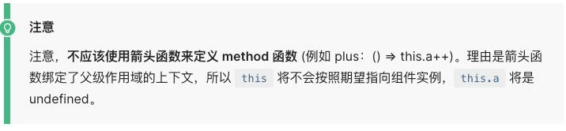

# 认识Vue

Vue (读音 /vjuː/，类似于 view) 是一套用于构建用户界面的渐进式框架。

- 全称是Vue.js或者Vuejs；
- 什么是渐进式框架呢？表示我们可以在项目中一点点来引入和使用Vue，而不一定需要全部使用Vue来开发整个项目；


### 目前Vue在前端处于什么地位？

目前前端最流行的是三大框架：Vue、React、Angular。


### 框架数据对比（Google指数）


### 框架数据对比（百度指数）


### 框架数据对比（npm下载量）


### 框架数据对比（GitHub）


### 谁是最好的前端框架？

- 当然，我不会去给出我的结论：
  - 首先，这是一个敏感的话题，在很多地方都争论不休，就像很多人喜欢争论谁才是世界上最好的语言一样；
  - 其次，争论这个话题是没有意义的，争论不休的话题；
- 其次，争论这个话题是没有意义的，争论不休的话题；
  - 找后端的工作：优先推荐Java、其次推荐Go、再次推荐Node（JavaScript），可能不推荐PHP、C#；
  - 找前端的工作：优先推荐JavaScript（TypeScript）、其次Flutter、再次Android（Java、Kotlin）、iOS（OC、 Swift）；
  - 也有很多的其他方向：游戏开发、人工智能、算法工程师等等；
- 那么，就前端来说，学习了HTML、CSS、JavaScript，哪一个框架更容易找到工作？
  - 如果去国外找工作，优先推荐React、其次是Vue和Angular，不推荐jQuery了；
  - 如果在国内找工作，优先推荐、必须学习Vue，其次是React，其次是Angular，不推荐jQuery了；

### 学习vue2还是vue3？


### 目前需要学习Vue3吗？

- 在2020年的9月19日，万众期待的Vue3终于发布了正式版，命名为“One Piece”。
  - 它也带来了很多新的特性：更好的性能、更小的包体积、更好的TypeScript集成、更优秀的API设计
  - 在vue3刚刚发布时，很多人也是跃跃欲试，想要尝试vue3的各种新特性。
  - 但是事实上在刚刚发布的时候我们使用vue3来写demo练习是没有问题的，真正在实际业务项目中使用vue3还需要一 个相对的过程
  - 包括vue3的进一步稳定、包括社区更多vue3相关的插件、组件库的支持和完善。
- 那么现在是否是学习vue3的时间呢？
  - 答案是肯定的
  - 首先vue3在经过一系列的更新和维护后，已经是趋于稳定，并且在之前尤雨溪也宣布在今年（2021年）第二季度会 将vue3作为Vue CLI的默认版本了。
  - 目前社区也经过一定时间的沉淀，更加的完善了，包括AntDesignVue、Element-Plus都提供了对Vue3的支持，所以 很多公司目前新的项目都已经在使用Vue3来进行开发了。
  - 并且在面试的时候，几乎都会问到各种各样Vue3、Vite2工具相关的问题。


### Vue3带来的变化（源码）

- 源码通过monorepo的形式来管理源代码：
  - Mono：单个
  - Repo：repository仓库
  - 主要是将许多项目的代码存储在同一个repository中；
  - 这样做的目的是多个包本身相互独立，可以有自己的功能逻辑、单元测试等，同时又在同一个仓库下方便管理；
  - 而且模块划分的更加清晰，可维护性、可扩展性更强；
- 源码使用TypeScript来进行重写：
  - 在Vue2.x的时候，Vue使用Flow来进行类型检测；
  - 在Vue3.x的时候，Vue的源码全部使用TypeScript来进行重构，并且Vue本身对TypeScript支持也更好了；


### Vue3带来的变化（性能）

- 使用Proxy进行数据劫持
  - 在Vue2.x的时候，Vue2是使用Object.defineProperty来劫持数据的getter和setter方法的；
  - 这种方式一致存在一个缺陷就是当给对象添加或者删除属性时，是无法劫持和监听的；
  - 所以在Vue2.x的时候，不得不提供一些特殊的API，比如$set或$delete，事实上都是一些hack方法，也增加了 开发者学习新的API的成本；
  - 而在Vue3.x开始，Vue使用Proxy来实现数据的劫持，这个API的用法和相关的原理我也会在后续讲到；
- 删除了一些不必要的API；
  - 删除了一些不必要的API；
  - 移除了一些特性：如filter、内联模板等；
- 包括编译方面的优化：
  - 生成Block Tree、Slot编译优化、diff算法优化；


### 包括编译方面的优化：

由Options API 到 Composition API：

- 在Vue2.x的时候，我们会通过Options API来描述组件对象；
- Options API包括data、props、methods、computed、生命周期等等这些选项；
- 存在比较大的问题是多个逻辑可能是在不同的地方：
  - 比如created中会使用某一个method来修改data的数据，代码的内聚性非常差；
- Composition API可以将 相关联的代码 放到同一处 进行处理，而不需要在多个Options之间寻找；

Hooks函数增加代码的复用性：

- 在Vue2.x的时候，我们通常通过mixins在多个组件之间共享逻辑；
- 但是有一个很大的缺陷就是 mixins也是由一大堆的Options组成的，并且多个mixins会存在命名冲突的问题；
- 在Vue3.x中，我们可以通过Hook函数，来将一部分独立的逻辑抽取出去，并且它们还可以做到是响应式的；


### 如何使用vue呢

Vue的本质，就是一个JavaScript的库：

- 刚开始我们不需要把它想象的非常复杂；
- 我们就把它理解成一个已经帮助我们封装好的库；
- 我们就把它理解成一个已经帮助我们封装好的库；

那么安装和使用Vue这个JavaScript库有哪些方式呢？

- 方式一：在页面中通过CDN的方式来引入；
  - 什么是CDN呢？CDN称之为内容分发网络（Content Delivery Network或Content Distribution Network，缩 写：CDN）
    - 它是指通过 相互连接的网络系统，利用最靠近每个用户的服务器；
    - 更快、更可靠地将音乐、图片、视频、应用程序及其他文件发送给用户；
    - 来提供高性能、可扩展性及低成本的网络内容传递给用户；
  - 常用的CDN服务器可以大致分为两种：
    - 自己的CDN服务器：需要购买自己的CDN服务器，目前阿里、 腾讯、亚马逊、Google等都可以购买CDN服务器；
    - 开源的CDN服务器：国际上使用比较多的是unpkg、 JSDelivr、cdnjs；

cdn的理解


我们开发完代码以后通过一些方式，打包成一个文件，比如dist或者build，这些东西被称为静态资源，上传到静态服务器，这个时候我们的服务器如果部署在背景，那么北京的用户访问我们的时候，响应的速度会是很快的，但是深圳的用户访问就会很慢了，这个时候有一种解决方案就是cdn，cdn是有很多节点的，每一个节点都对应一个服务器，购买cdn以后，我们在访问的时候，会先访问自己最近的服务器，最近的服务器如果没有的话，那么会访问父节点，父节点如果还没有的话，那么就访问源站，找到以后，再一层一层的响应回去，这样就很高效了

cdn引入

```html
    <div id="app"></div>
    <!-- 引入vue3，官网 -->
    <script src="https://unpkg.com/vue@next"></script>
```


```html
<!DOCTYPE html>
<html lang="en">
<head>
    <meta charset="UTF-8">
    <meta http-equiv="X-UA-Compatible" content="IE=edge">
    <meta name="viewport" content="width=device-width, initial-scale=1.0">
    <title>Document</title>
</head>
<body>
    <div id="app"></div>
    <!-- 引入vue3，官网 -->
    <script src="https://unpkg.com/vue@next"></script>
    <!-- 如果要找源代码，点开网址 -->
    <script>
        //下面是Vue相关代码
        const obj = {
            // 这个对象有一个属性叫template
            template: `
                <h2>hello,world</h2>
            `
        }
        // 点开源码可以发现 是var Vue = ...
        // Vue 有一个属性叫createApp, 要求传入一个对象，返回一个app
        // const app = Vue.createApp({});       //把这个对象提出来
        const app = Vue.createApp(obj)
        // 挂载到app上面
        app.mount('#app')
    </script>
</body>
</html>
```


- 方式二：下载Vue的JavaScript文件，并且自己手动引入；
  - 打开链接，复制其中所有的代码；

  - 创建一个新的文件，比如vue.js，将代码复制到其中；

  - 通过script标签，引入刚才的文件：

    ```html
    <script src="../js/vue.js"></script>
    <script>
    	// 因为上面已经引入了Vue，所以这里可以直接用
      Vue.createApp({
        template: `<h2>你好啊！李银河</h2>`
      }).mount('#app')
    </script>
    ```


- 方式三：通过npm包管理工具安装使用它（webpack再讲）；

- 方式四：直接通过Vue CLI创建项目，并且使用它；


### 计数器案例

 如果我们希望实现一个计数器的案例：

- 点击+1，那么内容会显示数字+1；
- 点击-1，那么内容会显示数字-1；

 我们可以选择很多种方式来实现：

- 在这里我们就对比原生和Vue的实现方式的不同。


**原生**

```html
<!DOCTYPE html>
<html lang="en">

<head>
    <meta charset="UTF-8">
    <meta http-equiv="X-UA-Compatible" content="IE=edge">
    <meta name="viewport" content="width=device-width, initial-scale=1.0">
    <title>Document</title>
</head>

<body>
    <h2 class="counter">0</h2>
    <button class="increment">+1</button>
    <button class="decrement">-1</button>
    <script>
        // 1、获取元素
        const element = document.querySelector('.counter');
        const incrementEl = document.querySelector('.increment');
        const decrementEl = document.querySelector('.decrement');
        // 2 初始化counter
        let counter = 100
        element.innerHTML = counter
        // 3、监听点击
        incrementEl.addEventListener('click', function () {
            counter += 1
            element.innerHTML = counter
        })
        decrementEl.addEventListener('click', function () {
            counter -= 1;
            element.innerHTML = counter;
        })
    </script>
</body>

</html>
//一步一步的命令
```


**Vue实现**

```html
<!DOCTYPE html>
<html lang="en">

<head>
    <meta charset="UTF-8">
    <meta http-equiv="X-UA-Compatible" content="IE=edge">
    <meta name="viewport" content="width=device-width, initial-scale=1.0">
    <title>Document</title>
    <script src="vue3/vue3.js"></script>
</head>

<body>
    <div id="app"></div>
    <script>
        Vue.createApp({
            
            // 将data中的counter绑定到template模板中，这种语法称为muastach语法
            // 将点击绑定到methods中对应的方法
            template: `
                <div>
                    <h2>{{counter}}</h2>		//进行绑定
                    <button @click="increment">+1</button>		//进行绑定
                    <button @click="decrement">-1</button>		//进行绑定
                </div>
            `,
            
            
            // 在vue3中data必须是一个函数,并且return一个对象，这是固定语法,是用来存储状态的,data里面的状态会加到vue的响应式系统中。
            data: function () {			//声明数据
                return {
                    counter: 100
                }
            },
            
            // methods，用来存储方法的
            methods: {				
                increment() {		//声明方法
                    this.counter++
                },
                decrement() {
                    this.counter--
                }
            }
        }).mount('#app')
    </script>
</body>

</html>
```


### 声明式和命令式

 原生开发和Vue开发的模式和特点，我们会发现是完全不同的，这里其实涉及到两种不同的编程范式：

-  命令式编程和声明式编程；
- 命令式编程关注的是 “how to do”，声明式编程关注的是 “what to do”，由框架(机器)完成 “how”的过程；
- 命令式编程的一系列操作由浏览器完成，声明式编程我们将一系列操作交给框架，框架完成，至于框架怎么完成我们不关系。

在原生的实现过程中，我们是如何操作的呢？

- 我们每完成一个操作，都需要通过JavaScript编写一条代码，来给浏览器一个指令；
- 这样的编写代码的过程，我们称之为命令式编程；
- 在早期的原生JavaScript和jQuery开发的过程中，我们都是通过这种命令式的方式在编写代码的；

在Vue的实现过程中，我们是如何操作的呢？

- 我们会在createApp传入的对象中声明需要的内容，模板template、数据data、方法methods；
- 这样的编写代码的过程，我们称之为是声明式编程；
- 目前Vue、React、Angular的编程模式，我们称之为声明式编程；


命令式编程


mvc


相当于给浏览器一条一条的命令

 

声明式编程


给它声明好，然后绑定

mvvm


```text
// 在vue内部实际上也是document.querySelector('#hehe')，拿到以后放到template中，但是这个过程是vue完成的
            template: '#hehe',
            data: function () {
                return {
                    counter: 100
                }
            },
```

所以在vue官网上的vm是什么？  也就是mvvm 中的vm

现在声明式编程越来越火


### MVVM模型

MVC和MVVM都是一种软件的体系结构

- MVC是Model – View –Controller的简称，是在前期被使用非常框架的架构模式，比如iOS、前端；
- MVVM是Model-View-ViewModel的简称，是目前非常流行的架构模式；

通常情况下，我们也经常称Vue是一个MVVM的框架。

- Vue官方其实有说明，Vue虽然并没有完全遵守MVVM的模型，但是整个设计是受到它的启发的。


### template属性

在使用createApp的时候，我们传入了一个对象，接下来我们详细解析一下之前传入的属性分别代表什么含义。

template属性：表示的是Vue需要帮助我们渲染的模板信息：

- 目前我们看到它里面有很多的HTML标签，这些标签会替换掉我们挂载到的元素（比如id为app的div）的 innerHTML；
- 模板中有一些奇怪的语法，比如 {{}}，比如 @click，这些都是模板特有的语法，我们会在后面讲到；

但是这个模板的写法有点过于别扭了，并且IDE很有可能没有任何提示，阻碍我们编程的效率

Vue提供了两种方式：

- 方式一：使用script标签，并且标记它的类型为 x-template；
- 方式二：使用任意标签（通常使用template标签，因为不会被浏览器渲染），设置id； 
  - template元素是一种用于保存客户端内容的机制，该内容再加载页面时不会被呈现，但随后可以在运行时使用JavaScript实例化；

 方式一：使用script标签


 

方式二：使用template

```html
<!DOCTYPE html>
<html lang="en">
<head>
    <meta charset="UTF-8">
    <meta http-equiv="X-UA-Compatible" content="IE=edge">
    <meta name="viewport" content="width=device-width, initial-scale=1.0">
    <title>Document</title>
    <script src="vue3/vue3.js"></script>
</head>

<body>
    <div id="app"></div>
    //template换成div也可以，
    但是他会显示两次，本身显示一次，vue处理后返回又显示一次
    <template id="hehe">
        <div>
            <h2>{{counter}}</h2>
            <button @click="increment">+1</button>
            <button @click="decrement">-1</button>
        </div> 
    </template>
    <script>
        Vue.createApp({
            // document.querySelector('#hehe')，拿到以后放到template中
            template: '#hehe',
            data: function () {
                return {
                    counter: 100
                }
            },
            // methods，用来存储方法的
            methods: {
                increment() {
                    this.counter++
                },
                decrement() {
                    this.counter--
                }
            }
        }).mount('#app')
    </script>
</body>
</html>
```

template是html提供的，他不会被浏览器渲染， 就是用来被javascript源代码读取的，相当于就是提供一个元素叫template

但是vue通过id拿到template里面的innerhtml以后就可以从新放到页面进行渲染了。

 这个时候，在createApp的对象中，我们需要传入的template以 # 开头：

- 如果字符串是以 # 开始，那么它将被用作 querySelector，并且使用匹配元素的 innerHTML 作为模板字符串；


### data属性

data属性是传入一个函数，并且该函数需要返回一个对象：

- 在Vue2.x的时候，也可以传入一个对象（虽然官方推荐是一个函数）；
- 在Vue3.x的时候，必须传入一个函数，否则就会直接在浏览器中报错；

data中返回的对象会被Vue的响应式系统劫持，之后对该对象的修改或者访问都会在劫持中被处理：

- 所以我们在template中通过 {{counter}} 访问counter，可以从对象中获取到数据；
- 所以我们修改counter的值时，template中的 {{counter}}也会发生改变；


### methods属性

methods属性是一个对象，通常我们会在这个对象中定义很多的方法：

- methods属性是一个对象，通常我们会在这个对象中定义很多的方法：
- 在该方法中，我们可以使用this关键字来直接访问到data中返回的对象的属性；

对于有经验的同学，在这里我提一个问题，官方文档有这么一段描述：

- 问题一：为什么不能使用箭头函数（官方文档有给出解释）？
- 问题二：不使用箭头函数的情况下，this到底指向的是什么？（可以作为一道面试题）




### 其他属性

当然，这里还可以定义很多其他的属性，我们会在后续进行讲解：

- 比如props、computed、watch、emits、setup等等；
- 也包括很多的生命周期函数；


### Vue的源码

如果想要学习Vue的源码，比如看createApp的实现过程，应该怎么办呢？

第一步：在GitHub上搜索 vue-next，下载源代码；

- 找到 tag 里面的分支，但是不要beta  要找稳定版本，然后找一个空文件夹，通过git clone 来下载源码（原因是如果通过download下载可能运行不起来）

第二步：安装Vue源码项目相关的依赖；

- 执行yarn install   (安装依赖)	

- 注意，如果是通过download来下载的话，上面的步骤执行完了以后，需要在这个文件夹里面执行git的初始化
  - 1、git init
  - 2、执行 git add .
  - 3、执行git commit -m "fix(install): install dep"
    - 注意：后面的注释是固定格式，内容可以不同，但是格式要一样，这是对cimmit的限制,注意，必须是双引号

做完以上操作以后，接下来调试代码

第四步：通过 packages/vue/dist/vue.global.js 调试代码

1、执行yarn dev,它会执行这个脚本


2、执行这个命令，它会把packge文件夹里面的源码做一个打包，打包之后的源码放到**packge/vue**文件夹下的**dist**文件夹


这个就是vue的源码，也是cdn看到的源码。

3、调试源码。


4、如何查看源码在哪个具体文件夹或文件


可以看到，在这里如果想看到一个代码的路径，它始终在global.js


5、配置sourcemap映射源码。

上面这种调试，都是在总的打包后的  也就是vue.global这个文件夹调试的。如果想要看到每一步的函数，会到哪个文件夹的哪个文件，需要一个配置


这个东西是代码映射，就是当我在调试代码的时候，虽然看起来在调试代码，但是用了sourcemap以后，他可以把每一行代码映射到来自于哪个打包文件。

重新打包以后，就会多一个文件。


把鼠标放到createApp中点进去

来自于


我们就可以在这里找到


