## Vuex的状态管理


## 什么是状态管理

在开发中，我们会的应用程序需要处理各种各样的数据，这些 数据需要保存在我们应用程序中的某一个位置，对于这些数据 的管理我们就称之为是 状态管理。

在前面我们是如何管理自己的状态呢？ 

- 在Vue开发中，我们使用组件化的开发方式； 
- 而在组件中我们定义data或者在setup中返回使用的数据， 这些数据我们称之为state； 
- 在模块template中我们可以使用这些数据，模块最终会被 渲染成DOM，我们称之为View； 
- 在模块中我们会产生一些行为事件，处理这些行为事件时， 有可能会修改state，这些行为事件我们称之为actions；

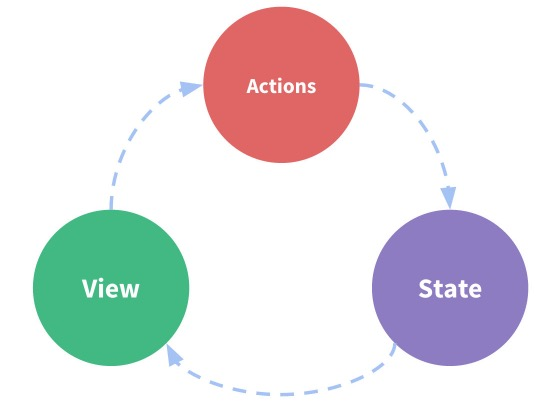


## 复杂的状态管理

JavaScript开发的应用程序，已经变得越来越复杂了： 

- JavaScript需要管理的状态越来越多，越来越复杂； 
- 这些状态包括服务器返回的数据、缓存数据、用户操作产生的数据等等； 
- 也包括一些UI的状态，比如某些元素是否被选中，是否显示加载动效，当前分页

当我们的应用遇到多个组件共享状态时，单向数据流的简洁性很容易被破坏： 

- 多个视图依赖于同一状态； 
- 来自不同视图的行为需要变更同一状态；

我们是否可以通过组件数据的传递来完成呢？ 

- 对于一些简单的状态，确实可以通过props的传递或者Provide的方式来共享状态； 
- 但是对于复杂的状态管理来说，显然单纯通过传递和共享的方式是不足以解决问题的，比如兄弟组件如何共享 数据呢？


## Vuex的状态管理

管理不断变化的state本身是非常困难的： 

- 状态之间相互会存在依赖，一个状态的变化会引起另一个状态的变化，View页面也有可能会引起状态的变化； 
- 当应用程序复杂时，state在什么时候，因为什么原因而发生了变化，发生了怎么样的变化，会变得非常难以控 制和追踪； 

因此，我们是否可以考虑将组件的内部状态抽离出来，以一个全局单例的方式来管理呢？ 

- 在这种模式下，我们的组件树构成了一个巨大的 “视图View”； 
- 不管在树的哪个位置，任何组件都能获取状态或者触发行为； 
- 通过定义和隔离状态管理中的各个概念，并通过强制性的规则来维护视图和状态间的独立性，我们的代码边会 变得更加结构化和易于维护、跟踪； 

这就是Vuex背后的基本思想，它借鉴了Flux、Redux、Elm（纯函数语言，redux有借鉴它的思想）：


## Vuex的状态管理

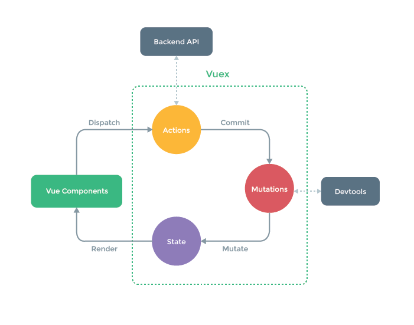


## Vuex的安装

依然我们要使用vuex，首先第一步需要安装vuex： 

- 我们这里使用的是vuex4.x，安装的时候需要添加 next 指定版本；

```
npm install vuex@next
```


## 创建Store

每一个Vuex应用的核心就是store（仓库）： 

- store本质上是一个容器，它包含着你的应用中大部分的状态（state）；

Vuex和单纯的全局对象有什么区别呢？

第一：Vuex的状态存储是响应式的 

- 当Vue组件从store中读取状态的时候，若store中的状态发生变化，那么相应的组件也会被更新； 

第二：你不能直接改变store中的状态 

- 改变store中的状态的唯一途径就显示提交 (commit) mutation； 

- 这样使得我们可以方便的跟踪每一个状态的变化，从而让我们能够通过一些工具帮助我们更好的管理应用的状态；

使用步骤： 

- 创建Store对象； 
- 在app中通过插件安装；

创建store

./store/index.js

```js
import { createStore } from 'vuex'

const store = createStore()

export default store
```

安装store

./main.js

```js
import { createApp } from 'vue'
import store from './store'
import App from './App.vue'
createApp(App).use(store).mount('#app')
```


新增数据/操作数据

./store/index.js

```js
import { createStore } from 'vuex'

const store = createStore({
  data() {
    return {
      counter: 0
    }
  },
  mutations: {
    increment(state) {
      state.counter++
    },
    decrement(state) {
      state.counter--
    }
  }
})

export default store
```

使用/修改

./App

```vue
<template>
	<h2>{{$store.counter}}</h2>
	<button @click="increment">增加</button>
	<button @click="decrement">减少</button>
</template>
<script>
	export default {
   	methods: {
      increment() {
        this.$store.commit('increment')
      },
      decrement() {
        this.$store.commit('decrement')
      }
    }
  }
</script>
```


## 组件中使用store

在组件中使用store，我们按照如下的方式： 

- 在模板中使用； 
- 在options api中使用，比如computed； 
- 在setup中使用； 


## Vue devtool

vue其实提供了一个devtools，方便我们对组件或者vuex进行调试： 

- 我们需要安装beta版本支持vue3，目前是6.0.0 beta15； 

它有两种常见的安装方式： 

- 方式一：通过chrome的商店； 
- 方式二：手动下载代码，编译、安装

方式一：通过Chrome商店安装： 

- 由于某些原因我们可能不能正常登录Chrome商店，所以可以选择第二种；

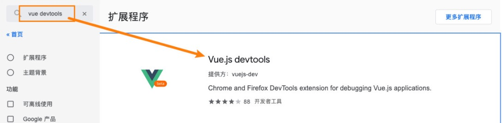


## 手动安装devtool

方式二：手动下载代码，编译、安装 

- https://github.com/vuejs/devtools/tree/v6.0.0-beta.15下载代码； 

- 执行 yarn install 安装相关的依赖； 
- 执行 yarn run build 打包；


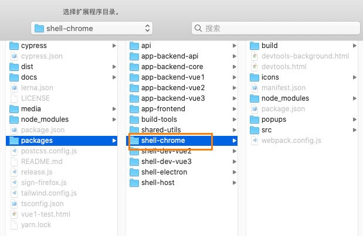


## 单一状态树

Vuex 使用单一状态树： 

- 用一个对象就包含了全部的应用层级状； 
- 采用的是SSOT，Single Source of Truth，也可以翻译成单一数据源； 
- 这也意味着，每个应用将仅仅包含一个 store 实例； 
- 单状态树和模块化并不冲突，后面我们会讲到module的概念；

单一状态树的优势： 

- 如果你的状态信息是保存到多个Store对象中的，那么之后的管理和维护等等都会变得特别困难； 
- 所以Vuex也使用了单一状态树来管理应用层级的全部状态； 
- 单一状态树能够让我们最直接的方式找到某个状态的片段，而且在之后的维护和调试过程中，也可以非常方便 的管理和维护；


## 组件获取状态

在前面我们已经学习过如何在组件中获取状态了。

当然，如果觉得那种方式有点繁琐（表达式过长），我们可以使用计算属性：

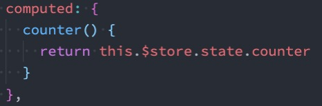

但是，如果我们有很多个状态都需要获取话，可以使用mapState的辅助函数： 

```vue
<template>
	<h2>{{counter}}</h2>
	<h2>{{name}}</h2>
</template>
<script>
	import { mapState } from 'vuex'
  export default {
    computed: {
      // 写法一：传入数组
      ...mapState(['counter', 'name']), // mapState返回的是一个对象
      
      // 写法二：传入对象
      ...mapState({
        sCounter: state => state.counter	// 对象的写法可以重命名
      }) 
    }
    // 也可以这样写
    // computed: mapState(['counter', 'name'])
  }
</script>
```


- mapState的方式一：对象类型； 
- mapState的方式二：数组类型； 
- 也可以使用展开运算符和来原有的computed混合在一起；


## 在setup中使用mapState

在setup中如果我们单个获取装是非常简单的：

- 通过useStore拿到store后去获取某个状态即可； 
- 但是如果我们需要使用 mapState 的功能呢？

默认情况下，Vuex并没有提供非常方便的使用mapState的方式，这里我们进行了一个函数的封装：

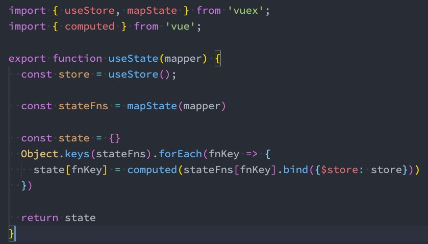

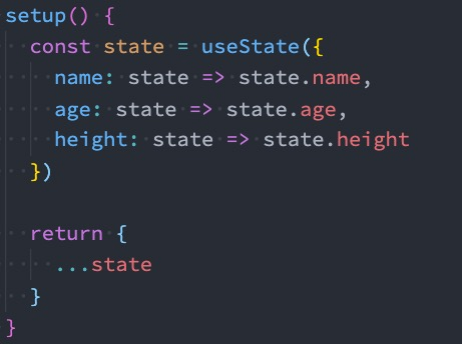

如果不像上面的封装的话只能通过 info = computed(() => store.state.counter)来使用 


## getters的基本使用

某些属性我们可能需要变化后来使用，这个时候可以使用getters：

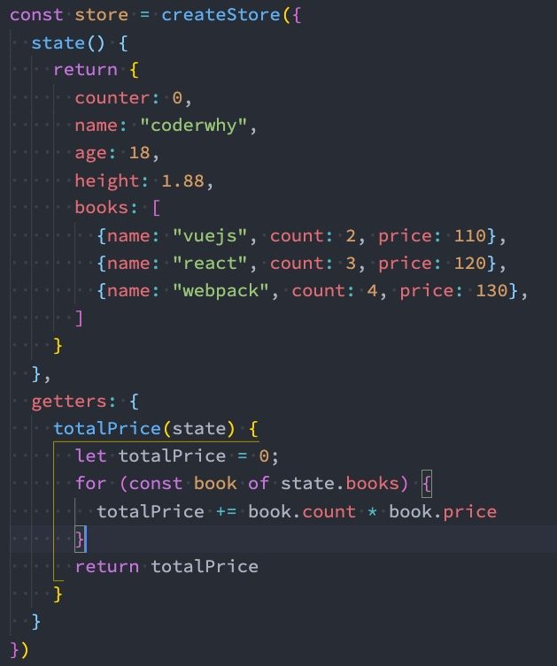

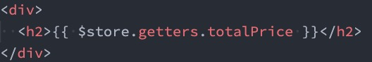


## getters第二个参数

getters可以接收第二个参数：

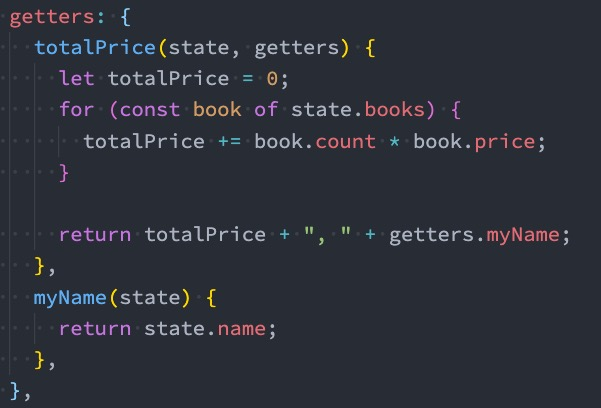


## getters的返回函数

getters中的函数本身，可以返回一个函数，那么在使用的地方相当于可以调用这个函数：

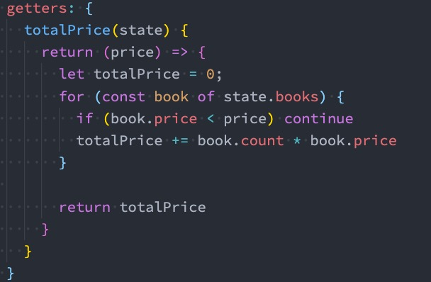


## mapGetters的辅助函数

这里我们也可以使用mapGetters的辅助函数。

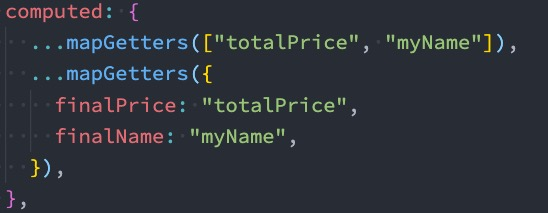


## 在setup中使用

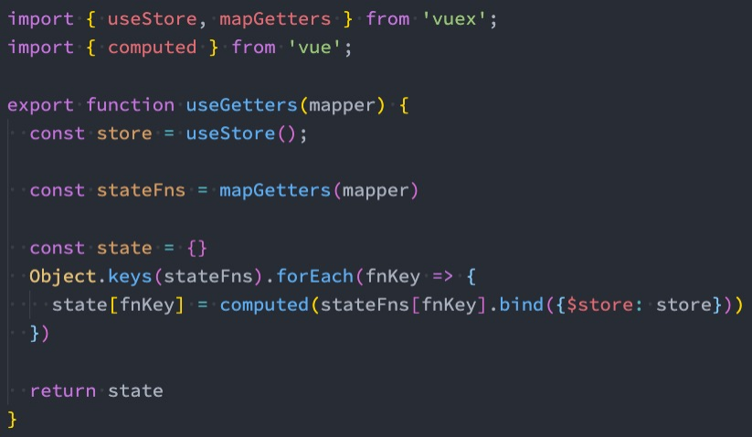


可以通过这种方式导出

./hooks/index.js

```js
import { useGetters } from './useGetters';
import { useState } from './useState';

export {
  useGetters,
  useState
}

```


## Mutation基本使用

更改 Vuex 的 store 中的状态的唯一方法是提交 mutation：

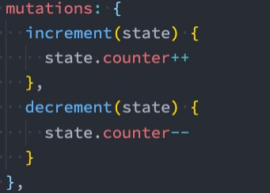

```vue
      <button @click="$store.commit('increment')">+1</button>
      <button @click="$store.commit('decrement')">-1</button>
```


## Mutation携带数据

很多时候我们在提交mutation的时候，会携带一些数据，这个时候我们可以使用参数：

payload为数字:

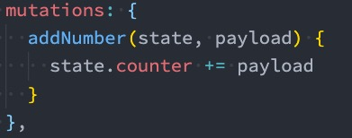

payload为对象类型:

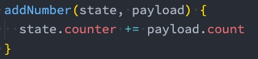

对象风格的提交方式

```js
this.$store.commit({
  type: 'addNumber',
  count: 100
})
```

非对象风格：

```js
this.$store.commit('addNumber', 10)
// 或者
this.$store.commit('addNumber', {count: 10})
```

一般情况下，如果有多个参数使用对象的方式进行提交


## Mutation常量类型

定义常量：mutation-type.js

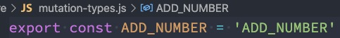

定义mutation

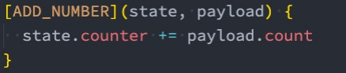

提交mutation

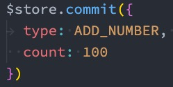


## mapMutations辅助函数

我们也可以借助于辅助函数，帮助我们快速映射到对应的方法中：

```vue
<script>
	export default {
    methods: {
      ...mapMutations({addNumber: ADD_NUMBER}), // 可以对他进行重命名
      ...mapMutations([ADD_NUMBER]),
      addN() {
        this.addNumber({n: 10})
        // 或者（要看mutations中怎么定义的）
        this[ADD_NUMBER](10)
      }
    }
  }
</script>
```


在setup中使用也是一样的：

```vue
<script>
	export default {
		setup() {
      const storeMutations1 = mapMutations(['increment', 'decrement'])
      const storeMutations2 = mapMutations({
        addNumber: ADD_NUMBER
      })
      return {
        ...storeMutations1
      }
    }
  }
</script>
```

直接这样写就行了，不需要和state跟getter一样转化


## mutation重要原则

一条重要的原则就是要记住 mutation 必须是同步函数 

- 这是因为devtool工具会记录mutation的日记； 
- 每一条mutation被记录，devtools都需要捕捉到前一状2，态和后一状态的快照； 
- 但是在mutation中执行异步操作，就无法追踪到数据的变化； 
- 所以Vuex的重要原则中要求 mutation必须是同步函数；


## actions的基本使用

Action类似于mutation，不同在于： 

- Action提交的是mutation，而不是直接变更状态； 
- Action可以包含任意异步操作；

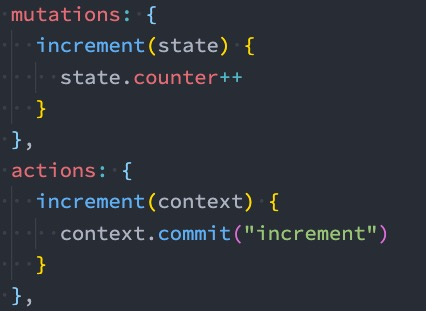

这里有一个非常重要的参数context： 

- context是一个和store实例均有相同方法和属性的context对象； 
- 所以我们可以从其中获取到commit方法来提交一个mutation，或者通过 context.state 和 context.getters 来 获取 state 和 getters； 
- 但是为什么它不是store对象呢？这个等到我们讲Modules时再具体来说；

context类似于store，有state、getters，等


## actions的分发操作

如何使用action呢？进行action的分发： 

- 分发使用的是 store 上的dispatch函数；

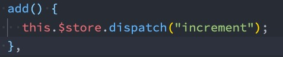

同样的，它也可以携带我们的参数：

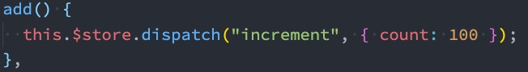

也可以以对象的形式进行分发：

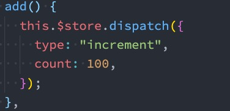

composition派发：

```vue
<script>
	import { useStore } from 'vuex'
  export default {
    setup() {
      const store = useStore()
      onMounted(() => {
        store.dispatch('getHomeMultidata')
      })
    }
  }
</script>
```


context是什么？

- commit： 提交一个事件来修改state；
- dispatch： 派发另一个action
- getters：拿到getters做操作
- cootGetters：用分模块的时候用到；
- rootState: 分模块的时候用到；
- state： 拿到state；


## actions的辅助函数

action也有对应的辅助函数： 

- 对象类型的写法； 
- 数组类型的写法；

options写法：

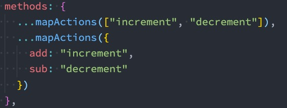

composition使用：

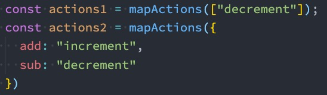


## actions的异步操作

Action 通常是异步的，那么如何知道 action 什么时候结束呢？ 

- 我们可以通过让action返回Promise，在Promise的then中来处理完成后的操作；

```js
  actions: {
    getHomeMultidata(context) {
      return new Promise((resolve, reject) => {
        axios.get("http://123.207.32.32:8000/home/multidata").then(res => {
          context.commit("addBannerData", res.data.data.banner.list)
          resolve({name: "coderwhy", age: 18})
        }).catch(err => {
          reject(err)
        })
      })
    }
  }
```

可以拿到这个函数的结果

```vue
<script>
  import { useStore } from 'vuex'
  import { onMounted } from "vue";
	export default {
    const store = useStore()
    onMounted(() => {
      const promise = store.dispatch("getHomeMultidata")
      promise.then(res => {
        console.log(res)
      }).catch(err => {
        console.log(err)
      })
    })
  }
</script>
```


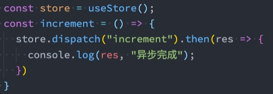


## module的基本使用

什么是Module？ 

- 由于使用单一状态树，应用的所有状态会集中到一个比较大的对象，当应用变得非常复杂时，store 对象就有可 能变得相当臃肿； 
- 为了解决以上问题，Vuex 允许我们将 store 分割成模块（module）； 
- 每个模块拥有自己的 state、mutation、action、getter、甚至是嵌套子模块；

```js
const moduleA = {
  state(){
    return {
      counter: 1
    }
  },
  getter: {
    doubleACounter(state) {
      return state.counter * 2
    }
  }
  mutations: {},
  actions: {}
}

const moduleB = {
  state() {
    return {
      counter: 2
    }
  },
  mutations: {},
  actions: {
    incrementAction() {
      console.log('哈哈哈')
    }
  }
}
```


```js
const store = createStore({
  state() {
    return {
      rootCounter: 0
    }
  },
  mutations: {},
  modules: {
    moduleA: moduleA,
    moduleB: moduleB
  }
})


// 使用
store.state.moduleA.counter // moduleA的counter
store.state.moduleB.counter // moduleA的counter
store.state.rootCounter // 根的rootCounter
```


## module的局部状态

对于模块内部的 mutation 和 getter，接收的第一个参数是模块的局部状态对象：

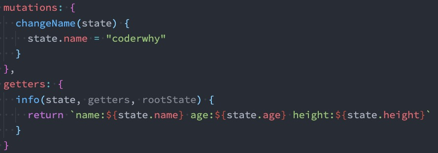

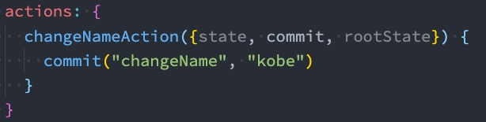

获取getter的话是这样

```vue
<template>
	<h2>
    {{$store.getter.doubleACounter}}
  </h2>
</template>
```

getter和state不一样，getter是会把模块中所有的getter合并的，这样显然不好

actions也存在这样一个问题

```vue
<script>
	export default {
    methods: {
      homeIncrementAction() {
        this.$store.dispatch('incrementAction')
      }
    }
  }
</script>
```

如果要解决这个问题，需要增加一个命名空间


## module的命名空间

默认情况下，模块内部的action和mutation仍然是注册在全局的命名空间中的： 

- 这样使得多个模块能够对同一个 action 或 mutation 作出响应； 
- Getter 同样也默认注册在全局命名空间；

如果我们希望模块具有更高的封装度和复用性，可以添加 namespaced: true 的方式使其成为带命名空间的模块： 

- 当模块被注册后，它的所有 getter、action 及 mutation 都会自动根据模块注册的路径调整命名；

加上命名空间以后需要这样来写

```vue
<template>
	<h2>{{$store.getters["moduleA/doubleACounter"]}}</h2>
</template>
<script>
	export default {
    methods: {
      increment() {
        this.$store.commit('moduleB/incrementAction')
      }
    }
  }
</script>
```

如果不加的话默认是从根空间去取getter和action

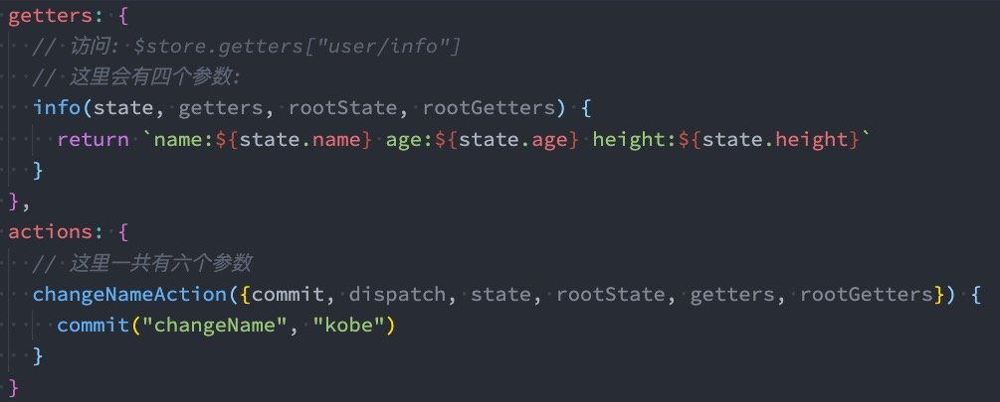


## module修改或派发根组件

如果我们希望在action中修改root中的state，那么有如下的方式：

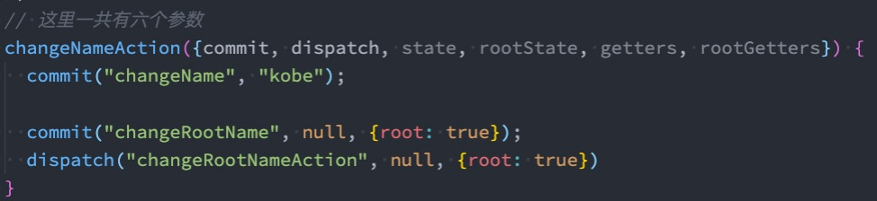

commit和dispatch都是这样，root改成true表示commit到根组件的修改


## module的辅助函数

如果辅助函数有三种使用方法： 

- 方式一：通过完整的模块空间名称来查找； 

- 方式二：第一个参数传入模块空间名称，后面写上要使用的属性； 
- 方式三：通过 createNamespacedHelpers 生成一个模块的辅助函数；

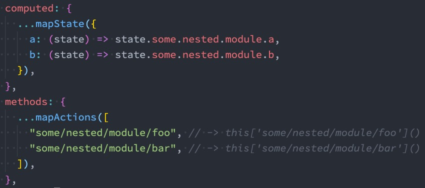

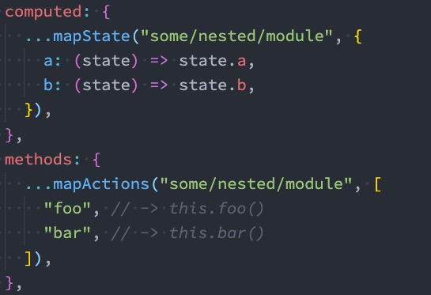


写法一：

```vue
<script>
   import { createNamespacedHelpers, mapState, mapGetters, mapMutations, mapActions } from "vuex";
	export default {
    computed: {
      ...mapState({
        homeCounter: state => state.home.homeCounter
      }),
      ...mapGetters({
        doubleHomeCounter: "home/doubleHomeCounter"
      })
    },
    methods: {
       ...mapMutations({
         increment: "home/increment"
       }),
       ...mapActions({
         incrementAction: "home/incrementAction"
       }),
    }
  }
</script>
```

写法二：

```vue
<script>
   import { createNamespacedHelpers, mapState, mapGetters, mapMutations, mapActions } from "vuex";
	export default {
    computed: {
      ...mapState("home", ["homeCounter"]),
      ...mapGetters("home", ["doubleHomeCounter"])
    },
    methods: {
       ...mapMutations("home", ["increment"]),
       ...mapActions("home", ["incrementAction"]),
    }
  }
</script>
```

写法三：

```vue
<script>
  // 通过这里解构出来的都是home模块的局部
   import { createNamespacedHelpers} from "vuex";
   const { mapState, mapGetters, mapMutations, mapActions } = createNamespacedHelpers("home")
	export default {
    computed: {
      // 3.写法三:
      ...mapState(["homeCounter"]),
      ...mapGetters(["doubleHomeCounter"])
    },
    methods: {
       ...mapMutations(["increment"]),
       ...mapActions(["incrementAction"]),
    }
  }
</script>
```


## 对模块的useState和useGetters修改

useMapper.js

```js
import { computed } from 'vue'
import { useStore } from 'vuex'

export function useMapper(mapper, mapFn) {
  // 拿到store独享
  const store = useStore()

  // 获取到对应的对象的functions: {name: function, age: function}
  const storeStateFns = mapFn(mapper)

  // 对数据进行转换
  const storeState = {}
  Object.keys(storeStateFns).forEach(fnKey => {
    const fn = storeStateFns[fnKey].bind({$store: store})
    storeState[fnKey] = computed(fn)
  })

  return storeState
}

```


useState.js

```js
import { mapState, createNamespacedHelpers } from 'vuex'
import { useMapper } from './useMapper'

export function useState(moduleName, mapper) {
  let mapperFn = mapState
  if (typeof moduleName === 'string' && moduleName.length > 0) {
    mapperFn = createNamespacedHelpers(moduleName).mapState
  } else {
    mapper = moduleName
  }

  return useMapper(mapper, mapperFn)
}

```

 

useGetter.js

```js
import { mapGetters, createNamespacedHelpers } from 'vuex'
import { useMapper } from './useMapper'

export function useGetters(moduleName, mapper) {
  let mapperFn = mapGetters
  if (typeof moduleName === 'string' && moduleName.length > 0) {
    mapperFn = createNamespacedHelpers(moduleName).mapGetters
  } else {
    mapper = moduleName
  }

  return useMapper(mapper, mapperFn)
}

```


## 自定义指令 format-time bug修复

```js
import dayjs from 'dayjs';

export default function(app) {
  app.directive("format-time", {
    created(el, bindings) {
      bindings.formatString = "YYYY-MM-DD HH:mm:ss";
      if (bindings.value) {
        bindings.formatString = bindings.value;
      }
    },
    mounted(el, bindings) {
      const textContent = el.textContent;
      let timestamp = parseInt(textContent);
      if (textContent.length === 10) {
        timestamp = timestamp * 1000
      }
      el.textContent = dayjs(timestamp).format(bindings.formatString);
    }
  })
}
```


## nexttick

官方解释：将回调推迟到下一个 DOM 更新周期之后执行。在更改了一些数据以等待 DOM 更新后立即使用它。 

比如我们有下面的需求：

- 点击一个按钮，我们会修改在h2中显示的message； 
- message被修改后，获取h2的高度；

```js
      const addMessageContent = () => {
        message.value += "哈哈哈哈哈哈哈哈哈哈"
      }
```

这里做了以后会发现获取到的高度不是最新的新增数据后的高度，但是实际想要的是拿到的是增加message之后拿到的高度

实现上面的案例我们有三种方式： 

- 方式一：在点击按钮后立即获取到h2的高度（错误的做法） 
- 方式二：在updated生命周期函数中获取h2的高度（但是其他数据更新，也会执行该操作） 
- 方式三：使用nexttick函数；

```js
      const addMessageContent = () => {
        message.value += "哈哈哈哈哈哈哈哈哈哈"

        // 更新DOM
        nextTick(() => {
          console.log(titleRef.value.offsetHeight)
        })
      }
```

nexttick是如何做到的呢？

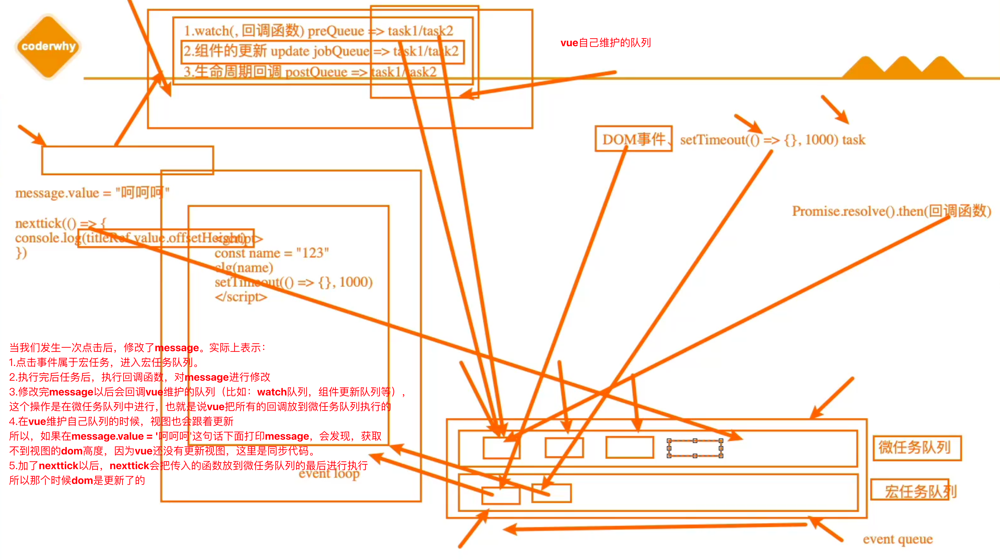

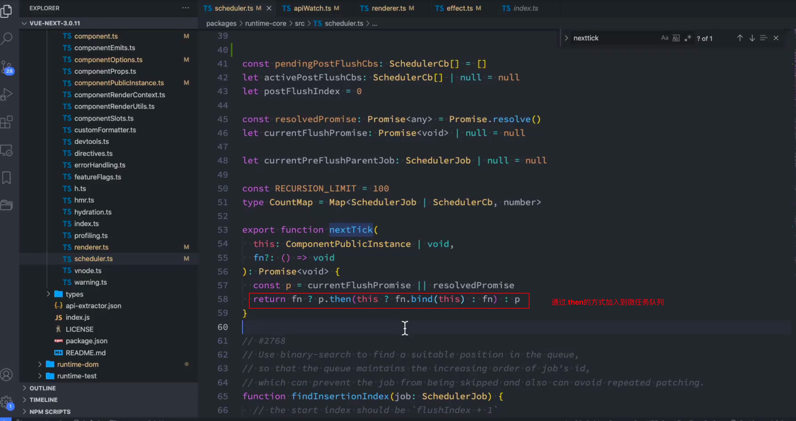

使用这种的原因是，如果有一百次变化，不会watch一百次，而是在异步中执行一次。


## historyApiFallback

historyApiFallback是开发中一个非常常见的属性，它主要的作用是解决SPA页面在路由跳转之后，进行页面刷新 时，返回404的错误。 

boolean值：默认是false

如果设置为true，那么在刷新时，返回404错误时，会自动返回 index.html 的内容；

object类型的值，可以配置rewrites属性： 

- 可以配置from来匹配路径，决定要跳转到哪一个页面；

事实上devServer中实现historyApiFallback功能是通过connect-history-api-fallback库的： 

- 可以查看connect-history-api-fallback 文档

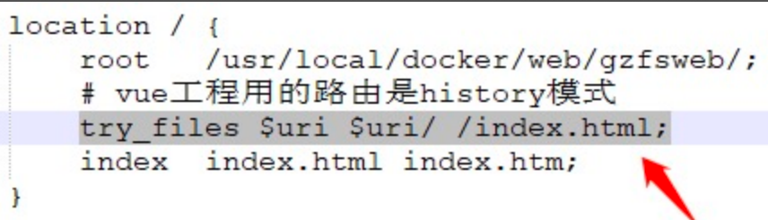


前端路由是如何找的，浏览器是如何拿到我们的代码的

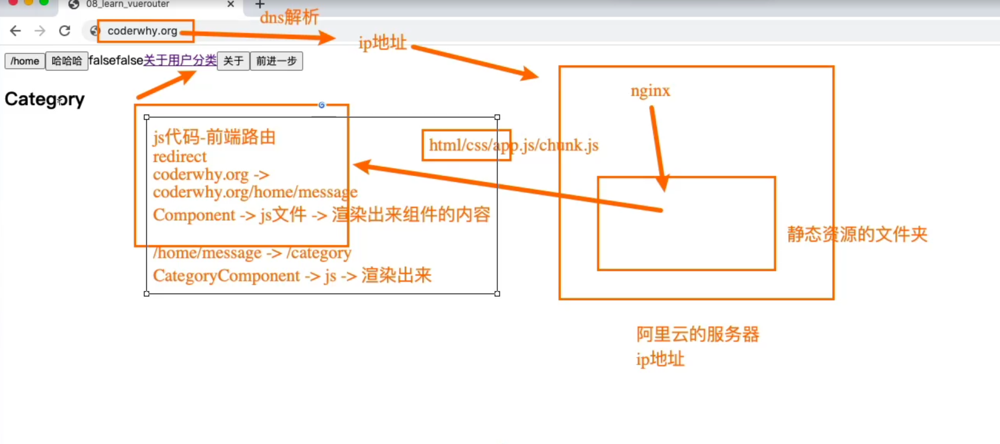

如果用户进入了coderwhy.org/home/message然后刷新页面，会发生什么呢？会通过这个路径去向后端请求

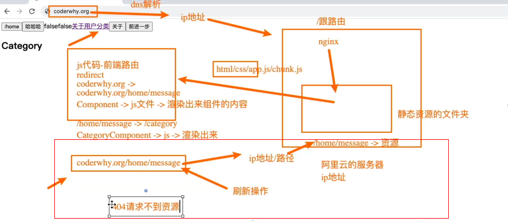

这个时候是请求不到资源的，因为这个路由是前端路由，后端是没有这个路由的，怎么办呢？后端一般有配置，比如返回index.html，一般方案就是这样

但是我们本地没有做过这个配置，随便到什么路由，刷新都是没有问题的，怎么回事呢？这个webpack默认的配置实现的，这个配置就是historyApiFallback: true，不管你点到/category还是/about，当找不到对应资源的时候就返回index.html

源码这里有配置

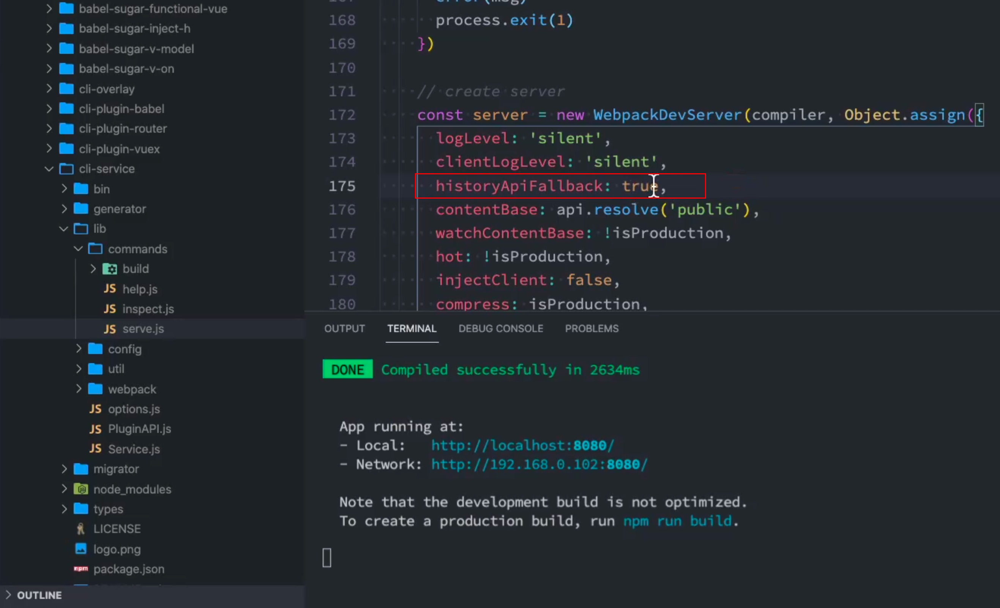


如何配置webpack呢？

/vue.config.js

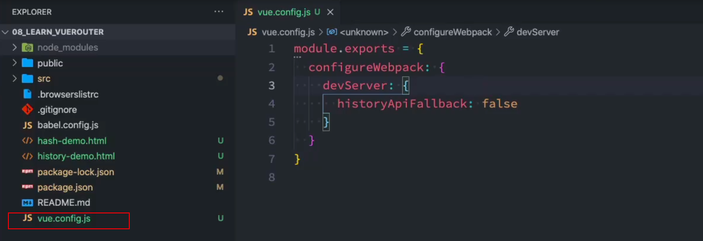

可以通过这种方式对webpack的配置进行修改
