## VueRouter路由使用


## 认识前端路由


路由其实是网络工程中的一个术语：

- 在架构一个网络时，非常重要的两个设备就是路由器和交换机。 
- 当然，目前在我们生活中路由器也是越来越被大家所熟知，因为我们生活中都会用到路由器： 
- 事实上，路由器主要维护的是一个映射表； 
- 映射表会决定数据的流向；

 

路由的概念在软件工程中出现，最早是在后端路由中实现的，原因是web的发展主要经历了这样一些阶段： 

- 后端路由阶段； 
- 前后端分离阶段； 
- 单页面富应用（SPA）；


## 后端路由阶段

早期的网站开发整个HTML页面是由服务器来渲染的. 

- 服务器直接生产渲染好对应的HTML页面, 返回给客户端进行展示.

但是, 一个网站, 这么多页面服务器如何处理呢? 

- 一个页面有自己对应的网址, 也就是URL； 
- URL会发送到服务器, 服务器会通过正则对该URL进行匹配, 并且最后交给一个Controller进行处理； 
- Controller进行各种处理, 最终生成HTML或者数据, 返回给前端.

上面的这种操作, 就是后端路由： 

- 当我们页面中需要请求不同的路径内容时, 交给服务器来进行处理, 服务器渲染好整个页面, 并且将页面返回给客户端. 
- 这种情况下渲染好的页面, 不需要单独加载任何的js和css, 可以直接交给浏览器展示, 这样也有利于SEO的优化.

后端路由的缺点: 

- 一种情况是整个页面的模块由后端人员来编写和维护的； 
- 另一种情况是前端开发人员如果要开发页面, 需要通过PHP和Java等语言来编写页面代码； 
- 而且通常情况下HTML代码和数据以及对应的逻辑会混在一起, 编写和维护都是非常糟糕的事情；


## 前后端分离阶段

前端渲染的理解： 

- 每次请求涉及到的静态资源都会从静态资源服务器获取，这些资源包括HTML+CSS+JS，然后在前端对这些请 求回来的资源进行渲染； 
- 需要注意的是，客户端的每一次请求，都会从静态资源服务器请求文件； 
- 同时可以看到，和之前的后端路由不同，这时后端只是负责提供API了；

前后端分离阶段： 

- 随着Ajax的出现, 有了前后端分离的开发模式； 
- 后端只提供API来返回数据，前端通过Ajax获取数据，并且可以通过JavaScript将数据渲染到页面中； 
- 这样做最大的优点就是前后端责任的清晰，后端专注于数据上，前端专注于交互和可视化上； 
- 并且当移动端(iOS/Android)出现后，后端不需要进行任何处理，依然使用之前的一套API即可； 
- 目前比较少的网站采用这种模式开发（jQuery开发模式）；

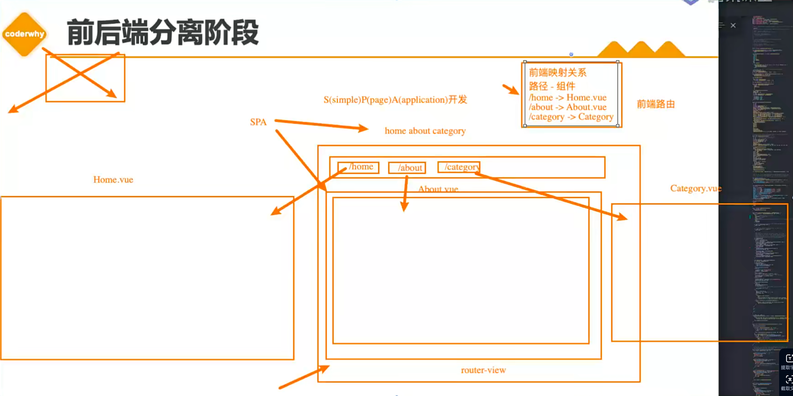


## URL的hash

前端路由是如何做到URL和内容进行映射呢？监听URL的改变。 

URL的hash 

- URL的hash也就是锚点(#), 本质上是改变window.location的href属性； 

- 我们可以通过直接赋值location.hash来改变href, 但是页面不发生刷新；

./index.html

```html
<!DOCTYPE html>
<html lang="en">
<head>
  <meta charset="UTF-8">
  <meta http-equiv="X-UA-Compatible" content="IE=edge">
  <meta name="viewport" content="width=device-width, initial-scale=1.0">
  <title>Document</title>
</head>
<body>
  
  <div id="app">
    <a href="#/home">home</a>
    <a href="#/about">about</a>

    <div class="content">Default</div>
  </div>

  <script>
    const contentEl = document.querySelector('.content');
    window.addEventListener("hashchange", () => {
      switch(location.hash) {
        case "#/home":
          contentEl.innerHTML = "Home";
          break;
        case "#/about":
          contentEl.innerHTML = "About";
          break;
        default:
          contentEl.innerHTML = "Default";
      }
    })
  </script>

</body>
</html>
```


hash的优势就是兼容性更好，在老版IE中都可以运行，但是缺陷是有一个#，显得不像一个真实的路径。


## HTML5的History

history接口是HTML5新增的, 它有l六种模式改变URL而不刷新页面： 

- replaceState：替换原来的路径； 
- pushState：使用新的路径； 
- popState：路径的回退； 
- go：向前或向后改变路径； 
- forward：向前改变路径； 
- back：向后改变路径；


## HTML5的History演练

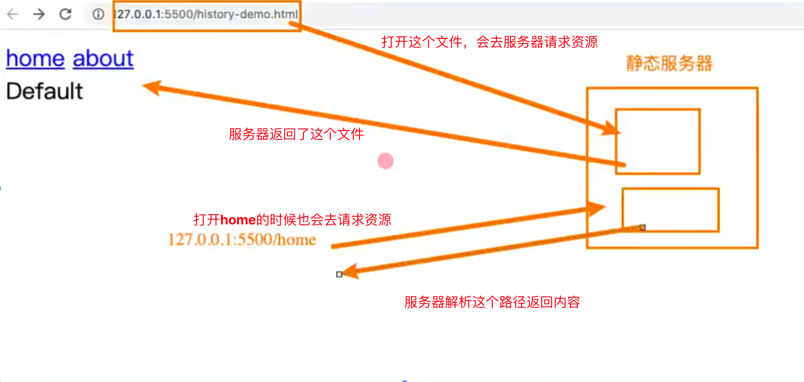

./index.html

```html
<!DOCTYPE html>
<html lang="en">
<head>
  <meta charset="UTF-8">
  <meta http-equiv="X-UA-Compatible" content="IE=edge">
  <meta name="viewport" content="width=device-width, initial-scale=1.0">
  <title>Document</title>
</head>
<body>
  <div id="app">
    <a href="/home">home</a>
    <a href="/about">about</a>

    <div class="content">Default</div>
  </div>
  <script>
    const contentEl = document.querySelector('.content');
    const changeContent = () => {
      switch(location.pathname) {
        case "/home":
          contentEl.innerHTML = "Home";
          break;
        case "/about":
          contentEl.innerHTML = "About";
          break;
        default: 
          contentEl.innerHTML = "Default";
      }
    }

    const aEls = document.getElementsByTagName("a");
    for (let aEl of aEls) {
      // 监听a元素的点击
      aEl.addEventListener("click", e => {
        // 阻止a元素的默认行为
        e.preventDefault();
        
        const href = aEl.getAttribute("href");
        
        // 更改页面路径（不会刷新页面、不回去服务器请求资源）
        // history.pushState({}, "", href);
        history.replaceState({}, "", href);

        // 更新要显示的内容
        changeContent();
      })
    }
    window.addEventListener("popstate", changeContent)
  </script>
</body>
</html>
```

history必须用live-server的模式打开


## 认识vue-router

目前前端流行的三大框架, 都有自己的路由实现: 

- Angular的ngRouter
- React的ReactRouter 
- Vue的vue-router

Vue Router 是 Vue.js 的官方路由。它与 Vue.js 核心深度集成，让用 Vue.js 构建单页应用变得非常容易。 

- 目前Vue路由最新的版本是4.x版本，我们上课会基于最新的版本讲解。

vue-router是基于路由和组件的 

- 路由用于设定访问路径, 将路径和组件映射起来. 
- 在vue-router的单页面应用中, 页面的路径的改变就是组件的切换.

安装Vue Router：

```
npm install vue-router@4
```


## 路由的使用步骤

使用vue-router的步骤: 

- 第一步：创建路由组件的组件； 
- 第二步：配置路由映射: 组件和路径映射关系的routes数组； 
- 第三步：通过createRouter创建路由对象，并且传入routes和history模式； 
- 第四步：使用路由<router-link>通过和<router-view>；


## 路由的基本使用流程

配置router

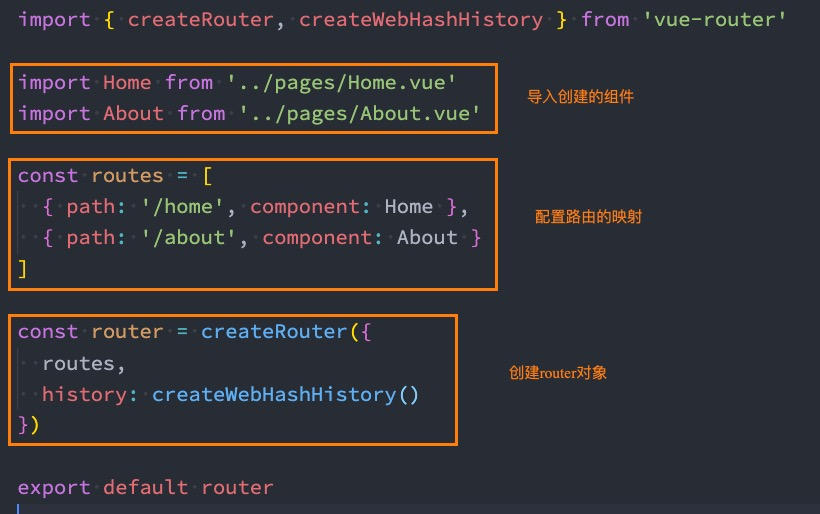


安装router

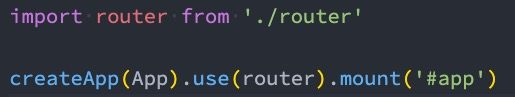


使用router

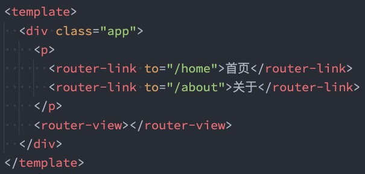

router-link和router-view都是vue提供的内置组件，to属性指定跳转到哪个路由，默认router-link是a元素


 

## 路由的默认路径

我们这里还有一个不太好的实现: 

- 默认情况下, 进入网站的首页, 我们希望渲染首页的内容； 
- 但是我们的实现中, 默认没有显示首页组件, 必须让用户点击才可以；

如何可以让路径默认跳到到首页, 并且渲染首页组件呢?

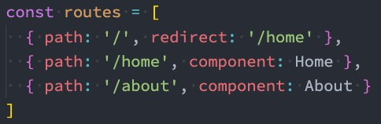

我们在routes中又配置了一个映射： 

- path配置的是根路径: / 
- redirect是重定向, 也就是我们将根路径重定向到/home的路径下, 这样就可以得到我们想要的结果了.


## history模式

另外一种选择的模式是history模式：

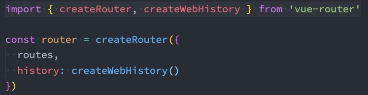

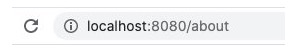


## router-link

router-link事实上有很多属性可以配置：

to属性：

- 是一个字符串，或者是一个对象

replace属性：

- 设置 replace 属性的话，当点击时，会调用 router.replace()，而不是 router.push()；
- 必须是history模式

active-class属性：

- 设置激活a元素后应用的class，默认是router-link-active

  默认这个a元素是有class属性的

  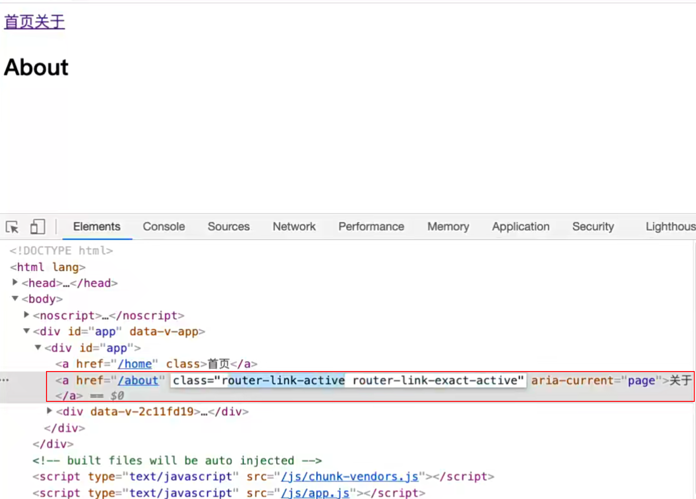

默认点击哪个，哪个就会加class，那么我么可以对这些class进行新增样式

```css
.router-link-active {
  color: red
}
```

一旦加上的话就可以给点击的这个router-link所在的按钮加上class样式了

这个class名字也是可以修改的

```vue
<template>
	<router-link to="/home" active-class="wts-active">首页</router-link>
	<router-link to="/about" active-class="wts-active">关于</router-link>
</template>
<style>
	.wts-active {
    color: red
  }
</style>
```

这样就会在激活的时候添加wts-active属性了

exact-active-class属性：

- 链接精准激活时，应用于渲染的 的 class，默认是router-link-exact-active；

这一幅图，是router-link-exact-active的案例 在子路由中如果用router-link-active的时候那么如果路径是 `/home`, 那么子路由会被渲染上 ，但是如果子路由用的是`router-link-active` 那么路径`/home`是渲染不上的

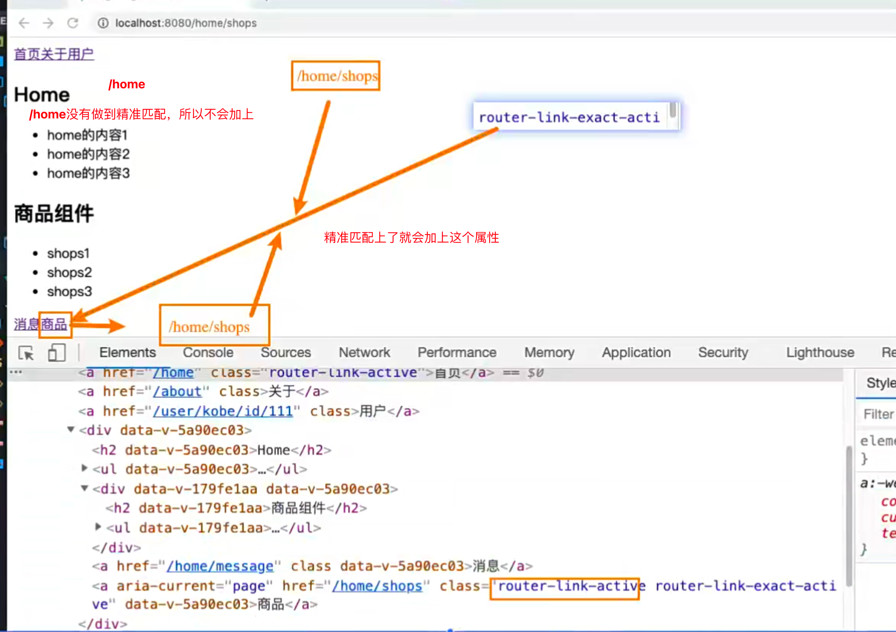

上面两个class的区别就是匹配和精准匹配


route-link在4+版本没有tag属性了


## 路由懒加载

当打包构建应用时，JavaScript 包会变得非常大，影响页面加载：

没有分包的情况下：

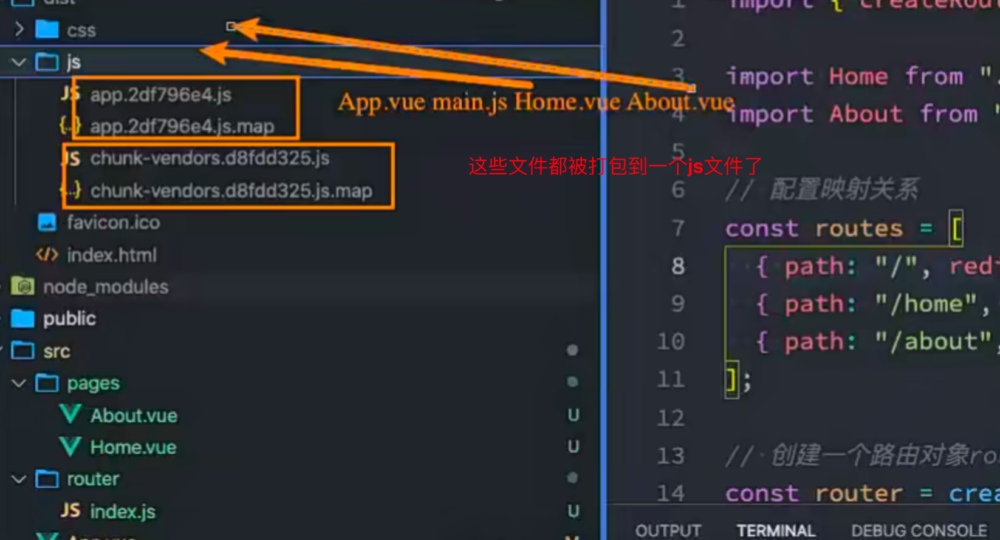

- 如果我们能把不同路由对应的组件分割成不同的代码块，然后当路由被访问的时候才加载对应组件，这样就会 更加高效；
- 也可以提高首屏的渲染效率；  

其实这里还是我们前面讲到过的webpack的分包知识，而Vue Router默认就支持动态来导入组件：

- 这是因为component可以传入一个组件，也可以接收一个函数，该函数 需要放回一个Promise； 
- 而import函数就是返回一个Promise；

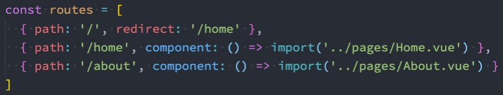


## 打包效果分析

我们看一下打包后的效果：

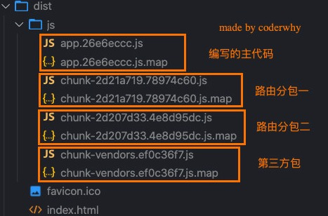

我们会发现分包是没有一个很明确的名称的，其实webpack从3.x开始支持对分包进行命名（chunk name）：

魔法注释

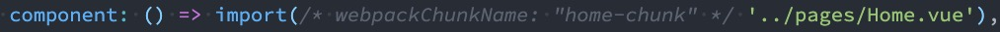

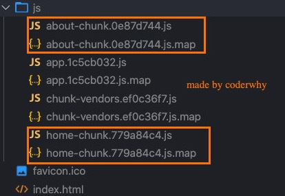

这样就能知道哪个组件打出来的哪个包了


## name和meta属性

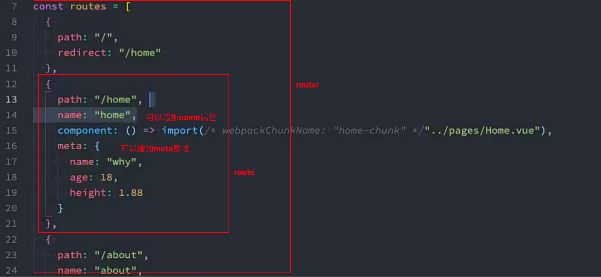


## 动态路由基本匹配

很多时候我们需要将给定匹配模式的路由映射到同一个组件： 

- 例如，我们可能有一个 User 组件，它应该对所有用户进行渲染，但是用户的ID是不同的； 
- 在Vue Router中，我们可以在路径中使用一个动态字段来实现，我们称之为 路径参数；

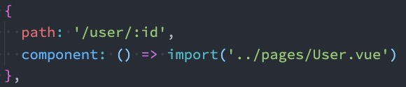


在router-link中进行如下跳转：

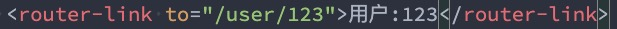


## 获取动态路由的值

那么在User中如何获取到对应的值呢？

- 在template中，直接通过 $route.params获取值；
  - 在created中，通过 this.$route.params获取值；
  - 在setup中，我们要使用 vue-router库给我们提供的一个hook useRoute；
    - 该Hook会返回一个Route对象，对象中保存着当前路由相关的值；

在template中拿到route中的值（这个id就是上面route的url配置的id）

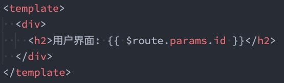

在options和setup中拿到$route（useRoute，他是一个hook，他是在vue-router中拿到的）

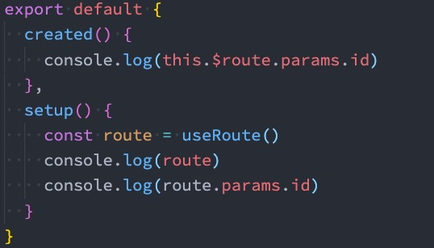


## 匹配多个参数

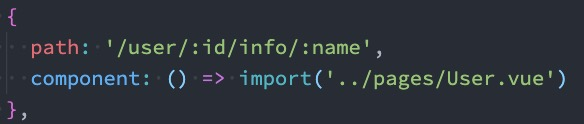

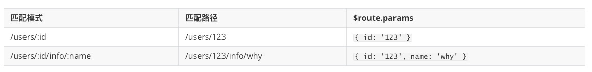


## NotFound

对于哪些没有匹配到的路由，我们通常会匹配到固定的某个页面 

- 比如NotFound的错误页面中，这个时候我们可编写一个动态路由用于匹配所有的页面；

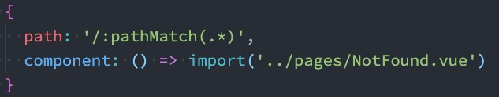


我们可以通过 $route.params.pathMatch获取到传入的参数：

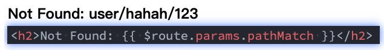


## 匹配规则加*

这里还有另外一种写法： 

- 注意：我在/:pathMatch(.*)后面又加了一个 *；

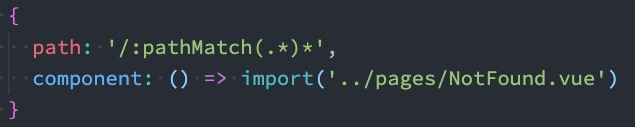


它们的区别在于解析的时候，是否解析 /：

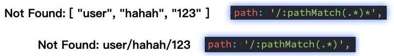

多了个*会按照/分隔出来数组，如果没有，那么就按照输入的路由显示出来


## 路由的嵌套

什么是路由的嵌套呢？ 

- 目前我们匹配的Home、About、User等都属于底层路由，我们在它们之间可以来回进行切换； 
- 但是呢，我们Home页面本身，也可能会在多个组件之间来回切换： 
  - 比如Home中包括Product、Message，它们可以在Home内部来回切换； 
- 这个时候我们就需要使用嵌套路由，在Home中也使用 router-view 来占位之后需要渲染的组件；


## 路由的嵌套配置

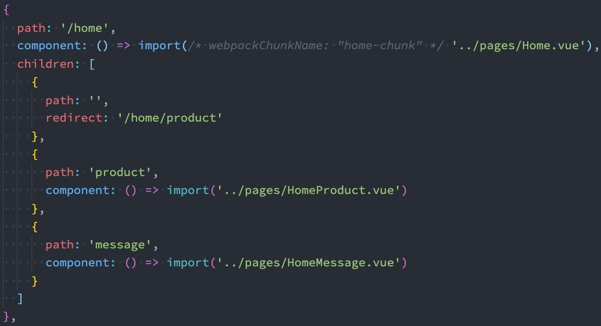

上面的product和message不能加/

重定向要写全

这里嵌套的组件要写到Home组件里面


## 代码的页面跳转

编程式导航：

有时候我们希望通过代码来完成页面的跳转，比如点击的是一个按钮：

options可以拿到this

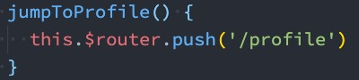

当然，我们也可以传入一个对象：

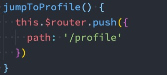

如果是在setup中编写的代码，那么我们可以通过 useRouter 来获取：

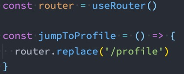


## query方式的参数

我们也可以通过query的方式来传递参数：

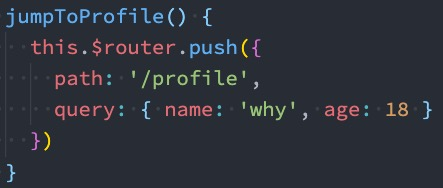


在界面中通过 $route.query 来获取参数：

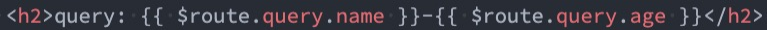


## 替换当前的位置

使用push的特点是压入一个新的页面，那么在用户点击返回时，上一个页面还可以回退，但是如果我们希望当前 页面是一个替换操作，那么可以使用**replace**：

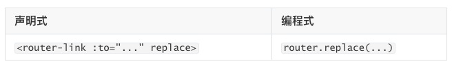


## 页面的前进后退

router的go方法：

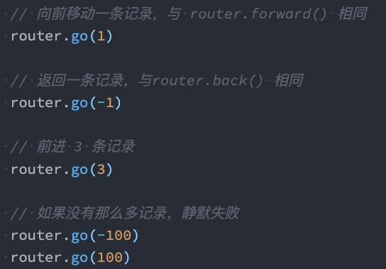

router也有back： 

- 通过调用 history.back() 回溯历史。相当于 router.go(-1)； 

router也有forward：

- 通过调用 history.forward() 在历史中前进。相当于 router.go(1)；


## router-link的v-slot

在vue-router3.x的时候，router-link有一个tag属性，可以决定router-link到底渲染成什么元素： 

```vue
<template>
	<router-link to="/home" tag="button">首页</router-link>
</template>
```

- 但是在vue-router4.x开始，该属性被移除了； 
- 而给我们提供了更加具有灵活性的v-slot的方式来定制渲染的内容；

v-slot如何使用呢？

首先，我们需要使用custom表示我们整个元素要自定义 

- 如果不写，那么自定义的内容会被包裹在一个 a 元素中；

```vue
<!-- 放入元素 -->
<template>
	<router-link to="/home">
    <button>首页</button>
  </router-link>
</template>

<!-- 放入组件,可以在这里给组件传参 -->
<template>
	<router-link to="/about">
    <nav-bar title="关于"></nav-bar>
  </router-link>
</template>
```


其次，我们使用v-slot来作用域插槽来获取内部传给我们的值： 

- href：解析后的 URL； 
- route：解析后的规范化的route对象； 
- navigate：触发导航的函数； 
- isActive：是否匹配的状态； 
- isExactActive：是否是精准匹配的状态；

```vue
<!-- 放入元素 -->
<template>
	<router-link to="/home" v-slot="props">
    <button>{{ props.href }}</button>
    <span :class="props.isActive">{{ props.isActive }}</span>
    <span :class="props.isExactActive">{{ props.isExactActive }}</span>
  </router-link>
</template>
```


## custom属性

custom属性表示，当前的link没有a标签了，完全按照用户自定义的了，不提供导航的跳转了,所以我们可以通过编程式导航跳转，如果没有custom属性的话，插槽都是被包裹在a标签的，点击任何位置都会触发a标签

```vue
<!-- 放入元素 -->
<template>
	<router-link to="/home" v-slot="props" custom>
    <button @click="props.navigate">{{ props.href }}</button>
  </router-link>
</template>
```


## 路由添加动态组件

如果想让路由组件实现transition动画怎么做呢？

首先需要通过路由的插槽拿到组件，然后给组件应用transition实现动画

```vue
<template>
  <div id="app">
    <!-- 通过插槽的方式拿到组件 -->
    <router-view v-slot="props">
      <transition name="why">
        	<!-- 应用组件 -->
          <component :is="props.Component"></component>
      </transition>
    </router-view>
  </div>
</template>

<style>
  .why-active {
    color: red;
  }

  .why-enter-from,
  .why-leave-to {
    opacity: 0;
  }

  .why-enter-active,
  .why-leave-active {
    transition: opacity 1s ease;
  }
</style>

```

如果想对组件做一个缓存，还可以这样

```vue
<template>
  <div id="app">
    <!-- 通过插槽的方式拿到组件 -->
    <router-view v-slot="props">
      <!-- 缓存组件 -->
        <keep-alive>
          <component :is="props.Component"></component>
        </keep-alive>
    </router-view>
  </div>
</template>

```


## 动态添加路由

某些情况下我们可能需要动态的来添加路由： 

- 比如根据用户不同的权限，注册不同的路由； 
- 这个时候我们可以使用一个方法 addRoute；

如果我们是为route添加一个children路由，那么可以传入对应的name：

在项目中并不是把所有的路由给配置好，而是判断当前登录的用户是什么样的角色，有什么样的权限再来判断是否需要注册某一个页面的路由

先把路由定义好，然后添加上预先定义好的路由

```js
// 创建一个路由对象router
const router = createRouter({
  routes,
  history: createWebHistory()
})
const categoryRoute = {
  path: '/category',
  component: () => import('../pages/category.vue')
}
// 这里添加了一个路由对象
router.addRoute(categoryRoute)

// 也可以添加二级路由对象,这里是给home这个一级路由新增一个二级路由
router.addRoute('home', {
  path: 'moment',
  component: () => import('../pages/homeMoment.vue')
})


export default router
```


## 动态删除路由

删除路由有以下三种方式： 

- 方式一：添加一个name相同的路由； 

- 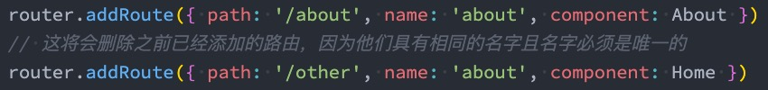

- 方式二：通过removeRoute方法，传入路由的名称； 

  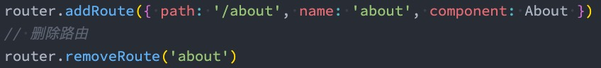

- 方式三：通过addRoute方法的返回值回调；

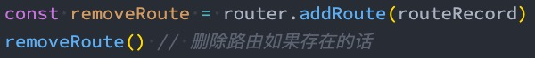

路由的其他方法补充： 

- router.hasRoute()：检查路由是否存在。 
- router.getRoutes()：获取一个包含所有路由记录的数组。


## 路由导航守卫

vue-router 提供的导航守卫主要用来通过跳转或取消的方式守卫导航。 

全局的前置守卫beforeEach是在导航触发时会被回调的：

它有两个参数： 

- to：即将进入的路由Route对象； 
- from：即将离开的路由Route对象；

它有返回值： 

- false：取消当前导航； 
- 不返回或者undefined：进行默认导航； 
- 返回一个路由地址：
  - 可以是一个string类型的路径； 
  - 可以是一个对象，对象中包含path、query、params等信息；

可选的第三个参数：next 

- 在Vue2中我们是通过next函数来决定如何进行跳转的； 
- 但是在Vue3中我们是通过返回值来控制的，不再推荐使用next函数，这是因为开发中很容易调用多次next；

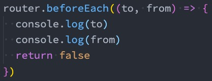


## 登录守卫功能

比如我们完成一个功能，只有登录后才能看到其他页面：

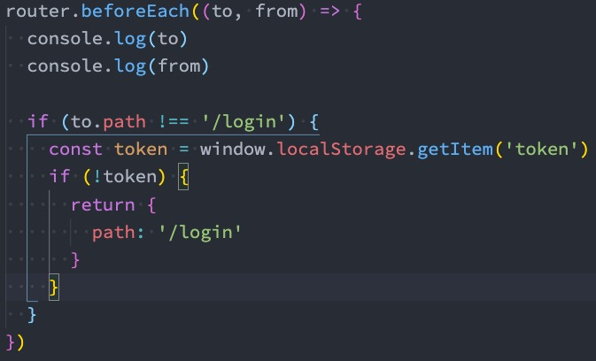

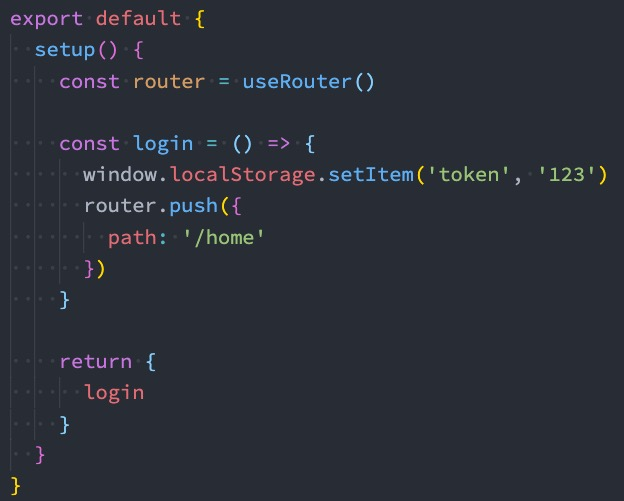


## 其他导航守卫

Vue还提供了很多的其他守卫函数，目的都是在某一个时刻给予我们回调，让我们可以更好的控制程序的流程或者功能： 

-  https://next.router.vuejs.org/zh/guide/advanced/navigation-guards.html

我们一起来看一下完整的导航解析流程： 

- 导航被触发。 
- 在失活的组件里调用 beforeRouteLeave 守卫。 
- 调用全局的 beforeEach 守卫。 
- 在重用的组件里调用 beforeRouteUpdate 守卫(2.2+)。 
- 在路由配置里调用 beforeEnter。 
- 解析异步路由组件。 
- 在被激活的组件里调用 beforeRouteEnter。 
- 调用全局的 beforeResolve 守卫(2.5+)。 
- 导航被确认。 
- 调用全局的 afterEach 钩子。 
- 触发 DOM 更新。 
- 调用 beforeRouteEnter 守卫中传给 next 的回调函数，创建好的组件实例会作为回调函数的参数传入。
