# Vue基础-模板语法


## methods方法绑定this

问题回顾：

- 问题一：为什么不能使用箭头函数（官方文档有给出解释）？
- 问题二：不使用箭头函数的情况下，this到底指向的是什么？（可以作为一道面试题）

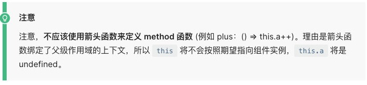


## 问题一：不能使用箭头函数？

我们在methods中要使用data返回对象中的数据：

- 那么这个this是必须有值的，并且应该可以通过this获取到data返回对象中的数据。

那么我们这个this能不能是window呢？

- 不可以是window，因为window中我们无法获取到data返回对象中的数据；
- 但是如果我们使用箭头函数，那么这个this就会是window了；

为什么是window呢？

- 这里涉及到箭头函数使用this的查找规则，它会在自己的上层作用于中来查找this；
- 最终刚好找到的是script作用于中的this，所以就是window；


```html
<!DOCTYPE html>
<html lang="en">

<head>
    <meta charset="UTF-8">
    <meta http-equiv="X-UA-Compatible" content="IE=edge">
    <meta name="viewport" content="width=device-width, initial-scale=1.0">
    <title>Document</title>
    <script src="vue3/vue3.js"></script>
</head>

<body>
    <div id="app"></div>
    <template id="hehe">
        <button @click="showThis">this</button>
    </template>
    <script>
        Vue.createApp({
            template: '#hehe',
            data: function () {
                return {
                    counter: 100
                }
            },
            methods: {
                showThis() {
                    console.log('普通函数的this', this)
                },
                // showThis: () => {
                //     console.log('箭头函数的this', this)
                // }
            }
        }).mount('#app')
    </script>
</body>

</html>
```


this到底是如何查找和绑定的呢？

- 在我的公众号有另外一篇文章，专门详细的讲解了this的绑定规则；
- `[前端面试之彻底搞懂this指向 (qq.com)](https://mp.weixin.qq.com/s/hYm0JgBI25grNG_2sCRlTA)`

注意this的隐式绑定和显示绑定


## 问题二：this到底指向什么？

事实上Vue的源码当中就是对methods中的所有函数进行了遍历，并且通过bind绑定了this：

拿到函数，然后通过bind进行绑定

在绑定点击之后，拿到这个函数名

Vue2的源码通过这样绑定this

通过遍历，所有的方法进行绑定this到Vue实例中，点击的时候 => 执行methods中的方法 => 执行ctx`[方法名]()` 

```html
ctx[btn2Click] = btn2Click.bind(publicThis)
```


Vue3的this绑定，vue3的this绑定和vue2差不多，但是vue是自己实现的bind绑定。

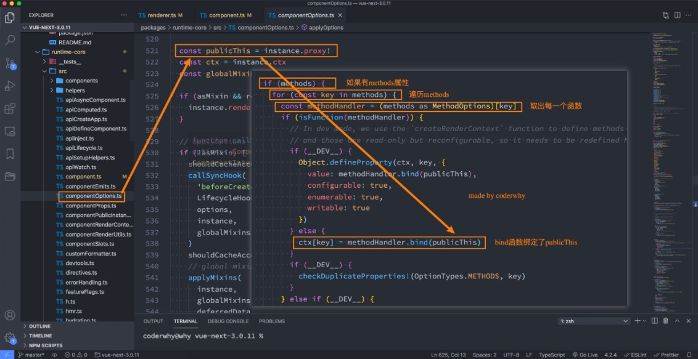

可以点开看一下

publicThis实际上是proxy代理对象

上面代码的大致意思：

- 如果有methods这个option

- 取出每一个方法

- 如果不是生产环境，就通过methodHandler.bind绑定到proxy


## VSCode代码片段

 我们在前面练习Vue的过程中，有些代码片段是需要经常写的，我们再VSCode中我们可以生成一个代码片段，方便我们快速生成。

VSCode中的代码片段有固定的格式，所以我们一般会借助于一个在线工具来完成。

具体的步骤如下：

- 第一步，复制自己需要生成代码片段的代码；

- 第二步，https://snippet-generator.app/在该网站中生成代码片段；
- 第三步，在VSCode中配置代码片段；

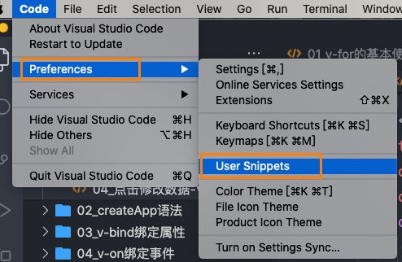

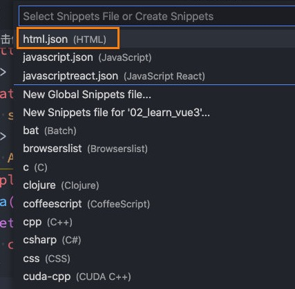

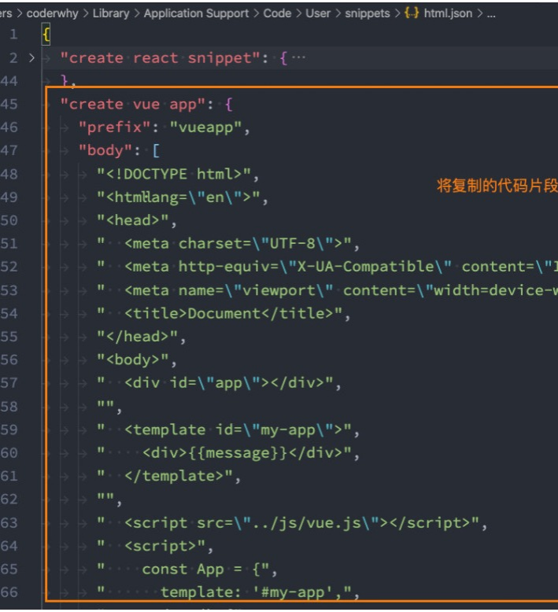


## 模板语法

React的开发模式：

- React使用的jsx，所以对应的代码都是编写的类似于js的一种语法；
- 之后通过Babel将jsx编译成 React.createElement 函数调用；

Vue也支持jsx的开发模式（后续有时间也会讲到）：

- 但是大多数情况下，使用基于HTML的模板语法；
- 在模板中，允许开发者以声明式的方式将DOM和底层组件实例的数据绑定在一起；
- 在底层的实现中，Vue将模板编译成虚拟DOM渲染函数，这个我会在后续给大家讲到；

所以，对于学习Vue来说，学习模板语法是非常重要的。


## Mustache双大括号语法

如果我们希望把数据显示到模板（template）中，使用最多的语法是 “Mustache”语法 (双大括号) 的文本插值。

- 并且我们前端提到过，data返回的对象是有添加到Vue的响应式系统中；
- 当data中的数据发生改变时，对应的内容也会发生更新。
- 当然，Mustache中不仅仅可以是data中的属性，也可以是一个JavaScript的表达式。 

另外这种用法是错误的：

```html
<!DOCTYPE html>
<html lang="en">

<head>
    <meta charset="UTF-8">
    <meta http-equiv="X-UA-Compatible" content="IE=edge">
    <meta name="viewport" content="width=device-width, initial-scale=1.0">
    <title>Document</title>
</head>

<body>
    <div id="app"></div>
    <template id="my-app">
        <!-- 1、mustache的基本使用 -->
        <h2>{{message}} - {{message}}</h2>
      
        <!-- 2、是一个表达式 -->
        <h2>{{counter * 10}}</h2>
        <h2>{{message.split(" ").reverse().join(" ")}}</h2>
      
        <!-- 3、也可以调用函数 -->
        <h2>{{getReverseMessage()}}</h2>
      
        <!-- 可以使用computed(计算属性) -->
        <!-- 4、使用三元运算符 -->
        <h2>{{isShow ? "哈哈哈" : "呵呵呵"}}</h2>
        <button @click="toggle">切换</button>

        <!-- 错误用法 -->
        <!-- 这个是赋值语句 -->
        <!-- <h2>{{var name = "abc"}}</h2>
        <h2>{{if (isShow) { return "哈哈哈" }}}</h2> -->
    </template>
    <script src="vue3/vue3.js"></script>
    <script>
        const App = {
            template: '#my-app',
            data: function () {
                return {
                    message: "hello world",
                    counter: 10,
                    isShow: true
                }
            },
            methods: {
                getReverseMessage() {
                    return this.message.split(" ").reverse().join(" ");
                },
                toggle() {
                    this.isShow = !this.isShow
                }
            }
        }
        Vue.createApp(App).mount("#app")
    </script>
</body>

</html>
```


# 指令

## v-once指令

v-once用于指定元素或者组件只渲染一次：

- 当数据发生变化时，元素或者组件以及其所有的子元素将视为静态内容并且跳过；
- 该指令可以用于性能优化；

```html
<!DOCTYPE html>
<html lang="en">
<head>
    <meta charset="UTF-8">
    <meta http-equiv="X-UA-Compatible" content="IE=edge">
    <meta name="viewport" content="width=device-width, initial-scale=1.0">
    <title>Document</title>
</head>
<body>
    <div id="app"></div>
    <template id="my-app">
        <!-- 加了once的这个只会是100，也就是说只渲染一次 -->
        <p v-once>{{counter}}</p>   
        <!-- 这个counter的值在点击增加的时候就会+1 -->
        <p>{{counter}}</p>
        <button @click="increment">增加</button>
    </template>
    <script src="vue3/vue3.js"></script>
    <script>
        const App = {
            template: '#my-app',
            data() {
                return {
                    message: 'hello world',
                    counter: 100
                }
            },
            methods: {
                increment() {
                    this.counter++
                }
            }
        }
        Vue.createApp(App).mount("#app")
    </script>
</body>
</html>
```


如果是子节点，也是只会渲染一次：

如果是子组件也只会渲染一次。

也就是不会响应式了，上面的counter发生了改变，但是v-once里面的都不会更新了


## v-text指令

用于更新元素的 textContent：

```html
<!DOCTYPE html>
<html lang="en">
<head>
    <meta charset="UTF-8">
    <meta http-equiv="X-UA-Compatible" content="IE=edge">
    <meta name="viewport" content="width=device-width, initial-scale=1.0">
    <title>Document</title>
</head>
<body>
    <div id="app"></div>
    <template id="my-app">
        <span v-text="message"></span>
        <!-- 等价于 -->
        <span>{{message}}</span>
    </template>
    <script src="vue3/vue3.js"></script>
    <script>
        const App = {
            template: '#my-app',
            data() {
                return {
                    message: 'hello world'
                }
            }
        }
        Vue.createApp(App).mount("#app")
    </script>
</body>
</html>
```

v-text和mustach语法的效果是一样的


## v-html

默认情况下，如果我们展示的内容本身是 html 的，那么vue并不会对其进行特殊的解析.

- 如果我们希望这个内容被Vue可以解析出来，那么可以使用 v-html 来展示；

```html
<!DOCTYPE html>
<html lang="en">
<head>
    <meta charset="UTF-8">
    <meta http-equiv="X-UA-Compatible" content="IE=edge">
    <meta name="viewport" content="width=device-width, initial-scale=1.0">
    <title>Document</title>
</head>
<body>
    <div id="app"></div>
    <template id="my-app">
        <!-- 这里不会解析div标签 -->
        <div>{{message}}</div>
        <!-- 这里会解析div标签 -->
        <div v-html="message"></div>
    </template>
    <script src="vue3/vue3.js"></script>
    <script>
        const App = {
            template: '#my-app',
            data() {
                return {
                    message: '<div style="color: red; background: blue;">哈哈哈</div>'
                }
            }
        }
        Vue.createApp(App).mount("#app")
    </script>
</body>
</html>
```

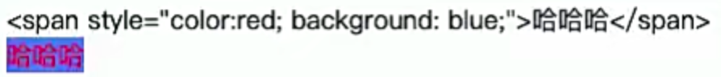

使用v-html会把message解析成html，没有使用v-html的话会把这段字符串展示出来


## v-pre

v-pre用于跳过元素和它的子元素的编译过程，显示原始的Mustache标签：

- 跳过不需要编译的节点，加快编译的速度；

```html
<!DOCTYPE html>
<html lang="en">
<head>
    <meta charset="UTF-8">
    <meta http-equiv="X-UA-Compatible" content="IE=edge">
    <meta name="viewport" content="width=device-width, initial-scale=1.0">
    <title>Document</title>
</head>
<body>
    <div id="app"></div>
    <template id="my-app">
        <div v-pre>{{message}}</div>
    </template>
    <script src="vue3/vue3.js"></script>
    <script>
        const App = {
            template: '#my-app',
            data() {
                return {
                    message: 'hello world'
                }
            }
        }
        Vue.createApp(App).mount("#app")
    </script>
</body>
</html>
```

展示的是这样，不会展示hello world

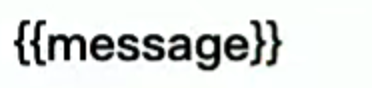


## v-cloak

这个指令保持在元素上直到关联组件实例结束编译。

编译过程是

- 把template模板语法展示到页面  如果有mustache语法 也展示为 例如: <h2>{{ message }}</h2>
- 数据加载完成后替换mustache  变成 <h2>hello world</h2>

这个过程很短暂，但是在有些情况下会出现。如何解决这个问题呢？

和 CSS 规则如 [v-cloak] { display: none } 一起用时，这个指令可以隐藏未编译的 Mustache 标签直到组件实例准备完毕。

```html
<!DOCTYPE html>
<html lang="en">
<head>
    <meta charset="UTF-8">
    <meta http-equiv="X-UA-Compatible" content="IE=edge">
    <meta name="viewport" content="width=device-width, initial-scale=1.0">
    <title>Document</title>
    <style>
        /* 如果有这个属性就隐藏 */
        [v-cloak] {
            display: none;
        }
    </style>
</head>
<body>
    <div id="app"></div>

    
    <template id="my-app">
        <!-- 在编译的时候vue发现如果有这个属性，在css中就会display掉 -->
        <!-- 等到编译完毕以后就会把这个属性删掉，上面的display就不会作用到这里了，显示出正常的mustache编译完成的 -->
        <div v-cloak>{{message}}</div>
    </template>
    <script src="vue3/vue3.js"></script>
    <script>
        const App = {
            template: '#my-app',
            data() {
                return {
                    message: 'hello world'
                }
            }
        }
        Vue.createApp(App).mount("#app")
    </script>
</body>
</html>
```


## v-bind的绑定属性

前端讲的一系列指令，主要是将值插入到模板内容中.

但是，除了内容需要动态来决定外，某些属性我们也希望动态来绑定。

- 比如动态绑定a元素的href属性；
- 比如动态绑定img元素的src属性；

绑定属性我们使用v-bind：

- 缩写：:
- 预期：any (with argument) | Object (without argument)
- 参数：attrOrProp (optional)
- 修饰符：
  - .camel - 将 kebab-case attribute 名转换为 camelCase。
- 用法：动态地绑定一个或多个 attribute，或一个组件 prop 到表达式。


## 绑定基本属性

v-bind用于绑定一个或多个属性值，或者向另一个组件传递props值（这个学到组件时再介绍）；

在开发中，有哪些属性需要动态进行绑定呢？

- 还是有很多的，比如图片的链接src、网站的链接href、动态绑定一些类、样式等等

```html
<!DOCTYPE html>
<html lang="en">

<head>
    <meta charset="UTF-8">
    <meta http-equiv="X-UA-Compatible" content="IE=edge">
    <meta name="viewport" content="width=device-width, initial-scale=1.0">
    <title>Document</title>
</head>

<body>
    <div id="app"></div>
    <!-- vue2 template中只能有一个根元素 -->
    <!-- vue3 template中可以有多个根元素 -->
    <template id="my-app">

<!-- 1、v-bind的基本使用 -->
        <!-- 把data中的imgUrl绑定到src上, 界面会展示data中imgUrl的地址 -->
        
        <!-- 把data中的link绑定到href中, 界面会展示data中link的地址 -->
        <a v-bind:href="link">百度</a>


<!-- 2、v-bind提供一个语法糖 -->
          <!-- 把data中的imgUrl绑定到src上, 界面会展示data中imgUrl的地址 -->
          
          <!-- 把data中的link绑定到href中, 界面会展示data中link的地址 -->
          <a :href="link">百度</a>
    </template>
    <script src="vue3/vue3.js"></script>
    <script>
        const App = {
            template: '#my-app',
            data: function () {
                return {
                    imgUrl: 'http://tiebapic.baidu.com/forum/w%3D580%3B/sign=00b89809c33f8794d3ff4826e2200cf4/aa64034f78f0f7363d3e37b01d55b319eac413ba.jpg',
                    link: 'https//www.baidu.com'
                }
            }
        }
        Vue.createApp(App).mount("#app")
    </script>
</body>

</html>
```

v-bind有一个对应的语法糖，也就是简写方式。在开发中，我们通常会使用语法糖的形式，因 为这样更加简洁


## 绑定class介绍

在开发中，有时候我们的元素class也是动态的，比如：

- 当数据为某个状态时，字体显示红色。
- 当数据另一个状态时，字体显示黑色。

绑定class有两种方式：

- 对象语法

对象语法：我们可以传给 :class (v-bind:class 的简写) 一个对象，以动态地切换 class。

```html
<!DOCTYPE html>
<html lang="en">

<head>
    <meta charset="UTF-8">
    <meta http-equiv="X-UA-Compatible" content="IE=edge">
    <meta name="viewport" content="width=device-width, initial-scale=1.0">
    <title>Document</title>
    <style>
        .red {
            color: red
        }

        .blue {
            color: blue;
        }
    </style>
</head>

<body>
    <div id="app"></div>
    <template id="my-app">
        <!-- 属性名是attribute，也就是class类名，属性值是布尔值 -->
        <!-- 对象语法： {'active': boolean} -->
        <!-- 可以有多个键值对，相对应也就有多个类名 -->
        <h2 :class="{'red': isRed, 'blue': isBlue, 'title': true}">{{message}}</h2>
        <button @click="change">切换</button>

        <!-- 默认class和动态class结合在一起 -->
        <!-- 在html中会显示的类名包括下面所有的在一起 -->
        <h2 class="abc def" :class="{'ghi': true, 'jkl': true}">哈哈哈</h2>

        <!-- 将对象放到一个单独的属性中 -->
        <h2 class="abc def" :class="option">哈哈哈</h2>

        <!-- 将返回的对象放到一个methods(computed)中 -->
        <h2 :class="getClassObj()">嘿嘿嘿</h2>
    </template>
    <script src="vue3/vue3.js"></script>
    <script>
        const App = {
            template: '#my-app',
            data: function () {
                return {
                    message: "hello world",
                    isRed: false,
                    isBlue: true,
                    // 这里最好使用true或者false，不要使用data中的其他数据，不能相互引用
                    option: { 'ghi': true, 'jkl': true }
                }
            },
            methods: {
                change() {
                    this.isRed = !this.isRed
                    this.isBlue = !this.isBlue
                },
                getClassObj() {
                    return { 'ghi': true, 'jkl': true }
                }
            }
        }
        Vue.createApp(App).mount("#app")
    </script>
</body>

</html>
```


- 数组语法

数组语法：我们可以把一个数组传给 :class，以应用一个 class 列表；

```html
<!DOCTYPE html>
<html lang="en">

<head>
    <meta charset="UTF-8">
    <meta http-equiv="X-UA-Compatible" content="IE=edge">
    <meta name="viewport" content="width=device-width, initial-scale=1.0">
    <title>Document</title>
</head>

<body>
    <div id="app"></div>
    <template id="my-app">
        <!-- 如果是字符串就展示字符串，如果是变量就解析这个变量，并且加入到类名中 -->
        <h2 :class="['abc', title]">{{message}}</h2>
        <!-- 使用三元运算符 -->
        <!-- 展示了active这个类名 -->
        <h2 :class="['abc', title, active ? 'active' : '']">{{message}}</h2>

        <!-- 数组里面嵌套对象语法,里面会展示对象中的cba, xxx -->
        <h2 :class="['abc', title, active ? 'active' : '', {'cba': true, 'xxx': showXxx}]">{{message}}</h2>
    </template>
    <script src="vue3/vue3.js"></script>
    <script>
        const App = {
            template: '#my-app',
            data: function () {
                return {
                    message: '哈哈哈',
                    title: 'def',
                    active: true,
                    showXxx: true
                }
            }
        }
        Vue.createApp(App).mount("#app")
    </script>
</body>

</html>
```


## 绑定style介绍

我们可以利用v-bind:style来绑定一些CSS内联样式：

- 这次因为某些样式我们需要根据数据动态来决定；
- 比如某段文字的颜色，大小等等；

CSS property 名可以用驼峰式 (camelCase) 或短横线分隔 (kebab-case，记得用引号括起来) 来命名；

绑定class有两种方式：


- 对象语法

```html
<!DOCTYPE html>
<html lang="en">

<head>
    <meta charset="UTF-8">
    <meta http-equiv="X-UA-Compatible" content="IE=edge">
    <meta name="viewport" content="width=device-width, initial-scale=1.0">
    <title>Document</title>
</head>

<body>
    <div id="app"></div>
    <template id="my-app">
        <!-- 对象语法,属性值一定要加'' -->
        <h2 :style="{color: 'red'}">{{message}}</h2>
        <!-- 如果不加引号,就是变量 -->
        <h2 :style="{color: finalColor}">{{message}}</h2>
        <!-- font-size可以用短横线链接也可以用驼峰，但是用短横线一定要加'', 下面是两种情况都可以 -->
        <h2 :style="{color: finalColor,'font-size': '30px', fontSize: '30px' }">{{message}}</h2>
        <!-- 可以不加引号，是data里面的数据 -->
        <h2 :style="{color: finalColor,'font-size': finalFontSize + 'px' }">{{message}}</h2>
        <!-- 在data中定义的好属性，直接放到这里 -->
        <div :style="finalStyleObj">哈哈哈</div>
        <!-- 通过methods来给style赋值 -->
        <div :style="getFinalStyleObj()">哈哈哈</div>
    </template>
    <script src="vue3/vue3.js"></script>
    <script>
        const App = {
            template: '#my-app',
            data: function () {
                return {
                    message: "hello world",
                    finalColor: 'red',
                    finalFontSize: 50,
                    finalStyleObj: {
                        fontSize: '50px;',
                        'font-size': '50px;',
                        fontWeight: 700,
                        backgroundColor: 'red'
                    }
                }
            },
            methods: {
                getFinalStyleObj() {
                    return {
                        fontSize: '50px;',
                        'font-size': '50px;',
                        fontWeight: 700,
                        backgroundColor: 'red'
                    }
                }
            }
        }
        Vue.createApp(App).mount("#app")
    </script>
</body>

</html>
```


- 数组语法

  - :style 的数组语法可以将多个样式对象应用到同一个元素上；


```html
<!DOCTYPE html>
<html lang="en">
<head>
    <meta charset="UTF-8">
    <meta http-equiv="X-UA-Compatible" content="IE=edge">
    <meta name="viewport" content="width=device-width, initial-scale=1.0">
    <title>Document</title>
</head>
<body>
    <div id="app"></div>
    <script src="vue3/vue3.js"></script>
    <template id="my-cpn">
        <!-- 把两个对象合并到一起，两个对象同时生效 -->
      	<!-- 当然也可以通过computed或者methods来替换这两个对象 -->
        <h2 :style="[styleObj1, styleObj2]">{{message}}</h2>
    </template>
    <script>
        const App = {
            template: '#my-cpn',
            data() {
                return {
                    message: 'hello world',
                    styleObj1: {
                        color: 'red',
                        fontSize: '40px'
                    },
                    styleObj2: {
                        backgroundColor: 'blue'
                    }
                }
            },
            methods: {

            }
        }
        Vue.createApp(App).mount('#app')
    </script>
</body>
</html>
```


## 绑定style演练

在某些情况下，我们属性的名称可能也不是固定的：

- 前端我们无论绑定src、href、class、style，属性名称都是固定的；
- 如果属性名称不是固定的，我们可以使用 :[属性名]=“值” 的格式来定义；
- 这种绑定的方式，我们称之为动态绑定属性；

动态绑定属性

```html
<!DOCTYPE html>
<html lang="en">

<head>
    <meta charset="UTF-8">
    <meta http-equiv="X-UA-Compatible" content="IE=edge">
    <meta name="viewport" content="width=device-width, initial-scale=1.0">
    <title>Document</title>
</head>

<body>
    <div id="app"></div>
    <template id="my-app">
        <!-- 动态绑定属性名称，name和value都是来自data -->
        <h2 :[name]="value">哈哈哈</h2>
    </template>
    <script src="vue3/vue3.js"></script>
    <script>
        const App = {
            template: '#my-app',
            data: function () {
                return {
                    name: 'title',
                    value: 'kobe'
                }
            }
        }
        Vue.createApp(App).mount("#app")
    </script>
</body>

</html>
```


## 绑定一个对象

如果我们希望将一个对象的所有属性，绑定到元素上的所有属性，应该怎么做呢？

- 非常简单，我们可以直接使用 v-bind 绑定一个对象；

案例：info对象会被拆解成div的各个属性

v-bind 给属性(attribute)直接绑定一个对象,展示的效果为 每一个attribute的属性名为对象的属性名，attribute的属性值为对象的属性值

```html
<!DOCTYPE html>
<html lang="en">

<head>
    <meta charset="UTF-8">
    <meta http-equiv="X-UA-Compatible" content="IE=edge">
    <meta name="viewport" content="width=device-width, initial-scale=1.0">
    <title>Document</title>
</head>

<body>
    <div id="app"></div>
    <template id="my-app">
        <!-- v-bind绑定一个对象，这样写，会在标签中展示所有的对象对应的 attribute -->
        <h2 v-bind="info">哈哈哈</h2>
        <!-- 这是简写，但是不推荐 -->
        <h2 :="info">哈哈哈</h2>
    </template>
    <script src="vue3/vue3.js"></script>
    <script>
        const App = {
            template: '#my-app',
            data: function () {
                return {
                    info: {
                        name: 'vue',
                        age: 18,
                        height: 1.88
                    }
                }
            }
        }
        Vue.createApp(App).mount("#app")
    </script>
</body>

</html>
```


## v-on绑定事件

前面我们绑定了元素的内容和属性，在前端开发中另外一个非常重要的特性就是交互。

在前端开发中，我们需要经常和用户进行各种各样的交互：

-  这个时候，我们就必须监听用户发生的事件，比如点击、拖拽、键盘事件等等
- 在Vue中如何监听事件呢？使用v-on指令。

 接下来我们来看一下v-on的用法：


## v-on的用法

v-on的使用：

- 缩写：@
- 预期：Function | Inline Statement | Object
- 参数：event
- 修饰符：
  - .stop - 调用 event.stopPropagation()。
  - .prevent - 调用 event.preventDefault()。
  - .capture - 添加事件侦听器时使用 capture 模式。
  - .self - 只当事件是从侦听器绑定的元素本身触发时才触发回调。 
  - .{keyAlias} - 仅当事件是从特定键触发时才触发回调。 
  - .once - 只触发一次回调。
  - .left - 只当点击鼠标左键时触发。
  - .right - 只当点击鼠标右键时触发。 
  - .middle - 只当点击鼠标中键时触发。
  - .passive - { passive: true } 模式添加侦听器
- 用法：绑定事件监听


## v-on的基本使用

我们可以使用v-on来监听一下点击的事件：

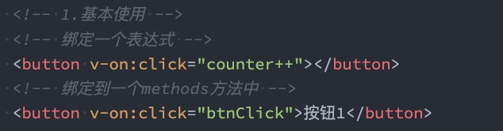

v-on:click可以写成@click，是它的语法糖写法：

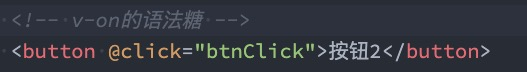

当然，我们也可以绑定其他的事件：

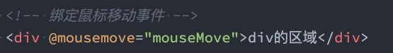

如果我们希望一个元素绑定多个事件，这个时候可以传入一个对象：

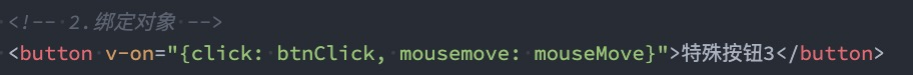


```html
<!DOCTYPE html>
<html lang="en">

<head>
    <meta charset="UTF-8">
    <meta http-equiv="X-UA-Compatible" content="IE=edge">
    <meta name="viewport" content="width=device-width, initial-scale=1.0">
    <title>Document</title>
    <style>
        .oDiv{
            width: 200px;
            height: 200px;
            background: red;
        }
    </style>
</head>

<body>
    <div id="app"></div>
    <template id="my-app">
        <h2>{{message}}</h2>
        <!-- 完整写法：v-on:监听的事件=""methods中的方法名 -->
        <button v-on:click="btn1Click">按钮1</button>
        <!-- 鼠标移动事件 -->
        <div v-on:mousemove="oDiv" class="oDiv"></div>

        <!-- 语法糖 -->
        <button @click="btn1Click">按钮1</button>

        <!-- 绑定一个表达式 -->
        <button @click="counterClick">{{counter}}</button>
        <button @click="counter++">{{counter}}</button>

        <!-- 绑定一个对象 -->
        <div class="oDiv" v-on="{click: btn1Click, mousemove: oDiv}">绑定对象</div>
        <div class="oDiv" @="{click: btn1Click, mousemove: oDiv}">绑定对象</div>
    </template>
    <script src="vue3/vue3.js"></script>
    <script>
        const App = {
            template: '#my-app',
            data: function () {
                return {
                    message: "hello world",
                    counter: 100
                }
            },
            methods: {
                btn1Click() {
                    console.log('按钮1发生了点击')
                },
                oDiv() {
                    console.log('鼠标发生了移动')
                },
                counterClick() {
                    this.counter++
                }
            }
        }
        Vue.createApp(App).mount("#app")
    </script>
</body>

</html>
```


## v-on参数传递

当通过methods中定义方法，以供@click调用时，需要注意参数问题：

情况一：如果该方法不需要额外参数，那么方法后的()可以不添加。

- 但是注意：如果方法本身中有一个参数，那么会默认将原生事件event参数传递进去

情况二：如果需要同时传入某个参数，同时需要event时，可以通过$event传入事件。

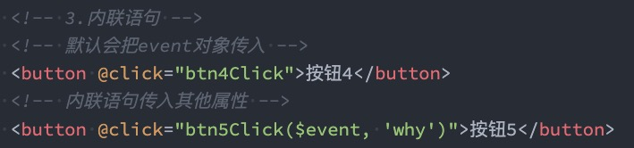

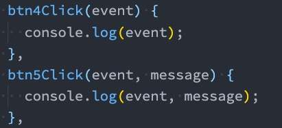

```html
<!DOCTYPE html>
<html lang="en">

<head>
    <meta charset="UTF-8">
    <meta http-equiv="X-UA-Compatible" content="IE=edge">
    <meta name="viewport" content="width=device-width, initial-scale=1.0">
    <title>Document</title>
</head>

<body>
    <div id="app"></div>
    <template id="my-app">
        <!-- 没有传递数据,默认传递event对象 -->
        <button @click="btn1Click">按钮1</button>
        <!-- $event可以获取到事件发生时的对象，然后可以传递 -->
        <button @click="btn2Click($event, 'Vue')">按钮2</button>
    </template>
    <script src="vue3/vue3.js"></script>
    <script>
        const App = {
            template: '#my-app',
            data: function () {
                return {
                    message: "hello world"
                }
            },
            methods: {
                // 这个是默认的，也就是说在事件触发的时候不传递任何参数的时候，这里默认有一个event对象。
                btn1Click(event) {
                    console.log('event', event)
                },
                btn2Click(event, value) {
                    console.log('event', event, value)
                }
            }
        }
        Vue.createApp(App).mount("#app")
    </script>
</body>

</html>
```

如果给一个dom绑定多个事件，参数传递需要这样写

```html
  <template id="my-app">
    <div class="box" v-on="{click: () => boxClick(1.88), mousemove: boxMove}"></div>
  </template>
```


## v-on的修饰符

v-on支持修饰符，修饰符相当于对事件进行了一些特殊的处理：

- .stop - 调用 event.stopPropagation()。
- .prevent - 调用 event.preventDefault()。 
- .capture - 添加事件侦听器时使用 capture 模式。 
- .self - 只当事件是从侦听器绑定的元素本身触发时才触发回调。 
- .{keyAlias} - 仅当事件是从特定键触发时才触发回调。 
- .once - 只触发一次回调。 
- .left - 只当点击鼠标左键时触发。 
- .right - 只当点击鼠标右键时触发。 
- .middle - 只当点击鼠标中键时触发。 
- .passive - { passive: true } 模式添加侦听器

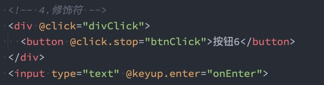


.stop修饰符

```html
<!DOCTYPE html>
<html lang="en">

<head>
    <meta charset="UTF-8">
    <meta http-equiv="X-UA-Compatible" content="IE=edge">
    <meta name="viewport" content="width=device-width, initial-scale=1.0">
    <title>Document</title>
</head>

<body>
    <div id="app"></div>
    <template id="my-app">
        <!-- 这样写会冒泡 -->
        <div @click="div1Click">
            <button @click="btn1Click">按钮1</button>
        </div>
        <!-- 这里加了修饰符，不会冒泡 -->
        <div @click="div2Click">
            <button @click.stop="btn2Click">按钮2</button>
        </div>
    </template>
    <script src="vue3/vue3.js"></script>
    <script>
        const App = {
            template: '#my-app',
            data: function () {
                return {
                    message: "hello world"
                }
            },
            methods: {
                div1Click() {
                    console.log('div1Click')
                },
                btn1Click() {
                    console.log('btn1Click')
                },
                div2Click() {
                    console.log('div2Click')
                },
                btn2Click() {
                    console.log('btn2Click')
                }
            }
        }
        Vue.createApp(App).mount("#app")
    </script>
</body>

</html>
```

.enter修饰符

```html
<!DOCTYPE html>
<html lang="en">

<head>
    <meta charset="UTF-8">
    <meta http-equiv="X-UA-Compatible" content="IE=edge">
    <meta name="viewport" content="width=device-width, initial-scale=1.0">
    <title>Document</title>
</head>

<body>
    <div id="app"></div>
    <template id="my-app">
        <h2>{{message}}</h2>
        <!-- 这里每次用键盘输入都会有一个打印 -->
        <input type="text" @keyup="keyup1Click">
        <!-- 这里在点击enter的时候才会有一个打印 -->
        <input type="text" @keyup.enter="keyup2Click">
    </template>
    <script src="vue3/vue3.js"></script>
    <script>
        const App = {
            template: '#my-app',
            data: function () {
                return {
                    message: "hello world"
                }
            },
            methods: {
                keyup1Click() {
                    console.log('keyup1Click')
                },
                keyup2Click() {
                    console.log('keyup2Click')
                }
            }
        }
        Vue.createApp(App).mount("#app")
    </script>
</body>

</html>
```


## 条件渲染

在某些情况下，我们需要根据当前的条件决定某些元素或组件是否渲染，这个时候我们就需要进行条件判断了。

Vue提供了下面的指令来进行条件判断：

- v-if 

```html
<!DOCTYPE html>
<html lang="en">

<head>
    <meta charset="UTF-8">
    <meta http-equiv="X-UA-Compatible" content="IE=edge">
    <meta name="viewport" content="width=device-width, initial-scale=1.0">
    <title>Document</title>
</head>

<body>
    <div id="app"></div>
    <template id="my-app">
        <!-- isShow为true条件成立，就会渲染 -->
        <h2 v-if="isShow">哈哈哈</h2>
        <!-- 通过切换，改变isShow为false -->
        <button @click="change">切换</button>
    </template>
    <script src="vue3/vue3.js"></script>
    <script>
        const App = {
            template: '#my-app',
            data: function () {
                return {
                    message: "hello world",
                    isShow: true
                }
            },
            methods: {
                change() {
                    this.isShow = !this.isShow
                }
            }
        }
        Vue.createApp(App).mount("#app")
    </script>
</body>

</html>
```


v-if、v-else、v-else-if用于根据条件来渲染某一块的内容：

- 这些内容只有在条件为true时，才会被渲染出来；
- 这三个指令与JavaScript的条件语句if、else、else if类似；

```html
<!DOCTYPE html>
<html lang="en">

<head>
    <meta charset="UTF-8">
    <meta http-equiv="X-UA-Compatible" content="IE=edge">
    <meta name="viewport" content="width=device-width, initial-scale=1.0">
    <title>Document</title>
</head>

<body>
    <div id="app"></div>
    <template id="my-app">
        <input type="text" v-model="score">
        <!-- 如果score > 90成立，渲染优秀 -->
        <h2 v-if="score > 90">优秀</h2>
        <!-- 如果score > 60成立，渲染良好 -->
        <h2 v-else-if="score > 60">良好</h2>
        <!-- 上面都不成立，渲染不及格 -->
        <h2 v-else>不及格</h2>
    </template>
    <script src="vue3/vue3.js"></script>
    <script>
        const App = {
            template: '#my-app',
            data: function () {
                return {
                    score: 50
                }
            }
        }
        Vue.createApp(App).mount("#app")
    </script>
</body>

</html>
```

v-if的渲染原理：

- v-if是惰性的;
- 当条件为false时，其判断的内容完全不会被渲染或者会被销毁掉；
- 当条件为true时，才会真正渲染条件块中的内容；


## template元素

因为v-if是一个指令，所以必须将其添加到一个元素上：

- 但是如果我们希望切换的是多个元素呢？
- 此时我们渲染div，但是我们并不希望div这种元素被渲染；
- 这个时候，我们可以选择使用template；

template元素可以当做不可见的包裹元素，并且在v-if上使用，但是最终template不会被渲染出来：

- 有点类似于小程序中的block

```html
<!DOCTYPE html>
<html lang="en">

<head>
    <meta charset="UTF-8">
    <meta http-equiv="X-UA-Compatible" content="IE=edge">
    <meta name="viewport" content="width=device-width, initial-scale=1.0">
    <title>Document</title>
</head>

<body>
    <div id="app"></div>
    <template id="my-app">
        //如果用div，就会多一层div
        <template v-if="isShowHa">
            <h2>哈哈哈</h2>
            <h2>哈哈哈</h2>
            <h2>哈哈哈</h2>
        </template>
        <template v-else>
            <h2>呵呵呵</h2>
            <h2>呵呵呵</h2>
            <h2>呵呵呵</h2>
        </template>
    </template>
    <script src="vue3/vue3.js"></script>
    <script>
        const App = {
            template: '#my-app',
            data: function () {
                return {
                    message: "hello world",
                    isShowHa: true
                }
            }
        }
        Vue.createApp(App).mount("#app")
    </script>
</body>

</html>
```


## v-show

- v-show和v-if的用法看起来是一致的，也是根据一个条件决定是否显示元素或者组件：

```html
<!DOCTYPE html>
<html lang="en">

<head>
    <meta charset="UTF-8">
    <meta http-equiv="X-UA-Compatible" content="IE=edge">
    <meta name="viewport" content="width=device-width, initial-scale=1.0">
    <title>Document</title>
</head>

<body>
    <div id="app"></div>
    <template id="my-app">
        <div v-show="isShowHa">
            <h2>哈哈哈</h2>
            <h2>哈哈哈</h2>
            <h2>哈哈哈</h2>
        </div>
    </template>
    <script src="vue3/vue3.js"></script>
    <script>
        const App = {
            template: '#my-app',
            data: function () {
                return {
                    message: "hello world",
                    isShowHa: false
                }
            }
        }
        Vue.createApp(App).mount("#app")
    </script>
</body>

</html>
```


## v-show和v-if的区别

首先，在用法上的区别：

- v-show是不支持template；
- v-show不可以和v-else一起使用；

其次，本质的区别：

- v-show元素无论是否需要显示到浏览器上，它的DOM实际都是有渲染的，只是通过CSS的display属性来进行 切换；
- v-if当条件为false时，其对应的元素压根不会被渲染到DOM中；

开发中如何进行选择呢？

- 如果我们的原生需要在显示和隐藏之间频繁的切换，那么使用v-show；
- 如果不会频繁的发生切换，那么使用v-if；


