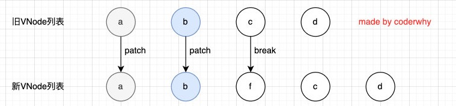

## 列表渲染

在真实开发中，我们往往会从服务器拿到一组数据，并且需要对其进行渲染。

- 这个时候我们可以使用v-for来完成；
- v-for类似于JavaScript的for循环，可以用于遍历一组数据；


## v-for类似于JavaScript的for循环，可以用于遍历一组数据；

v-for的基本格式是 "item in 数组"：

- 数组通常是来自data或者prop，也可以是其他方式；
- item是我们给每项元素起的一个别名，这个别名可以自定来定义；

我们知道，在遍历一个数组的时候会经常需要拿到数组的索引：

- 如果我们需要索引，可以使用格式： "(item, index) in 数组"；
- 注意上面的顺序：数组元素项item是在前面的，索引项index是在后面的；


## v-for支持的类型

v-for也支持遍历对象，并且支持有一二三个参数：

- 一个参数： "value in object";
- 二个参数： "(value, key) in object";
- 三个参数： "(value, key, index) in object";

v-for同时也支持数字的遍历：

- 每一个item都是一个数字；

```html
<!DOCTYPE html>
<html lang="en">

<head>
    <meta charset="UTF-8">
    <meta http-equiv="X-UA-Compatible" content="IE=edge">
    <meta name="viewport" content="width=device-width, initial-scale=1.0">
    <title>Document</title>
</head>

<body>
    <div id="app"></div>
    <template id="my-app">
        <!-- 遍历数组 -->
        <ul>
            <!-- 如果只有一个参数，就是数组的每一项，如果写第二个参数就是索引 -->
            <li v-for="(value, index) in films">{{value}}-{{index}}</li>
        </ul>
        <!-- 遍历对象 -->
        <ul>
            <!-- 如果只有一个参数就是键值，如果有两个参数第二个参数就是键名， 如果有三个参数第三个参数就是索引 -->
            <li v-for="(value, key, index) in message">{{value}}-{{key}}-{{index}}</li>
        </ul>
        <!-- 遍历数字 -->
        <ul>
            <!-- 从1到10渲染，第一个参数是值，第二个参数是索引 -->
            <li v-for="(value, index) in 10">{{value}}-{{index}}</li>
        </ul>
    </template>
    <script src="vue3/vue3.js"></script>
    <script>
        const App = {
            template: '#my-app',
            data: function () {
                return {
                    films: [
                        '星际穿越',
                        '少年派',
                        '盗梦空间',
                        '速度与激情'
                    ],
                    message: {
                        name: 'vue',
                        age: 3,
                        height: 18
                    }
                }
            }
        }
        Vue.createApp(App).mount("#app")
    </script>
</body>

</html>
```


## template元素

类似于v-if，你可以使用 template 元素来循环渲染一段包含多个元素的内容：

- 我们使用template来对多个元素进行包裹，而不是使用div来完成；

```html
<!DOCTYPE html>
<html lang="en">

<head>
    <meta charset="UTF-8">
    <meta http-equiv="X-UA-Compatible" content="IE=edge">
    <meta name="viewport" content="width=device-width, initial-scale=1.0">
    <title>Document</title>
</head>

<body>
    <div id="app"></div>
    <template id="my-app">
        <ul>
            <!-- 一个div是一组数据 -->
            <!-- 这样虽然可以实现，但是我们知道ul里面只能有li -->
            <!-- <div v-for="value in message">
                <li>{{value}}</li>
                <hr />
            </div> -->
            <!-- 我们可以用template，他不会在dom中渲染出来 -->
            <template v-for="value in message">
                <li>{{value}}</li>
                <li class="line"></li>
            </template>
        </ul>
    </template>
    <script src="vue3/vue3.js"></script>
    <script>
        const App = {
            template: '#my-app',
            data: function () {
                return {
                    // 假设有很多这种数据，每一个对象就是一条数据，我们要放在li，怎么放？
                    message: {
                        name: 'vue',
                        age: 18,
                        height: 29
                    }
                }
            }
        }
        Vue.createApp(App).mount("#app")
    </script>
</body>

</html>
```


## 数组更新检测

Vue 将被侦听的数组的变更方法进行了包裹，所以它们也将会触发视图更新。这些被包裹过的方法包括：

- push() 
- pop() 
- shift() 
- unshift() 
- splice() 
- sort() 
- preverse()


替换数组的方法

- 上面的方法会直接修改原来的数组，但是某些方法不会替换原来的数组，而是会生成新的数组，比如 filter()、 concat() 和 slice()。

```html
\!DOCTYPE html><html lang="en">

<head>
    <meta charset="UTF-8">
    <meta http-equiv="X-UA-Compatible" content="IE=edge">
    <meta name="viewport" content="width=device-width, initial-scale=1.0">
    <title>Document</title>
</head>

<body>
    <div id="app"></div>
    <template id="my-app">
        <ul>
            <li v-for="(value, index) in films">{{value}}-{{index}}</li>
        </ul>
        <input type="text" v-model="film">
        <button @click="add">添加</button>
    </template>
    <script src="vue3/vue3.js"></script>
    <script>
        const App = {
            template: '#my-app',
            data: function () {
                return {
                    films: [
                        '星际穿越',
                        '少年派',
                        '盗梦空间',
                        '速度与激情'
                    ],
                    film: ''
                }
            },
            methods: {
                add() {
                    this.films.push(this.film)
                    this.film = ""
                  
                  // 替换数组
                  // this.filems = this.films.filter((item, index) => { return item.length > 2})
                }
            }
        }
        Vue.createApp(App).mount("#app")
    </script>
</body>

</html>
```


## v-for中的key是什么作用？

在使用v-for进行列表渲染时，我们通常会给元素或者组件绑定一个key属性。

这个key属性有什么作用呢？我们先来看一下官方的解释：

- key属性主要用在Vue的虚拟DOM算法，在新旧nodes对比时辨识VNodes； 
- 如果不使用key，Vue会使用一种最大限度减少动态元素并且尽可能的尝试就地修改/复用相同类型元素的算法； 
- 而使用key时，它会基于key的变化重新排列元素顺序，并且会移除/销毁key不存在的元素；

官方的解释对于初学者来说并不好理解，比如下面的问题：

- 什么是新旧nodes，什么是VNode？
- 没有key的时候，如何尝试修改和复用的？
- 有key的时候，如何基于key重新排列的？


## 认识VNode

我们先来解释一下VNode的概念：

- 因为目前我们还没有比较完整的学习组件的概念，所以目前我们先理解HTML元素创建出来的VNode； 
- VNode的全称是Virtual Node，也就是虚拟节点； 
- 事实上，无论是组件还是元素，它们最终在Vue中表示出来的都是一个个VNode； 
- VNode的本质是一个JavaScript的对象；

这个是模板，是我们在template中写的html代码


这个就是把模版中的html代码转成虚拟dom（它就是一个JavaScript对象）


实际上vue会把我们写的template中的模板转成VNode，再转成真实dom，真实dom就是现实到页面


虚拟dom最大的好处是可以跨平台，服务端渲染等

当然，性能也会高一点


## 虚拟DOM

如果我们不只是一个简单的div，而是有一大堆的元素，那么它们应该会形成一个VNode Tree：


VNode不一定和真实DOM一一对应


## 插入F的案例

我们先来看一个案例：这个案例是当我点击按钮时会在中间插入一个f；


我们可以确定的是，这次更新对于ul和button是不需要进行更新，需要更新的是我们li的列表： 

- 在Vue中，对于相同父元素的子元素节点并不会重新渲染整个列表； 
- 因为对于列表中 a、b、c、d它们都是没有变化的； 
- 在操作真实DOM的时候，我们只需要在中间插入一个f的li即可； 

那么，diff算法到底是什么呢？

- 1.拿到老的VNodes
- 2.拿到新的VNodes
- 3.对比新的和老的VNodes
- 4.拿到对比后不同的内容，例如，新的多了一个f,那么就拿到f
- 5.将拿到的f插入到Nodes中

这个过程就是diff算法做的


那么Vue中对于列表的更新究竟是如何操作的呢？ 

- Vue事实上会对于有key和没有key会调用两个不同的方法； 

- 有key，那么就使用 patchKeyedChildren方法； 

- 没有key，那么久使用 patchUnkeyedChildren方法


## Vue源码对于key的判断


这里修改的应该是老的VNode

没有key的操作（源码）


## 没有key的过程如下

我们会发现上面的diff算法效率并不高：

- c和d来说它们事实上并不需要有任何的改动；
- 但是因为我们的c被f所使用了，所有后续所有的内容都要一次进行改动，并且最后进行新增；


## 有key执行操作（源码）


用新的vnode和旧的vnode进行对比，使用长度最小的进行遍历


- 把新的a和旧的a进行一个patch，也就是进行一个更新
- 如果他们的类型(div这样的元素类型)一样，属性一样，子元素也都一样，那么就不需要更新
- b也一样，所以他们更新的效率是比较高的，这样a和b旧更新完了
- 但是到c以后，发现c对应的是f，他们（类型、属性或者子元素）不一样，那么就把c更新为f，到d也是一样，被更新为c
- 循环走完（这里旧的vnode长度更短，遍历的是旧的vnode）
- 但是新的vnode还有一个d，那么直接创建一个d加入到新的vnode列表中


## 有key的diff算法如下（一）

### 从头部开始遍历

第一步的操作是从头开始进行遍历、比较：

- a和b是一致的会继续进行比较；
- c和f因为key不一致，所以就会break跳出循环；




这里用的是while循环进行比较


### 从尾部开始遍历

第二步的操作是从尾部开始进行遍历、比较：

​	


### 处理多余的节点

第三步是如果旧节点遍历完毕，但是依然有新的节点，那么就新增节点插入到新的VNode中去：


这里的f就是剩下需要处理的，需要做挂载操作


第四步是如果新的节点遍历完毕，但是依然有旧的节点，那么就移除旧节点：


第五步是最特殊的情况，中间还有很多未知的或者乱序的节点：


所以我们可以发现，Vue在进行diff算法的时候，会尽量利用我们的key来进行优化操作： 

- 在没有key的时候我们的效率是非常低效的； 
- 在进行插入或者重置顺序的时候，保持相同的key可以让diff算法更加的高效；
- 有key的时候会利用key来复用oldVNode, 然后调整顺序，这样来达到性能的最大优化

