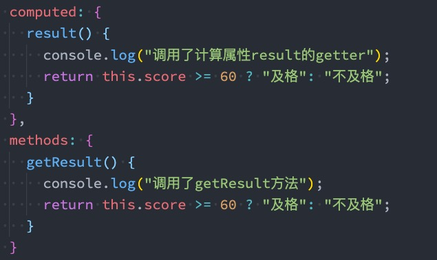
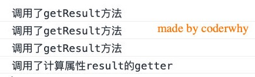
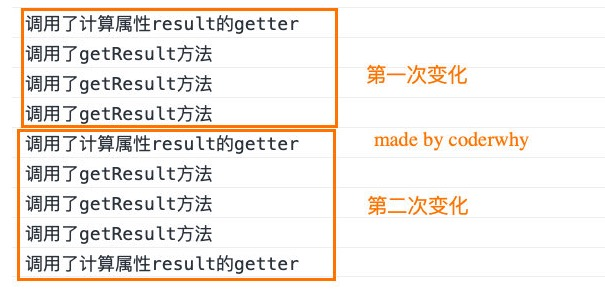
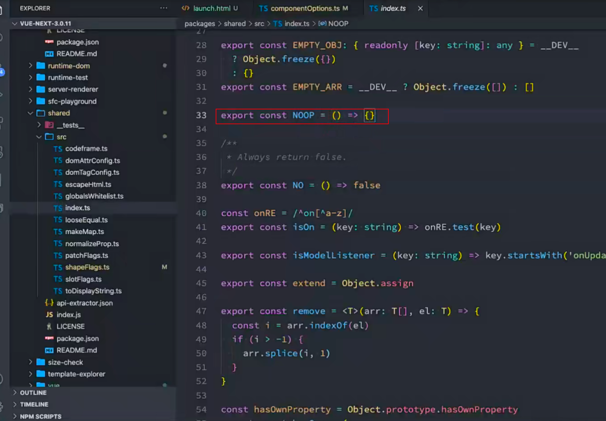
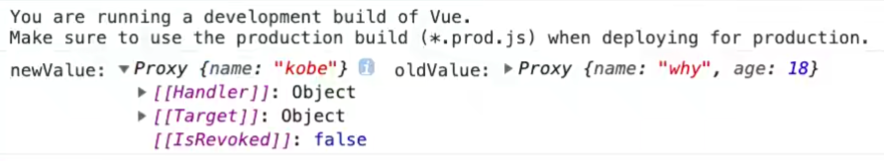
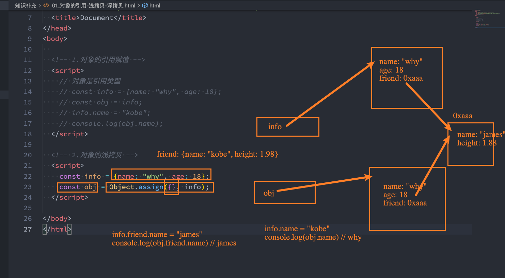

## 复杂data的处理方式

我们知道，在模板中可以直接通过插值语法显示一些data中的数据。

但是在某些情况，我们可能需要对数据进行一些转化后再显示，或者需要将多个数据结合起来进行显示；

- 比如我们需要对多个data数据进行运算、三元运算符来决定结果、数据进行某种转化后显示；
- 在模板中使用表达式，可以非常方便的实现，但是设计它们的初衷是用于简单的运算；
- 在模板中放入太多的逻辑会让模板过重和难以维护；
- 并且如果多个地方都使用到，那么会有大量重复的代码；

并且如果多个地方都使用到，那么会有大量重复的代码；

- 可以，其中一种方式就是将逻辑抽取到一个method中，放到methods的options中；
- 但是，这种做法有一个直观的弊端，就是所有的data使用过程都会变成了一个方法的调用；
- 另外一种方式就是使用计算属性computed；


## 认识计算属性computed

什么是计算属性呢？

- 官方并没有给出直接的概念解释；
- 而是说：对于任何包含响应式数据的复杂逻辑，你都应该使用计算属性；
- 计算属性将被混入到组件实例中。所有 getter 和 setter 的 this 上下文自动地绑定为组件实例；

计算属性的用法：

- 选项：computed
- 类型：{ [key: string]: Function | { get: Function, set: Function } }

那接下来我们通过案例来理解一下这个计算属性。


## 案例实现思路

我们来看三个案例：

案例一：我们有两个变量：firstName和lastName，希望它们拼接之后在界面上显示；

案例二：我们有一个分数：score

- 当score大于60的时候，在界面上显示及格；
- 当score小于60的时候，在界面上显示不及格；

案例三：我们有一个变量message，记录一段文字：比如Hello World

- 某些情况下我们是直接显示这段文字； 
- 某些情况下我们需要对这段文字进行反转；

我们可以有三种实现思路：

思路一：在模板语法中直接使用表达式；

思路二：使用method对逻辑进行抽取；

思路三：使用计算属性computed；


## 实现思路一：模板语法

思路一的实现：模板语法

- 缺点一：模板中存在大量的复杂逻辑，不便于维护（模板中表达式的初衷是用于简单的计算）；
- 缺点二：当有多次一样的逻辑时，存在重复的代码；
- 缺点三：多次使用的时候，很多运算也需要多次执行，没有缓存；

```html
<!DOCTYPE html>
<html lang="en">

<head>
    <meta charset="UTF-8">
    <meta http-equiv="X-UA-Compatible" content="IE=edge">
    <meta name="viewport" content="width=device-width, initial-scale=1.0">
    <title>Document</title>
</head>

<body>
    <div id="app"></div>
    <template id="my-app">
      	<!-- 写多次效率比较低，没有缓存 -->
        <h2>{{firstName + '' + lastName}}</h2>
        <h2>{{firstName + '' + lastName}}</h2>
        <h2>{{firstName + '' + lastName}}</h2>
        
        <h2>{{score > 80 ? '优秀' : '良好'}}</h2>
        <h2>{{message.split(' ').reverse().join(' ')}}</h2>
    </template>
    <script src="vue3/vue3.js"></script>
    <script>
        const App = {
            template: '#my-app',
            data: function () {
                return {
                    firstName: 'Kobe',
                    lastName: 'Bryant',
                    score: 80,
                    message: "Hello world"
                }
            }
        }
        Vue.createApp(App).mount("#app")
    </script>
</body>

</html>
```

这种方案不好，mustach语法只是写一些简单的表达式，不方便维护


## 实现思路二：method实现

实现思路二：method实现

- 缺点一：我们事实上先显示的是一个结果，但是都变成了一种方法的调用；
- 缺点二：多次使用方法的时候，没有缓存，也需要多次计算；

```html
<!DOCTYPE html>
<html lang="en">

<head>
    <meta charset="UTF-8">
    <meta http-equiv="X-UA-Compatible" content="IE=edge">
    <meta name="viewport" content="width=device-width, initial-scale=1.0">
    <title>Document</title>
</head>

<body>
    <div id="app"></div>
    <template id="my-app">
        <!-- 多次调用效率低，方法会执行多次，而且显示不直观 -->
        <h2>{{getFullName()}}</h2>
        <h2>{{getFullName()}}</h2>
        <h2>{{getFullName()}}</h2>
        <h2>{{getFullName()}}</h2>
        <h2>{{getFullName()}}</h2>
        <h2>{{getResult()}}</h2>
        <h2>{{getReverseMessage()}}</h2>
    </template>
    <script src="vue3/vue3.js"></script>
    <script>
        const App = {
            template: '#my-app',
            data: function () {
                return {
                    firstName: 'Kobe',
                    lastName: 'Bryant',
                    score: 80,
                    message: "Hello world"
                }
            },
            methods: {
                getFullName() {
                    return this.firstName + ' ' + this.lastName
                },
                getResult() {
                    return this.score > 80 ? '优秀' : '良好'
                },
                getReverseMessage() {
                    return this.message.split(' ').reverse().join(' ');
                }
            }
        }
        Vue.createApp(App).mount("#app")
    </script>
</body>

</html>
```


## 思路三的实现：computed实现

思路三的实现：computed实现

- 注意：计算属性看起来像是一个函数，但是我们在使用的时候不需要加()，这个后面讲setter和getter时会讲到；
- 我们会发现无论是直观上，还是效果上计算属性都是更好的选择；
- 并且计算属性是有缓存的；

```html
<!DOCTYPE html>
<html lang="en">

<head>
    <meta charset="UTF-8">
    <meta http-equiv="X-UA-Compatible" content="IE=edge">
    <meta name="viewport" content="width=device-width, initial-scale=1.0">
    <title>Document</title>
</head>

<body>
    <div id="app"></div>
    <template id="my-app">
        <h2>{{fullName}}</h2>
        <h2>{{result}}</h2>
        <h2>{{reverse}}</h2>
    </template>
    <script src="vue3/vue3.js"></script>
    <script>
        const App = {
            template: '#my-app',
            data: function () {
                return {
                    firstName: 'Kobe',
                    lastName: 'Bryant',
                    score: 80,
                    message: "Hello world"
                }
            },
            methods: {
                getFullName() {
                    return this.firstName + ' ' + this.lastName
                },
                getResult() {
                    return this.score > 80 ? '优秀' : '良好'
                },
                getReverseMessage() {
                    return this.message.split(' ').reverse().join(' ');
                }
            },
            computed: {
                // 定义一个计算属性fullName
                fullName() {
                    // 这里的this绑定的是组件实例
                    return this.firstName + ' ' + this.lastName;
                },
                result() {
                    return this.score > 80 ? '优秀' : '良好'
                },
                reverse() {
                    return this.message.split(' ').reverse().join(' ');
                }
            }
        }
        Vue.createApp(App).mount("#app")
    </script>
</body>

</html>
```


## 计算属性 vs methods

在上面的实现思路中，我们会发现计算属性和methods的实现看起来是差别是不大的，而且我们多次提到计算属 性有缓存的。

接下来我们来看一下同一个计算多次使用，计算属性和methods的差异：


 




## 计算属性的缓存

计算属性的缓存

- 这是因为计算属性会基于它们的依赖关系进行缓存；
- 在数据不发生变化时，计算属性是不需要重新计算的；
- 但是如果依赖的数据发生变化，在使用时，计算属性依然会重新进行计算；



计算属性只执行了一次，methods执行了多次

```html
<!DOCTYPE html>
<html lang="en">

<head>
    <meta charset="UTF-8">
    <meta http-equiv="X-UA-Compatible" content="IE=edge">
    <meta name="viewport" content="width=device-width, initial-scale=1.0">
    <title>Document</title>
</head>

<body>
    <div id="app"></div>
    <template id="my-app">
      <!-- 计算属性调用了三次 -->
        <h2>{{fullName}}</h2>
        <h2>{{fullName}}</h2>
        <h2>{{fullName}}</h2>
      
      <!-- methods调用了三次 -->
        <h2>{{getFullName()}}</h2>
        <h2>{{getFullName()}}</h2>
        <h2>{{getFullName()}}</h2>
        <button @click="change">change</button>
    </template>
    <script src="vue3/vue3.js"></script>
    <script>
        const App = {
            template: '#my-app',
            data: function () {
                return {
                    firstName: 'Kobe',
                    lastName: 'Bryant'
                }
            },
            methods: {
                getFullName() {
                    console.log('methods的log')
                    return this.firstName + ' ' + this.lastName
                },
                // 在修改的时候，也就是计算属性和methods的依赖发生改变的时候，他们就会从新计算，但是计算属性还是只执行一次。
                change() {
                    this.firstName = 'coder'
                }
            },
            computed: {
                // 定义一个计算属性fullName
                // 如果获得一个新的值，会把新的值继续缓存下来。
                fullName() {
                    // 这里的this绑定的是组件实例
                    console.log('计算属性的log')
                    return this.firstName + ' ' + this.lastName;
                }
            }
        }
        Vue.createApp(App).mount("#app")
    </script>
</body>

</html>
```

如果计算属性函数的依赖发生了改变，那么计算属性函数会重新执行一次，methods函数也会执行(调用了多少次就执行多少次)


## 计算属性的setter和getter

计算属性在大多数情况下，只需要一个getter方法即可，所以我们会将计算属性直接写成一个函数。

但是，如果我们确实想设置计算属性的值呢？

- 这个时候我们也可以给计算属性设置一个setter的方法；

```html
<!DOCTYPE html>
<html lang="en">

<head>
    <meta charset="UTF-8">
    <meta http-equiv="X-UA-Compatible" content="IE=edge">
    <meta name="viewport" content="width=device-width, initial-scale=1.0">
    <title>Document</title>
</head>

<body>
    <div id="app"></div>
    <template id="my-app">
        <h2>{{fullName}}</h2>
        <button @click="change">修改fullName</button>
    </template>
    <script src="vue3/vue3.js"></script>
    <script>
        const App = {
            template: '#my-app',
            data: function () {
                return {
                    firstName: 'Kobe',
                    lastName: 'Bryant'
                }
            },
            computed: {
                // 计算属性的getter方法
                // fullName: function() {
                //     // 这里的this绑定的是组件实例
                //     console.log('计算属性的log')
                //     return this.firstName + ' ' + this.lastName;
                // }

                // fullName的setter和getter
                fullName: {
                    get: function () {
                        return this.firstName + ' ' + this.lastName
                    },
                    set: function(newValue) {
                        console.log(newValue)
                        const names = newValue.split(' ')
                        this.firstName = names[0];
                        this.lastName = names[1]
                    }
                }
            },
            methods: {
                change() {
                    this.fullName = 'coder why'
                }
            }
        }
        Vue.createApp(App).mount("#app")
    </script>
</body>

</html>
```


## 源码如何对setter和getter处理呢？

你可能觉得很奇怪，Vue内部是如何对我们传入的是一个getter，还是说是一个包含setter和getter的对象进行处 理的呢？

- 事实上非常的简单，Vue源码内部只是做了一个逻辑判断而已；


在这里遍历所有的key

如果是函数，说明是getter的语法糖，就把他取下来，进行一个bind绑定

如果不是函数，说明是一个对象，就取get

如果什么都没有就是一个 NOOP,它是一个空函数




## 认识侦听器watch

什么是侦听器呢？

- 开发中我们在data返回的对象中定义了数据，这个数据通过插值语法等方式绑定到template中；
- 当数据变化时，template会自动进行更新来显示最新的数据；
- 但是在某些情况下，我们希望在代码逻辑中监听某个数据的变化，这个时候就需要用侦听器watch来完成了；


侦听器的用法如下：

- 选项：watch
- 类型：{ [key: string]: string | Function | Object | Array}


## 侦听器案例

举个栗子（例子）：

- 比如现在我们希望用户在input中输入一个问题；
- 每当用户输入了最新的内容，我们就获取到最新的内容，并且使用该问题去服务器查询答案；
- 那么，我们就需要实时的去获取最新的数据变化；

```html
<!DOCTYPE html>
<html lang="en">

<head>
    <meta charset="UTF-8">
    <meta http-equiv="X-UA-Compatible" content="IE=edge">
    <meta name="viewport" content="width=device-width, initial-scale=1.0">
    <title>Document</title>
</head>

<body>
    <div id="app"></div>
    <template id="my-app">
      <!--	请输入 -->
        <input type="text" v-model="message">
        <h2>{{showMessage}}</h2>
    </template>
    <script src="vue3/vue3.js"></script>
    <script>
        const App = {
            template: '#my-app',
            data: function () {
                return {
                    // 侦听message的变化，进行一些javascript逻辑的处理
                    message: "hello world",
                    showMessage: ''
                }
            },
            watch: {
                // message侦听data中message得变化
                // newValue是侦听后的变化
                // oldValue是侦听前的变化
                message(newValue, oldValue) {
                    console.log('变化前', newValue, '变化后', oldValue)
                    this.showMessage = this.message
                    // 可以在这里调用函数
                    this.question()
                }
            },
            methods: {
                question(){
                    console.log('开始请求~')
                }
            }
        }
        Vue.createApp(App).mount("#app")
    </script>
</body>

</html>
```


## 侦听器watch的配置选项

我们先来看一个例子：

- 当我们点击按钮的时候会修改info.name的值；
- 这个时候我们使用watch来侦听info，可以侦听到吗？答案是不可以。

这是因为默认情况下，watch只是在侦听info的引用变化，对于内部属性的变化是不会做出响应的：

- 这个时候我们可以使用一个选项deep进行更深层的侦听；
- 注意前面我们说过watch里面侦听的属性对应的也可以是一个Object；

还有另外一个属性，是希望一开始的就会立即执行一次：

- 这个时候我们使用immediate选项；
- 这个时候无论后面数据是否有变化，侦听的函数都会有限执行一次；


侦听器的打印，vue是把data中的数据交给了proxy管理，所以这里打印的是一个proxy对象



侦听器的基本使用：

```html
<!DOCTYPE html>
<html lang="en">

<head>
    <meta charset="UTF-8">
    <meta http-equiv="X-UA-Compatible" content="IE=edge">
    <meta name="viewport" content="width=device-width, initial-scale=1.0">
    <title>Document</title>
</head>

<body>
    <div id="app"></div>
    <template id="my-app">
        <h2>{{info.name}}</h2>
        <button @click="changeInfo">changeInfo</button>
        <button @click="changeInfoName">changeInfoName</button>
        <button @click="changeInfoLike">changeInfoLike</button>
    </template>
    <script src="vue3/vue3.js"></script>
    <script>
        const App = {
            template: '#my-app',
            data: function () {
                return {
                    // info加入到响应式系统，如果发生改变，页面就会发生改变
                    // {name: "why", age: 18}会加入到响应式系统中，如果发生改变，页面就会发生改变。
                    // info: {name: "why", age: 18}
                    info: {name: 'why', age: 18, like: {like: 'basketball'}}
                }
            },
            watch: {
                // 默认情况下，侦听器只会侦听数据本身的改变，也就是info整个发生改变，才能侦听到
                // info: function (newInfo, oldInfo) {
                //     console.log('新的', newInfo, '旧的', oldInfo)
                // }

                // 如果info内部发生改变，侦听器是侦听不到的，那么如何做呢？--深度侦听
                // info: {
                //     handler(newValue, oldValue) {
                //         console.log('新的', newValue, '旧的', oldValue)
                //     },
                //     // 深度监听，就算info里面的内容发生改变，也可以侦听到。
                //     deep: true
                // }
                // 如果更加深度,也可以监听到
                info: {
                    handler(newValue, oldValue) {
                        console.log('新的', newValue, '旧的', oldValue)
                    },
                    deep: true,
                    // 立即执行,页面一加载就开始执行，如果不加这个，页面初次加载是不会执行监听器里面的函数的
                    immediate: true
                }
            },
            methods: {
                // 该整个info对象
                changeInfo() {
                    this.info = {name: 'Kobe'}
                    console.log('点击改变', this.info)
                },
                // 改info对象中的一个属性。
                changeInfoName() {
                    this.info.name = "Kobe"
                },
                // 更加深度,对象里面还有对象
                changeInfoLike() {
                    this.info.like.like = "footBall"
                }
            }
        }
        Vue.createApp(App).mount("#app")
    </script>
</body>

</html>
```


写法一：

这个someMethod是我在methods中定义的一个方法

```html
<!DOCTYPE html>
<html lang="en">

<head>
    <meta charset="UTF-8">
    <meta http-equiv="X-UA-Compatible" content="IE=edge">
    <meta name="viewport" content="width=device-width, initial-scale=1.0">
    <title>Document</title>
</head>

<body>
    <div id="app"></div>
    <template id="my-app">
        <h2>{{message}}</h2>
        <button @click="changeMessage">改变</button>
    </template>
    <script src="vue3/vue3.js"></script>
    <script>
        const App = {
            template: '#my-app',
            data: function () {
                return {
                    message: "hello world"
                }
            },
            watch: {
                // 跟一个字符串，这个字符串时methods中的一个方法，如果message发生了改变，那么就执行这个方法
                message: 'someMethods'
            },
            methods: {
                changeMessage() {
                    this.message = '改变了message'
                },
                someMethods() {
                    console.log('这里打印，说明监听到了message发生了改变')
                }
            }
        }
        Vue.createApp(App).mount("#app")
    </script>
</body>

</html>
```


写法二：

```html
<!DOCTYPE html>
<html lang="en">

<head>
    <meta charset="UTF-8">
    <meta http-equiv="X-UA-Compatible" content="IE=edge">
    <meta name="viewport" content="width=device-width, initial-scale=1.0">
    <title>Document</title>
</head>

<body>
    <div id="app"></div>
    <template id="my-app">
        <h2>{{message}}</h2>
        <button @click="changeMessage">改变</button>
    </template>
    <script src="vue3/vue3.js"></script>
    <script>
        const App = {
            template: '#my-app',
            data: function () {
                return {
                    message: "hello world"
                }
            },
            watch: {
                // 这里后面跟一个数组，如果message发生改变，那么下面三个函数都会被调用
                message: [
                    'someMethods',
                    function () {
                        console.log('message改变，我也会改变2')
                    },
                    'someMethods2'
                ]
            },
            methods: {
                changeMessage() {
                    this.message = '改变了message'
                },
                someMethods() {
                    console.log('这里打印，说明监听到了message发生了改变')
                },
                someMethods2() {
                    console.log('message改变，我也会改变3')
                }
            }
        }
        Vue.createApp(App).mount("#app")
    </script>
</body>

</html>
```


写法三：

另外一个是Vue3文档中没有提到的，但是Vue2文档中有提到的是侦听对象的属性：

```html
<!DOCTYPE html>
<html lang="en"><!DOCTYPE html>
<html lang="en">

<head>
    <meta charset="UTF-8">
    <meta http-equiv="X-UA-Compatible" content="IE=edge">
    <meta name="viewport" content="width=device-width, initial-scale=1.0">
    <title>Document</title>
</head>

<body>
    <div id="app"></div>
    <template id="my-app">
        <button @click="changeData">改变数据</button>
        <h2>{{friends[0].name}}</h2>
        <button @click="changeFriends">friends[0].name</button>
    </template>
    <script src="vue3/vue3.js"></script>
    <script>
        const App = {
            template: '#my-app',
            data: function () {
                return {
                    info: { name: "why", age: 18 },
                    friends: [{ name: 'why' }, { name: 'Kobe' }]
                }
            },
            watch: {
                // 这里只监听info和name的改变，如果age发生改变是侦听不到的
                'info.name': function (newValue, oldValue) {
                    console.log('新的', newValue, '老的', oldValue)
                },
                friends: {
                    handler(newValue, oldValue) {
                        // 这两个值是一样的，都是李雷雷，因为vue没有用深拷贝。
                        console.log(newValue, oldValue)
                    },
                    deep: true
                },
              
                // 这样写是侦听不到的
                'friends[0].name': function (newValue, oldValue) {
                    // console.log('新的', newValue, '老的', oldValue)
                },
                //如果想监听这个对他做一个深度监听，两种方式
              	// 方案一：
                friends:{
                 	handler() {

                 	},
                 	deep: true
                }
              	// 方案二：
              	// 在遍历数组的时候，写一个组件，把数组的item传入到组件中，然后在这个组件中监听props传入的值
            },
            methods: {
                changeData() {
                    // name发生改变，可以监听到
                    this.info.name = 'Kobe'
                    // age发生改变是监听不到的
                    this.info.age = 12
                },
                changeFriends() {
                    console.log(123)
                    this.friends[0].name = '李雷雷'
                },
            }
        }
        Vue.createApp(App).mount("#app")
    </script>
</body>

</html>
```


还有另外一种方式就是使用 $watch 的API：

我们可以在created的生命周期（后续会讲到）中，使用 this.$watchs 来侦听；

- 第一个参数是要侦听的源；
- 第二个参数是侦听的回调函数callback；
- 第三个参数是额外的其他选项，比如deep、immediate；

```html
<!DOCTYPE html>
<html lang="en">

<head>
    <meta charset="UTF-8">
    <meta http-equiv="X-UA-Compatible" content="IE=edge">
    <meta name="viewport" content="width=device-width, initial-scale=1.0">
    <title>Document</title>
</head>

<body>
    <div id="app"></div>
    <template id="my-app">
        <button @click="handle">修改</button>
    </template>
    <script src="vue3/vue3.js"></script>
    <script>
        const App = {
            template: '#my-app',
            data: function () {
                return {
                    info: {name: 'why', age: 18}
                }
            },
            created() {
                // 注意，这里可以写箭头函数，他会找到上面这个函数的this,也就是created这个函数
                // 第一个参数是需要监听的data，第二个参数是监听到的改变函数，第三个参数是配置
                // 它返回一个值，这个值是一个函数，如果调用这个函数，就可以取消这个侦听器
                const unWatch = this.$watch("info", (newValue, oldValue) => {
                    console.log('新的', newValue, '旧的', oldValue)
                }, {
                    deep: true,
                    immediate: true
                })
            },
            // 如果调用这个这个函数可以取消侦听器
            // unWatch()
            methods: {
                handle() {
                    this.info = {name: '李雷雷'}
                }
            }
        }
        Vue.createApp(App).mount("#app")
    </script>
</body>

</html>
```


## 综合案例

现在我们来做一个相对综合一点的练习：书籍购物车


案例说明：

- 1.在界面上以表格的形式，显示一些书籍的数据；
- 2.在底部显示书籍的总价格；
- 3.点击+或者-可以增加或减少书籍数量（如果为1，那么不能继续-）；
- 4.点击移除按钮，可以将书籍移除（当所有的书籍移除完毕时，显示：购物车为空~）；

html

```html
<!DOCTYPE html>
<html lang="en">

<head>
    <meta charset="UTF-8">
    <meta http-equiv="X-UA-Compatible" content="IE=edge">
    <meta name="viewport" content="width=device-width, initial-scale=1.0">
    <title>Document</title>
    <Link rel="stylesheet" href="style.css"></Link>
</head>

<body>
    <div id="app"></div>
    <template id="my-app">
        <template v-if="this.books.length">
            <table>
                <thead>
                    <th></th>
                    <th>书籍名称</th>
                    <th>出版日期</th>
                    <th>价格</th>
                    <th>购买数量</th>
                    <th>操作</th>
                </thead>
                <tbody>
                    <tr v-for="(book, index) in filterBooks">
                        <td>{{index + 1}}</td>
                        <td>{{book.name}}</td>
                        <td>{{book.date}}</td>
                        <td>{{formatPrice(book.price)}}</td>
                        <td>
                            <button @click="decrement(index, $event)" :disabled="book.count <= 1">-</button>
                            <span class='counter'>{{book.count}}</span>
                            <!-- 这里可以传$event，还可以传index -->
                            <button @click="increment(index, $event)">+</button>
                        </td>
                        <td>
                            <button @click="removeBook">移除</button>
                        </td>
                    </tr>
                </tbody>
            </table>
            <!-- 如果想价格$ ￥  在vue2可以用过滤器（|），但是vue3没有了 -->
            <!-- vue3推荐两种方法：使用计算属性/使用全局方法 -->
            <h2>总价格：{{formatPrice(totalPrice)}}</h2>
        </template>
        <template v-else>
            <h2>当前购物车无数据</h2>
        </template>
    </template>

    <script src="vue3/vue3.js"></script>
    <!-- 把所有的js放到这里 -->
    <script src="./index.js"></script>
</body>

</html>
```


css

```css
table {
    border: 1px solid #e9e9e9;
    border-collapse: collapse;
    border-spacing: 0;
  }
  
  th, td {
    padding: 8px 16px;
    border: 1px solid #e9e9e9;
    text-align: left;
  }
  
  th {
    background-color: #f7f7f7;
    color: #5c6b77;
    font-weight: 600;
  }
  
  .counter {
    margin: 0 5px;
  }
  
```


index.js

```js
Vue.createApp({
  template: "#my-app",
  data() {
    return {
      books: [
        {
          name: "《算法导论》",
          time: "2006-9",
          price: "85",
          count: 1,
        },
        {
          name: "《unix编程艺术》",
          time: "2006-2",
          price: "59",
          count: 1,
        },
        {
          name: "《编程珠玑》",
          time: "2008-10",
          price: "39",
          count: 1,
        },
        {
          name: "《编程大全》",
          time: "2006-3",
          price: "120",
          count: 1,
        },
      ],
    };
  },
  methods: {
    increment(index, event) {
      // 通过索引值
      console.log(index, event);
      this.books[index].count++;
    },
    decrement(index, event) {
      this.books[index].count--;
    },
    removeBook(index) {
      this.books.splice(index, 1);
    },
    // 方案三：这种方式比较好
    formatPrice(price) {
      return "￥" + price;
    },
  },
  computed: {
    totalPrice() {
      let allPrice = 0;
      this.books.map((value, index) => {
        allPrice += value.count * value.price;
        //  方案一：在这里改
        // allPrice += value.count * parseInt(value.price.slice(1))
      });
      // return '￥' + allPrice
      return allPrice;
    },
    
    // 使用计算属性
    filterBooks() {
      return this.books.map((value, index) => {
        // 方案二：在这里的value放到一个新的对象里面，返回的是这个新的对象，不会影响this.books里面的数据,如果这里改了的话，计算总价的话就需要对price的数据进行操作
        const newValue = Object.assign({}, value);
        // newValue.price = '￥' + newValue.price
        return newValue;
      });
    },
  },
}).mount("#app");

```

vue3不支持过滤器了，推荐两种做法：

1、使用计算属性

​	例如上面的filterBooks这个计算属性，把数据转化完以后，在template中使用filterBooks这个计算属性

2、使用全局的方法

​	把一些通用的方法定义到app.config.globalProperties中


## 浅拷贝




## 深拷贝

方式一: JSON.parse(JSON.stringify())；

方式二：lodash

```javascript
// 引入lodash
const info = {name: 'why', friend: {name: 'kobe'}};
const obj = _.cloneDeep(info);	//这个obj就是深拷贝后的对象
```

