## v-model的基本使用

表单提交是开发中非常常见的功能，也是和用户交互的重要手段：

- 比如用户在登录、注册时需要提交账号密码；
- 比如用户在检索、创建、更新信息时，需要提交一些数据；

这些都要求我们可以在代码逻辑中获取到用户提交的数据，我们通常会使用v-model指令来完成：

- v-model指令可以在表单 input、textarea以及select元素上创建双向数据绑定；
- 它会根据控件类型自动选取正确的方法来更新元素；
- 尽管有些神奇，但 v-model 本质上不过是语法糖，它负责监听用户的输入事件来更新数据，并在某种极端场景 下进行一些特殊处理；

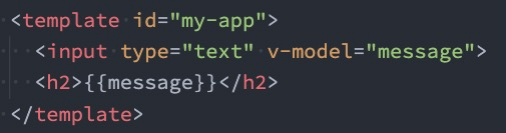


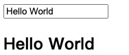


```html
<!DOCTYPE html>
<html lang="en">

<head>
    <meta charset="UTF-8">
    <meta http-equiv="X-UA-Compatible" content="IE=edge">
    <meta name="viewport" content="width=device-width, initial-scale=1.0">
    <title>Document</title>
</head>

<body>
    <div id="app"></div>
    <template id="my-app">
        <!-- 1、v-bind value的绑定 -->
        <!-- 2、监听input事件， 更新message的值 -->
        <!-- 本质就是上面两个操作的语法糖 -->
        <input type="text" :value="message" @input="inputChange">
        <h2>{{message}}</h2>
    </template>
    <script src="vue3/vue3.js"></script>
    <script>
        const App = {
            template: '#my-app',
            data: function () {
                return {
                    message: "hello world"
                }
            },
            methods: {
                inputChange(event) {
                    this.message = event.target.value
                }
            }
        }
        Vue.createApp(App).mount("#app")
    </script>
</body>

</html>
```


## v-model的原理

官方有说到，v-model的原理其实是背后有两个操作：

- v-bind绑定value属性的值；
- v-on绑定input事件监听到函数中，函数会获取最新的值赋值到绑定的属性中；

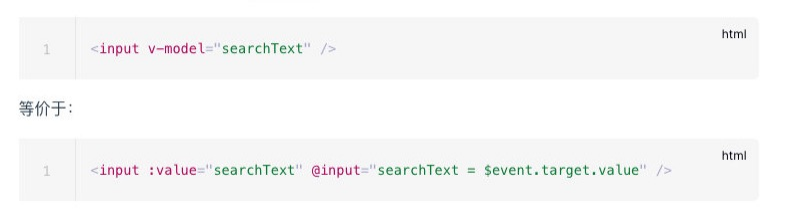


## 事实上v-model更加复杂


1.v-model在编译后会生成黄色的这部分代码，会执行一个指令叫做_vModelText

2.这个vModelText的函数定义在vModel文件中

3.这个指令的create函数执行的时候会给el绑定一个事件，这个el就是我们用到的input标签

4.绑定这个函数会执行一个方法，这个方法实际上来源于getModelAssigner这个函数

5.这个函数中拿到一个函数，这个函数就是@input时的函数，其实就是一个赋值

6.会执行这个函数


## v-model绑定textarea

```html
<!DOCTYPE html>
<html lang="en">

<head>
    <meta charset="UTF-8">
    <meta http-equiv="X-UA-Compatible" content="IE=edge">
    <meta name="viewport" content="width=device-width, initial-scale=1.0">
    <title>Document</title>
</head>

<body>
    <div id="app"></div>
    <template id="my-app">


        <!-- 1、绑定textarea -->
        <label for="intro">
            <textarea name="intro" id="intro" cols="30" rows="10" v-model="message"></textarea>
        </label>
        <!-- 可以实时拿到这个值 -->
        <h2>intro: {{message}}</h2>


        <!-- 2、绑定checkbox -->
        <!-- 2.1、单选框 -->
        <label for="agree">
            <input type="checkbox" id="agree" v-model="isAgree">同意协议
            <!-- 实时显示 -->
            <h2>isAgree: {{isAgree}}</h2>
        </label>
        <!-- 2.2 多选框 -->
        <span>你的爱好是</span>
        <!-- 这里的hobbies是一个数组，绑定到所有的checkbox里面的，如果想要他生效必须要给他一个value -->
        <label for="backetball">
            <input type="checkbox" id="backetball" v-model="hobbies" value="backetball"> 篮球
        </label>
        <label for="football">
            <input type="checkbox" id="football" v-model="hobbies" value="football"> 足球
        </label>
        <label for="tennis">
            <input type="checkbox" id="tennis" v-model="hobbies" value="tennis"> 网球
        </label>
        <h2>hobbies: {{hobbies}}</h2>

        <!-- 3、radio -->
        <!-- 如果你的type是radio,并且v-model绑定的是一个状态，那么他们是互斥的 -->
        <span>你的性别是：</span>
        <label for="male">
            <input id="male" type="radio" v-model="gender" value="男">男
        </label>
        <label for="female">
            <input id="female" type="radio" v-model="gender" value="女">女
        </label>
        <span>gender: {{gender}}</span>
        <hr />

        <!-- 4、select -->
        <span>喜欢的水果是：</span>
        <!-- multiple 多选 -->
        <select name="" id="" v-model="fruit" multiple size="2">
            <option value="apple">苹果</option>
            <option value="orange">橘子</option>
            <option value="banana">香蕉</option>
        </select>
        <h2>fruit:{{fruit}}</h2>
    </template>
    <script src="vue3/vue3.js"></script>
    <script>
        const App = {
            template: '#my-app',
            data: function () {
                return {
                    message: "hello world",
                    isAgree: false,
                    hobbies: [],
                    gender: "女",	//默认值
                    fruit: "apple"
                }
            }
        }
        Vue.createApp(App).mount("#app")
    </script>
</body>

</html>
```


我们再来绑定一下其他的表单类型：textarea、checkbox、radio、select

我们来看一下绑定textarea：

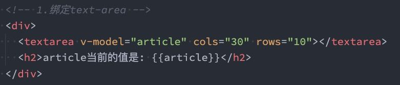


## v-model绑定checkbox

我们来看一下v-model绑定checkbox：单个勾选框和多个勾选框

单个勾选框：

- v-model即为布尔值。
- 此时input的value并不影响v-model的值。

多个复选框：

- 当是多个复选框时，因为可以选中多个，所以对应的data中属性是一个数组。
- 当选中某一个时，就会将input的value添加到数组中。

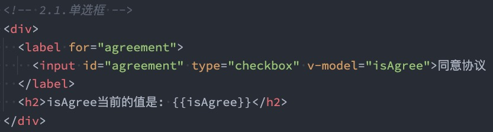

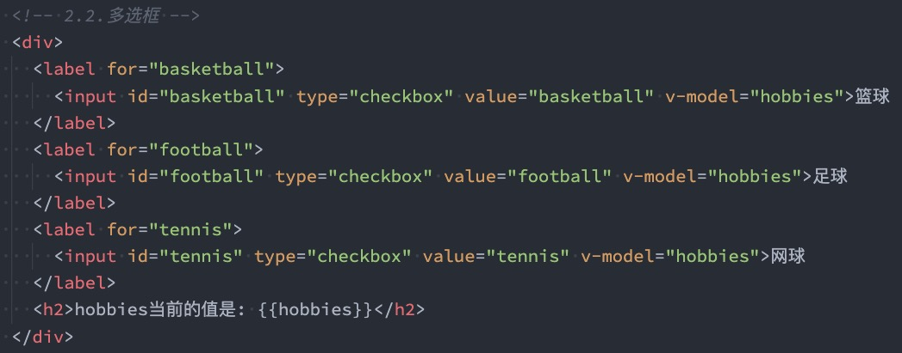


## v-model绑定radio

v-model绑定radio，用于选择其中一项；

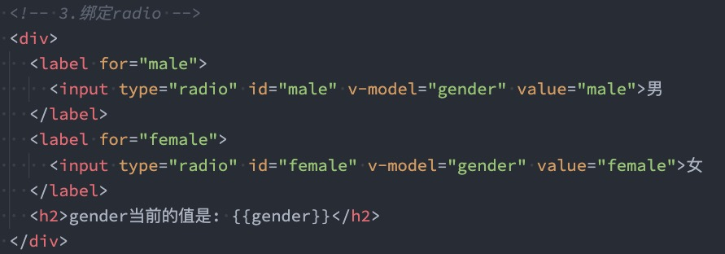


## v-model绑定select

和checkbox一样，select也分单选和多选两种情况。

单选：只能选中一个值

- v-model绑定的是一个值；
- 当我们选中option中的一个时，会将它对应的value赋值到fruit中；

多选：可以选中多个值

- v-model绑定的是一个数组；
- 当选中多个值时，就会将选中的option对应的value添加到数组fruit中；

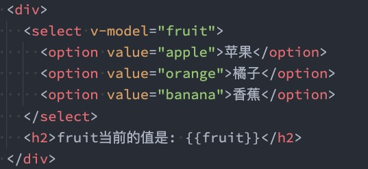

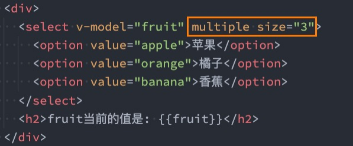


## v-model的值绑定

目前我们在前面的案例中大部分的值都是在template中固定好的：

- 比如gender的两个输入框值male、female
- 比如hobbies的三个输入框值basketball、football、tennis；

在真实开发中，我们的数据可能是来自服务器的，那么我们就可以先将值请求下来，绑定到data返回的对象中， 再通过v-bind来进行值的绑定，这个过程就是值绑定。

- 这里不再给出具体的做法，因为还是v-bind的使用过程。


## v-model修饰符 - lazy

lazy修饰符是什么作用呢？

- 默认情况下，v-model在进行双向绑定时，绑定的是input事件，那么会在每次内容输入后就将最新的值和绑定的属性进行同步； 
- 如果我们在v-model后跟上lazy修饰符，那么会将绑定的事件切换为 change 事件，只有在提交时（比如回车） 才会触发；

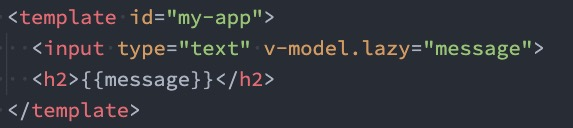


```html
<!DOCTYPE html>
<html lang="en">

<head>
    <meta charset="UTF-8">
    <meta http-equiv="X-UA-Compatible" content="IE=edge">
    <meta name="viewport" content="width=device-width, initial-scale=1.0">
    <title>Document</title>
</head>

<body>
    <div id="app"></div>
    <template id="my-app">
        <!-- 1、lazy修饰符 -->
        <!-- 敲下回车的时候进行更新，原理是把input改成change事件了 -->
        <!-- <input type="text" v-model.lazy="message"> -->

        <!-- 2、number修饰符 -->
        <!-- message是数字类型，但是我们通过v-model绑定完，查看message是字符串类型。哪怕type是number也不行 -->
        <!-- <input type="number" v-model="message"> -->
      
      	<!-- 这样写的话，不管message是不是number类型，都会想办法把它转成number类型 -->
        <!-- <input type="text" v-model.number="message"> -->
        <!-- <h2>{{message}}</h2> -->
        <!-- <button @click="showType">查看类型</button> -->
        
        
        <!-- 3、trim修饰符 -->
        <!-- 就算输入的有空格，也会去掉 -->
        <input type="text" v-model.trim="message">
        <button @click="showResult">查看结果</button>
        <h2>{{message}}</h2>

    </template>
    <script src="vue3/vue3.js"></script>
    <script>
        const App = {
            template: '#my-app',
            data: function () {
                return {
                    message: 100
                }
            },
            methods: {
                showType() {
                    console.log(this.message, typeof this.message)
                },
                showResult() {
                    console.log(this.message)
                }
            }
        }
        Vue.createApp(App).mount("#app")
    </script>
</body>

</html>
```


##  v-model修饰符 - number

我们先来看一下v-model绑定后的值是什么类型的：

- message总是string类型，即使在我们设置type为number也是string类型；

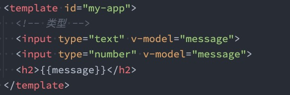

如果我们希望转换为数字类型，那么可以使用 .number 修饰符：

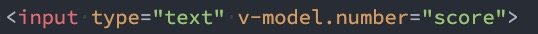


另外，在我们进行逻辑判断时，如果是一个string类型，在可以转化的情况下会进行隐式转换的： 

- 下面的score在进行判断的过程中会进行隐式转化的；

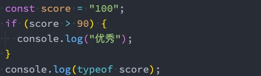


## v-model修饰符 - trim

如果要自动过滤用户输入的首尾空白字符，可以给v-model添加 trim 修饰符：

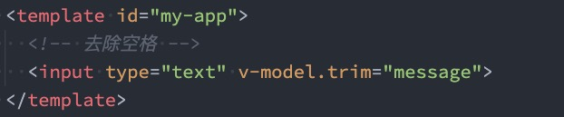


## v-mode组件上使用

v-model也可以使用在组件上，Vue2版本和Vue3版本有一些区别。 

- 具体的使用方法，后面讲组件化开发再具体学习。


## 人处理问题的方式

人面对复杂问题的处理方式：

- 任何一个人处理信息的逻辑能力都是有限的 
- 所以，当面对一个非常复杂的问题时，我们不太可能一次性搞定一大堆的内容。 
- 但是，我们人有一种天生的能力，就是将问题进行拆解。 
- 如果将一个复杂的问题，拆分成很多个可以处理的小问题，再将其放在整体当中，你会发现大的问题也会迎刃而解。

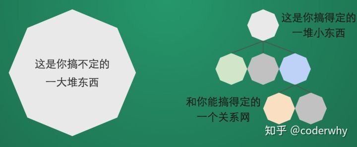

 

## 认识组件化开发

组件化也是类似的思想：

- 如果我们将一个页面中所有的处理逻辑 全部放在一起，处理起来就会变得非常 复杂，而且不利于后续的管理以及扩展； 
- 但如果，我们讲一个页面拆分成一个个 小的功能块，每个功能块完成属于自己 这部分独立的功能，那么之后整个页面 的管理和维护就变得非常容易了； 
- 如果我们将一个个功能块拆分后，就可 以像搭建积木一下来搭建我们的项目；

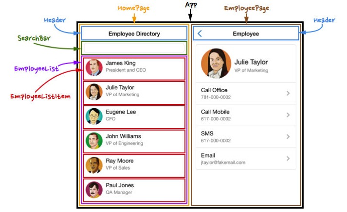


## 组件化开发

现在可以说整个的大前端开发都是组件化的天下，无论从三大框架（Vue、React、Angular），还是跨平台方案 的Flutter，甚至是移动端都在转向组件化开发，包括小程序的开发也是采用组件化开发的思想。

所以，学习组件化最重要的是它的思想，每个框架或者平台可能实现方法不同，但是思想都是一样的。

我们需要通过组件化的思想来思考整个应用程序： 

- 我们将一个完整的页面分成很多个组件； 
- 每个组件都用于实现页面的一个功能块； 
- 而每一个组件又可以进行细分； 
- 而组件本身又可以在多个地方进行复用；


## Vue的组件化

 组件化是Vue、React、Angular的核心思想，也是我们后续课程的重点（包括以后实战项目）： 

- 前面我们的createApp函数传入了一个对象App，这个对象其实本质上就是一个组件，也是我们应用程序的根 组件； 
- 组件化提供了一种抽象，让我们可以开发出一个个独立可复用的小组件来构造我们的应用； 
- 任何的应用都会被抽象成一颗组件树；

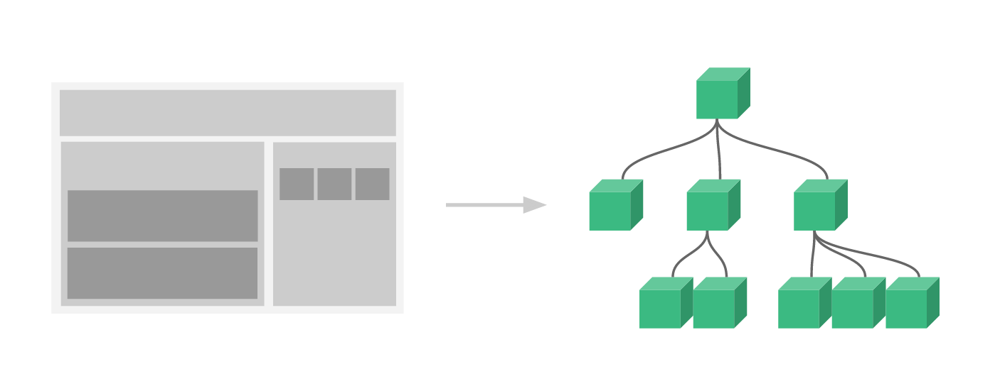


接下来，我们来学习一下在Vue中如何注册一个组件，以及之后如何使用这个注册后的组件。


## 注册组件的方式

如果我们现在有一部分内容（模板、逻辑等），我们希望将这部分内容抽取到一个独立的组件中去维护，这个时候 如何注册一个组件呢？ 

我们先从简单的开始谈起，比如下面的模板希望抽离到一个单独的组件：

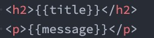


注册组件分成两种： 

- 全局组件：在任何其他的组件中都可以使用的组件； 

- 局部组件：只有在注册的组件中才能使用的组件；


## 注册全局组件

我们先来学习一下全局组件的注册： 

- 全局组件需要使用我们全局创建的app来注册组件； 
- 通过component方法传入组件名称、组件对象即可注册一个全局组件了； 
- 之后，我们可以在App组件的template中直接使用这个全局组件：

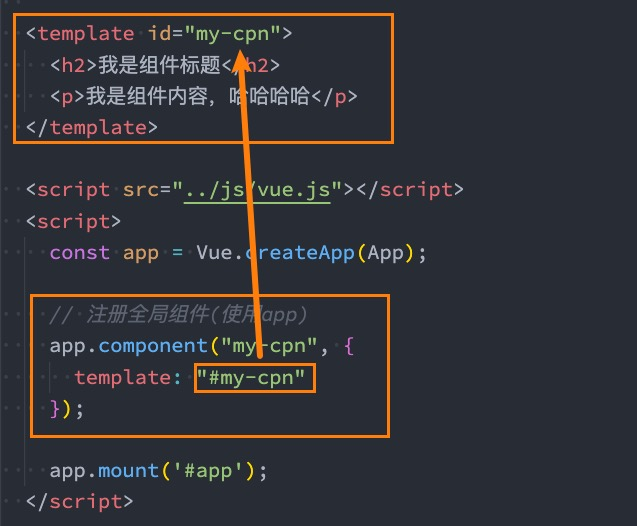

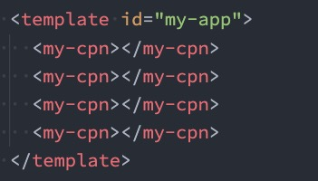

```html
<!DOCTYPE html>
<html lang="en">

<head>
    <meta charset="UTF-8">
    <meta http-equiv="X-UA-Compatible" content="IE=edge">
    <meta name="viewport" content="width=device-width, initial-scale=1.0">
    <title>Document</title>
</head>

<body>
    <div id="app"></div>
    <template id="my-app">
        <!-- 这个就是我们全局注册的组件，可以多次使用 -->
        <component-a></component-a>
        <component-b></component-b>
    </template>
    <template id="component-a">
        <h2>我是一个template-a组件</h2>
        <h2>{{title}}</h2>
        <h2>{{describe}}</h2>
        <button @click="btnClick">按钮点击</button>
    </template>
    <template id="component-b">
        <h2>我是一个template-b组件</h2>
        <h2>{{title}}</h2>
        <h2>{{describe}}</h2>
        <button @click="btnClick">按钮点击</button>
    </template>
    <script src="vue3/vue3.js"></script>
    <script>
        const App = {
            template: '#my-app',
            data: function () {
                return {
                    message: "hello world",
                    title: '哈哈哈',
                    desc: '我是内容，哈哈哈哈哈'
                }
            },
            methods: {
                btnClick() {
                    console.log('按钮发生点击')
                }
            }
        }
        // 我们之前都是这样写的
        // Vue.createApp(App).mount("#app")
        // 当我们要注册一个全局组件的时候
        const app = Vue.createApp(App)
        // app.component(组件名称，组件对象)
        // app.component("component-a", {
        //     template: `
        //         <div>我是一个template-a组件</div>
        //     `
        // })
        app.component("component-a", {
            // 组件里面有所有的东西
            template: "#component-a",
            data() {
                return {
                    describe: '我是描述',
                    title: '我是标题'
                }
            },
            methods: {
                btnClick() {
                    console.log('按钮点击')
                }
            }
        })
        // 如果想注册多个全局组件，可以继续写
        app.component("component-b", {
            // 组件里面有所有的东西
            template: "#component-b",
            data() {
                return {
                    describe: '我是描述',
                    title: '我是标题'
                }
            },
            methods: {
                btnClick() {
                    console.log('按钮点击')
                }
            }
        })
        app.mount("#app")
    </script>
</body>

</html>
```


## 全局组件的逻辑

当然，我们组件本身也可以有自己的代码逻辑：

- 当然，我们组件本身也可以有自己的代码逻辑：

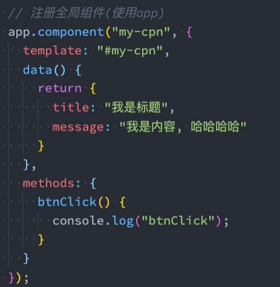


## 组件的名称

在通过app.component注册一个组件的时候，第一个参数是组件的名称，定义组件名的方式有两种：

方式一：使用kebab-case（短横线分割符）

- 当使用 kebab-case (短横线分隔命名) 定义一个组件时，你也必须在引用这个自定义元素时使用 kebab-case， 例如 ；

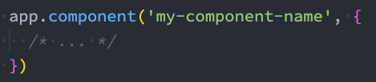


方式二：使用PascalCase（驼峰标识符）

这种不推荐，一般用 -

- 当使用 PascalCase (首字母大写命名) 定义一个组件时，你在引用这个自定义元素时两种命名法都可以使用。也 就是说<my-component-name> 和<MyComponentName> 都是可接受的；

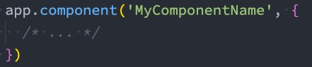

## 注册局部组件

全局组件往往是在应用程序一开始就会全局组件完成，那么就意味着如果某些组件我们并没有用到，也会一起被注 册：

- 比如我们注册了三个全局组件：ComponentA、ComponentB、ComponentC； 
- 在开发中我们只使用了ComponentA、ComponentB，如果ComponentC没有用到但是我们依然在全局进行 了注册，那么就意味着类似于webpack这种打包工具在打包我们的项目时，我们依然会对其进行打包； 
- 这样最终打包出的JavaScript包就会有关于ComponentC的内容，用户在下载对应的JavaScript时也会增加包 的大小；

所以在开发中我们通常使用组件的时候采用的都是局部注册：

- 局部注册是在我们需要使用到的组件中，通过components属性选项来进行注册； 

- 比如之前的App组件中，我们有data、computed、methods等选项了，事实上还可以有一个components选 项； 

- 该components选项对应的是一个对象，对象中的键值对是 组件的名称: 组件对象；


## 局部组件注册代码

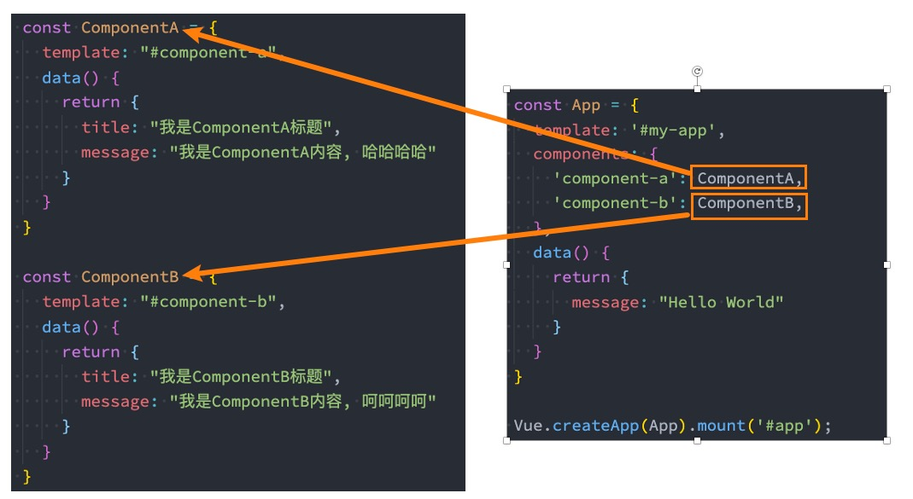


## Vue的开发模式

目前我们使用vue的过程都是在html文件中，通过template编写自己的模板、脚本逻辑、样式等。

但是随着项目越来越复杂，我们会采用组件化的方式来进行开发：

- 这就意味着每个组件都会有自己的模板、脚本逻辑、样式等； 

- 当然我们依然可以把它们抽离到单独的js、css文件中，但是它们还是会分离开来； 

- 也包括我们的script是在一个全局的作用域下，很容易出现命名冲突的问题； 

- 并且我们的代码为了适配一些浏览器，必须使用ES5的语法； 

- 在我们编写代码完成之后，依然需要通过工具对代码进行构建、代码；

所以在真实开发中，我们可以通过一个后缀名为 .vue 的single-file components (单文件组件) 来解决，并且可 以使用webpack或者vite或者rollup等构建工具来对其进行处理。


## 单文件的特点

在这个组件中我们可以获得非常多的特性： 

- 代码的高亮； 
- ES6、CommonJS的模块化能力； 
- 组件作用域的CSS； 
- 可以使用预处理器来构建更加丰富的组件，比 如TypeScript、Babel、Less、Sass等；

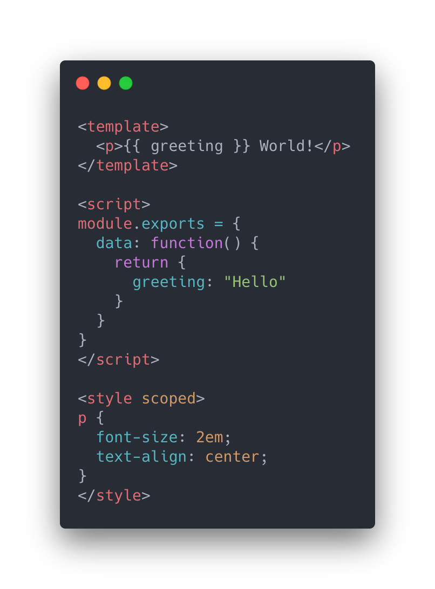


## 如何支持SFC

如果我们想要使用这一的SFC的.vue文件，比较常见的是两种方式：

- 方式一：使用Vue CLI来创建项目，项目会默认帮助我们配置好所有的配置选项，可以在其中直接使用.vue文件； 
- 方式二：自己使用webpack或rollup或vite这类打包工具，对其进行打包处理；

我们最终，无论是后期我们做项目，还是在公司进行开发，通常都会采用Vue CLI的方式来完成。

但是在学习阶段，为了让大家理解Vue CLI打包项目的过程，我会接下来穿插讲解一部分webpack的知识，帮助大 家更好的理解Vue CLI的原理以及其打包的过程。


## 认识webpack

事实上随着前端的快速发展，目前前端的开发已经变的越来越复杂了：

- 比如开发过程中我们需要通过模块化的方式来开发； 
- 比如也会使用一些高级的特性来加快我们的开发效率或者安全性，比如通过ES6+、TypeScript开发脚本逻辑， 通过sass、less等方式来编写css样式代码； 
- 比如开发过程中，我们还希望实时的监听文件的变化来并且反映到浏览器上，提高开发的效率； 
- 比如开发完成后我们还需要将代码进行压缩、合并以及其他相关的优化； p等等….

但是对于很多的前端开发者来说，并不需要思考这些问题，日常的开发中根本就没有面临这些问题： 

- 这是因为目前前端开发我们通常都会直接使用三大框架来开发：Vue、React、Angular； 
- 但是事实上，这三大框架的创建过程我们都是借助于脚手架（CLI）的； 
- 事实上Vue-CLI、create-react-app、Angular-CLI都是基于webpack来帮助我们支持模块化、less、 TypeScript、打包优化等的；


## 脚手架依赖webpack

事实上我们上面提到的所有脚手架都是依赖于webpack的：

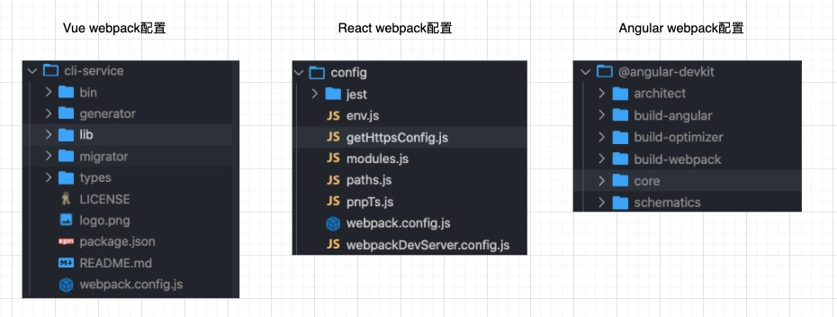

