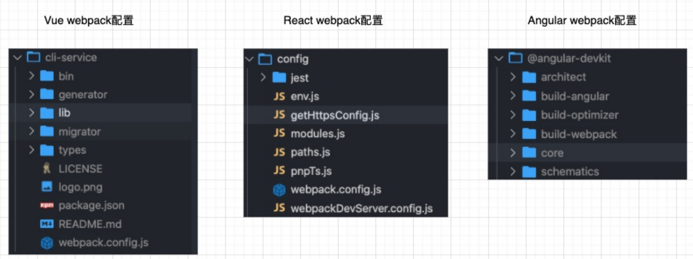
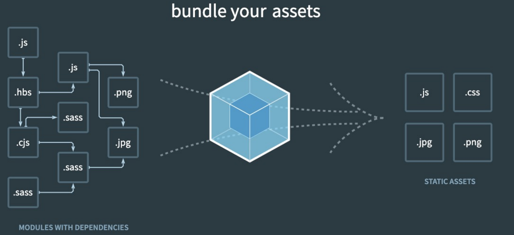
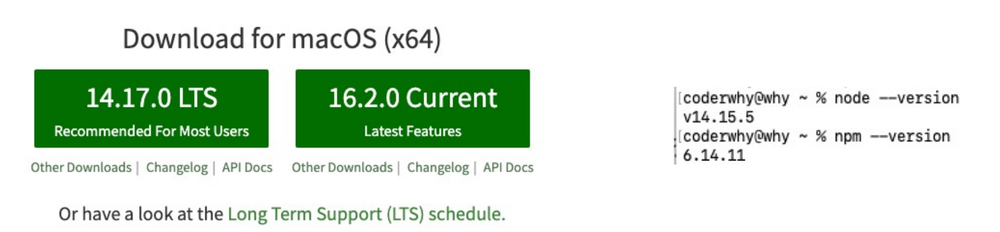
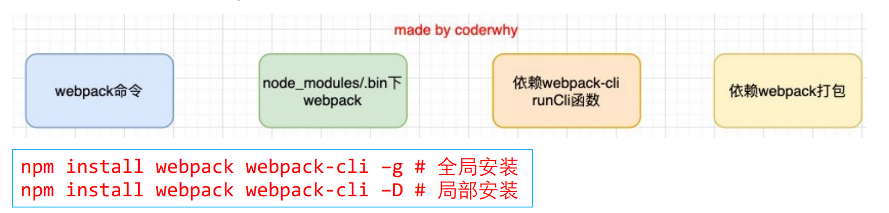
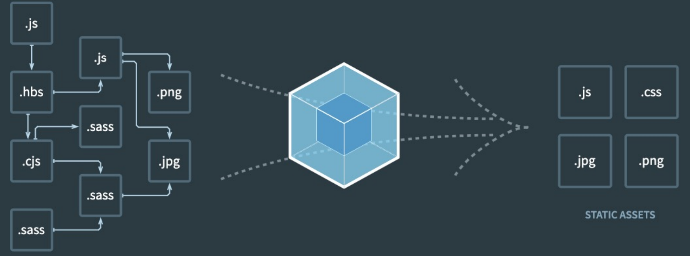
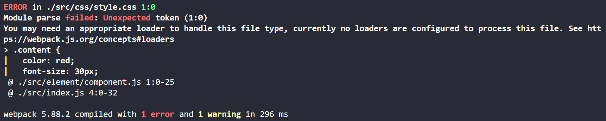
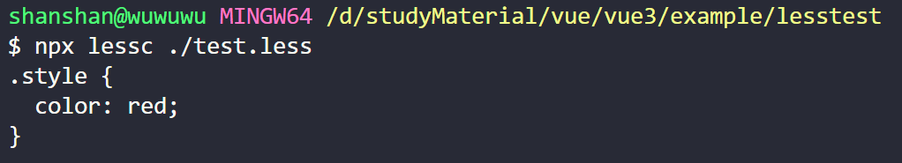

## 认识webpack

事实上随着前端的快速发展，目前前端的开发已经变的越来越复杂了： 

- 比如开发过程中我们需要通过模块化的方式来开发； 
- 比如也会使用一些高级的特性来加快我们的开发效率或者安全性，比如通过ES6+、TypeScript开发脚本逻辑， 通过sass、less等方式来编写css样式代码； 
- 比如开发过程中，我们还希望实时的监听文件的变化来并且反映到浏览器上，提高开发的效率； 
- 比如开发完成后我们还需要将代码进行压缩、合并以及其他相关的优化； 
- 等等…. 

但是对于很多的前端开发者来说，并不需要思考这些问题，日常的开发中根本就没有面临这些问题： 

- 这是因为目前前端开发我们通常都会直接使用三大框架来开发：Vue、React、Angular； 
- 但是事实上，这三大框架的创建过程我们都是借助于脚手架（CLI）的； 
- 事实上Vue-CLI、create-react-app、Angular-CLI都是基于webpack来帮助我们支持模块化、less、 TypeScript、打包优化等的；


## 脚手架依赖webpack

事实上我们上面提到的所有脚手架都是依赖于webpack的：




## Webpack到底是什么呢？

我们先来看一下官方的解释：

- webpack is a static module bundler for modern JavaScript applications.

webpack是一个静态的模块化打包工具，为现代的JavaScript应用程序；

我们来对上面的解释进行拆解：

- 打包bundler：webpack可以将帮助我们进行打包，所以它是一个打包工具；
- 静态的static：这样表述的原因是我们最终可以将代码打包成最终的静态资源（部署到静态服务器；
- 模块化module：webpack默认支持各种模块化开发，ES Module、CommonJS、AMD等；
- 现代的modern：我们前端说过，正是因为现代前端开发面临各种各样的问题，才催生了webpack的出现和发展；





## Vue项目加载的文件有哪些呢？

JavaScript的打包： 

- 将ES6转换成ES5的语法； 
- TypeScript的处理，将其转换成JavaScript；

Css的处理： 

- CSS文件模块的加载、提取； 
- Less、Sass等预处理器的处理；

资源文件img、font： 

- 图片img文件的加载； 
- 字体font文件的加载；

HTML资源的处理： 

- 打包HTML资源文件； 

  处理vue项目的SFC文件.vue文件；


## Webpack的使用前提

webpack的官方文档是https://webpack.js.org/

- webpack的中文官方文档是https://webpack.docschina.org/
- DOCUMENTATION：文档详情，也是我们最关注的

Webpack的运行是依赖Node环境的，所以我们电脑上必须有Node环境

- 所以我们需要先安装Node.js，并且同时会安装npm；
- 我当前电脑上的node版本是v14.15.5，npm版本是6.14.11（你也可以使用nvm或者n来管理Node版本）；
- Node官方网站：https://nodejs.org/




## Webpack的安装

webpack的安装目前分为两个：webpack、webpack-cli

那么它们是什么关系呢？

- 执行webpack命令，会执行node_modules下的.bin目录下的webpack； 
- webpack在执行时是依赖webpack-cli的，如果没有安装就会报错； 
- 而webpack-cli中代码执行时，才是真正利用webpack进行编译和打包的过程； 
- 所以在安装webpack时，我们需要同时安装webpack-cli（第三方的脚手架事实上是没有使用webpack-cli的，而是类似于自己的vue-service-cli的东西）




## 不用webpack

如果不用webpack

./src/index.html

```html
<!DOCTYPE html>
<html lang="en">
<head>
  <meta charset="UTF-8">
  <meta name="viewport" content="width=device-width, initial-scale=1.0">
  <title>Document</title>
</head>
<body>
  <script src="index.js"></script>
</body>
</html>
```


./src/js/math.js

```js
const math = function (num1, num2) {
  return num1 + num2;
}

export {
  math
}
```


./src/js/format.js

```js
const format = function (num) {
  return '¥' + num;
}

module.exports = {
  format: format
}
```


./src/js/index.js

```js
import { format } from "./js/format.js";
const { math } = require('./js/math.js');

const res1 = format(10);
const res2 = math(10, 20);
console.log('res1', res1);
console.log('res2', res2);
```


通过vscode的live server运行这个html文件会提示我们： `Uncaught SyntaxError: Cannot use import statement outside a module`

翻译过来：未捕获的SyntaxError:不能在模块外使用import语句

这个错误是可以处理的，我们再`script`标签加一个 `type="module"` 就行了

但是改完之后还是有更多的问题，比如： `Uncaught SyntaxError: The requested module './js/format.js' does not provide an export named 'format'`

所以使用这种方式，问题是比较多的，因为我们浏览器不能识别module这些代码,那么我们可以使用 `webpack`


## Webpack的默认打包

我们可以通过webpack进行上面的代码进行打包，之后运行打包之后的代码

- 在目录下直接执行**webpack**的命令后

```shell
webpack
```

就会生成一个`dist`文件夹，里面有一个`index.js`文件，就是我们打包之后的文件：

```js
(()=>{var e={466:e=>{e.exports={format:function(e){return"¥"+e}}},640:(e,r,t)=>{"use strict";t.r(r),t.d(r,{fun:()=>o});const o=function(e,r){return e+r}}},r={};function t(o){var n=r[o];if(void 0!==n)return n.exports;var u=r[o]={exports:{}};return e[o](u,u.exports,t),u.exports}t.n=e=>{var r=e&&e.__esModule?()=>e.default:()=>e;return t.d(r,{a:r}),r},t.d=(e,r)=>{for(var o in r)t.o(r,o)&&!t.o(e,o)&&Object.defineProperty(e,o,{enumerable:!0,get:r[o]})},t.o=(e,r)=>Object.prototype.hasOwnProperty.call(e,r),t.r=e=>{"undefined"!=typeof Symbol&&Symbol.toStringTag&&Object.defineProperty(e,Symbol.toStringTag,{value:"Module"}),Object.defineProperty(e,"__esModule",{value:!0})},(()=>{"use strict";var e=t(466);const{math:r}=t(640),o=(0,e.format)(10),n=r(10,20);console.log("res1",o),console.log("res2",n)})()})();
```

- 这个文件中的代码被压缩和丑化了；
- 另外我们发现代码中依然存在ES6的语法，比如箭头函数、const等，这是因为默认情况下webpack并不清楚我们打包后的文 件是否需要转成ES5之前的语法，后续我们需要通过babel来进行转换和设置；

我们发现是可以正常进行打包的，但是有一个问题，webpack是如何确定我们的入口的呢？

- 事实上，当我们运行webpack时，webpack会查找当前目录下的 src/index.js作为入口；
- 所以，如果当前项目中没有存在src/index.js文件，那么会报错；

我们把上面的./src/index.js的文件名修改为`./src/main.js`的文件，就会报错，告诉我们找不到，这里找不到的实际上是入口，但是在默认的时候会找到 `./src/index.js` 文件， 但是我们把他修改成了`main.js`文件，所以找不到，所以我们要给webpack指定一个入口

我们可以写一些文件

./src/main.js

```js
//可以不加后缀，webpack会帮我们加上的
import { sum } from './js/math'; 
const { priceFormat } = require('./js/format')

console.log(sum(20, 30));
console.log(priceFormat());
```

./src/js/format.js

```js
const priceFormat  = function () {
    return "$99.88"
}
// commonJs的导出
module.exports = {
    priceFormat
}
```

./src/js/math.js

```js
// es的导出
export function sum(num1, num2) {
    return num1 + num2
}
```

执行命令

有些项目src下面没有index,例如有的是main.js  那么webpack找不到就会报错呀，怎么办呢

可以给webpack指定入口和出口

```shell
npx webpack --entry 当前文件夹下的入口路径 --output-path 出口文件夹
npx webpack --entry ./src/main.js --output-path ./build
 注意：这里有一个坑，必须用./而不能用.\
```


这样就会生成一个文件夹叫做build，里面有一个文件叫做main.js

这个时候引入打包的文件，启动浏览器执行就可以看到我们打印的信息

```html
<!DOCTYPE html>
<html lang="en">
<head>
    <meta charset="UTF-8">
    <meta http-equiv="X-UA-Compatible" content="IE=edge">
    <meta name="viewport" content="width=device-width, initial-scale=1.0">
    <title>Document</title>
</head>
<body>
    <script src="./dist/main.js"></script>
</body>
</html>
```

上面我们说要用npx webpack来执行局部的webpack，为什么要创建局部的webpack，每一个项目依赖的webpack版本可能不一样， 一般针对这个项目创建局部的webpack


## 创建局部的webpack

如果在命令行中敲webpack就是用的全局webpack，不是局部webpack

前面我们直接执行webpack命令使用的是全局的webpack，如果希望使用局部的可以按照下面的步骤来操作。

webpack叫做包，包括css，js文件，都叫包，你的项目依赖一大堆包，一般项目中会有一个文件叫packge.json，这个文件是用来管理包的


第一步：创建package.json文件，用于管理项目的信息、库依赖等

```
npm init -y
```

-y表示，每一个都是yes


第二步：安装局部的webpack，局部安装分为生产依赖和开发依赖，生产依赖直接安装，开发依赖要加上 --save-dev或者-D

```
npm install webpack webpack-cli -D	
或者：
npm install webpack webpack-cli --save-dev
```

webpack还依赖其他包，所以会下载很多包。


第三步：使用局部的**webpack**

第一种使用方式

```
npx webpack
```

​	注意：这里执行的是 npx webpack, 而不是webpack，这是因为我们希望我们用的webpack是我们刚才下载的，如果用webpack的话，使用的是全局的webpack，用npx webpack的话，我们用到的才是刚才下载的webpack，并且实际上执行的是./node_modules/.bin/webpack这个文件

​	当执行npx webpack的时候webpack就会去当前目录下的src目录(一定是src目录)，找里面的index.js文件（一定是index.js文件），然后对这个文件进行打包，当然如果像前面那样需要指定入口需要这样


第二种使用方式

在package.json中创建scripts脚本，执行脚本打包即可

./package.json

```json
{
    "scripts": {
        "build": "webpack"
    }
}
```

在Packge.json中配置build，里面写webpack，它不用加npx，因为，在脚本中配置，它会优先去node_modules中去找的，找什么呢？后面是webpack，所以找的就是webpack，也就是去./node_modules/.bin/webpack

配置好以后在命令行执行

```
npm run build
```

执行完以后就可以打包成功，当然我们如果需要指定出口和入口可以这样配置

```json
{
    "scripts": {
        "build": "webpack --entry ./src/main.js --output-path ./build"
    }
}
```

然后可以执行 `npm run build`

这种虽然也可以，但是不免配置的太麻烦了,其实webpack是有自己的配置的


## webpack的配置文件

在通常情况下，webpack需要打包的项目是非常复杂的，并且我们需要一系列的配置来满足要求，默认配置必然是不可以的。

我们可以在根目录下创建一个`webpack.config.js`文件，来作为webpack的配置文件：

这个文件需要返回一个对象

./webpack.config.js

```js
// 必须要用module来导出，因为我们的webpack是运行在node中，node不支持es6的导出，如果想支持需要配置，所以现在我们用module.exports导出一个对象
const path = require('path')
module.exports = {
    entry: "./src/main.js",
    output: {
        // 这里必须写一个绝对路径
        // path: "D:\studyMaterial\vue3\exercise\build"     //但是这样太长了，用一个node的模块
        // __dirname可以获取当前路径，也就是D:\studyMaterial\vue3\exercise\
        path: path.resolve(__dirname, "./build"),
        // 打包完的名字
        filename: 'bundle.js'
    }
}
```

./package.json

```jsson
{
	"scripts": {
		"build": "webpack"
	}
}
```

因为我们在配置文件里面已经指定了出口和入口，所以这里的出口和入口就可以去掉了

```shell
npm run build
```

就可以打包出来`bundle.js`文件了


## 指定webpack的配置文件

但是如果我们的配置文件并不是webpack.config.js的名字，而是其他的名字呢？

- 比如我们将webpack.config.js修改成了 wk.config.js；
- 这个时候我们可以通过 --config 来指定对应的配置文件；

第一种方式要使用这种来启动配置文件

```js
npx webpack --config wk.config.js
```

但是每次这样执行命令来对源码进行编译，会非常繁琐，所以我们可以在package.json中增加一个新的脚本：

./package.json

```json
{
    "scripts": {
        "build": "webpack --config wk.config.js"
    }
}
```

之后我们执行 npm run build来打包即可。


## Webpack的依赖图

webpack到底是如何对我们的项目进行打包的呢？

- 事实上webpack在处理应用程序时，它会根据命令或者配置文件找到入口文件
- 从入口开始，会生成一个 依赖关系图，这个依赖关系图会包含应用程序中所需的所有模块（比如.js文件、css文件、图片、字 体等）；
- 然后遍历图结构，打包一个个模块（根据文件的不同使用不同的loader来解析）；




## 编写案例代码

我们创建一个component.js

- 通过JavaScript创建了一个元素；

./src/element/component.js

```js
function component() {
  const element = document.createElement('div');
  element.innerHTML = ['Hello', 'World'].join(',');
  element.className = 'content';
  return element;
}

document.body.appendChild(component());
```

如果一个文件没有被和入口文件有关系的任何文件依赖，那么它不会打包到webpack中，所以我们需要引入这个刚创建的文件，不会被打包到bundle.js中，如果想要打包到bundle.js里面，我们需要引入这个文件

./src/index.js

```js
import './element/component.js';	// 引入创建的文件
...
```

当文件引入以后就可以将创建的文件打包进bundle.js了

我们把刚才打包完的bundle.js文件在html引入

```html
<script src="../build/bundle.js"></script>
```

当我们引入完以后，再在浏览器打开，就能看到我们创建的元素`Hello,world`


### 样式引入

上面创建的元素可以正确引入到html中，如果我们想要引入css呢

创建一个文件

./src/css/style.css

```css
// 创建的元素中有一个content的类名，所以我们创建一个content的类
.content {
  color: red;
  font-size: 30px;
  font-weight: 700;
}
```

前面说了，要想将写的模块（每一个文件都是一个模块）打包进来，就需要引入，所以我们需要把这个css文件引入

./src/element/component.js

```js
import '../css/style.css'
...
```

现在已经引入了css了，我们打包一下试试 `npm run build`



可以发现，他报错了，它说你可能需要一个合适的loader来处理css， webpack默认支持js文件的打包，但是不支持css文件的打包，如果想支持，需要配置loader


## css-loader的使用

上面的错误信息告诉我们需要一个loader来加载这个css文件，但是loader是什么呢？

- loader 可以用于对模块的源代码进行转换；
- 我们可以将css文件也看成是一个模块，我们是通过import来加载这个模块的；
- 在加载这个模块时，webpack其实并不知道如何对其进行加载，我们必须制定对应的loader来完成这个功能；

那么我们需要一个什么样的loader呢？

- 对于加载css文件来说，我们需要一个可以读取css文件的loader；
- 这个loader最常用的是css-loader；

css-loader的安装：

```
npm install css-loader -D
```


## css-loader的使用方案

如何使用这个loader来加载css文件呢？有三种方式：

- 内联方式；
- CLI方式（webpack5中不再使用）；
- 配置方式；


内联方式：

- 内联方式使用较少，因为不方便管理；

- 在引入的样式前加上使用的loader，并且使用!分割；

将刚才引入css的方式修改为：

./src/element/component.js

```js
import 'css-loader!../css/style.css';
...
```

这样就能成功打包，不会报错了（注意：这个时候页面还不会显示出样式）


CLI方式：

- 在webpack5的文档中已经没有了--module-bind；
- 实际应用中也比较少使用，因为不方便管理；


## loader配置方式

配置方式表示的意思是在我们的webpack.config.js文件中写明配置信息： 

- module.rules中允许我们配置多个loader（因为我们也会继续使用其他的loader，来完成其他文件的加载）； 
- 这种方式可以更好的表示loader的配置，也方便后期的维护，同时也让你对各个Loader有一个全局的概览；

module.rules的配置如下：

rules属性对应的值是一个数组：[Rule]

数组中存放的是一个个的Rule，Rule是一个对象，对象中可以设置多个属性：

- test属性：用于对 resource（资源）进行匹配的，通常会设置成正则表达式； 

- use属性：对应的值时一个数组：[UseEntry]

  - UseEntry是一个对象，可以通过对象的属性来设置一些其他属性 

    - loader：必须有一个 loader属性，对应的值是一个字符串； 
    - options：可选的属性，值是一个字符串或者对象，值会被传入到loader中； 
    - query：目前已经使用options来替代
- 传递字符串（如：use: [ 'style-loader' ]）是 loader 属性的简写方式（如：use: [ { loader: 'style-loader'} ]）
-  loader属性： Rule.use: [ { loader } ] 的简写。


## Loader的配置代码

```js

// 必须要用module来导出，因为我们的webpack是运行在node中，node不支持es6的导出，如果想支持需要配置，所以现在我们用module.exports导出一个对象
const path = require('path')
module.exports = {
    entry: "./src/main.js",
    output: {
        // 这里必须写一个绝对路径
        // path: "D:\studyMaterial\vue3\exercise\build"     //但是这样太长了，用一个node的模块
        // __dirname可以获取当前路径，也就是D:\studyMaterial\vue3\exercise\
        path: path.resolve(__dirname, "./build"),
        // 打包完的名字
        filename: 'bundle.js'
    },
    module: {
        // 规则
        rules: [
            {
                test: /\.css$/,  //用这个正则表达式来做匹配,转义一个.
                // 1、写法一
                // loader: "css-loader"
                // 2、写法二
                // use: "css-loader"
                // 3、写法三，完整写法
                // 不确定加载cssloader一个就搞定，加载css，一个loader搞不定，就必须用use
                use: [
                    // {loader: 'css-loader'， options: {}}
                    "css-loader"		//语法糖
                ]
            }
        ]
    }
}
```

我们这样配置完以后就不需要通过 `import 'css-loader!../css/style.css';` 这种方式引入了，修改为正常方式引入就行

./src/element/component.js

```js
import '../css/style.css';
...
```

重新打包 `npm run build`

是OK的


## 认识style-loader

我们已经可以通过css-loader来加载css文件了

- 但是你会发现这个css在我们的代码中并没有生效（页面没有效果）。

这是为什么呢？

- 因为css-loader只是负责将.css文件进行解析，并不会将解析之后的css插入到页面中；
- 如果我们希望再完成插入style的操作，那么我们还需要另外一个loader，就是style-loader；

安装style-loader：

```
npm install style-loader -D
```

```js

// 必须要用module来导出，因为我们的webpack是运行在node中，node不支持es6的导出，如果想支持需要配置，所以现在我们用module.exports导出一个对象
const path = require('path')
module.exports = {
    ...
    module: {
        // 规则
        rules: [
            {
                test: /\.css$/,  //用这个正则表达式来做匹配,转义一个.
                // 1、一种写法
                // loader: "css-loader"
                // 2、二种写法
                // use: "css-loader"
                // 3、三种写法，完整写法
                // 不确定加载cssloader一个就搞定，加载css，一个loader搞不定，就必须用use
                use: [
                    // {loader: 'css-loader'， options: {}}
                    // use的执行顺序是从后到前的，css要先加载，在有style-loader
                    "style-loader",
                    "css-loader"
                ]
            }
        ]
    }
}
```

在配置文件中，添加style-loader；

注意：因为loader的执行顺序是从右向左（或者说从下到上，或者说从后到前的），所以我们需要将styleloader写到css-loader的前面；

重新执行编译npm run build，可以发现打包后的css已经生效了（页面中会有效果了）： 

当前目前我们的css是通过页内样式的方式添加进来的； 


## 如何处理less文件？

在我们开发中，我们可能会使用less、sass、stylus的预处理器来编写css样式，效率会更高。 

首先我们要知道less文件是需要转成css文件的，那么我们怎么做呢

重新创建一个文件夹，测试一下less转成less文件

./test-less

```shell
npm init -y
```

然后下载less,注意：下载less，还会下载一个叫做lessc的库，这个库是用来执行less文件的

```
npm install less -D
```

./test-less/test.less

```
@color: red;
.style {
  color: @color;
}
```

执行文件

```shell
npx lessc ./test.less
```



命令行会给我们输出转成css的文件，我们也可以把它输出到某一个文件中

在命令行输入

```shell
npx lessc ./test.less ./test.css
```

这样的话就能给我们生成一个test.css文件

以上就是less的独立使用，那么在webpack中如何使用呢？


在开发中可能有很多less文件，不可能一个一个的转，所以我们要在webpack中配置

- 首先我们需要确定，less、sass等编写的css需要通过工具转换成普通的css；

下载less-loader

```shell
npm install less-loader -D
```

./src/less/style.less

```less
@color: red;
@height: 200px;

.less-style {
  color: @color;
  width: 200px;
  height: @height;
}
```


./src/element/component.js

```js
import '../less/style.less'；	// 引入
function component() {
  const element = document.createElement('div');
  element.innerHTML = ['Hello', 'World'].join(',');
  element.className = 'less-style';
  return element;
}

document.body.appendChild(component());
```

./src/webpack.config.js

```js
      {
        test: /\.less$/,
        use: [
          {
            loader: 'style-loader',
          },
          {
            loader: 'css-loader',
          },
          {
            loader: 'less-loader'
          }
        ]
      }
```

注意：这里的顺序不能乱，这样再打包的话，less的文件就能打包起来，在页面中可以正常显示


## 认识PostCSS工具

什么是PostCSS呢？ 

- PostCSS是一个通过JavaScript来转换样式的工具； 
- 这个工具可以帮助我们进行一些CSS的转换和适配，比如自动添加浏览器前缀、css样式的重置； 
- 但是实现这些功能，我们需要借助于PostCSS对应的插件；

如何使用PostCSS呢？主要就是两个步骤： 

- 第一步：查找PostCSS在构建工具中的扩展，比如webpack中的postcss-loader； 
- 第二步：选择可以添加你需要的PostCSS相关的插件；


## postcss的单独使用

当然，我们能不能也直接在终端独立使用PostCSS呢？ 

- 也是可以的，但是我们需要单独安装一个工具postcss-cli；

我们可以安装一下它们：postcss、postcss-cli

```
npm install postcss postcss-cli -D
```

我们编写一个需要添加前缀的css：

```
https://autoprefixer.github.io/
```

我们可以在上面的网站中查询一些添加css属性的样式；


创建一个文件

./src/start.css

```css
.example {
  display: grid;
  transition: all .5s;
  user-select: none;
  background: linear-gradient(to bottom, white, black);
}
```

我们希望给这些css加上浏览器前缀，所以我们还需要下载对应的加前缀的插件，这个插件是在csspost用的

```shell
npm install autoprefixer -D
```

当我们下载完以后，我们就可以执行

```shell
npx postcss --use autoprefixer -o ./src/end.css ./src/start.css
```

当执行完以后就会生成一个文件

./src/end.css

```css
.example {
  display: grid;
  transition: all .5s;
  -webkit-user-select: none;
     -moz-user-select: none;
          user-select: none;
  background: linear-gradient(to bottom, white, black);
}
```


## webpack中使用postcss

上面使用这个工具是独立的使用，但是在开发中一般是在webpack中配置的

```js
{
  loader: "postcss-loader",
  options: {
   postcssOptions: {
     plugins: [
      require("autoprefixer")
     ],
   },
  },
}
```

注意：这里用到了postcss-loader，而且用到了autoprefixer插件

这个时候在执行打包的时候，就能打包成功，而且能给需要加前缀的样式加上前缀了

但是，这样我们的这个loader配置的东西太多了，就会导致webpack.config.js的配置文件太大了，所以我们可以单独将postcss-loader的配置抽离到一个文件，这个文件叫`postcss.config.js`

./postcss.config.js

```js
{
        test: /\.less$/,
        use: [
          "style-loader",
          "css-loader",
          {
            loader: "postcss-loader",
            options: {
              postcssOptions: {
                plugins: [require("autoprefixer")],
              },
            },
          },
          "less-loader",
        ]
}
```


webpack.config.js

```js
...
{
	loader: "postcss-loader",
}
```


这样就将`postcss`的配置分开了，在webpack.config.js里面就可以去掉那部分的配置


## postcss-preset-env

事实上，在配置postcss-loader时，我们配置插件并不需要使用autoprefixer。

我们可以使用另外一个插件：postcss-preset-env

- postcss-preset-env也是一个postcss的插件； 
- 它可以帮助我们将一些现代的CSS特性，转成大多数浏览器认识的CSS，并且会根据目标浏览器或者运行时环境 添加所需的polyfill；
- 也包括会自动帮助我们添加autoprefixer（所以相当于已经内置了autoprefixer）；

首先，我们需要安装postcss-preset-env：

```
npm install postcss-preset-env -D
```

之后，我们直接修改掉之前的autoprefixer即可：

./postcss.config.js

```js
module.exports = {
  plugins: [
    require('postcss-preset-env')
  ]
};
```


我们在使用某些postcss插件时，也可以直接传入字符串

./postcss.config.js

```js
module.exports = {
  plugins: [
    'postcss-preset-env'
  ]
};

```

这两种方式配置都是可以的

