## 加载图片案例准备

为了演示我们项目中可以加载图片，我们需要在项目中使用图片，比较常见的使用图片的方式是两种：

- img元素，设置src属性；
- 其他元素（比如div），设置background-image的css属性；


如果直接打包，比如我们想给一个div设置背景，那么我们的代码可能是这样

./src/element/component.js

```js
import '../css/style.css'
function component() {
  const element = document.createElement('div');
  element.className = 'content';
  return element;
}

document.body.appendChild(component());
```

./src/css/style.css

```css
.content {
  height: 200px;
  width: 200px;
  background-image: url(../images/3.jpg);
}
```

webpack.config.js

```js
{
	test: /\.css$/,
	use: ["style-loader", "css-loader"],
}
```


```shell
npm run build
```

打包完以后可以显示图片的


另一种方式：

./src/element/component.js

```js
import '../css/style.css';	// 引入
import cj from '../images/cj.jpg';
function component() {
  const element = document.createElement('img');
  element.className = 'content';
  element.src = cj  // 注意，这里要通过require引入一个资源
  return element;
}

document.body.appendChild(component());
```

打包完以后会报错

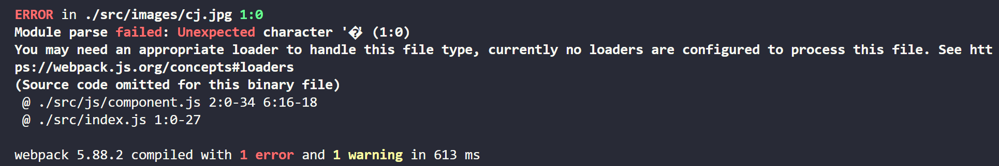


虽然第一种方式是可以打包图片，但是这两种方式都不是webpack打包资源的正确姿势，例如我们如果有更多的操作，比如想把图片打包到指定的目录，想把小与100kb的图片打包成base64的图片等都是不能做到的


## file-loader

要处理jpg、png等格式的图片，我们也需要有对应的loader：file-loader 

- file-loader的作用就是帮助我们处理import/require()方式引入的一个文件资源，并且会将它放到我们输出的文件夹中； 
- 当然我们待会儿可以学习如何修改它的名字和所在文件夹；

安装file-loader：

```
npm install file-loader -D
```

配置处理图片的Rule：

```js
      {
        test: /\.(png|jpg|gif|jpeg)$/,
        type: "javascript/auto",
        use: [
          {
            loader: "file-loader",
            options: {
              esModule: false,  // 不使用esModule引入
            },
          },
        ],
      }
```

注意：

type, esModule都是必须的，否则无法打包

当前打包的图片会放到`build`文件夹中，和bundle.js文件同一级

```shell
npm run build
```

打包成功！


进一步配置，将图片打包到某一个文件夹中

```js
      {
        test: /\.(png|jpg|gif|jpeg)$/,
        type: "javascript/auto",
        use: [
          {
            loader: "file-loader",
            options: {
              esModule: false,  // 不使用esModule引入
              outputPath: 'image',  // 生成一个image文件夹，打包的图片放到这个里面
              name: "[name]_[hash:6].[ext]",
              // name: './image/[name]_[hash:6].[ext]'  // 将outputPath和name合在一起
            },
          },
        ],
      },
```

```shell
npm run build
```

打包成功！

这样打包的图片就会放到`./build/image`这个文件夹中

使用`file-loader`的时候不管是通过背景图的方式引入图片还是通过src引入资源的方式都是可以成功打包的


## 文件的命名规则

这里我们有些[name]、[hash:6]、[ext],这些是什么意思呢？

有时候我们处理后的文件名称按照一定的规则进行显示： 

- 比如保留原来的文件名、扩展名，同时为了防止重复，包含一个hash值等；

这个时候我们可以使用PlaceHolders来完成，webpack给我们提供了大量的PlaceHolders来显示不同的内容： 

- https://webpack.js.org/loaders/file-loader/#placeholders 
- 我们可以在文档中查阅自己需要的placeholder；

我们这里介绍几个最常用的placeholder： 

- [ext]： 处理文件的扩展名； 
- [name]：处理文件的名称； 
- [hash]：文件的内容，使用MD4的散列函数处理，生成的一个128位的hash值（32个十六进制）； 
- [contentHash]：在file-loader中和[hash]结果是一致的（在webpack的一些其他地方不一样，后面会讲到）； 
- [hash:]：截图hash的长度，默认32个字符太长了； 
- [path]：文件相对于webpack配置文件的路径


## url-loader

url-loader和file-loader的工作方式是相似的，但是可以将较小的文件，转成base64的URI。 

安装url-loader：

```shell
npm install url-loader -D
```

url-loader的使用和file-loader的使用是相同的

配置：

```js
      {
        test: /\.(png|jpg|gif|jpeg)$/,
        type: "javascript/auto",
        use: [
          {
            loader: "url-loader",
            options: {
              esModule: false,  // 不使用esModule引入
              name: './image/[name]_[hash:6].[ext]'  // 将outputPath和name合在一起
            },
          },
        ],
      },
```


但是开发中我们往往是小的图片需要转换，但是大的图片直接使用图片即可 

- 这是因为小的图片转换base64之后可以和页面一起被请求，减少不必要的请求过程； 
- 而大的图片也进行转换，反而会影响页面的请求速度；

那么，我们如何可以限制哪些大小的图片转换和不转换呢？ 

- 默认情况下url-loader会将所有的图片文件转成base64编码
- 但是，要知道，大的图片是不能通过base64来获取的，因为这样会更慢，所以要设置，大于100kb的不要通过base64

- url-loader有一个options属性limit，可以用于设置转换的限制；
- 下面的代码38kb的图片会进行base64编码，而295kb的不会；

如果我希望将小于100kb的图片打包成base64的资源，将大于100kb的资源打包成图片，url是支持配置的

```js
      {
        test: /\.(png|jpg|gif|jpeg)$/,
        type: "javascript/auto",
        use: [
          {
            loader: "url-loader",
            options: {
              limit: 1024 * 100, // 这里的55是b，所以转成kb要乘以1024
              esModule: false,  // 不使用esModule引入
              outputPath: 'image',  // 生成一个image文件夹，打包的图片放到这个里面
              name: "[name]_[hash:6].[ext]",
              // name: './image/[name]_[hash:6].[ext]'  // 将outputPath和name合在一起
            },
          },
        ],
      },
```

这样配置以后，超过55KB的图片才会打包成图片放到image的文件夹中，但是如果没有就会被打包成base64放到build.js中


## 认识asset module type

首先webpack5内置了资源模块（assets），可以自己处理资源文件（图片、字体等），在webpack5之前都是需要通过配置一些额外的loader，例如：url-loader，file-loader。

我们当前使用的webpack版本是webpack5： 

- 在webpack5之前，加载这些资源我们需要使用一些loader，比如raw-loader 、url-loader、file-loader； 
- 在webpack5开始，我们可以直接使用资源模块类型（asset module type），来替代上面的这些loader；

资源模块类型(asset module type)，通过添加 4 种新的模块类型，来替换所有这些 loader： 

- asset/resource 发送一个单独的文件并导出URL。之前通过使用`file-loader`实现，(注意：不能打包base64);
- asset/inline 导出一个资源的 data URI。之前通过使用 url-loader 实现； 
- asset/source 导出资源的源代码。之前通过使用 raw-loader 实现； 
- asset 在导出一个 data URI 和发送一个单独的文件之间自动选择。之前通过使用 url-loader，并且配置资源体积限制实现；（可以打包base64）

用了这个，上面的file-loader或者url-loader就可以不用使用了,

```js
    {
      test: /\.(jpe?g$|png|gif|svg)/,
      type: "asset/resource"
    }
```


如果我们要输入指定的目录

方式一：

```js
module.exports = {
  entry: "./src/main.js",
  output: {
    path: path.resolve(__dirname, "./build"),
    filename: "bundle.js",
 		assetModuleFilename: "images/[name]_[hash:6][ext]"	// 资源的导出路径
  },
}
```

方式二：

不通过`assetModuleFilename`来配置,在loader中配置

```js
{
  test: /\.(png|gif|jpg)$/,
  type: 'asset',
  generator: {
    filename: 'images/[hash][ext]'	// 注意这里不需要.[ext]
  }
}
```

这两种方式都可以将文件资源打包到images文件夹中


## url-loader的limit效果

`asset`在导出一个`data URI`和发送一个单独的文件之间自动选择。之前通过使用`url-loader`，并且配置资源体积限制实现；（可以打包base64）

通过asset就可以配置类似limit这样的打包

提供了一种通用的资源类型，根据设置的 Rule.parser.dataUrlCondition.maxSize 自动的在 asset/resource、asset/inline 之间做选择，小于该大小指定的文件视为 inline 模块类型，否则视为 resource 模块类型。

```js
{
    test: /\.(png|gif|jpg)$/,
    type: 'asset',
  	parser: {
    	dataUrlCondition: {
      		maxSize: 100 * 1024
    	}
  	},
  	generator: {
    	filename: 'images/[hash][ext]'
  	}
}  

```

这样如果大于100kb的资源就会打包为普通资源，如果小于或者等于100kb的资源就会打包为base64的资源

webpack5推荐我们使用asset module type的方式打包资源


## 加载字体文件

如果我们需要使用某些特殊的字体或者字体图标，那么我们会引入很多字体相关的文件，这些文件的处理也是一样的。 

首先，我从阿里图标库中下载了几个字体图标：

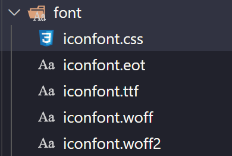

在component中引入，并且添加一个i元素用于显示字体图标：

./src/js/component.js

```js
import '../font/iconfont.css'
function component() {
  const element = document.createElement('i');
  element.className = 'iconfont icon-ashbin';
  return element;
}

document.body.appendChild(component());
```

会报错，或者不能打包字体文件


## 字体的打包

这个时候打包会报错，因为无法正确的处理eot、ttf、woff等文件： 

- 我们可以选择使用file-loader来处理，也可以选择直接使用webpack5的资源模块类型来处理；
- 因为webpack5推荐使用assets来打包资源文件，所以我们这里来这里使用assets module type

./webpack.config.js

```js
      {
        test: /\.(eot|ttf|woff|woff2)$/,
        type: "asset/resource",	// 字体文件较小，不用单独打包出来文件
        generator: {
          filename: "[hash:6][ext]",
        },
      },
```

这样就能打包出来字体文件了，并且在页面也可以显示出来


## 认识Plugin

Webpack的另一个核心是Plugin，官方有这样一段对Plugin的描述： 

- While loaders are used to transform certain types of modules, plugins can be leveraged to perform a  wider range of tasks like bundle optimization, asset management and injection of environment  variables.

上面表达的含义翻译过来就是： 

- Loader是用于特定的模块类型进行转换； 
- Plugin可以用于执行更加广泛的任务，比如打包优化、资源管理、环境变量注入等；

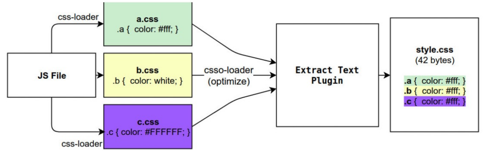


当前的效果还有一些问题：

- 每次打包，都要把之前的东西删掉
- 打包完没有index.html文件，也就是没有打包html文件

那么说一下如何自动删掉打包的build，这个时候就不是用loader了，因为loader是在打包的时候使用的，就需要用plugin

注意：loader用不了的时候就可以用插件，功能很强大，其实webpack的入口，出口最后也是转成插件的。


## CleanWebpackPlugin

前面我们演示的过程中，每次修改了一些配置，重新打包时，都需要手动删除`build`文件夹： 

- 我们可以借助于一个插件来帮助我们完成，这个插件就是CleanWebpackPlugin；

首先，我们先安装这个插件：

```
npm install clean-webpack-plugin -D
```

之后在插件中配置：


配置plugin:

./webpack.config.js

```js
const path = require("path");
const { CleanWebpackPlugin } = require("clean-webpack-plugin");
module.exports = {
  entry: "./src/index.js",
  output: {
    path: path.resolve(__dirname, "./build"),
    filename: "bundle.js",
  },
  module: {
    rules: [
        ...
    ],
  },
  plugins: [
    new CleanWebpackPlugin()
  ],
};

```

这样配置完以后，我们每次执行`npm run build`之后就会将之前的build文件夹删掉，生成新的build文件，他会把outputPath这个路径的文件夹删掉，再重新打包。


## HtmlWebpackPlugin

另外还有一个不太规范的地方： 

- 我们的HTML文件是编写在根目录下的，而最终打包的dist文件夹中是没有index.html文件的。 - 
- 在进行项目部署的时，必然也是需要有对应的入口文件index.html； 
- 所以我们也需要对index.html进行打包处理；

对HTML进行打包处理我们可以使用另外一个插件：HtmlWebpackPlugin；

```
npm install html-webpack-plugin -D
```

这个插件可以帮助我们生成一个html文件

```js
const HtmlWebpackPlugin = require('html-webpack-plugin');
module.exports = {   
	plugins: [
		new HtmlWebpackPlugin()
	]
}
```

```
npm run build
```

我们这样配置完以后，重新打包，他就可以给我们生成一个html文件,而且值得注意的是，我们无须提供模板，他会自动帮助我们生成一个模板，生成的模板长这个样子

```html
<!DOCTYPE html>
<html>
  <head>
    <meta charset="utf-8">
    <title>Webpack App</title>
  <meta name="viewport" content="width=device-width, initial-scale=1"><script defer src="bundle.js"></script></head>
  <body>
  </body>
</html>
```

- 我们会发现，现在自动在build文件夹中，生成了一个index.html的文件： 
- 该文件中也自动添加了我们打包的bundle.js文件；

这个文件是如何生成的呢？ 

- 默认情况下是根据ejs的一个模板来生成的； 
- 在html-webpack-plugin的源码中，有一个default_index.ejs模块；

这个html是webpack内置的一个模板，打包的话webpack会自动引用这个模板

但是还有个问题，就是js文件也应该有个单独的文件夹，但是我们现在是这个样子

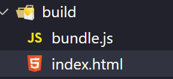

所以我们想配置一下配置

```js
const path = require('path');
module.exports = {
    output: {
        path: path.resolve(__dirname, './build')
        filename: 'js/bundle.js'
    }
}
```

这样再进行打包，打包出来的bundle.js文件就会是  build/js/bundle.js


当然前面的html也是可以配置的，如何配置呢？

先看一下vue打包出来的html

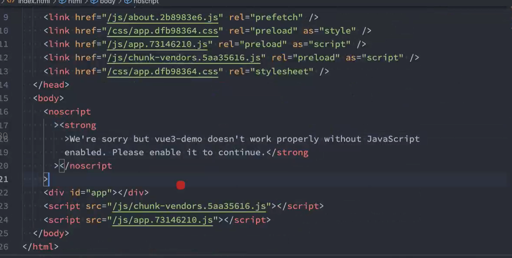

这里面的html比我们打包的文件多，这是为什么呢？这是因为它在打包的时候指定了一个模板

就是说我在打包的时候使用我指定的模板，而不使用webpack默认的模板


## 自定义HTML模板

如果我们想在自己的模块中加入一些比较特别的内容： 

- 比如添加一个noscript标签，在用户的JavaScript被关闭时，给予响应的提示； 
- 比如在开发vue或者react项目时，我们需要一个可以挂载后续组件的根标签 

这个我们需要一个属于自己的index.html模块：

```html
<!DOCTYPE html>
<html lang="">
  <head>
    <meta charset="utf-8">
    <meta http-equiv="X-UA-Compatible" content="IE=edge">
    <meta name="viewport" content="width=device-width,initial-scale=1.0">
    <link rel="icon" href="<%= BASE_URL %>favicon.ico">
    <title><%= htmlWebpackPlugin.options.title %></title>
  </head>
  <body>
    <noscript>
      <strong>We're sorry but <%= htmlWebpackPlugin.options.title %> doesn't work properly without JavaScript enabled. Please enable it to continue.</strong>
    </noscript>
    <div id="app"></div>
  </body>
</html>

```


创建一个文件夹叫public,在里面有一个index.html，这个html就是上面的模板

把vuecli的文件放到里面（也就是上面的模板）

./public/index.html

```html
<!DOCTYPE html>
<html lang="">
  <head>
    <meta charset="utf-8">
    <meta http-equiv="X-UA-Compatible" content="IE=edge">
    <meta name="viewport" content="width=device-width,initial-scale=1.0">
    <link rel="icon" href="<%= BASE_URL %>favicon.ico">
    <title><%= htmlWebpackPlugin.options.title %></title>
  </head>
  <body>
    <noscript>
      <strong>We're sorry but <%= htmlWebpackPlugin.options.title %> doesn't work properly without JavaScript enabled. Please enable it to continue.</strong>
    </noscript>
    <div id="app"></div>
  </body>
</html>

```


如何利用这个模板来打包呢？

在webpack配置一下html-webpack-plugin

```js
plugins: [
    new HtmlWebpackPlugin({
      template: "./public/index.html"
    })
]
```

打包

注意，这个时候会报错，因为

```html
    <link rel="icon" href="<%= BASE_URL %>favicon.ico">
	<title><%= htmlWebpackPlugin.options.title %></title>
    <strong>We're sorry but <%= htmlWebpackPlugin.options.title %> doesn't work properly without JavaScript enabled. Please enable it to continue.</strong>
```

这两行代码都是有问题的，第一行是 BASE_URL 这个变量是没有变量的,第二行和第三行是htmlWebpackPlugin.options.title这个变量也是不存在的，我们没有配置他

如果把这两行代码删掉的话，是可以打包成功的。（注意，必须要删掉，注释不行），打包完以后就可以生成一个文件./build/index.html 这个文件就和./public/index.html是一样的，因为我们指定了生成的模板就是按照这个文件来生成的

上面因为那两行代码打包失败了，是因为BASE_URL没有这个东西，那么如何填充这个东西呢？


## 自定义模板数据填充

上面的代码中，会有一些类似这样的语法<% 变量 %>，这个是EJS模块填充数据的方式。 

在配置HtmlWebpackPlugin时，我们可以添加如下配置： 

- template：指定我们要使用的模块所在的路径； 
- title：在进行htmlWebpackPlugin.options.title读取时，就会读到该信息；

webpack.config.js

```js
  plugins: [
    ...
    new HtmlWebpackPlugin({
      template: './public/index.html',
      title: '你好啊，李银河！'
    })
  ],
```

这里我们配置了title，也就是解决了，那么还有一个问题没有解决那就是 BASE_URL 这个变量没有定义，这个变量怎么定义呢？


## DefinePlugin的介绍

但是，这个时候编译还是会报错，因为在我们的模块中还使用到一个BASE_URL的常量：

```html
<link rel="icon" href="<%= BASE_URL %>favicon.ico">
```

但是我们并没有设置过这个常量值，所以会出现没有定义的错误,这个时候我们可以使用`DefinePlugin`插件；


## DefinePlugin的使用

DefinePlugin允许在编译时创建配置的全局常量，是一个webpack内置的插件（不需要单独安装）：

```js
const { DefinePlugin } = require("webpack");
plugins: [
    new HtmlWebpackPlugin({
      template: "./public/index.html"
    }),
    new DefinePlugin({ BASE_URL: "'./'" }),	// 注意，这里有两个引号
]
```

这个时候，编译template就可以正确的编译了，会读取到BASE_URL的值了

这样配置以后，再次打包，就不会报错了，并且会把./填充进去了，也就是说, 这个问题也解决了，这里的BASE_URL是有值的了

```html
<link rel="icon" href="<%= BASE_URL %>favicon.ico">
```

这里配置完了以后不会报错了，但是还有一个问题：

```html
<link rel="icon" href="<%= BASE_URL %>favicon.ico">
```

这里的BASE_URL解析完了以后会变成

```html
<link rel="icon" href="./favicon.ico">
```

也就是说这里引用了当前文件夹下的一个文件叫做favicon.ico，我们知道我们打包出来的html是在build这个文件夹中所以这里的favicon.ico这个文件应该是在build这个文件夹中的，但是我们现在是没有的，因为我们没有针对它做配置。

一般在开发中这个图标是浏览器tab的一个图标。这个图标在./public这个文件中，所以我们添加一个文件, ./public/favicon.ico


这个图标是在页面的table上面的，在vue-cli中他是放到public中的

public里面的图标是怎么通过webpack打包的呢？

其实是复制过去的，但是要注意的是html文件是作为模板要生成的，favicon.icon文件是要赋值的


## CopyWebpackPlugin

在vue的打包过程中，如果我们将一些文件放到public的目录下，那么这个目录会被复制到build文件夹中。 

- 这个复制的功能，我们可以使用CopyWebpackPlugin来完成；

安装CopyWebpackPlugin插件：

```
npm install copy-webpack-plugin -D
```

接下来配置CopyWebpackPlugin即可：

- 复制的规则在patterns中设置；
- from：设置从哪一个源中开始复制；
- to：复制到的位置，可以省略，会默认复制到打包的目录下；
- globOptions：设置一些额外的选项，其中可以编写需要忽略的文件：
  - .DS_Store：mac目录下会自动生成的一个文件；
  - index.html：也不需要复制，因为我们已经通过HtmlWebpackPlugin完成了index.html的生成；


public中我们放了一些东西

```js
    ├─public
    │      index.html	// 模板
    │      favicon.ico	// icon
```


html文件是作为我们的模板的，我们一般拿他作为模板来生成一个打包后的html的，所以我们不应该复制他，我们应该复制的是favicon.io这个文件，我们可以这样来配置

```js
plugins: [
    new CopyWebpackPlugin({
      patterns: [
        {
          from: "public",
          to: './',
          globOptions: {
            ignore: ["**/index.html"],
          },
        },
      ],
    }),
]
```

并且为了让结构更清晰，我们把js放到文件夹中

```js
  entry: "./src/index.js",
  output: {
    path: path.resolve(__dirname, "./build"),
    filename: "js/bundle.js",
  }
```


打包后的打包文件

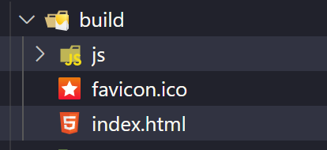


- 可以发现已经打包到build文件夹中了，但是注意，这个是复制过来

- 当然这个to一般不写，不写的话就默认放在build中，也就是和当前一样
- 它应该把to的这个./和上面的的output中的path做了一个拼接，也就是说我们只需要写个./就行了。
- 如果你写一个abc，那你就会在output文件夹在创建一个abc的文件夹。
- 所以写个./就行了


现在代码有两个问题

- 如果代码出错了

现在还有个问题，如果我们代码报错了怎么办

./src/js/component.js

```js
import '../font/iconfont.css'
function component() {
  const element = document.createElement('i');
  element.className = 'iconfont icon-ashbin';
  return element;
}
console.log(aaa.length);	// 注意：这里不存在aaa
document.body.appendChild(component());
```


打包以后，运行打包后的html,就会发现

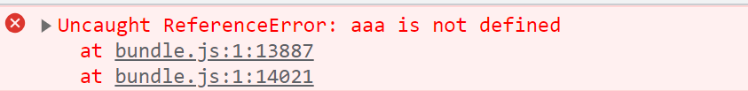

点开下面的bundle.js:1:13887

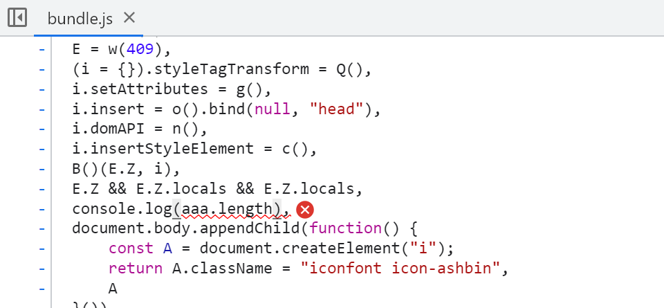

点开了以后发现是这里，但是这里并不是和我们的代码是一样的，如果我希望点开报错以后，错误信息能在我的源代码中显示出来

点开，找报错，所有代码在一行，没办法找到报错，比如代码量非常多的时候。


那么怎么办呢？ 

配置webpack

./webpack.config.js

```js
module.exports = {
  mode: 'development',	// 配置打包模式
  entry: "./src/index.js",
  output: {
    path: path.resolve(__dirname, "./build"),
    filename: "js/bundle.js",
  },
  ...
};

```


development是开发模式，打包过后的代码就是这样，他没有压缩了

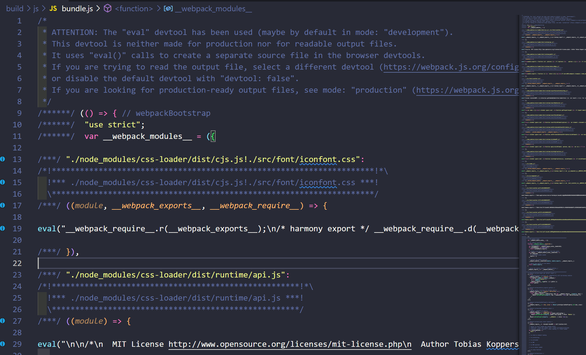

发现里面都是一些eval函数，里面都是字符串，因为默认有一个配置（见下面）,而且这里面的代码就是没有压缩的代码，这里面是字符串，它是通过eval函数运行

```js
module.exports = {
  mode: 'development',	// 配置打包模式
  devtool: 'eval',	// 这个配置是默认的，可以不用特地的去写
  entry: "./src/index.js",
  output: {
    path: path.resolve(__dirname, "./build"),
    filename: "js/bundle.js",
  },
  ...
};
```

这样配置完了以后，还是没有解决我们最初的问题，解决报错的时候不能跳转到我们源代码的位置

修改为`source-map`

./webpack.config.js

```js
module.exports = {
  mode: 'development',	// 配置打包模式
  devtool: 'source-map',	// 这样配置以后就可以在浏览器看到每一行代码了
  entry: "./src/index.js",
  output: {
    path: path.resolve(__dirname, "./build"),
    filename: "js/bundle.js",
  },
  ...
};
```

重新打包就会生成一个bundle.js.map文件，他就是一个映射文件，他可以把它们看不懂的源代码映射到我们开发的代码文件中


./build/js/bundle.js

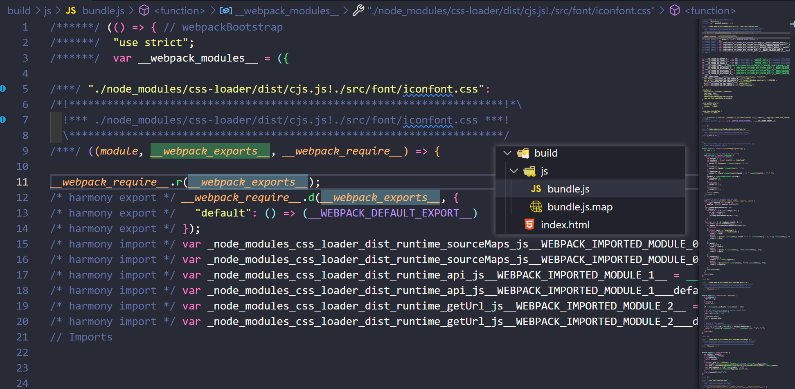


./build/js/bundle.js.map

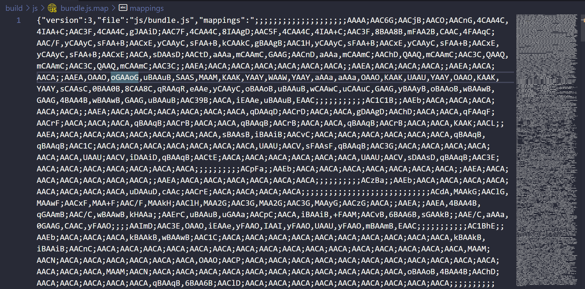


再打开我们的报错就会发现可以方便的找到我们的文件

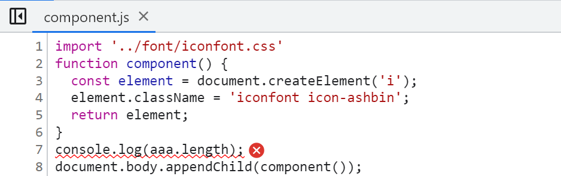

这里其实可以设置非常多的值，这里设置成`source-map`就行了

`devtool`的配置非常多，大概有将近10个值，我们这里用的`source-map`就行


## Mode配置

前面我们一直没有讲mode。 

Mode配置选项，可以告知webpack使用响应模式的内置优化：

- 默认值是production（什么都不设置的情况下）； 

- 可选值有：'none' | 'development' | 'production'；

这几个选项有什么样的区别呢?

开发阶段会设置为development,生产阶段会设置为production

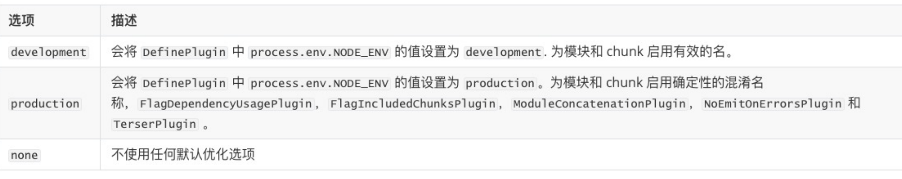


## Mode配置代表更多

一旦你设置了mode，那么代码你配置了这么多东西

devtoo，默认是eval

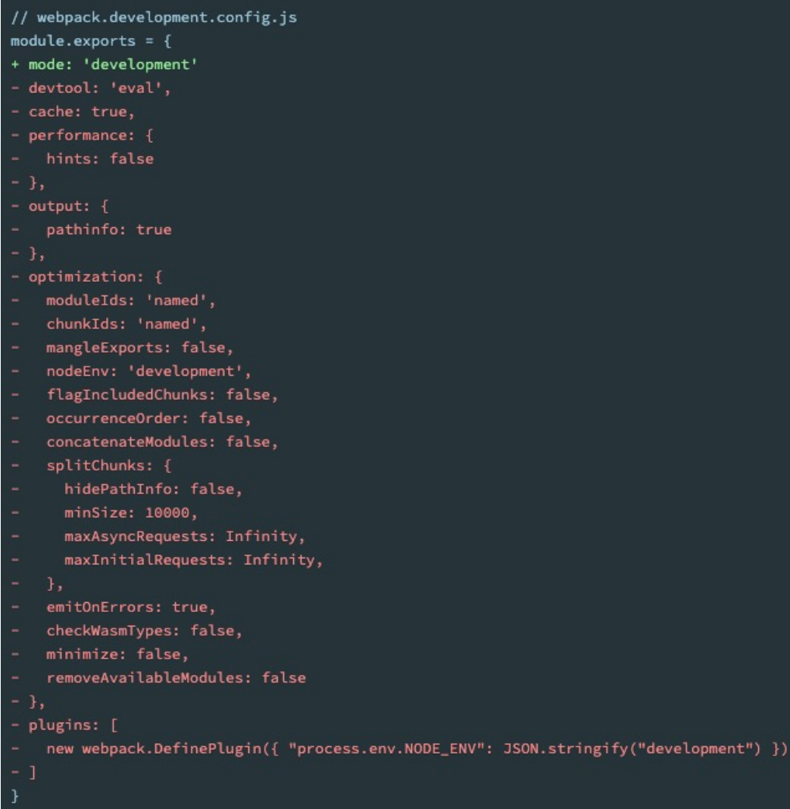


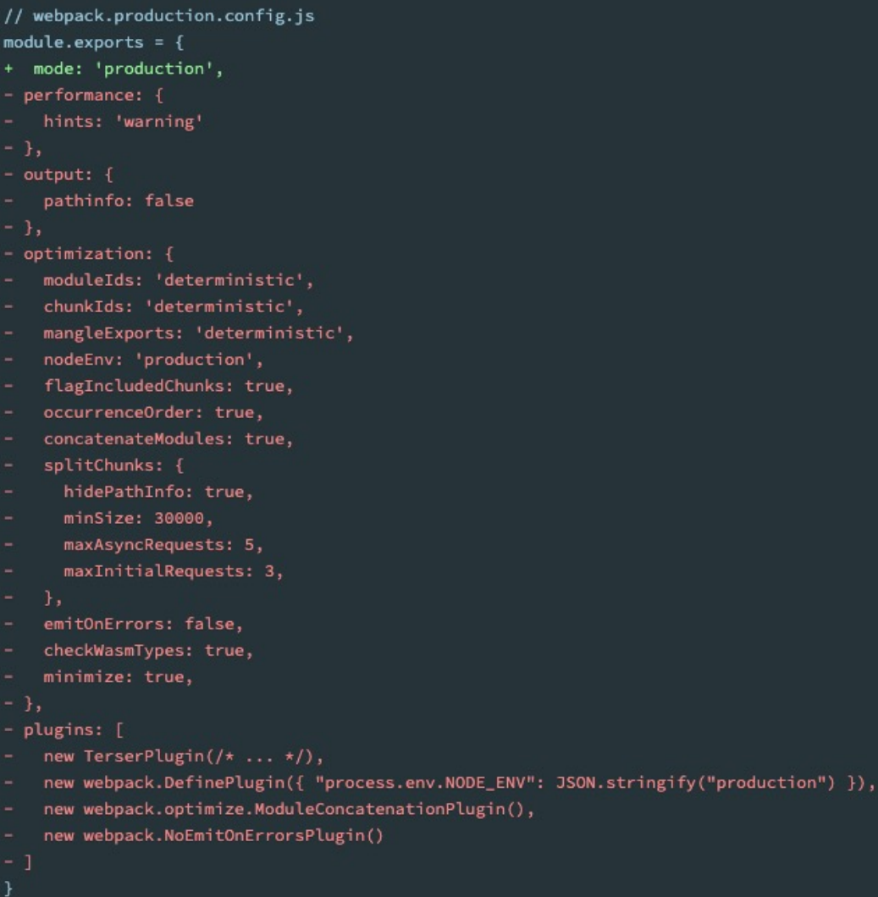


通过上面可以看出，要想设置devtool，必须设置mode
