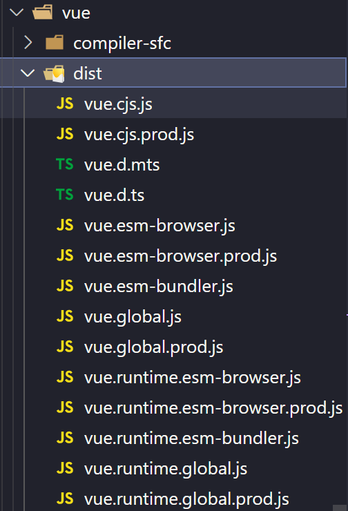
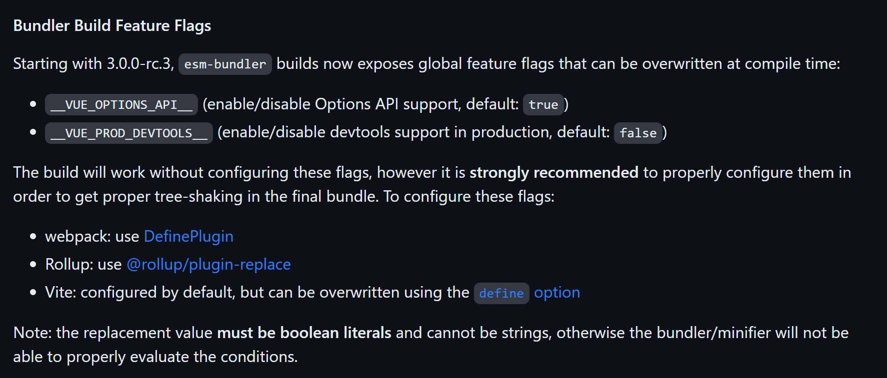
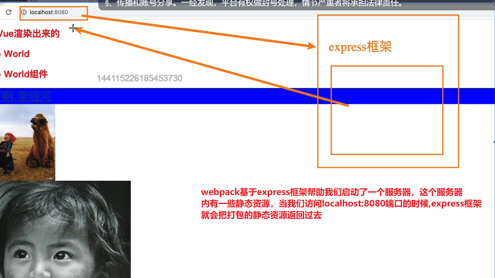
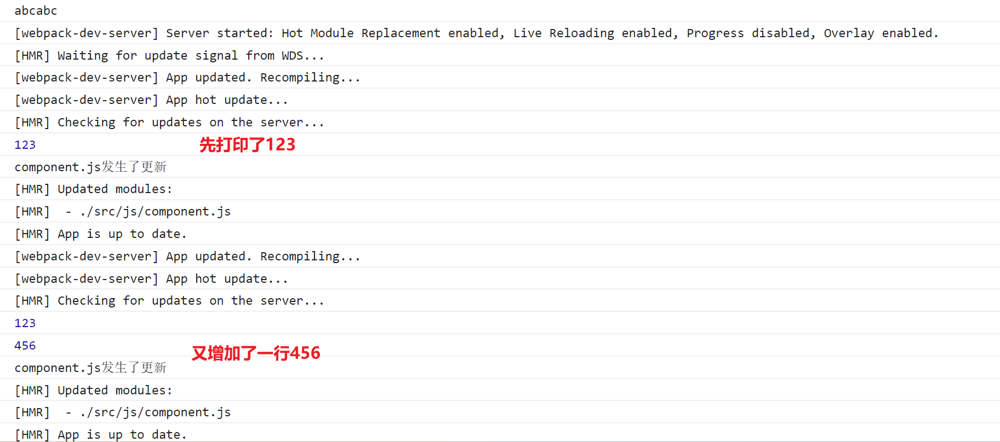
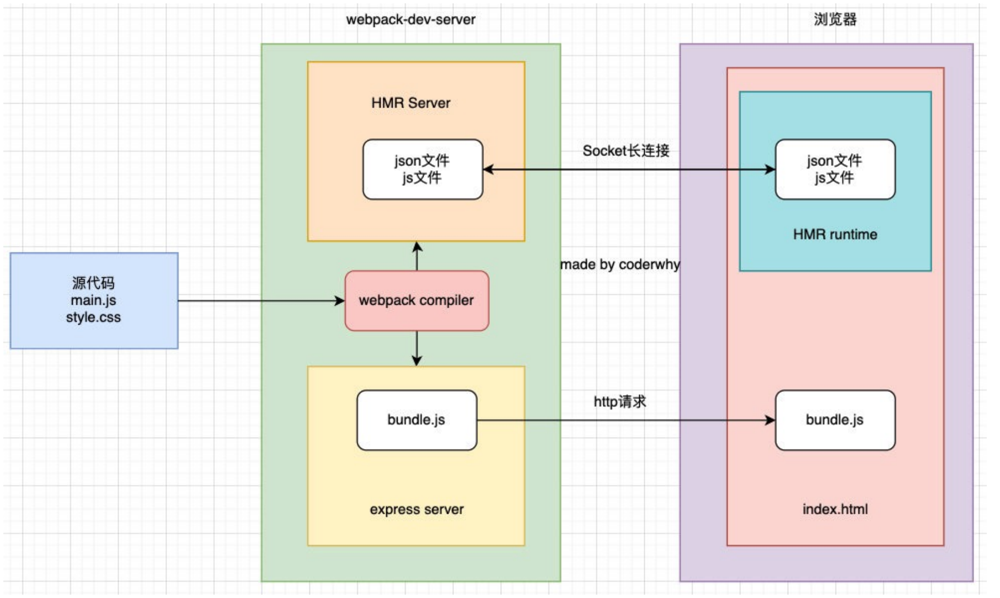
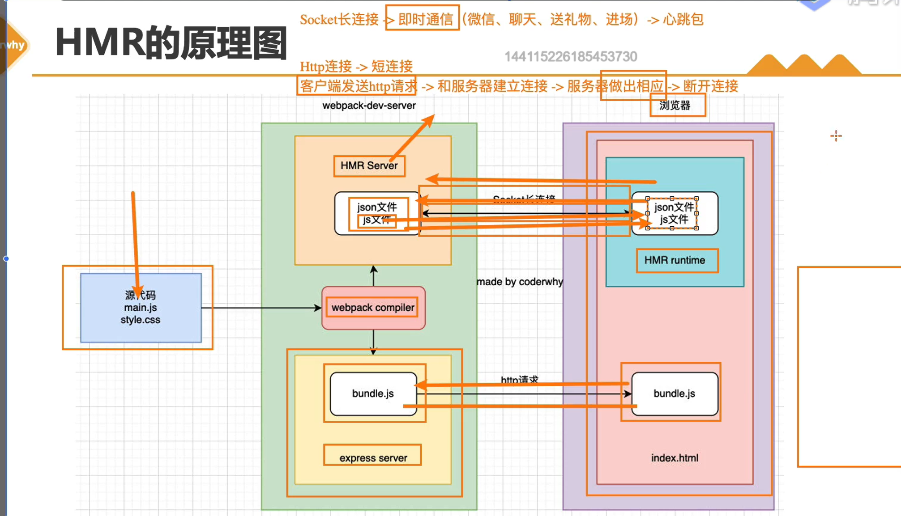
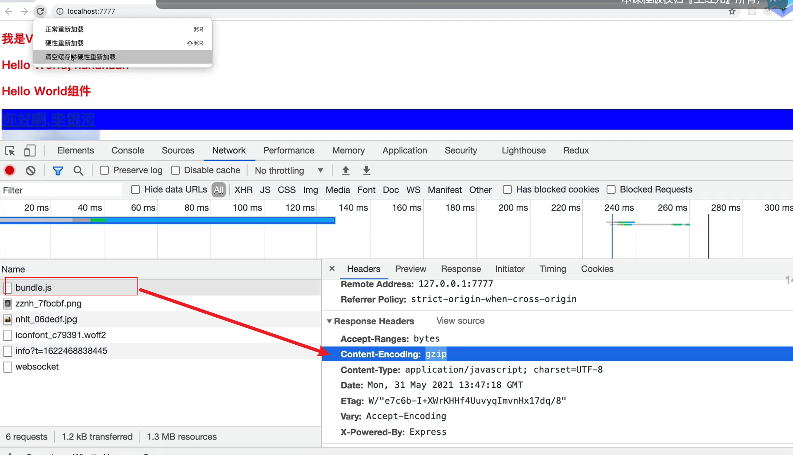

## 为什么需要babel？

事实上，在开发中我们很少直接去接触babel，但是babel对于前端开发来说，目前是不可缺少的一部分：

- 开发中，我们想要使用ES6+的语法，想要使用TypeScript，开发React项目，它们都是离不开Babel的； 
- 所以，学习Babel对于我们理解代码从编写到线上的转变过程至关重要；

那么，Babel到底是什么呢？ 

- Babel是一个工具链，主要用于旧浏览器或者环境中将ECMAScript 2015+代码转换为向后兼容版本的 JavaScript； 
- 包括：语法转换、源代码转换等；

例如这些es6的方法

```js
const aaa = '123';
let bbb = '123';
[1, 2, 3].map(n => n+1);
[1, 2, 3].map(function (n) {
    return n + 1;
})
```


## Babel命令行使用

babel本身可以作为一个独立的工具（和postcss一样），不和webpack等构建工具配置来单独使用。

如果我们希望在命令行尝试使用babel，需要安装如下库：

- @babel/core：babel的核心代码，必须安装；
- @babel/cli：可以让我们在命令行使用babel；

```
npm install @babel/cli @babel/core -D
```


创建一个js文件

./test.js

```js
const aaa = '123';
let bbb = '123';
[1, 2, 3].map(n => n+1);
[1, 2, 3].map(function (n) {
    return n + 1;
})
```

因为我们刚才是局部安装，所以我们执行局部的babel的话要用 npx

执行，使用babel来处理我们的源代码：

```js
npx babel test.js --out-file newTest.js
// test.js是我们需要通过babel转换的文件名, newTest.js是转换后的文件名
npx babel src --out-dir dist
// src: 你要转换的文件的目录， dist是转换后的新目录
```

这两种都是可以的，因为我们用的是单文件，而不是文件夹

```shell
npx babel test.js --out-file newTest.js
```

执行完了以后

./newTest.js

```js
const aaa = '123';
let bbb = '123';
[1, 2, 3].map(n => n+1);
[1, 2, 3].map(function (n) {
    return n + 1;
})
```

这样就能输出newTest.js的文件，但是也是没有转成es5的代码


babel官网

https://babeljs.io/

为什么输出的依然是es6？

在使用babel的时候如果想转换语法，需要用一些插件

想把箭头函数转成普通函数，就可以用插件


## babel插件的使用

箭头函数插件

比如我们需要转换箭头函数，那么我们就可以使用箭头函数转换相关的插件：

```
npm install @babel/plugin-transform-arrow-functions -D
```

```
npx babel test.js --out-file newTest.js --plugins=@babel/plugin-transform-arrow-functions
```

打包完以后箭头函数就帮我们改过来了

./newTest.js

```js
const aaa = '123';
let bbb = '123';
[1, 2, 3].map(function (n) {
  return n + 1;
});
[1, 2, 3].map(function (n) {
  return n + 1;
});
```


查看转换后的结果：我们会发现 const 并没有转成 var 

- 这是因为 plugin-transform-arrow-functions，并没有提供这样的功能； 
- 我们需要使用 plugin-transform-block-scoping 来完成这样的功能；

转换const、let

下载插件

```js
npm install @babel/plugin-transform-block-scoping -D
```

执行

```
npx babel test.js --out-file newTest.js --plugins=@babel/plugin-transform-block-scoping,@babel/plugin-transform-arrow-functions
```

执行完以后

./newTest.js

```js
var aaa = '123';
var bbb = '123';
[1, 2, 3].map(function (n) {
  return n + 1;
});
[1, 2, 3].map(function (n) {
  return n + 1;
});

```


## Babel的预设preset（预设）

但是如果要转换的内容过多，一个个设置是比较麻烦的，我们可以使用预设（preset）： 

- 后面我们再具体来讲预设代表的含义；

安装@babel/preset-env预设：

```
npm install @babel/preset-env -D
```

执行如下命令：

```
npx babel test.js --out-file newTest.js --presets=@babel/preset-env
```

注意：这里是 --presets

执行完了以后打包出来的文件就是这样

./newTest.js

```js
"use strict";

var aaa = '123';
var bbb = '123';
[1, 2, 3].map(function (n) {
  return n + 1;
});
[1, 2, 3].map(function (n) {
  return n + 1;
});

```


## Babel**的底层原理**

babel是如何做到将我们的一段代码（ES6、TypeScript、React）转成另外一段代码（ES5）的呢？

- 从一种源代码（原生语言）转换成另一种源代码（目标语言），这是什么的工作呢？
- 就是编译器，事实上我们可以将babel看成就是一个编译器。
- Babel编译器的作用就是将我们的源代码，转换成浏览器可以直接识别的另外一段源代码；

Babel也拥有编译器的工作流程：

- 解析阶段（Parsing）
- 转换阶段（Transformation）
- 生成阶段（Code Generation）

github上的一个简单的编译器：https://github.com/jamiebuilds/the-super-tiny-compiler


## Babel编译器执行原理

Babel的执行阶段


当然，这只是一个简化版的编译器工具流程，在每个阶段又会有自己具体的工作：


可以去视频看，了解一下就行


打包

这里的代码依然是es6，并没有转换成es5。

```js
[1, 2, 3].forEach((o) => {
  console.log(o);
});

```

讲道理应该不会转换的，应为webpack不会帮助转换，那不是它的工作，它的工作只是打包

那么如何在打包的时候也能将es6代码转成es5呢？


## babel-loader

在webpack中怎么通过babel将es6的代码转成es5的代码呢？

首先要知道，如果不做任何配置，webpack是不会自动将es6的代码转成es5的代码，因为那不是webpack的工作，它的工作只是打包

那么如何在打包的时候也能将es6代码转成es5呢？答案是使用loader


在实际开发中，我们通常会在构建工具中通过配置babel来对其进行使用的，比如在webpack中。

那么我们就需要去安装相关的依赖：

- 因为`@babel/core`是babel的核心代码所以这个包是一定要安装的
- 其次要安装`babel-loader`

- 如果之前已经安装了@babel/core，那么这里不需要再次安装；

```
npm install babel-loader @babel/core -D
```

我们可以设置一个规则，在加载js文件时，使用我们的babel：


./src/index.js

```js
const aab = 123;
let aac = 456;
[1, 2, 3].map(n => n+1);
[1, 2, 3].map(function (n) {
    return n + 1;
})
```


./webpack.config.js

```js
module: {
    rules: [
        {
            test: /\.js$/,
            use: [
                {loader: 'babel-loader'}
            ]
        }
    ]
}
```

本质上用的就是babel

然后我们再打包看一下./build/bundle.js

./build/bundle.js

```js
/******/ (() => { // webpackBootstrap
var __webpack_exports__ = {};
/*!**********************!*\
  !*** ./src/index.js ***!
  \**********************/
// import './js/component.js';
const aab = 123;
let aac = 456;
[1, 2, 3].map(n => n + 1);
[1, 2, 3].map(function (n) {
  return n + 1;
});
/******/ })()
;
//# sourceMappingURL=bundle.js.map
```

这里是没有转化的，原因和前面我们使用babel-cli的时候是一样的，babel-loder是babel的核心代码，他不会去转换es6的代码


## 指定使用的插件

我们必须指定使用的插件才会生效,比如，我们想要对箭头函数，const,let这些es6的语法转化成es5,那么我们需要用刚才我们用到的那些插件

重新下载插件

```js
npm install @babel/plugin-transform-block-scoping @babel/plugin-transform-arrow-functions -D
```


重新配置

```js
  module: {
    rules: [
      {
        test: /\.js$/,
        use: [
          {
            loader: 'babel-loader',
            options: {
              plugins: [
                "@babel/plugin-transform-block-scoping",
                "@babel/plugin-transform-arrow-functions"
              ]
            }
          }
        ]
      }
    ]
  },
```

打包后打开打包的文件

./build/bundle.js

```js
/******/ (() => { // webpackBootstrap
var __webpack_exports__ = {};
/*!**********************!*\
  !*** ./src/index.js ***!
  \**********************/
// import './js/component.js';
var aab = 123;
var aac = 456;
[1, 2, 3].map(function (n) {
  return n + 1;
});
[1, 2, 3].map(function (n) {
  return n + 1;
});
/******/ })()
;
//# sourceMappingURL=bundle.js.map
```

现在的文件就是转换完，并且打包后的文件了。

当然，如果要下载所有的插件，还是很麻烦的，箭头函数，const...


## babel-preset

如果我们一个个去安装使用插件，那么需要手动来管理大量的babel插件，我们可以直接给webpack提供一个 preset，webpack会根据我们的预设来加载对应的插件列表，并且将其传递给babel。

比如常见的预设有三个:

- env
- react
- TypeScript

安装preset-env：

```
npm install @babel/preset-env
```

配置

```js
  module: {
    rules: [
      {
        test: /\.js$/,
        use: [
          {
            loader: 'babel-loader',
            options: {
              presets: ['@babel/preset-env']
            }
          }
        ]
      }
    ]
  },
```

注意：presets是一个数组，是因为它可以传多个preset,比如传入react的预设或者vue的预设等


打包，依然可以实现

./build/bundle.js

```js
/******/ (() => { // webpackBootstrap
var __webpack_exports__ = {};
/*!**********************!*\
  !*** ./src/index.js ***!
  \**********************/
// import './js/component.js';
var aab = 123;
var aac = 456;
[1, 2, 3].map(function (n) {
  return n + 1;
});
[1, 2, 3].map(function (n) {
  return n + 1;
});
/******/ })()
;
//# sourceMappingURL=bundle.js.map
```


options文件写太多的话会显得webpack.config.js太拥挤了，我们可以这样做


## Babel的配置文件

像之前一样，我们可以将babel的配置信息放到一个独立的文件中，babel给我们提供了两种配置文件的编写：

- babel.config.json（或者.js，.cjs，.mjs）文件；
- .babelrc.json（或者.babelrc，.js，.cjs，.mjs）文件；

它们两个有什么区别呢？目前很多的项目都采用了多包管理的方式（babel本身、element-plus、umi等）；

- .babelrc.json：早期使用较多的配置方式，但是对于配置Monorepos项目是比较麻烦的；
- babel.config.json（babel7）：可以直接作用于Monorepos项目的子包，更加推荐；
- 

./webpack.config.js

```js
  module: {
    rules: [
      {
        test: /\.js$/,
        loader: "babel-loader"
      },
    ],
  },
```


新建一个文件

./babel.config.js

```js
module.exports = {
  presets: ['@babel/preset-env']
}
```

这样配置以后就webpack.config.js就更简洁一些了


## Vue源码的打包

我们课程主要是学习Vue的，那么我们应该包含Vue相关的代码：

在前面，js代码，css代码，等都可以打包，但是，vue代码没有打包，那么如何打包呢？

在前面写的代码中，我们是通过cdn来引用vue，然后来写的，

但是在这里我们不引用了，我们将vue代码下载下来，把他当成一个模块在webpack打包

```js
npm install vue // 注意这里不要跟 -D
```


src/index.js

```js
import { createApp } from "vue";

const arr = [1, 2, 3];
arr.forEach((item) => {
  console.log(item);
})

createApp({
  template: '<h2>你好啊，李银河</h2>',
  data: () => {
    return {}
  }
}).mount('#app');
```


public/index.html

```js
<!DOCTYPE html>
<html lang="">
  <head>
    <meta charset="utf-8">
    <meta http-equiv="X-UA-Compatible" content="IE=edge">
    <meta name="viewport" content="width=device-width,initial-scale=1.0">
    <link rel="icon" href="<%= BASE_URL %>favicon.ico">
    <title><%= htmlWebpackPlugin.options.title %></title>
  </head>
  <body>
    <noscript>
      <strong>We're sorry but <%= htmlWebpackPlugin.options.title %> doesn't work properly without JavaScript enabled. Please enable it to continue.</strong>
    </noscript>
    <div id="app"></div>
  </body>
</html>

```

配置完以后，执行 `npm run build`

打包完以后会发现页面没有显示任何内容

>注意：如果用render函数和.vue函数是没问题的，但是目前这种，里面的template就不能解析

控制台给我们这个信息


vue源代码对我们的vue代码进行解析，vue有两种类型的版本，版本一：runtime + compiler; 版本二：runtime-only，版本二不对template进行编译

这是因为vue有各种不同的版本，runtime-only是vue的默认版本，它不包含对template的编译，所以它会出现警告，并且不会渲染，上面警告就是说，当前有template，但是当前这个版本不支持，所以不显示

上面举例的是两个版本，但是vue其实不止两个版本，有很多版本




## Vue打包后不同版本解析

vue(.runtime).global(.prod).js：

- .runtime表示，这个东西可有可无，如果你需要用compile对template进行解析的话，就用，如果不需要就不用，当然不用的话包就会小一点

- .prod表示要不要用prodction版本，这个版本更小，压缩过的

-  通过浏览器中的 <script src="..."> 直接使用；

- 我们之前通过CDN引入和下载的Vue版本就是这个版本；
- 会暴露一个全局的Vue来使用；
- cdn的地址是这个
  - https://unpkg.com/vue@3.3.4/dist/vue.global.js


vue(.runtime).esm-browser(.prod).js：

- 用于通过原生 ES 模块导入使用 (在浏览器中通过 <script type="module"> 来使用)。
- 如果通过cdn引入，然后再script中定义一个type为module的话，script用的就是esmodule的版本


vue(.runtime).esm-bundler.js：

- 用于 webpack，rollup 和 parcel 等构建工具；
- 构建工具中默认是vue.runtime.esm-bundler.js；
- 如果我们需要解析模板template，那么需要手动指定vue.esm-bundler.js；


vue.cjs(.prod).js：

- 服务器端渲染使用；
- 通过require()在Node.js中使用；


如果想解析，必须要runtime+compiler，vue.esm-bundle就是包含了runtime+compiler，其中runtime是运行时，是vue运行的必要代码，compiler是用来解析template的

当我们知道每个版本的意义之后，我们就可以重新引入vue的文件了

./src/index.js

```js
import { createApp } from "vue/dist/vue.esm-bundler";
const arr = [1, 2, 3];
arr.forEach((item) => {
  console.log(item);
});

createApp({
  template: "<h2>你好啊，李银河</h2>",
  data: () => {
    return {};
  },
}).mount("#app");

```

打包完了以后，界面就能显示出来了


## 运行时+编译器 vs 仅运行时

在Vue的开发过程中我们有三种方式来编写DOM元素： 

- 方式一：template模板的方式（之前经常使用的方式）； 

  - ```js
    template: "<h2>你好啊，李银河</h2>",
    ```

- 方式二：render函数的方式，使用h函数来编写渲染的内容； 

- 方式三：通过.vue文件中的template来编写模板；

它们的模板分别是如何处理的呢？ 

- 方式二中的h函数可以直接返回一个虚拟节点，也就是Vnode节点； 
- 方式一和方式三的template都需要有特定的代码来对其进行解析：
  - 方式三.vue文件中的template可以通过在vue-loader对其进行编译和处理； 
  - 方式一种的template我们必须要通过源码中一部分代码来进行编译；

所以，Vue在让我们选择版本的时候分为 运行时+编译器 vs 仅运行时 

- 运行时+编译器包含了对template模板的编译代码，更加完整，但是也更大一些； 
- 仅运行时没有包含对template版本的编译代码，相对更小一些；

我们前门的./src/index.js有一个缺点,就是我们的html代码写在了字符串中

```js
template: "<h2>你好啊，李银河</h2>",
```

这样写没有任何代码提示，开发也不友好，在前面学习的时候我们是放到html文件中的，那么我们在这里能不能放在html中呢

./public/index.html

```html
<!DOCTYPE html>
<html lang="">
  <head>
    <meta charset="utf-8">
    <meta http-equiv="X-UA-Compatible" content="IE=edge">
    <meta name="viewport" content="width=device-width,initial-scale=1.0">
    <link rel="icon" href="<%= BASE_URL %>favicon.ico">
    <title><%= htmlWebpackPlugin.options.title %></title>
  </head>
  <body>
    <noscript>
      <strong>We're sorry but <%= htmlWebpackPlugin.options.title %> doesn't work properly without JavaScript enabled. Please enable it to continue.</strong>
    </noscript>
    <div id="app"></div>
        
     // 将模板放到了这里
    <template id="my-app">
      <h2>你好啊，李银河</h2>
    </template>
  </body>
</html>
```


./src/index.js

```js
import { createApp } from "vue/dist/vue.esm-bundler";
const arr = [1, 2, 3];
arr.forEach((item) => {
  console.log(item);
});

createApp({
  template: "#my-app",
  data: () => {
    return {};
  },
}).mount("#app");

```

这样修改完以后，我们的页面依然显示正常


虽然这样也是正常的，但是显然把模板和js代码分离是不方便的，例如我增加一个变量，我还要去html文件修改一下，所以我们可以编写.vue的文件


## VSCode对SFC文件的支持

在前面我们提到过，真实开发中多数情况下我们都是使用SFC（ single-file components (单文件组件) ）。

我们先说一下VSCode对SFC的支持：  

- 插件一：Vetur，从Vue2开发就一直在使用的VSCode支持Vue的插件； 
- 插件二：Volar，官方推荐的插件（后续会基于Volar开发官方的VSCode插件）；

下载了一个插件叫 volar,这个插件是尤大推荐的，对vue3支持比较好


## 编写App.vue代码

回到刚才的问题，把模板和js代码分离是不方便的，例如我增加一个变量，我还要去html文件修改一下，所以我们可以编写.vue的文件

接下来我们编写自己的App.vue代码：

./src/index.js

```js
import { createApp } from "vue/dist/vue.esm-bundler";
import App from './vue/App.vue';
const app = createApp(App)
app.mount('#app');
```


./src/vue/App.vue

```vue
<template>
  <h2>你好啊，李银河</h2>
  <h3>{{ message }}</h3>
</template>

<script>
export default {
  data: () => {
    return {
      message: '我是vue渲染出来的'
    }
  }
}
</script>
<style>
  h3{
    color: red
  }
</style>

```


## vue-loader、@vue/compiler-sfc

这样写完以后打包会报错，因为我们没有处理vue文件的loader

注意，处理vue的文件相较于css,js来说会相对复杂一些，首先我们需要下载vue-loader

```shell
npm install vue-loader -D
```

下载完以后还没完，因为vue-loader他依赖一个包叫做@vue/compiler-sfc,这个包是用来编译我们template模板的，所以我们必须要下载这个包

```shell
npm install @vue/compiler-sfc -D
```


安装完以后我们就可以配置了，配置支持vue文件的webpack注意,还需要配置一个plugin

./webpack.config.js

```js
const { VueLoaderPlugin } = require('vue-loader/dist/index');
module.exports = {
    module: {
        rules: [
            ...
            {
               test: /\.vue$/, 
               loader: 'vue-loader'
            }
        ]
	},
    plugins: [
        ...,
        new VueLoaderPlugin()	// 注意，这里的plugin是和vue-loader一块用的，必须要有这个东西
    ]
}

```

这样配置完了以后，就可以进行打包，打包完了以后，就可以正常在页面显示了

就会发现我们在.vue文件中写的template中的html和style中的css都起作用了。

这个就是我们再webpack中打包vue文件，当然也还可以打包很多.vue文件，例如全局注册.vue文件，或者局部注册.vue文件等


## 全局标识的配置

我们会发现控制台还有另外的一个警告：


https://link.vuejs.org/feature-flags

在GitHub上的文档中我们可以找到说明：



- `__VUE_OPTIONS_API__`表示是否支持vue2的optionsApi,默认是支持的，如果你设置为false，那么他不会打包支持兼容vue2的optionsApi的代码
- `__VUE_PROD_DEVTOOLS__`表示是否支持devTools，是vue的调试工具，默认是false,devTools是vue的浏览器辅助插件，可以看到vue的状态、组件等等信息
- 他是说，虽然他们都有默认值，但是强烈建议我们手动对他们进行配置；

配置这两个属性

./webpack.config.js

```js
  plugins: [
    ...
    new DefinePlugin({
      BASE_URL: "'./'",
      __VUE_OPTIONS_API__: true,
      __VUE_PROD_DEVTOOLS__: false,
    }),
  ],
```

这两个属性是在DefinePlugin这个插件配置的，配置完再打包就不会有报错了


还有一个注意点：

前面我们说我们使用的vue版本是

./src/index.js

```js
import { createApp } from "vue/dist/vue.esm-bundler";
...
```

使用这个版本的原因是我们需要对我们写的template模板做解析，这个版本的vue有对template模板解析的代码，但是现在我们没有template了，因为我们使用的是.vue文件，他的template是不会交给他来解析的，那么.vue文件里面的template是交给谁来解析的呢？

.vue文件里面的template模板实际上是交给vue-loader来解析的，而vue-loader实际上是交给了`@vue/compiler-sfc`来解析的，这也就是为什么我们在使用vue-loader的时候为什么还需要安装这么一个库

那当前我可以通过`@vue/compiler-sfc`来解析template了，我是不是就可以不使用这个vue版本了呢

答案是肯定的，我们可以使用其他的版本，因为vue.esm-bundler这个版本是比较大的，因为它存在解析模板的代码，但是我们不需要它解析，所以我们可以使用其他不存在解析模板的vue版本，在这里的话，我们可以直接这样来用

./src/index.js

```js
import { createApp } from "vue";	// 使用这个vue版本
import App from './vue/App.vue';
const app = createApp(App)
app.mount('#app');

```

改成这样以后再接着打包，依然是可以运行的。

现在还有一个问题，就是每修改一个代码，都需要打包，这是很麻烦的。

那么怎么办呢


## 为什么要搭建本地服务器？

目前我们开发的代码，只要修改了一点代码，为了运行需要有两个操作：

- 操作一：npm run build，编译相关的代码；
- 操作二：通过live server或者直接通过浏览器，打开index.html代码，查看效果；

这个过程经常操作会影响我们的开发效率，我们希望可以做到，当文件发生变化时，可以自动的完成编译 展示；

为了完成自动编译，webpack提供了几种可选的方式：

- webpack watch mode； 
- webpack-dev-server（常用）； 
- webpack-dev-middleware(一般不用这种方式)；


## Webpack watch

webpack给我们提供了watch模式： 

- 在该模式下，webpack依赖图中的所有文件，只要有一个发生了更新，那么代码将被重新编译； 
- 我们不需要手动去运行 npm run build指令了；

如何开启watch呢？两种方式： 

- 方式一：在导出的配置中，添加 watch: true； 
- 方式二：在启动webpack的命令中，添加 --watch的标识；

这里我们选择方式二，在package.json的 scripts 中添加一个 watch 的脚本：

./package.json

```json
  "scripts": {
    "build": "webpack --watch"
  },
```

改了配置以后其实是把webpack-cli 中的watch改成了true，webpack-cli会帮助我们处理这个选项，然后再webpack.config.js中导出的配置中添加一个配置就是 watch: true

这样就处于监听中


这个时候，只要我们修改了代码，webpack就会帮助我们重新编译，页面也会重新刷新，当然，浏览器中页面的刷新是vscode中live server这个插件帮助我们完成的，不是webpack帮助我们完成的


这种监听是是一种方式


第二种方式：

在webpack.config.js中配置watch来进行监听

我们说了第一种方式实际上在底层就是在webpack的配置上给我们加了个watch: true,那么我们也可以自己去webpack.config.js中添加这个配置

./webpack.config.js

```js
module.exports = {
  mode: "development",
  devtool: "source-map",
  entry: "./src/index.js",
  output: {
    path: path.resolve(__dirname, "./build"),
    filename: "js/bundle.js",
  },
  watch: true	// 监听代码的更新，然后webpack重新打包
  ...
}
```

这样的效果和上面再package.json中添加 --watch 是一样的


## webpack-dev-server

上面的方式可以监听到文件的变化，但是事实上它本身是没有自动刷新浏览器的功能的： 

- 当然，目前我们可以在VSCode中使用live-server来完成这样的功能； 
- 但是，我们希望在不使用live-server的情况下，可以具备live reloading（实时重新加载）的功能；

安装webpack-dev-server

```
npm install webpack-dev-server -D
```

修改配置文件，告知webpack-dev-server，从什么位置查找文件：

./package.json

```json
  "scripts": {
    "build": "webpack",
    "serve": "webpack serve"
  },
```

> 配置了这个的话，我们就不需要在webpack.config.js中配置watch了，因为webpack-dev-serve会帮助我们开启监听

当这样做的时候，执行 npm run server,他就会执行webpack server  通过webpack-dev-server来建立一个本地服务器， 有了这个插件，有没有live-server都可以

这个就是webpack给我搭建的基于node的express框架建立的服务器,而不是live-server帮我开启的


这里的webpack-dev-server仅仅是在webpack后面加了个serve, 其他没有做任何配置，但是就可以启动，为什么呢？

因为我们在运行webpack的时候实际上运行的是webpack-cli，它接收到一个参数server,就会帮我们运行webpack-dev-server了

我们在运行`npm run server`的时候，是没有把我们的src中的源代码打包，生成目标代码的(build)。如果你执行了这个命令之后的话，可以看到生成了一个空的build文件夹的，也就是说我们在运行npm run server的时候，虽然打包输出了一个文件夹，但是这个文件夹没有任何东西，也就是说我们的src代码没有打包进去。

既然没有生成目标代码，那么他是怎么做的呢？

webpack-dev-server 在编译之后不会写入到任何输出文件，而是将 bundle 文件保留在内存中： 

- 事实上webpack-dev-server使用了一个库叫memfs（memory-fs webpack自己写的）
- webpack给我们开启了一个服务器，有了这个服务器，有没有live-server都可以，因为我们不通过live-server来开启服务器的
- 既然我们的代码没有打包出去，那么我们是如何能访问呢？
- 其实我们的webpack是对代码有编译和打包的，只是没有做输出，没有做文件的写入，先放到内存里面，通过express服务器来访问刚才打包的内存里面的静态资源，我们的浏览器访问的时候也是访问内存里面的静态资源。为什么不输出呢？
- 从我们的文件系统里面先读到内存里面，再转换成一些数据流，再返回给浏览器，但是webpack-dev-server为了增加开发效率会将开发的资源直接放到内存里面，就相当于少了一个从文件，到内存的过程，这种效率就高一点，浏览器访问就快一点
- 
- 这里用到了一个库 memfs  相当于内存的一个系统


当然，上面我们没有做任何配置，他就帮助我们做了很多的事，例如帮我们开启一个服务器，帮助我们做一个监听，等等，其实还有很多的事，但是注意，他不会帮助我们打包，但是其实webpack-dev-server还可以做一些配置。

./webpack.config.js

```js
const path = require("path");
const { CleanWebpackPlugin } = require("clean-webpack-plugin");
const HtmlWebpackPlugin = require("html-webpack-plugin");
const { DefinePlugin } = require("webpack");
const { VueLoaderPlugin } = require("vue-loader/dist/index");
module.exports = {
  mode: "development",
  devtool: "source-map",
  entry: "./src/index.js",
  output: {
    path: path.resolve(__dirname, "./build"),
    filename: "js/bundle.js",
  },
  // devServer的配置是写到这里的
  devServer: {

  }
  ...
};

```


static：

从static配置的路径进行查找并加载


例如我们引入了一个资源

./public/index.html

```html
<!DOCTYPE html>
<html lang="">
  <head>
    <meta charset="utf-8">
    <meta http-equiv="X-UA-Compatible" content="IE=edge">
    <meta name="viewport" content="width=device-width,initial-scale=1.0">
    <link rel="icon" href="<%= BASE_URL %>favicon.ico">
    <title><%= htmlWebpackPlugin.options.title %></title>
  </head>
  <body>
    <noscript>
      <strong>We're sorry but <%= htmlWebpackPlugin.options.title %> doesn't work properly without JavaScript enabled. Please enable it to continue.</strong>
    </noscript>
    <div id="app"></div>
    <template id="my-app">
      <h2>你好啊，李银河</h2>
    </template>
    <!-- 我们引入了这样一个资源 -->
    <script src="./abc.js"></script>
  </body>
</html>
```

建立一个文件夹,以及一个文件

/abc/abc.js

```js
console.log('abcabc');
```

注意这个文件夹在根目录


当我们运行的时候，html文件会加载abc.js，但是在public文件夹中是不存在abc.js这个文件的，所以我们可以配置一下

./webpack.config.js

```js
const path = require("path");
const { CleanWebpackPlugin } = require("clean-webpack-plugin");
const HtmlWebpackPlugin = require("html-webpack-plugin");
const { DefinePlugin } = require("webpack");
const { VueLoaderPlugin } = require("vue-loader/dist/index");
module.exports = {
  mode: "development",
  devtool: "source-map",
  entry: "./src/index.js",
  output: {
    path: path.resolve(__dirname, "./build"),
    filename: "js/bundle.js",
  },
  // devServer的配置是写到这里的
  devServer: {
    // 这里是一个数组，可以放多个静态资源的目录
    static: [
      {
        directory: path.join(__dirname, 'abc'),
      },
    ]
  },
  ...
};
```

当我们这样配置以后，他就会从/abc这个文件夹来读取，abc是存在./abc.js这个文件的

当我们这样配置了以后，就能加载abc.js的代码了

当然这种用法是webpack5的用法


加载页面tab的icon，我们之前在打包的时候都会有一个copy的，一般会copy的是页面tab的图标，但是那是打包的时候才会进行copy，我们当前不打包，但是我们还想要获取这个图标怎么办呢？那么我们也可以新增加一个配置

./webpack.config.js

```js
const path = require("path");
const { CleanWebpackPlugin } = require("clean-webpack-plugin");
const HtmlWebpackPlugin = require("html-webpack-plugin");
const { DefinePlugin } = require("webpack");
const { VueLoaderPlugin } = require("vue-loader/dist/index");
module.exports = {
  mode: "development",
  devtool: "source-map",
  entry: "./src/index.js",
  output: {
    path: path.resolve(__dirname, "./build"),
    filename: "js/bundle.js",
  },
  // devServer的配置是写到这里的
  devServer: {
    // 这里是一个数组，可以放多个静态资源的目录
    static: [
      {
        directory: path.join(__dirname, 'abc'),
      },
      {
        directory: path.join(__dirname, 'public'),
      },
    ]
  },
  ...
};
```

当我们这样配置以后，我们通过npm run serve的时候就能通过这里配置的路径找到我们的icon了，当我们打包的时候也能通过copy-webpack-plugin来打包了


详细介绍一下刚才的过程


打包后的资源是放在内存中的，express框架起了一个服务器，服务器访问内存中的数据，然后，访问8080这个端口的时候，服务器把这些静态资源给到浏览器（这些打包后的静态资源，浏览器是认识的）， 但是事实上，给到浏览器的起始只是一个html文件，但是这个html文件里面有link  img  script， 这些资源也需要进行一个请求下载，正常来说，经过打包的文件，都是有的，但是在前面，我们建立了一个abc的文件夹，并且在html中通过script访问了./abc.js，但是在index.html这一层中是没有abc.js文件的，所以浏览器要么报错，要么不处理，另外需要注意的是，在html中引入的文件，一般是不会加入到依赖图中的，更何况，html中没有abc.js文件，所以也就不存在打包，所以，浏览器中访问./abc.js去打包中的文件中找，是找不到的（因为本来就没有，并且不会被打包），那么如果你想找到怎么办，你在webpack中devServer中进行配置，contentBase这个配置的功能是，如果你在webpack中找不到这个资源，就去这个文件夹中找（是真正的本地上找，并不是通过打包后的文件里面找），这个相对目录相对的就是webpack.config.js这个文件，是可以找到的，找到以后就会把他放到express的静态服务中，然后浏览器请求后，就通过静态资源的方式给到浏览器，所以，配置完以后，就可以找到了。favicon.ico这个文件也是一样的，我们把copyWebpackPlugin这个插件删掉之后，就不会把favicon.ico这个文件复制到webpack的打包中了，所以就访问不到，访问不到的话就去pulic这个文件夹中找，是可以找到的。

在开发阶段的时候，比如有一些文件是mp3，或者mp4，他比较大，这个时候我们如果每一次都copy的话，对性能是有影响的，所以我们可以通过contentBase直接拿到这个资源，但是在生产阶段的时候，一定是通过copyWebpackPlugin插件来的


## 认识模块热替换（HMR）

 什么是HMR呢？

- HMR的全称是Hot Module Replacement，翻译为模块热替换；
- 模块热替换是指在 应用程序运行过程中，替换、添加、删除模块，而无需重新刷新整个页面；

HMR通过如下几种方式，来提高开发的速度： 

- 不重新加载整个页面，这样可以保留某些应用程序的状态不丢失； 
- 只更新需要变化的内容，节省开发的时间； 
- 修改了css、js源代码，会立即在浏览器更新，相当于直接在浏览器的devtools中直接修改样式；

现象:

当我们在随便一个文件中修改了代码，比如

./src/index.js

```js
import { createApp } from "vue";
import './js/component'
import App from './vue/App.vue';
const app = createApp(App)
app.mount('#app');

```

./src/js/component.js

```js
function component() {
  const element = document.createElement('i');
  element.className = 'iconfont icon-ashbin';
  return element;
}
console.log(123); // 添加一行代码
document.body.appendChild(component());
```

我们再component.js中添加了一行代码，然后保存，页面会刷新，再添加一行代码，再保存，页面又会刷新，这个刷新是整个页面的刷新，也相当于点击了页面左上方的刷新按钮，这个刷新也就是devServer帮我们刷新的，当然这也是我们用devServer的原因。

但是，

这是一个好的现象吗？

- 也许不是，假如有一个计数器，加到了99，假如我一不小心打印了一个log  这个时候浏览器会进行刷新，打印log是对的，但是我好不容易加到99的又到0了。
- 性能问题，只修改了一点，整个页面就需要重新加载。
- 一般情况下只是替换一个文件，它看成是一个模块，虽然一行也可以做，但是一般不这样做。

那么这个时候就可以使用HMR了


如何使用HMR呢？ 

- 默认情况下，webpack-dev-server已经支持HMR，我们只需要开启即可； 
- 在不开启HMR的情况下，当我们修改了源代码之后，整个页面会自动刷新，使用的是live reloading；


## 开启HMR

修改webpack的配置：

./webpack.config.js

```js
module.exports = {
    ...
  target: 'web',	// 这里也需要打开，要选择web环境（也有node环境）
  devServer: {
    hot: true,	// 开启热更新
    static: [
      {
        directory: path.join(__dirname, 'abc'),
      },
      {
        directory: path.join(__dirname, 'public'),
      }
    ]
  },
}
```

浏览器可以看到如下效果：


等待webpack-dev-server给她来一个信号

但是仅仅打开了这个配置，当我们修改了某一个模块的代码时，依然是刷新的整个页面，因为webpack不知道要对哪个模块做模块热替换

所以我们需要去指定哪些模块发生更新时，进行HMR；

./src/index.js

```js
import { createApp } from "vue";
import './js/component'	// 第一次加载要加上
import App from './vue/App.vue';

if (module.hot) {
  // 配置component.js这个文件的热更新
  module.hot.accept('./js/component.js', () => {
    console.log('component.js发生了更新')
  })
}

const app = createApp(App)
app.mount('#app');
```

这里做的是，首先判断是否开启了热替换，这里的module是webpack提供的一个全局变量，hot表示是否开启了热替换， hot有一个方法叫accept，第一个参数是需要热替换的模块，第二个是热替换成功的回调，这样就开启了模块的热替换

这样我们就对我们的component.js这个文件做了热更新，当我们修改这个文件中的内容的时候，就只会处理修改的部分

例如：

./src/js/component.js

```js
function component() {
  const element = document.createElement('i');
  element.className = 'iconfont icon-ashbin';
  return element;
}
console.log(123); // 添加一行代码
console.log(456); // 又添加了一行代码
document.body.appendChild(component());
```



这样的打印说明了整个页面没有刷新，而只是更新了这一个文件（abcabc只打印了一次）

但是如果修改其他的文件，就整个页面就会刷新，因为我们只配置了component.js这个文件

如果想实现其他模块的热替换，可能是这样的。

./src/index.js

```js
...
if (module.hot) {
  // 配置component.js这个文件的热更新
  module.hot.accept('./js/component.js', () => {
    console.log('component.js发生了更新')
  })
  module.hot.accept('./js/cpn1.js', () => {
    console.log('component.js发生了更新')
  })
  module.hot.accept('./js/cpn2.js', () => {
    console.log('component.js发生了更新')
  })
}
```

那我们每创建一个文件，可能就需要添加到这里，所以这样会很麻烦，能不能有更好的方式呢


## 框架的HMR

有一个问题：在开发其他项目时，我们是否需要经常手动去写入 module.hot.accpet相关的API呢？ 

- 比如开发Vue、React项目，我们修改了组件，希望进行热更新，这个时候应该如何去操作呢？ 
- 事实上社区已经针对这些有很成熟的解决方案了； 
- 比如vue开发中，我们使用vue-loader，此loader支持vue组件的HMR，提供开箱即用的体验； 
- 比如react开发中，有React Hot Loader，实时调整react组件（目前React官方已经弃用了，改成使用react-refresh）；

接下来我们来演示一下Vue实现一下HMR功能。

我们再代码中hello world后面加了hahahah


会发现改掉了，而且没有重新加载页面，红框里面的都是热替换，vue-loader已经帮助我们实现了模块热替换。

所以说我们再平常的vue中使用了vue-loader，只要使用过了这个，就会自动帮助我们完成配置了热替换


## HMR的原理

那么HMR的原理是什么呢？如何可以做到只更新一个模块中的内容呢？ 

- webpack-dev-server会创建两个服务：提供静态资源的服务（express）和Socket服务（net.Socket）； 
- express server负责直接提供静态资源的服务（打包后的资源直接被浏览器请求和解析）；

HMR Socket Server，是一个socket的长连接： 

- 长连接有一个最好的好处是建立连接后双方可以通信（服务器可以直接发送文件到客户端）； 
- 当服务器监听到对应的模块发生变化时，会生成两个文件.json（manifest文件）和.js文件（update chunk）； 
  - json文件是描述文件，描述哪里发生了变化，js文件是变化后的文件，进行替换的
- 通过长连接，可以直接将这两个文件主动发送给客户端（浏览器）； 
- 浏览器拿到两个新的文件后，通过HMR runtime机制，加载这两个文件，并且针对修改的模块进行更新；




短连接，就是webpack进行打包，打包以后，浏览器发起请求，express server服务器将webpack打包后的文件给到浏览器

长链接，就是浏览器和HMR server服务器之间建立了一个通道，不再局限于，请求->响应，而是如果服务器监听到文件发生改变，就会将改变的文件发给浏览器。



源代码发生改变，webpack会监听到，然后对这个文件做一个编译，一种方案是，重新打包成bundle.js然后给到浏览器全部更新，另一种方案是：根据这个文件的变化，对这个文件生成两个新的文件，一个是menifest的json文件，另一个是具体变化的内容。然后把这两个文件传递给浏览器。然后客户端有一个HMR runtime这样一个机制，监听到服务器传递过来的这两个文件后，就会根据这两个文件进行更新。


## hotOnly、host配置

host设置主机地址： 

- 默认值是localhost； 
- 如果希望其他地方也可以访问，可以设置为 0.0.0.0；

localhost 和 0.0.0.0 的区别：

- localhost：本质上是一个域名，通常情况下会被解析成127.0.0.1;
- 127.0.0.1：回环地址(Loop Back Address)，表达的意思其实是我们主机自己发出去的包，直接被自己接收;
  - 正常的数据库包经常 应用层 - 传输层 - 网络层 - 数据链路层 - 物理层 ; 
  - 而回环地址，是在网络层直接就被获取到了，是不会经常数据链路层和物理层的; 
  - 比如我们监听 127.0.0.1时，在同一个网段下的主机中，通过ip地址是不能访问的;
- 0.0.0.0：监听IPV4上所有的地址，再根据端口找到不同的应用程序; 
  - 比如我们监听 0.0.0.0时，在同一个网段下的主机中，通过ip地址是可以访问的;

./webpack.config.js

```js
  devServer: {
	...
    host: 'localhost'	// 也可以设置为127.0.0.1/0.0.0.0
  },
```

设置为0.0.0.0在同一区域网以下，其他设备也可以访问，例如移动端可以通过访问 0.0.0.0:8080 来访问到这个页面

但是实际测试中发现使用0.0.0.0这个地址是无法打开网页的，网上的解决方案是使用本机的ip，通过在cmd中输入 ipconfig来获取

获取完了以后就可以通过移动端或者其他同一区域网来打开页面了


## port、open、compress

port设置监听的端口，默认情况下是8080 

./webpack.config.js

```js
  devServer: {
	...
    host: 'localhost',
    port: 8080
  },
```


open是否打开浏览器：

- 默认值是false，设置为true会打开浏览器； 
- 也可以设置为类似于 Google Chrome等值；

/webpack.config.js

```js
  devServer: {
	...
    host: 'localhost',
    port: 8080,
    open: true,	// 默认会打开浏览器
  },
```


compress是否为静态文件开启gzip compression：

- 如果为false就是将这些资源原封不动的下载下来， 如果资源过大，可能想要压缩，一般在浏览器下载的格式是gzip，压缩的比例比较大，可能有60%，浏览器会自己解压，gzip格式，我们不用管
- 默认值是false，可以设置为true；



注意，它对html没有压缩，对bundle.js有压缩

他本来是有949kb，但是再网络上传输只有211


本地的资源压缩不压缩，没太大问题


## Proxy

proxy是我们开发中非常常用的一个配置选项，它的目的设置代理来解决跨域访问的问题： 

- 比如我们的一个api请求是 http://localhost:8888，但是本地启动服务器的域名是 http://localhost:8000，这 个时候发送网络请求就会出现跨域的问题； 
- 那么我们可以将请求先发送到一个代理服务器，代理服务器和API服务器没有跨域的问题，就可以解决我们的跨 域问题了；

解决跨域：

1、静态资源和api是同一个服务器，访问的时候就没有跨域的问题

2、服务器把跨域关掉

可以在dev-server配置一个代理

我们可以进行如下的设置： 

- target：表示的是代理到的目标地址，比如 /api-hy/moment会被代理到 http://localhost:8888/api-hy/moment； 

  配置代理：

  /webpack.config.js

  ```js
    devServer: {
  		...
  		proxy: {
         "/api": "http://localhost:8888",
         pathRewrite: {'^/api': ''}	// 要不要^?
      }
    },
  ```

  > 这里需要重写为空,否则下面的使用会变成这样：http://localhost:8888/api/moment, 但是实际上我们的路径是http://localhost:8888/moment

  

  使用代理:

  这里通过axios库进行测试

  /src/index.js

  ```js
  const axios = require('axios');
  // 本来的接口是http://localhost:8888/moment
  axios.get('/api/moment').then(res => {
      console.log(res);
  })
  ```

  

- pathRewrite：默认情况下，我们的 /api-hy 也会被写入到URL中，如果希望删除，可以使用pathRewrite； 

- secure：默认情况下不接收转发到https的服务器上，如果希望支持，可以设置为false；

  /webpack.config.js

  ```js
    devServer: {
  	...
  	proxy: {
         "/api": "http://localhost:8888",
         pathRewrite: {'/api': ''}，
         secure： true
      }
    },
  ```

  

- changeOrigin：它表示是否更新代理后请求的headers中host地址；

  /webpack.config.js

  ```js
    devServer: {
  	...
  	proxy: {
         "/api": "http://localhost:8888",
         pathRewrite: {'/api': ''}，
         secure： true,
         changeOrigin: true
      }
    },
  ```

  有一些服务器会校验，虽然你是通过8888这个来访问的，但是你是通过代理的，服务器会校验你代理的源是否是8888，如果不是那说明你可能是通过爬虫来的，那就不给你返回数据,如果要解决这个问题，可以配置这个属性
  
  源码里面是这样把它加到header中的
  
  


## historyApiFallback

historyApiFallback是开发中一个非常常见的属性，它主要的作用是解决SPA页面在路由跳转之后，进行页面刷 新时，返回404的错误。

boolean值：默认是false 

- 如果设置为true，那么在刷新时，返回404错误时，会自动返回 index.html 的内容；

object类型的值，可以配置rewrites属性（了解）： 

- 可以配置from来匹配路径，决定要跳转到哪一个页面；

object类型的值，可以配置rewrites属性（了解）： 

- 可以配置from来匹配路径，决定要跳转到哪一个页面；


## resolve模块解析  

resolve用于设置模块如何被解析： 

- 在开发中我们会有各种各样的模块依赖，这些模块可能来自于自己编写的代码，也可能来自第三方库； 
- resolve可以帮助webpack从每个 require/import 语句中，找到需要引入到合适的模块代码； 
- webpack 使用 enhanced-resolve 来解析文件路径；

webpack能解析三种文件路径：

绝对路径 

- 由于已经获得文件的绝对路径，因此不需要再做进一步解析。

相对路径 

- 在这种情况下，使用 import 或 require 的资源文件所处的目录，被认为是上下文目录； 
- 在 import/require 中给定的相对路径，会拼接此上下文路径，来生成模块的绝对路径；

模块路径 

- 在 resolve.modules中指定的所有目录检索模块；
  - 默认值是 ['node_modules']，所以默认会从node_modules中查找文件；
- 我们可以通过设置别名的方式来替换初识模块路径，具体后面讲解alias的配置；

```js
module.exports = {
  ...
  resolve: {
    modules: ['node_modules']
  }
}
```

当这样写的时候，在通过 import createApp from 'vue'的时候就去node_modules中找到这个文件，webpack就是这样的原理


## 确定是一个文件还是文件夹

如果是一个文件： 

- 如果文件具有扩展名，则直接打包文件； 
- 否则，将使用 resolve.extensions选项作为文件扩展名解析；

如果是一个文件夹： 

- 会在文件夹中根据 resolve.mainFiles配置选项中指定的文件顺序查找；
  - resolve.mainFiles的默认值是 ['index']； 
  - 再根据 resolve.extensions来解析扩展名；


## extensions和alias配置

extensions是解析到文件时自动添加扩展名： 

- 默认值是 ['.wasm', '.mjs', '.js', '.json']； 
- 所以如果我们代码中想要添加加载 .vue 或者 jsx 或者 ts 等文件时，我们必须自己写上扩展名；

前面的.vue文件我们必须要加后缀名，但是这里配置一下就好了

/webpack.config.js

```js
module.exports = {
  mode: "development",
  devtool: "source-map",
  entry: "./src/index.js",
  output: {
    path: path.resolve(__dirname, "./build"),
    filename: "js/bundle.js",
  },
  resolve: {
      extensions: ['.wasm', '.mjs', '.js', '.json', '.vue']	// 把.vue加上就可以不写vue文件的后缀名了
  }
}
```

这样配置以后，我们在加载vue文件的时候就不需要写vue文件的后缀名了

/src/index.js

```js
import App from './vue/App';
```


另一个非常好用的功能是配置别名alias： 

- 特别是当我们项目的目录结构比较深的时候，或者一个文件的路径可能需要 ../../../这种路径片段； 
- 我们可以给某些常见的路径起一个别名；

/webpack.config.js

```js
const path = require('path');
module.exports = {
  mode: "development",
  devtool: "source-map",
  entry: "./src/index.js",
  output: {
    path: path.resolve(__dirname, "./build"),
    filename: "js/bundle.js",
  },
  resolve: {
      extensions: ['.wasm', '.mjs', '.js', '.json', '.vue'],
      alias: [
          '@': path.resolve(__dirname, './src')	// 配置一个别名为@
      ]
  }
}
```

当配置完了以后，当使用src下面的目录的时候就可以直接使用@来代替src了


## 如何区分开发环境

目前我们所有的webpack配置信息都是放到一个配置文件中的：webpack.config.js 

- 当配置越来越多时，这个文件会变得越来越不容易维护； 
- 并且某些配置是在开发环境需要使用的，某些配置是在生成环境需要使用的，当然某些配置是在开发和生成环 境都会使用的； 
- 所以，我们最好对配置进行划分，方便我们维护和管理；

那么，在启动时如何可以区分不同的配置呢？ 

- 方案一：编写两个不同的配置文件，开发和生成时，分别加载不同的配置文件即可； 
- 方式二：使用相同的一个入口配置文件，通过设置参数来区分它们；

我们现在打包，都是通过npm run build 他执行的都是package里面的build，也就是不管是生产还是开发环境，执行的都是一套配置，显然是不合理的，也就是说，开发环境的webpack的配置和生产环境的webpack配置不一样，所以我们需要对它们做一个分离


首先建立一个根文件夹叫做config

/config/webpack.comm.config.js  公共文件

```js
// 必须要用module来导出，因为我们的webpack是运行在node中，node不支持es6的导出，如果想支持需要配置，所以现在我们用module.exports导出一个对象
const path = require("path");
// 这个插件导出了一个类, 这里在引入一下。
const { CleanWebpackPlugin } = require("clean-webpack-plugin");
// 这个插件不用结构，因为它做了一个默认导出
const HtmlWebpackPlugin = require("html-webpack-plugin");
// 用来填充BASE_URL,这个插件是webpack内置的一个插件,不用安装
const { DefinePlugin } = require("webpack");

// 可以帮助我们的vue做一些事情，所以必不可少的
const { VueLoaderPlugin } = require("vue-loader/dist/index");
module.exports = {
  target: "web",

  // watch: true,
  // 设置模式
  // development    //开发阶段，会设置development
  // production     //准备打包上线的时候设置production
  
  // 设置source-map，建立我们的js映射文件，方便调试代码错误
  // 开发时的工具,默认值是eval,那么他就是刚才看到的字符串
  // source-map的作用是，对应生成打包的时候，也会生成一个source-map文件
 
  entry: "./src/index.js",
  output: {
    // 这里必须写一个绝对路径
    // path: "D:\studyMaterial\vue3\exercise\build"     //但是这样太长了，用一个node的模块
    // __dirname可以获取当前路径，也就是D:\studyMaterial\vue3\exercise\
    path: path.resolve(__dirname, "../build"),
    // 打包完的名字
    filename: "js/bundle.js",
  },
  module: {
    // 规则
    rules: [
      {
        test: /\.css$/, //用这个正则表达式来做匹配,转义一个.
        // 1、一种写法
        // loader: "css-loader"
        // 2、二种写法
        // use: "css-loader"
        // 3、三种写法，完整写法
        // 不确定加载cssloader一个就搞定，加载css，一个loader搞不定，就必须用use
        use: [
          // {loader: 'css-loader'， 后面加配置}
          // use的执行顺序是从后到前的，css要先加载，在有style-loader
          "style-loader",
          // 通过css-loader把他打包到一个文件
          "css-loader",
          //   在用postcss-loader的时候用上autoprefixer这个插件加上前缀。
          //   {
          //     loader: "postcss-loader",
          //     options: {
          //       postcssOptions: {
          //         plugins: [
          //             require("autoprefixer")
          //         ],
          //       },
          //     },
          //   },
          // 抽取以后，就可以不像上面那样写了
          "postcss-loader",
        ],
      },
      {
        test: /\.less$/,
        use: [
          // 通过style-loader打包。
          "style-loader",
          // 通过css-loader把他打包到一个文件
          "css-loader",
          // 把less转成css
          "less-loader",
        ],
      },
      //   {
      //     test: /\.(less|css)$/,
      //     use: [
      //       // 通过style-loader打包。
      //       "style-loader",
      //       // 通过css-loader把他打包到一个文件
      //       "css-loader",
      //       // 把less转成css
      //       "less-loader",
      //     ],
      //   },
      // {
      //   // 匹配
      //   test: /\.(jpe?g$|png|gif|svg)/,
      //   // 处理
      //   // use: "file-loader"
      //   // 给loader添加参数
      //   // 如果有多个loader，可以是一个数组
      //   use: {
      //     loader: "url-loader",

      //     options: {
      //       // 输出路径
      //       // outputPath也可以不要，如果不要，可以在下面name修改一下
      //       // outputPath: "img",
      //       // 图片名字,根据这个东西，然后取到原来图片的名字，不包括扩展名
      //       // 因为名字可能会重复，这里加一个hash,保留6位
      //       // 扩展名不写死ext
      //       name: 'img/[name]_[hash:6].[ext]',
      //       // 限制100kb，小于100kb，才用base64编码，否则就直接打包
      //       limit: 100 * 1024
      //     }
      //   }
      // }
      {
        test: /\.(jpe?g$|png|gif|svg)/,
        type: "asset",
        generator: {
          // 这里不包含.
          filename: "img/[name]_[hash:6][ext]",
        },
        parser: {
          dataUrlCondition: {
            // 最大的图片打包成base64
            maxSize: 10 * 1024,
          },
        },
      },
      // {
      //   test: /\.(eot|ttf|woff2?)$/,
      //   use: {
      //     loader: "file-loader",
      //     options: {
      //       // outputPath: "font",
      //       name: "font/[name]_[hash:6].[ext]"
      //     }
      //   }
      // }
      {
        test: /\.(eot|ttf|woff2?)$/,
        // resource对应的就是file-loader
        type: "asset/resource",
        generator: {
          filename: "font/[name]_[hash:6][ext]",
        },
      },
      {
        test: /\.js$/,
        loader: "babel-loader",
      },
      {
        test: /\.vue$/,
        loader: "vue-loader",
      },
    ],
  },
  plugins: [
    // 这里的插件没有顺序
    // 一个个的插件对象
    new CleanWebpackPlugin(),
    new HtmlWebpackPlugin({
      template: "./public/index.html",
      title: "哈哈哈",
    }),
    new DefinePlugin({
      // 如果写abc，他会在上下文中找abc这个变量
      // BASE_URL: "abc"
      BASE_URL: "'./'",
      __VUE_OPTIONS_API__: true,
      __VUE_PROD_DEVTOOLS__: false
    }),

    new VueLoaderPlugin()
  ],
  resolve: {
    extensions: [".js", ".json", ".mjs", ".vue"],
    alias: {
      "@": path.resolve(__dirname, "../src"),
      "js": path.resolve(__dirname, "../src/js")
    }
  }
};

```


/config/webpack.dev.config.js 开发环境

```js
module.exports = {
    mode: "development",
    devtool: "source-map",
    devServer: {
        static: "../public",
        hot: true,
        // 域名
        host:"0.0.0.0",
        // 端口
        port: 8888,
        // 运行npm run server   就会打开运行的浏览器
        open: true,
        compress: true
      },
}
```


/config/webpack.prod.config.js 生产环境

```js
const { CleanWebpackPlugin } = require("clean-webpack-plugin");
const CopyWebpackPlugin = require("copy-webpack-plugin");
module.exports = {
  mode: "production",
  plugins: [
    new CleanWebpackPlugin(),
    new CopyWebpackPlugin({
      // 配置文件，需要告诉它赋值那些文件,可以写多个对象
      patterns: [
        {
          from: "./public",
          // 这些文件需要做忽略
          globOptions: {
            // 忽略当前文件夹(public)下所有叫html的文件
            ignore: ["**/index.html"],
          },
        },
      ],
    }),
  ],
}

```

分离了以后，webpack.common.config.js这个文件是本地开发和打包生产都需要的文件，那么在生产打包的时候需要把webpack.common.config.js和webpack.prod.config.js这个文件合并一起，在本地开发的时候又需要把webpack.comm.config.js和webpack.dev.config.js和并在一起，那么怎么做呢？


webpack官方提供了一个插件

```shell
npm install webpack-merge -D
```


然后配置：

开发环境

/config/webpack.dev.config.js

```js
const { merge } = require("webpack-merge");
const commonConfig = require("./webpack.comm.config.js");
module.exports = merge(commonConfig, {
	...
})
```


生产打包

/config/webpack.prod.config.js

```js
const { merge } = require("webpack-merge");
const commonConfig = require("./webpack.comm.config.js");
module.exports = merge(commonConfig, {
	...
});

```


这样分离了一下我们的命令也需要修改一下

/package.json

```json
"scripts": {
    "build": "webpack --config ./config/webpack.prod.config.js",
    "serve": "webpack serve --config ./config.webpack.dev.config.js"
}
```

这样我们在打包的时候就用的生产需要的配置，在本地的时候就用的本地的配置


## 入口文件解析

我们之前编写入口文件的规则是这样的：./src/index.js，但是如果我们的配置文件所在的位置变成了 config 目录， 我们是否应该变成 ../src/index.js呢？ 

- 如果我们这样编写，会发现是报错的，依然要写成 ./src/index.js； 
- 这是因为入口文件其实是和另一个属性时有关的 context；

context的作用是用于解析入口（entry point）和加载器（loader）： 

- 官方说法：默认是当前路径（但是经过我测试，默认应该是webpack的启动目录） 
- 另外推荐在配置中传入一个值；


## 区分开发和生成环境配置

这里我们创建三个文件： 

- webpack.comm.conf.js 
- webpack. dev.conf.js 
- webpack.prod.conf.js

具体的分离代码这里不再给出，查看课堂代码；

