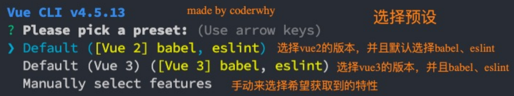
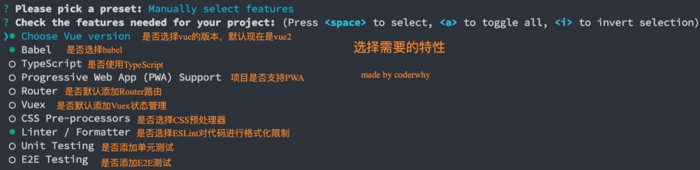
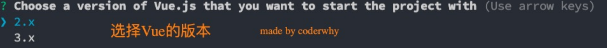
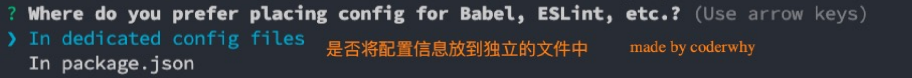
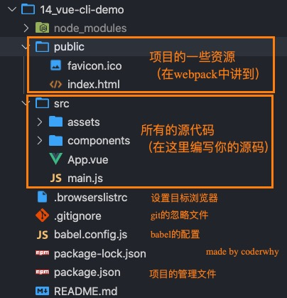
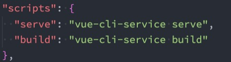
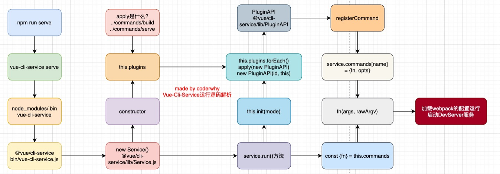

## Vue CLI脚手架

什么是Vue脚手架？ 

- 我们前面学习了如何通过webpack配置Vue的开发环境，但是在真实开发中我们不可能每一个项目从头来完成 所有的webpack配置，这样显示开发的效率会大大的降低； 
- 所以在真实开发中，我们通常会使用脚手架来创建一个项目，Vue的项目我们使用的就是Vue的脚手架； 
- 脚手架其实是建筑工程中的一个概念，在我们软件工程中也会将一些帮助我们搭建项目的工具称之为脚手架；


Vue的脚手架就是Vue CLI： 

- CLI是Command-Line Interface, 翻译为命令行界面； 
- 我们可以通过CLI选择项目的配置和创建出我们的项目； 
- Vue CLI已经内置了webpack相关的配置，我们不需要从零来配置；


## Vue CLI 安装和使用

安装Vue CLI（目前最新的版本是v4.5.13） 

- 我们是进行全局安装，这样在任何时候都可以通过vue的命令来创建项目；

```
npm install @vue/cli -g
```

升级Vue CLI： 

- 如果是比较旧的版本，可以通过下面的命令来升级

```
npm update @vue/cli -g
```

通过Vue的命令来创建项目

```
vue create 项目的名称
```


## vue create 项目的过程










## 项目的目录结构





github可以搜索，browerslist,里面有所有的配置,可以看一下怎么配置


在以前我们自己配置webpack的时候


我们执行serve，因为我们写的有webpack，他会去.bin里面找到webpack,然后webpack会读取webpack.config.js文件，然后作用到src上，或者是dist上

但是脚手架是这个命令，和我们以前写的不一样了


他也是.bin这个文件夹下面找


打开vue-cli-service


这里有一个导入，但是你是找不到这个导入的上一个文件夹是没有lib的，也没有service的


那真实代码在哪呢

在node_modules中

有一个@vue

它里面有一个cli-service

里面的packge.json中


讲到这里的时候花了很多时间讲了vue-cli的源码，但是很复杂，可以看看，但是比较难看懂，需要的话可以看视频


## Vue CLI的运行原理



